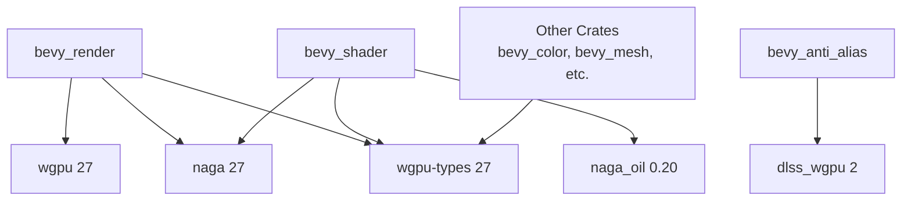

+++
title = "#21746 Upgrade to wgpu 27 and associated crates"
date = "2025-12-10T00:00:00"
draft = false
template = "pull_request_page.html"
in_search_index = false

[extra]
current_language = "zh-cn"
available_languages = {"en" = { name = "English", url = "/pull_request/bevy/2025-12/pr-21746-en-20251210" }, "zh-cn" = { name = "中文", url = "/pull_request/bevy/2025-12/pr-21746-zh-cn-20251210" }}
labels = ["A-Rendering", "C-Dependencies", "X-Contentious"]
+++

# Title

## Basic Information
- **Title**: Upgrade to wgpu 27 and associated crates
- **PR Link**: https://github.com/bevyengine/bevy/pull/21746
- **Author**: JMS55
- **Status**: MERGED
- **Labels**: A-Rendering, C-Dependencies, S-Ready-For-Final-Review, X-Contentious
- **Created**: 2025-11-05T02:01:39Z
- **Merged**: 2025-12-10T07:51:33Z
- **Merged By**: mockersf

## Description Translation
替代了之前的 PR https://github.com/bevyengine/bevy/pull/21725。

## The Story of This Pull Request

这次 PR 的核心任务是升级 Bevy 渲染引擎的基础依赖，从 wgpu 26 版本迁移到 27 版本。wgpu 是 WebGPU API 的 Rust 实现，为 Bevy 提供了跨平台的底层图形抽象。此类升级通常是为了获取新的 GPU 功能、性能改进、错误修复和 API 更新，但同时也需要代码库进行相应的适配。

**问题与背景**
Bevy 团队需要保持其依赖的 wgpu 生态系统处于最新状态。wgpu 27 版本带来了 API 的变更、新特性的引入以及一些原有特性的移除或重命名。如果不进行升级，Bevy 将无法利用最新的图形硬件功能，并且可能随着时间的推移，与上游库的兼容性会逐渐变差。升级的挑战在于需要系统地更新所有相关的依赖项，并仔细调整代码以适配 API 的变更，确保渲染管线的所有功能在升级后依然正常工作。

**解决方案与实现**
开发者采用了直接升级依赖版本并修改适配代码的策略。这项工作涉及面较广，修改了 17 个 crate 的 `Cargo.toml` 文件，并调整了多个核心渲染模块的源代码。

主要的依赖版本变更如下：
- `wgpu`、`naga`、`wgpu-types` 从 `26` 升级到 `27`。
- `naga_oil` 从 `0.19` 升级到 `0.20`。
- `dlss_wgpu` 从 `1` 升级到 `2`。

这些版本升级是基础，但更重要的是随之而来的代码适配。例如，在 `renderer/mod.rs` 中，初始化 `wgpu::Device` 的配置发生了变化。在 wgpu 27 中，`DeviceDescriptor` 新增了一个 `experimental_features` 字段，PR 中通过一个 unsafe 调用 `wgpu::ExperimentalFeatures::enabled()` 来启用所有实验性特性，并添加了相关安全说明的 TODO 注释。

```rust
// crates/bevy_render/src/renderer/mod.rs
// 在创建 DeviceDescriptor 时
required_limits: limits,
// SAFETY: TODO, see https://github.com/bevyengine/bevy/issues/22082
experimental_features: unsafe { wgpu::ExperimentalFeatures::enabled() },
memory_hints: options.memory_hints.clone(),
```
同时，为了支持新的图形特性（如网格着色器），代码中也添加了对更多 `Limits` 字段（例如 `max_task_workgroup_total_count`、`max_mesh_output_layers`）的适配。

另一个显著的 API 变更体现在着色器模块的创建上。在 `render_device.rs` 中，用于 SPIR-V 直通（passthrough）的特性名称从 `Features::SPIRV_SHADER_PASSTHROUGH` 变更为 `Features::EXPERIMENTAL_PASSTHROUGH_SHADERS`，并且创建着色器模块的调用方式也发生了变化。

```rust
// crates/bevy_render/src/renderer/render_device.rs
// Before:
unsafe {
    self.device.create_shader_module_passthrough(
        wgpu::ShaderModuleDescriptorPassthrough::SpirV(
            wgpu::ShaderModuleDescriptorSpirV {
                label: desc.label,
                source: source.clone(),
            },
        ),
    )
}

// After:
unsafe {
    self.device.create_shader_module_passthrough(
        wgpu::ShaderModuleDescriptorPassthrough {
            label: desc.label,
            spirv: Some(source.clone()),
            ..Default::default()
        },
    )
}
```
这种从枚举变更为结构体并设置字段的模式，提供了更好的扩展性。

在 `uniform_buffer.rs` 中，`DynamicUniformBufferWriter` 的类型定义发生了改变，移除了其生命周期的参数。这是因为底层的 `wgpu::QueueWriteBufferView` 类型可能内部已经处理了生命周期，使得 `BufferMut` trait 的实现不再需要外部生命周期标注，从而简化了 API。

```rust
// crates/bevy_render/src/render_resource/uniform_buffer.rs
// Before:
pub struct DynamicUniformBufferWriter<'a, T> {
    buffer: encase::DynamicUniformBuffer<QueueWriteBufferViewWrapper<'a>>,
    _marker: PhantomData<fn() -> T>,
}
// After:
pub struct DynamicUniformBufferWriter<T> {
    buffer: encase::DynamicUniformBuffer<QueueWriteBufferViewWrapper>,
    _marker: PhantomData<fn() -> T>,
}
```
此外，PR 中还移除了一些对过时特性的检查（例如在 `gpu_preprocessing.rs` 中移除了对 `Features::MULTI_DRAW_INDIRECT` 的检查），并更新了调用 `device.poll` 的方法以匹配新的 API（使用 `PollType::wait_indefinitely()` 方法）。

**技术洞察与影响**
这次升级是一次典型的依赖管理任务。它要求开发者对 wgpu 的更新日志有深入理解，并能够精确地定位和修改受影响的代码。升级带来了对最新图形 API 特性的潜在支持（例如通过启用实验性特性），但也引入了一些待解决的问题（如上面提到的安全 TODO）。`experimental_features` 的 unsafe 使用表明，开发团队正在积极地探索 wgpu 的前沿功能，但这部分代码的长期稳定性需要关注。

从工程角度看，这次 PR 展示了如何管理一个大型项目中深度依赖的底层库的升级。它不仅仅是一个版本号的修改，而是涉及到多个模块的协同变更。PR 成功地保持了 Bevy 渲染后端的现代性，为后续利用 WebGPU 新特性铺平了道路，同时也为社区进行类似的依赖升级提供了参考范例。

## Visual Representation


上图展示了本次升级中核心的依赖关系变更。`bevy_render` 作为渲染核心，其依赖的 `wgpu`、`naga` 和 `wgpu-types` 全部升级到 27 版本。`bevy_shader` 也相应更新了其 `naga` 和 `naga_oil` 的依赖。`bevy_anti_alias` 升级了 `dlss_wgpu`。此外，多个其他直接或间接使用 `wgpu-types` 的 crate 也同步更新了版本号以保持一致性。

## Key Files Changed

### 1. `crates/bevy_render/Cargo.toml`
**变更描述**：更新了核心渲染依赖 `wgpu` 和 `naga` 的主版本号。
```toml
# 变更前:
wgpu = { version = "26", ... }
naga = { version = "26", ... }

# 变更后:
wgpu = { version = "27", ... }
naga = { version = "27", ... }
```
**关联性**：这是升级的基础，所有后续的代码适配都源于此版本变更。

### 2. `crates/bevy_render/src/renderer/mod.rs`
**变更描述**：适配了 wgpu 27 中 `DeviceDescriptor` 的新字段，并添加了对新 Limits 字段的支持。
```rust
// 新增了 experimental_features 字段
experimental_features: unsafe { wgpu::ExperimentalFeatures::enabled() },

// 新增了对多个新 Limits 字段的处理，例如：
max_task_workgroup_total_count: limits
    .max_task_workgroup_total_count
    .min(constrained_limits.max_task_workgroup_total_count),
// ... 其他类似字段
```
**关联性**：确保 Bevy 在初始化渲染设备时能够正确配置新版本的 wgpu，并启用可能需要的实验性功能。

### 3. `crates/bevy_render/src/renderer/render_device.rs`
**变更描述**：更新了 SPIR-V 直通着色器特性的名称和创建着色器模块的 API 调用方式。
```rust
// 特性名称变更
// Before: wgpu::Features::SPIRV_SHADER_PASSTHROUGH
// After:  wgpu::Features::EXPERIMENTAL_PASSTHROUGH_SHADERS

// API 调用方式变更（代码见上文“解决方案与实现”部分）
```
**关联性**：反映了 wgpu API 的演变，确保使用 SPIR-V 着色器的路径在新版本下依然有效。

### 4. `crates/bevy_render/src/batching/gpu_preprocessing.rs`
**变更描述**：简化了 GPU 预处理特性检查逻辑，移除了对 `MULTI_DRAW_INDIRECT` 特性的检查。
```rust
// 变更前:
let culling_feature_support = device.features().contains(
    Features::INDIRECT_FIRST_INSTANCE
        | Features::MULTI_DRAW_INDIRECT
        | Features::PUSH_CONSTANTS,
);

// 变更后:
let culling_feature_support = device
    .features()
    .contains(Features::INDIRECT_FIRST_INSTANCE | Features::PUSH_CONSTANTS);
```
**关联性**：可能表明 `MULTI_DRAW_INDIRECT` 特性在 wgpu 27 中已成为默认支持或不再需要显式检查，从而简化了条件判断逻辑。

### 5. `crates/bevy_render/src/render_resource/uniform_buffer.rs`
**变更描述**：移除了 `DynamicUniformBufferWriter` 结构体的生命周期参数，简化了类型签名。
```rust
// 变更前后类型定义对比（代码见上文“解决方案与实现”部分）
```
**关联性**：利用 wgpu 27 中 `QueueWriteBufferView` 的改进，提供了更简洁的缓冲区写入接口。

## Further Reading
- **wgpu 发布说明**: 了解 wgpu 26 到 27 版本的具体变更、新特性和 API 差异。
- **WebGPU Specification**: 深入理解 wgpu 所实现的底层 WebGPU 标准。
- **Bevy 渲染架构文档**: 学习 Bevy 如何在其 ECS 架构之上构建渲染系统，以及 wgpu 在其中扮演的角色。