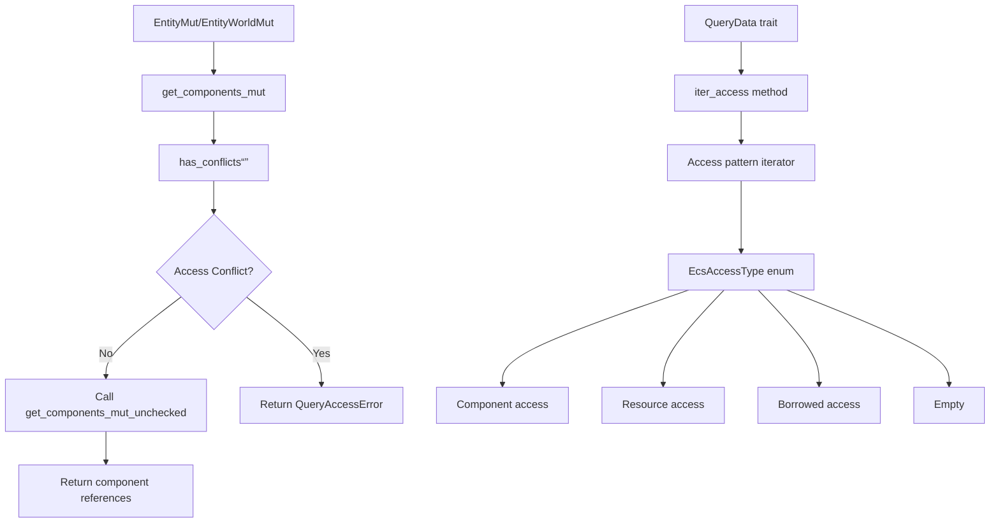

+++
title = "#21780 get_components_mut"
date = "2025-12-08T00:00:00"
draft = false
template = "pull_request_page.html"
in_search_index = true

[taxonomies]
list_display = ["show"]

[extra]
current_language = "en"
available_languages = {"en" = { name = "English", url = "/pull_request/bevy/2025-12/pr-21780-en-20251208" }, "zh-cn" = { name = "中文", url = "/pull_request/bevy/2025-12/pr-21780-zh-cn-20251208" }}
labels = ["C-Feature", "A-ECS", "M-Release-Note"]
+++

# Title

## Basic Information
- **Title**: get_components_mut
- **PR Link**: https://github.com/bevyengine/bevy/pull/21780
- **Author**: hymm
- **Status**: MERGED
- **Labels**: C-Feature, A-ECS, S-Ready-For-Final-Review, M-Release-Note
- **Created**: 2025-11-07T22:39:30Z
- **Merged**: 2025-12-08T23:06:07Z
- **Merged By**: alice-i-cecile

## Description Translation
# Objective

- Add a checked version of `EntityMut::get_components_mut` and `EntityWorldMut::get_components_mut` that does not allocate

## Solution

- Add a iterator over the access type to `QueryData`. This is then used to iterate over the pairs of access to check if they are compatible or not.

## Testing

- Added a unit test

### Bench checked vs unchecked (50000 entities)

| #components | unchecked | checked  | times slower |
|-------------|-----------|----------|----------|
| 2           | 509 us    | 1123 us  | 2.2x     |
| 5           | 903 us    | 2902us  | 3.2x     |
| 10          | 1700 us   | 11424 us | 6.72x    |

so at 10 components each call was taking about 0.22us vs 0.03 us

---

## ToDo

* [x] add release note
* [x] add migration guide
* [x] add macro for more benches
* [x] add bench results to pr description
* [ ] look into if this will help with uncached queries
* [x] see if we can optimize it a bit


## The Story of This Pull Request

This PR addresses a specific gap in Bevy's Entity Component System (ECS) API: the lack of a safe, non-allocating method to get multiple mutable component references from a single entity. Previously, developers had two options for retrieving multiple components from an entity:

1. Use separate calls to `get_mut` for each component, which is safe but inefficient for multiple components
2. Use the unsafe `get_components_mut_unchecked` method, which doesn't allocate but requires manual verification that no aliasing mutable references are requested

The problem with the unsafe approach is that it's easy to misuse. For example, requesting `(&mut T, &mut T)` would create two mutable references to the same component, violating Rust's borrowing rules. The PR author recognized that while the unsafe method provided performance benefits, a safe alternative was needed for everyday use cases where correctness is prioritized over maximum performance.

The core challenge was implementing the safety checks without resorting to dynamic allocation. Existing query systems in Bevy already perform similar access conflict checks, but they typically build up `FilteredAccess` structures that allocate memory. For a simple entity component access operation, this overhead was undesirable.

The solution introduced a new abstraction called `EcsAccessType`, which represents different kinds of ECS access patterns (component read/write, resource read/write, borrowed access from query state, or empty). Each `QueryData` type now implements an `iter_access` method that returns an iterator over the access patterns it requires. This allows the system to statically analyze whether a query would create conflicting borrows without needing to allocate any data structures.

The implementation follows a straightforward approach: for a given query type `Q`, collect all its access patterns and compare each pair to ensure compatibility. The algorithm is O(n²) in the number of access patterns, but since typical queries involve only a handful of components, this is acceptable. The implementation includes an optimization for small queries (≤16 access patterns) by using a stack-allocated array instead of iterating twice, which helps reduce overhead for common cases.

The performance benchmarks reveal the trade-off clearly: the safe version is 2.2-6.7x slower than the unsafe version, depending on the number of components. At 10 components, each checked call takes about 0.22 microseconds versus 0.03 microseconds for the unchecked version. This overhead is reasonable for many use cases, especially considering the safety guarantees it provides.

An important implementation detail is how the access checking integrates with Bevy's existing query system. The PR modifies the `QueryData` trait to require an `iter_access` method, which all existing query types must implement. This was done by:
1. Adding the method to the trait definition
2. Implementing it for all built-in query types (entity references, component references, tuples, etc.)
3. Updating the `QueryData` derive macro to generate implementations for user-defined query types

The new safe API methods (`get_components_mut` for both `EntityMut` and `EntityWorldMut`) simply call the existing unsafe methods after performing the access conflict check via `has_conflicts::<Q>()`. If the check passes, the operation is safe; otherwise, an error is returned.

The PR also updates related methods to return `Result` instead of `Option` for better error reporting. This change affects `get_components` (read-only version), `get_components_mut_unchecked`, and `into_components_mut_unchecked`, which now return `QueryAccessError` instead of `None` when components are missing or unregistered.

From an architectural perspective, this change demonstrates how to add runtime safety checks to an existing unsafe API without breaking existing code. The unsafe methods remain available for performance-critical code, while the new safe methods provide a more ergonomic default. The access checking logic is centralized in the new `access_iter` module, making it reusable for other purposes in the future.

## Visual Representation



## Key Files Changed

1. **`crates/bevy_ecs/src/query/access_iter.rs` (+467/-0)**
   - New module containing the core access conflict checking logic
   - Defines `EcsAccessType` enum representing different access patterns
   - Implements `has_conflicts<Q>` function that performs O(n²) pairwise compatibility checks
   - Includes comprehensive unit tests for various access conflict scenarios

```rust
// Key code snippet: The core conflict checking logic
pub fn has_conflicts<Q: QueryData>(components: &Components) -> Result<(), QueryAccessError> {
    const MAX_SIZE: usize = 16;
    let Some(state) = Q::get_state(components) else {
        return Err(QueryAccessError::ComponentNotRegistered);
    };
    let iter = Q::iter_access(&state).enumerate();
    let size = iter.size_hint().1.unwrap_or(MAX_SIZE);

    if size > MAX_SIZE {
        // Large query: iterate pairwise
        for (i, access) in iter {
            for access_other in Q::iter_access(&state).take(i) {
                if let Err(err) = access.is_compatible(access_other) {
                    panic!("{}", err);
                }
            }
        }
    } else {
        // Small query: cache in stack array
        let mut inner_access = [EcsAccessType::Empty; MAX_SIZE];
        for (i, access) in iter {
            for access_other in inner_access.iter().take(i) {
                if let Err(err) = access.is_compatible(*access_other) {
                    panic!("{}", err);
                }
            }
            inner_access[i] = access;
        }
    }

    Ok(())
}
```

2. **`crates/bevy_ecs/src/query/fetch.rs` (+97/-3)**
   - Adds `iter_access` method to the `QueryData` trait
   - Implements `iter_access` for all built-in query types (components, entities, tuples, etc.)
   - Each implementation returns the appropriate `EcsAccessType` for that query

```rust
// Example implementation for &mut T (mutable component reference)
fn iter_access(state: &Self::State) -> impl Iterator<Item = EcsAccessType<'_>> {
    iter::once(EcsAccessType::Component(EcsAccessLevel::Write(*state)))
}

// Example implementation for EntityMut (mutable entity reference)
fn iter_access(_state: &Self::State) -> impl Iterator<Item = EcsAccessType<'_>> {
    iter::once(EcsAccessType::Component(EcsAccessLevel::WriteAll))
}
```

3. **`crates/bevy_ecs/src/world/entity_access/entity_mut.rs` (+91/-5)**
   - Adds new safe `get_components_mut` method to `EntityMut`
   - Updates existing methods to return `Result` instead of `Option`
   - Implements the safe method by calling `has_conflicts` then the unsafe method

```rust
// The new safe method
pub fn get_components_mut<Q: ReleaseStateQueryData>(
    &mut self,
) -> Result<Q::Item<'_, 'static>, QueryAccessError> {
    self.reborrow().into_components_mut::<Q>()
}

// Implementation that performs the check
pub fn into_components_mut<Q: ReleaseStateQueryData>(
    self,
) -> Result<Q::Item<'w, 'static>, QueryAccessError> {
    has_conflicts::<Q>(self.cell.world().components())?;
    // SAFETY: we checked that there were not conflicting components above
    unsafe { self.into_components_mut_unchecked::<Q>() }
}
```

4. **`crates/bevy_ecs/src/world/entity_access/world_mut.rs` (+93/-4)**
   - Mirrors the changes in `entity_mut.rs` for `EntityWorldMut`
   - Adds safe `get_components_mut` and `into_components_mut` methods
   - Updates return types from `Option` to `Result`

5. **`benches/benches/bevy_ecs/world/world_get.rs` (+64/-1)**
   - Adds benchmarks comparing checked vs unchecked versions
   - Uses a macro to generate benchmarks for 2, 5, and 10 components
   - Shows the performance trade-off of the safety checks

```rust
// Benchmark macro for different component counts
macro_rules! query_get_components_mut {
    ($function_name:ident, $val:literal) => {
        pub fn $function_name(criterion: &mut Criterion) {
            // ... setup code ...
            group.bench_function(format!("{}_components_{entity_count}_entities", $val), |bencher| {
                bencher.iter(|| {
                    for entity in &entities {
                        seq!(N in 0..$val {
                            assert!(query
                                .get_mut(&mut world, *entity)
                                .unwrap()
                                .get_components_mut::<(
                                        #(&mut WideTable<N>,)*
                                    )>()
                                    .is_ok());
                        });
                    }
                });
            });
            // ... also benchmark unchecked version ...
        }
    };
}
```

6. **`crates/bevy_ecs/macros/src/query_data.rs` (modifications)**
   - Updates the `QueryData` derive macro to generate `iter_access` implementations
   - The generated code chains iterators from all fields in the query

```rust
// Generated code snippet from the macro
fn iter_access(
    _state: &Self::State,
) -> impl core::iter::Iterator<Item = #path::query::EcsAccessType<'_>> {
    core::iter::empty() #(.chain(<#field_types>::iter_access(&_state.#field_aliases)))*
}
```

## Further Reading

1. **Rust Borrow Checker and Aliasing Rules**: Understanding Rust's rules about mutable references is essential for appreciating why this feature was needed. The Rust Book's chapter on references and borrowing provides a good foundation.

2. **Bevy ECS Query System**: The official Bevy ECS documentation explains how queries work and the different types of query data available. This PR extends that system with additional safety guarantees.

3. **Performance Optimization in Systems Programming**: The trade-off between safety and performance demonstrated in this PR is a classic concern in systems programming. Resources on zero-cost abstractions and safe systems programming would provide useful context.

4. **Iterator Patterns in Rust**: The implementation makes extensive use of Rust's iterator patterns, particularly iterator chaining and size hints. The Rust documentation on iterators covers these concepts in detail.

5. **Macro Metaprogramming in Rust**: The changes to the `QueryData` derive macro demonstrate how to use Rust's macro system for code generation. Resources on procedural macros and derive macros would help understand this aspect of the implementation.