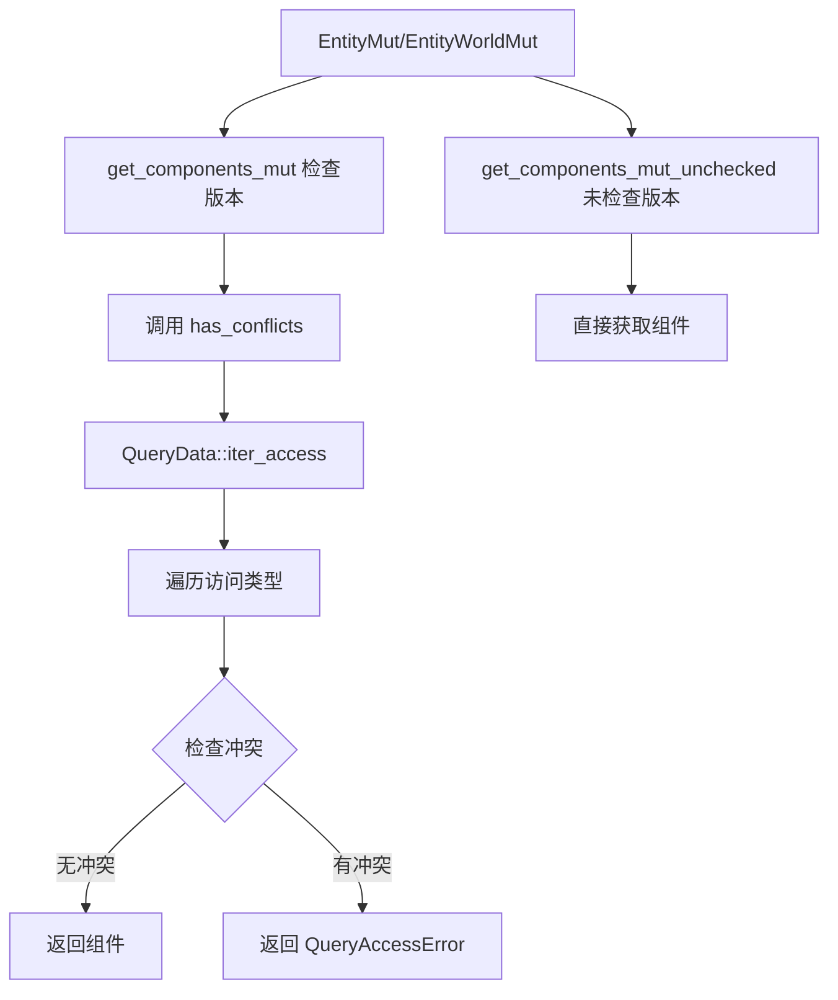

+++
title = "#21780 get_components_mut"
date = "2025-12-08T00:00:00"
draft = false
template = "pull_request_page.html"
in_search_index = false

[extra]
current_language = "zh-cn"
available_languages = {"en" = { name = "English", url = "/pull_request/bevy/2025-12/pr-21780-en-20251208" }, "zh-cn" = { name = "中文", url = "/pull_request/bevy/2025-12/pr-21780-zh-cn-20251208" }}
labels = ["C-Feature", "A-ECS", "M-Release-Note"]
+++

# Title

## Basic Information
- **Title**: get_components_mut
- **PR Link**: https://github.com/bevyengine/bevy/pull/21780
- **Author**: hymm
- **Status**: MERGED
- **Labels**: C-Feature, A-ECS, S-Ready-For-Final-Review, M-Release-Note
- **Created**: 2025-11-07T22:39:30Z
- **Merged**: 2025-12-08T23:06:07Z
- **Merged By**: alice-i-cecile

## 描述翻译

# 目标
- 添加 `EntityMut::get_components_mut` 和 `EntityWorldMut::get_components_mut` 的检查版本，该版本不分配内存

## 解决方案
- 为 `QueryData` 添加一个遍历访问类型的迭代器。然后使用这个迭代器来遍历访问对，检查它们是否兼容。

## 测试
- 添加了单元测试

### 检查版与未检查版的基准测试（50000 个实体）

| #组件数量 | 未检查版本 | 检查版本  | 速度倍数 |
|-------------|-----------|----------|----------|
| 2           | 509 us    | 1123 us  | 2.2倍     |
| 5           | 903 us    | 2902us  | 3.2倍     |
| 10          | 1700 us   | 11424 us | 6.72倍    |

在10个组件的情况下，每次调用大约需要 0.22us vs 0.03 us

---

## 待办事项
* [x] 添加发布说明
* [x] 添加迁移指南
* [x] 添加基准测试宏
* [x] 将基准测试结果添加到 PR 描述中
* [ ] 研究这是否有助于未缓存的查询
* [x] 看看能否进一步优化

## 该 PR 的故事

这个 PR 解决了 Bevy ECS 中的一个核心安全问题：如何在保证安全的同时，让开发者能够同时获取实体的多个可变组件引用。

### 问题与背景

在 Bevy 中，开发者经常需要从单个实体获取多个组件的可变引用。之前，这只能通过不安全的 `get_components_mut_unchecked` 方法实现，因为它无法检查是否存在别名冲突（aliasing）——比如 `(&mut T, &mut T)` 这样的查询会返回同一个组件的多个可变引用，这是 Rust 不允许的。

主要的技术约束包括：
1. **安全性**：必须防止返回别名可变引用
2. **性能**：检查应该尽可能高效，避免分配内存
3. **API 兼容性**：需要保持向后兼容，同时改进 API

### 解决方案方法

开发者选择了一个聪明的解决方案：在编译时分析查询的访问模式，然后在运行时进行 O(n²) 的冲突检查。这个方法的优势在于：
- 不需要额外的内存分配
- 可以在编译时推导出所有必要的检查逻辑
- 对于小查询（<=16 个组件），使用栈上数组优化

备选方案可能包括在编译时完全静态检查（类似 Rust 的借用检查器），但这需要更复杂的类型系统支持，实现成本太高。

### 具体实现

实现的核心是新增的 `access_iter` 模块。这个模块定义了 `EcsAccessType` 枚举，表示不同类型的 ECS 访问：
- `Component(EcsAccessLevel)`：组件访问（读/写特定组件，或全部组件）
- `Resource(ResourceAccessLevel)`：资源访问
- `Access(&'a Access)`：从其他查询借用的访问
- `Empty`：不访问任何可能冲突的数据

关键的 `has_conflicts` 函数通过 `QueryData::iter_access` 方法获取查询的所有访问类型，然后成对检查它们是否兼容：

```rust
pub fn has_conflicts<Q: QueryData>(components: &Components) -> Result<(), QueryAccessError> {
    const MAX_SIZE: usize = 16;
    let Some(state) = Q::get_state(components) else {
        return Err(QueryAccessError::ComponentNotRegistered);
    };
    let iter = Q::iter_access(&state).enumerate();
    // ... 冲突检查逻辑
}
```

对于每个 `QueryData` 类型，都需要实现 `iter_access` 方法。例如，对于 `&mut T`：

```rust
fn iter_access(state: &Self::State) -> impl Iterator<Item = EcsAccessType<'_>> {
    iter::once(EcsAccessType::Component(EcsAccessLevel::Write(*state)))
}
```

这种方法的有趣之处在于，它利用了 Bevy 已有的查询系统结构：每个查询类型已经知道它需要什么访问权限，现在只是把这些信息暴露出来供运行时检查使用。

### 技术细节

几个重要的技术点：

1. **性能优化**：对于小查询（<=16 个组件），使用栈上数组缓存访问类型，避免双重迭代的开销
2. **错误处理**：引入了 `QueryAccessError` 枚举，区分"组件未注册"和"实体不匹配"两种错误情况
3. **API 设计**：提供 `get_components_mut`（安全）和 `get_components_mut_unchecked`（不安全）两个版本，让开发者根据性能需求选择

基准测试显示了检查的成本：2个组件时慢2.2倍，10个组件时慢6.7倍。虽然看起来很多，但绝对时间仍然很小（微秒级别），对于许多应用场景是可接受的。

### 影响与启示

这个 PR 的影响是多方面的：

1. **安全性提升**：开发者现在可以使用安全的 API 同时获取多个可变组件，减少了 unsafe 代码的使用
2. **API 一致性**：所有相关方法现在都返回 `Result` 而不是 `Option`，提供更详细的错误信息
3. **性能透明度**：开发者可以在安全性和性能之间做出明智的选择

从工程角度看，这个实现展示了如何在不改变底层架构的情况下添加安全检查。通过扩展现有的 `QueryData` trait 来暴露访问信息，然后复用这些信息进行运行时检查，这是一个优雅的解决方案。

这个 PR 也带来了一些技术启发：
- 通过 trait 扩展添加新功能时，保持向后兼容是可能的
- 运行时安全检查的成本是可以量化的，让开发者能够做出合理的选择
- 栈上分配的小数组可以作为优化手段，避免堆分配

## 可视化关系图



## 关键文件变更

### 1. `crates/bevy_ecs/src/query/access_iter.rs` (+467/-0)
- **变更说明**：新增文件，包含冲突检查的核心逻辑
- **关键代码**：
```rust
pub fn has_conflicts<Q: QueryData>(components: &Components) -> Result<(), QueryAccessError> {
    const MAX_SIZE: usize = 16;
    let Some(state) = Q::get_state(components) else {
        return Err(QueryAccessError::ComponentNotRegistered);
    };
    let iter = Q::iter_access(&state).enumerate();
    let size = iter.size_hint().1.unwrap_or(MAX_SIZE);
    
    if size > MAX_SIZE {
        // 双重迭代
        for (i, access) in iter {
            for access_other in Q::iter_access(&state).take(i) {
                if let Err(err) = access.is_compatible(access_other) {
                    panic!("{}", err);
                }
            }
        }
    } else {
        // 栈上数组优化
        let mut inner_access = [EcsAccessType::Empty; MAX_SIZE];
        for (i, access) in iter {
            for access_other in inner_access.iter().take(i) {
                if let Err(err) = access.is_compatible(*access_other) {
                    panic!("{}", err);
                }
            }
            inner_access[i] = access;
        }
    }
    
    Ok(())
}
```

### 2. `crates/bevy_ecs/src/query/fetch.rs` (+97/-3)
- **变更说明**：为所有 `QueryData` 实现添加 `iter_access` 方法
- **关键代码**：
```rust
// 为 &mut T 的实现
fn iter_access(state: &Self::State) -> impl Iterator<Item = EcsAccessType<'_>> {
    iter::once(EcsAccessType::Component(EcsAccessLevel::Write(*state)))
}

// 为 &T 的实现  
fn iter_access(state: &Self::State) -> impl Iterator<Item = EcsAccessType<'_>> {
    iter::once(EcsAccessType::Component(EcsAccessLevel::Read(*state)))
}
```

### 3. `crates/bevy_ecs/src/world/entity_access/entity_mut.rs` (+91/-5)
- **变更说明**：添加安全的 `get_components_mut` 方法，更新返回类型为 `Result`
- **关键代码**：
```rust
pub fn get_components_mut<Q: ReleaseStateQueryData>(
    &mut self,
) -> Result<Q::Item<'_, 'static>, QueryAccessError> {
    self.reborrow().into_components_mut::<Q>()
}

pub fn into_components_mut<Q: ReleaseStateQueryData>(
    self,
) -> Result<Q::Item<'w, 'static>, QueryAccessError> {
    has_conflicts::<Q>(self.cell.world().components())?;
    // SAFETY: we checked that there were not conflicting components above
    unsafe { self.into_components_mut_unchecked::<Q>() }
}
```

### 4. `crates/bevy_ecs/src/world/entity_access/world_mut.rs` (+93/-4)
- **变更说明**：为 `EntityWorldMut` 添加相同的功能

### 5. `benches/benches/bevy_ecs/world/world_get.rs` (+64/-1)
- **变更说明**：添加基准测试，比较检查版和未检查版的性能
- **关键代码**：
```rust
group.bench_function(format!("{}_components_{entity_count}_entities", $val), |bencher| {
    bencher.iter(|| {
        for entity in &entities {
            seq!(N in 0..$val {
                assert!(query
                    .get_mut(&mut world, *entity)
                    .unwrap()
                    .get_components_mut::<(
                            #(&mut WideTable<N>,)*
                        )>()
                        .is_ok());
            });
        }
    });
});
```

## 进一步阅读

1. **Bevy ECS 文档**：了解查询系统的基本概念
2. **Rust 所有权与借用**：理解为什么需要避免别名可变引用
3. **Trait 系统扩展模式**：学习如何通过 trait 扩展添加新功能
4. **性能优化技巧**：栈上分配与堆分配的权衡