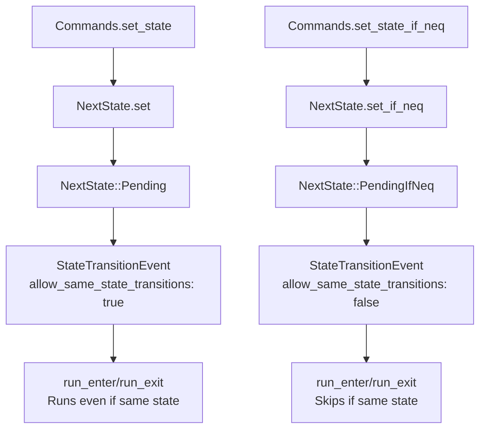

+++
title = "#21792 Make default state change trigger self state transitions"
date = "2025-12-09T00:00:00"
draft = false
template = "pull_request_page.html"
in_search_index = true

[taxonomies]
list_display = ["show"]

[extra]
current_language = "en"
available_languages = {"en" = { name = "English", url = "/pull_request/bevy/2025-12/pr-21792-en-20251209" }, "zh-cn" = { name = "中文", url = "/pull_request/bevy/2025-12/pr-21792-zh-cn-20251209" }}
labels = ["M-Migration-Guide", "X-Contentious", "D-Straightforward", "A-States"]
+++

# Title
Make default state change trigger self state transitions

## Basic Information
- **Title**: Make default state change trigger self state transitions
- **PR Link**: https://github.com/bevyengine/bevy/pull/21792
- **Author**: janhohenheim
- **Status**: MERGED
- **Labels**: S-Ready-For-Final-Review, M-Migration-Guide, X-Contentious, D-Straightforward, A-States
- **Created**: 2025-11-09T18:33:56Z
- **Merged**: 2025-12-09T18:57:52Z
- **Merged By**: alice-i-cecile

## Description Translation
# Objective

- https://github.com/bevyengine/bevy/pull/19363 finally allows self-state transitions
- The naming is a bit meh (`set_forced`)
- Many people expect this to work out of the box
- That PR also missed a few spots where this distinction applies

## Solution

- Expand on https://github.com/bevyengine/bevy/pull/19363 by making it the default
- Rename `set` -> `set_if_neq`
- Rename `set_forced` -> `set`
- Add the two variants to 
  - commands
  - reflection
  - computed states
- make the transition logs a bit less chatty in the common case
- add a test for the new behavior


## Testing

- CI


## The Story of This Pull Request

This PR addresses a design inconsistency in Bevy's state management system. The core issue revolves around how state transitions behave when the target state is the same as the current state.

Prior to PR #19363, calling `next_state.set()` with the same state value would do nothing - it wouldn't trigger any transition events or run `OnEnter`/`OnExit` schedules. This was often surprising to developers who expected state changes to be idempotent and trigger the associated logic. PR #19363 introduced the ability to force same-state transitions via a new method called `set_forced()`, but this created several issues: the naming was awkward (`set_forced`), it wasn't the default behavior, and the implementation missed several places in the codebase where this distinction needed to be applied.

The solution in this PR flips the default behavior. Now, `next_state.set()` will always trigger state transition schedules, even when transitioning to the same state. For cases where you want to avoid running transitions for same-state changes, there's a new `set_if_neq()` method. This makes the common case (wanting transitions to run) the default and the optimization case (skipping transitions) explicit.

The implementation required changes across multiple components of the state system:

1. **Core State Resources**: The `NextState` enum was refactored from having `Pending` and `ForcedPending` variants to `Pending` and `PendingIfNeq` variants, with their behaviors swapped. The `set()` method now always creates a `Pending` variant (which triggers transitions), while `set_if_neq()` creates a `PendingIfNeq` variant (which skips transitions when the state hasn't changed).

2. **Commands Extension**: The commands API was extended with both `set_state()` (which uses the new default behavior) and `set_state_if_neq()` for the conditional case.

3. **Reflection System**: Reflection support was added for both state setting methods to maintain parity with the direct API.

4. **Computed States**: Computed states now have a configurable `ALLOW_SAME_STATE_TRANSITIONS` constant (defaulting to `true`) to control this behavior at the type level.

5. **Logging**: Transition logging was made less verbose by only adding "(disallowing same-state transitions)" text when same-state transitions are actually being skipped.

The technical insight here is that the system tracks whether same-state transitions should be allowed through a boolean flag that propagates through the transition event. When `allow_same_state_transitions` is `false`, the transition system early-returns in `run_enter()` and `run_exit()` if the exited and entered states are the same.

This change represents a breaking API change, so a migration guide was added. Code that previously used `set()` and expected to skip same-state transitions needs to change to use `set_if_neq()`, while code that used `set_forced()` should switch to `set()`.

## Visual Representation



## Key Files Changed

### `crates/bevy_state/src/state/resources.rs` (+14/-16)
This file contains the core `NextState` enum and its methods. The key change is swapping the behavior of the two enum variants and renaming the methods:

```rust
// Before:
pub enum NextState<S: FreelyMutableState> {
    Pending(S),
    ForcedPending(S),  // Triggers transitions even for same state
}

impl<S: FreelyMutableState> NextState<S> {
    pub fn set(&mut self, state: S) { /* Skips transitions if same state */ }
    pub fn set_forced(&mut self, state: S) { /* Always triggers transitions */ }
}

// After:
pub enum NextState<S: FreelyMutableState> {
    Pending(S),         // Now: Always triggers transitions
    PendingIfNeq(S),    // Now: Skips transitions if same state
}

impl<S: FreelyMutableState> NextState<S> {
    pub fn set(&mut self, state: S) { /* Always triggers transitions */ }
    pub fn set_if_neq(&mut self, state: S) { /* Skips transitions if same state */ }
}
```

### `crates/bevy_state/src/commands.rs` (+22/-3)
This file extends the commands API to support both state setting behaviors:

```rust
// Before: Only one method
fn set_state<S: FreelyMutableState>(&mut self, state: S);

// After: Two methods for different behaviors
fn set_state<S: FreelyMutableState>(&mut self, state: S);
fn set_state_if_neq<S: FreelyMutableState>(&mut self, state: S);
```

### `crates/bevy_state/src/state/mod.rs` (+52/-1)
This file contains tests that demonstrate the new behavior. A key test shows that same-state transitions now run schedules by default:

```rust
#[test]
fn same_state_transition_should_emit_event_and_run_schedules() {
    // Test setup...
    world.insert_resource(NextState::Pending(SimpleState::A));
    world.run_schedule(StateTransition);
    // Now verifies that transition schedules run
    assert_eq!(*world.resource::<TransitionCounter>(), TransitionCounter {
        exit: 1,
        transition: 1,
        enter: 1
    });
}
```

### `crates/bevy_state/src/reflect.rs` (+21/-0)
This file adds reflection support for the new `set_if_neq` method, ensuring the reflection system has parity with the direct API:

```rust
pub struct ReflectFreelyMutableStateFns {
    pub set_next_state: fn(&mut World, &dyn Reflect, &TypeRegistry),
    pub set_next_state_if_neq: fn(&mut World, &dyn Reflect, &TypeRegistry),  // New
}
```

### `crates/bevy_state/src/state/transitions.rs` (+8/-8)
This file updates the transition logic to use the renamed `allow_same_state_transitions` field:

```rust
// Before:
pub struct StateTransitionEvent<S: States> {
    pub same_state_enforced: bool,
}

// After:
pub struct StateTransitionEvent<S: States> {
    pub allow_same_state_transitions: bool,
}
```

The transition execution logic is updated to check this flag and skip transitions when `allow_same_state_transitions` is `false` and the states are the same.

## Further Reading

1. [Bevy States Documentation](https://docs.rs/bevy_state/latest/bevy_state/) - Official documentation for Bevy's state system
2. [PR #19363](https://github.com/bevyengine/bevy/pull/19363) - The original PR that introduced forced same-state transitions
3. [State Management Patterns in Bevy](https://bevy-cheatbook.github.io/programming/states.html) - Community guide on state management patterns
4. [Bevy Migration Guide](https://github.com/bevyengine/bevy/blob/main/release-content/migration-guides/same_state_transitions.md) - Migration guide for this breaking change