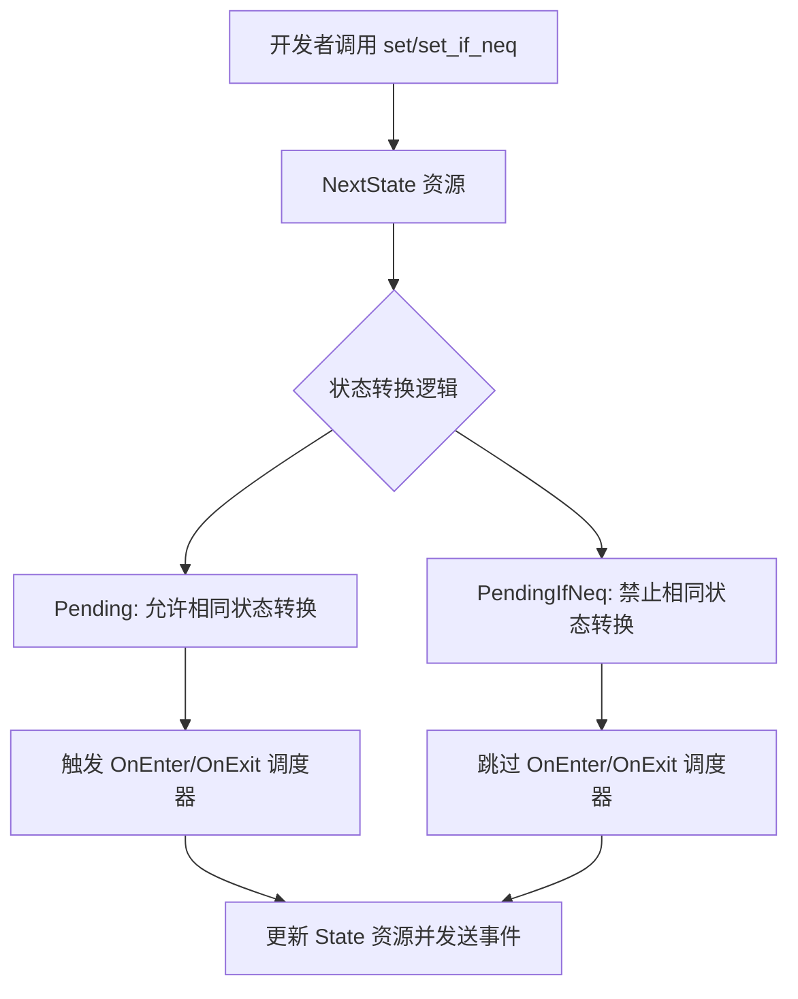

+++
title = "#21792 Make default state change trigger self state transitions"
date = "2025-12-09T00:00:00"
draft = false
template = "pull_request_page.html"
in_search_index = false

[extra]
current_language = "zh-cn"
available_languages = {"en" = { name = "English", url = "/pull_request/bevy/2025-12/pr-21792-en-20251209" }, "zh-cn" = { name = "中文", url = "/pull_request/bevy/2025-12/pr-21792-zh-cn-20251209" }}
+++

# Make default state change trigger self state transitions

## Basic Information
- **标题**: Make default state change trigger self state transitions
- **PR 链接**: https://github.com/bevyengine/bevy/pull/21792
- **作者**: janhohenheim
- **状态**: 已合并
- **标签**: S-Ready-For-Final-Review, M-Migration-Guide, X-Contentious, D-Straightforward, A-States
- **创建时间**: 2025-11-09T18:33:56Z
- **合并时间**: 2025-12-09T18:57:52Z
- **合并者**: alice-i-cecile

## 描述翻译

# 目标

- https://github.com/bevyengine/bevy/pull/19363 最终允许自身状态转换（self-state transitions）
- 命名有点不尽人意（`set_forced`）
- 许多人期望这个功能可以开箱即用
- 那个 PR 也遗漏了此功能适用的几个地方

## 解决方案

- 扩展 https://github.com/bevyengine/bevy/pull/19363，使其成为默认行为
- 重命名 `set` -> `set_if_neq`
- 重命名 `set_forced` -> `set`
- 将这两个变体添加到：
  - commands（命令）
  - reflection（反射）
  - computed states（计算状态）
- 在常见情况下减少转换日志的冗长程度
- 为新的行为添加测试

## 测试

- CI

## 这个Pull Request的故事

这个PR的故事开始于一个期望与现实的差距。在Bevy的状态管理系统中，开发者经常需要触发状态转换，即使目标状态与当前状态相同。例如，你可能想要在每次进入某个游戏关卡时重置其状态，而不管玩家是否刚从同一个关卡离开。在PR #19363之前，这是不可能的——将状态设置为相同的值会被静默忽略。该PR引入了`set_forced`方法，允许强制进行相同的状态转换，但这留下了几个问题。

首先，`set_forced`这个名称并不直观，它暗示了某种“强制”行为，而没有清晰地传达其核心功能：允许相同的状态转换。其次，许多开发者期望这种行为是默认的——如果他们调用`set`来设置状态，他们通常希望相关的`OnEnter`和`OnExit`调度器（schedules）被执行，无论状态是否改变。最后，PR #19363的实现并不完整，它在几个地方（如commands、reflection和computed states）遗漏了相同的状态转换功能。

这个PR的作者决定解决这些问题。核心思路很简单：交换默认行为。让`set`方法总是触发状态转换（包括转换到相同状态），而将之前`set`的跳过相同状态转换的行为，移动到一个新的方法`set_if_neq`中（`if not equal`）。这更符合开发者的直觉：调用`set`意味着“我想进入这个状态”，而不是“我想进入这个状态，但仅当它与当前状态不同时”。

这个改变涉及多个层面的修改。首先是核心资源`NextState<S>`枚举。它之前有两个变体：`Pending`（跳过相同状态转换）和`ForcedPending`（允许相同状态转换）。作者将它们重命名为`Pending`（允许相同状态转换）和`PendingIfNeq`（跳过相同状态转换），并相应地将`set`和`set_forced`方法重命名为`set`和`set_if_neq`。

```rust
// crates/bevy_state/src/state/resources.rs
// 修改前：
pub enum NextState<S: FreelyMutableState> {
    // ...
    Pending(S),
    ForcedPending(S),
}

impl<S: FreelyMutableState> NextState<S> {
    pub fn set(&mut self, state: S) { /* 跳过相同状态转换 */ }
    pub fn set_forced(&mut self, state: S) { /* 允许相同状态转换 */ }
}

// 修改后：
pub enum NextState<S: FreelyMutableState> {
    // ...
    Pending(S),
    PendingIfNeq(S),
}

impl<S: FreelyMutableState> NextState<S> {
    pub fn set(&mut self, state: S) { /* 允许相同状态转换 */ }
    pub fn set_if_neq(&mut self, state: S) { /* 跳过相同状态转换 */ }
}
```

这个重命名不仅仅是表面功夫。它翻转了`take_next_state`函数中的布尔标志，该标志控制是否允许相同的状态转换。之前，`Pending`对应`false`（不允许），`ForcedPending`对应`true`（允许）。现在，`Pending`对应`true`，`PendingIfNeq`对应`false`。

接下来，作者需要在整个代码库中更新对这个API的调用。这包括：
1. **Commands**：为`CommandsStatesExt` trait添加了`set_state_if_neq`方法，并调整了`set_state`的实现以使用新的语义。
2. **Reflection**：在`ReflectFreelyMutableStateFns`中添加了`set_next_state_if_neq`函数指针，并为实现了`FreelyMutableState`的类型提供了相应的反射支持。
3. **Computed States**：为`ComputedStates` trait添加了`ALLOW_SAME_STATE_TRANSITIONS`关联常量，默认为`true`，允许计算状态在内部决定是否允许相同的状态转换。
4. **Transition Logic**：更新了状态转换逻辑（`internal_apply_state_transition`和相关函数），使用新的`allow_same_state_transitions`标志，并调整了`StateTransitionEvent`结构体的字段名，从`same_state_enforced`改为`allow_same_state_transitions`，使其语义更清晰（从“强制执行”变为“允许”）。

```rust
// crates/bevy_state/src/state/transitions.rs
// 修改前：
pub struct StateTransitionEvent<S: States> {
    pub same_state_enforced: bool,
}

// 修改后：
pub struct StateTransitionEvent<S: States> {
    pub allow_same_state_transitions: bool,
}
```

5. **Logging**：修改了开发者工具中的日志函数，当相同的状态转换被禁止时，在日志中追加说明文字，使日志更清晰。

在整个修改过程中，作者还更新了测试以反映新的行为。一个关键的测试变更是将`same_state_transition_should_emit_event_and_not_run_schedules`重命名为`same_state_transition_should_emit_event_and_run_schedules`，因为现在默认行为是运行调度器。同时，作者还添加了一个新的测试`same_state_transition_should_emit_event_and_not_run_schedules_if_same_state_transitions_are_disallowed`，来验证当相同状态转换被禁止时的行为。

从技术角度看，这个PR的核心挑战是确保所有相关的代码路径都得到更新，并且新的命名和语义在整个系统中保持一致。作者通过系统地搜索和替换，以及添加新的API变体，成功地完成了这个任务。这个改变是破坏性的（breaking change），因此作者还提供了一个迁移指南，指导用户如何将他们的代码从旧的行为迁移到新的行为。

这个PR的影响是深远的。它简化了状态转换的心理模型：`set`就是“设置状态”，总是触发转换逻辑。如果你需要旧的行为（仅在状态不同时触发），现在有一个明确的方法`set_if_neq`。这种明确性减少了API的模糊性，并使Bevy的状态系统更加直观和强大。

## 可视化表示



## 关键文件变更

1. **`crates/bevy_state/src/state/resources.rs` (+14/-16)**
   - 这是核心变更所在，修改了`NextState`枚举及其方法。
   - 关键代码片段：
   ```rust
   // 修改后：
   pub enum NextState<S: FreelyMutableState> {
       Pending(S),
       PendingIfNeq(S),
   }
   
   impl<S: FreelyMutableState> NextState<S> {
       pub fn set(&mut self, state: S) {
           *self = Self::Pending(state);
       }
       
       pub fn set_if_neq(&mut self, state: S) {
           if !matches!(self, Self::Pending(s) if s == &state) {
               *self = Self::PendingIfNeq(state);
           }
       }
   }
   ```
   - 关系：这个文件定义了状态转换请求的核心数据结构，其他所有变更都是围绕这个核心展开的。

2. **`crates/bevy_state/src/commands.rs` (+22/-3)**
   - 为`CommandsStatesExt` trait添加了`set_state_if_neq`方法，并调整了`set_state`的实现。
   - 关键代码片段：
   ```rust
   // 新增方法：
   fn set_state_if_neq<S: FreelyMutableState>(&mut self, state: S);
   
   impl CommandsStatesExt for Commands<'_, '_> {
       fn set_state_if_neq<S: FreelyMutableState>(&mut self, state: S) {
           self.queue(move |w: &mut World| {
               let mut next = w.resource_mut::<NextState<S>>();
               next.set_if_neq(state);
           });
       }
   }
   ```
   - 关系：这使得通过commands设置状态时，也能选择是否跳过相同的状态转换。

3. **`crates/bevy_state/src/reflect.rs` (+21/-0)**
   - 为反射系统添加了`set_next_state_if_neq`支持。
   - 关键代码片段：
   ```rust
   pub struct ReflectFreelyMutableStateFns {
       pub set_next_state_if_neq: fn(&mut World, &dyn Reflect, &TypeRegistry),
   }
   ```
   - 关系：确保通过反射系统设置状态时，也能利用新的功能。

4. **`crates/bevy_state/src/state/transitions.rs` (+8/-8)**
   - 更新了`StateTransitionEvent`结构体和内部转换逻辑，使用新的`allow_same_state_transitions`字段名和语义。
   - 关键代码片段：
   ```rust
   // 修改后：
   pub struct StateTransitionEvent<S: States> {
       pub allow_same_state_transitions: bool,
   }
   
   // 在run_enter和run_exit中：
   if transition.entered == transition.exited && !transition.allow_same_state_transitions {
       return;
   }
   ```
   - 关系：这是实际执行状态转换和运行调度器的逻辑，必须与`NextState`的语义保持一致。

5. **`release-content/migration-guides/same_state_transitions.md`**
   - 更新了迁移指南，指导用户从`set`/`set_forced`迁移到`set`/`set_if_neq`。
   - 关键内容：
   ```markdown
   // 0.17
   next_state.set(State::Menu);
   
   // 0.18
   next_state.set_if_neq(State::Menu);
   ```
   - 关系：这是一个重要的用户体验变更，必须提供清晰的迁移路径。

## 扩展阅读

- [Bevy States 官方文档](https://docs.rs/bevy/latest/bevy/state/index.html)：了解Bevy状态系统的基本概念。
- [PR #19363](https://github.com/bevyengine/bevy/pull/19363)：了解相同状态转换功能的初始实现。
- [Rust 枚举和模式匹配](https://doc.rust-lang.org/book/ch06-00-enums.html)：理解本PR中使用的`NextState`枚举和`matches!`宏。
- [Bevy 迁移指南](https://bevyengine.org/learn/migration-guides/)：了解如何更新你的Bevy项目以适应新版本。

这个PR展示了API设计中的权衡：是选择最安全的行为（默认跳过相同状态转换），还是选择最符合直觉的行为（默认允许相同状态转换）。作者选择了后者，并通过清晰的命名和完整的生态系统支持，使这个变更更加易于使用和理解。