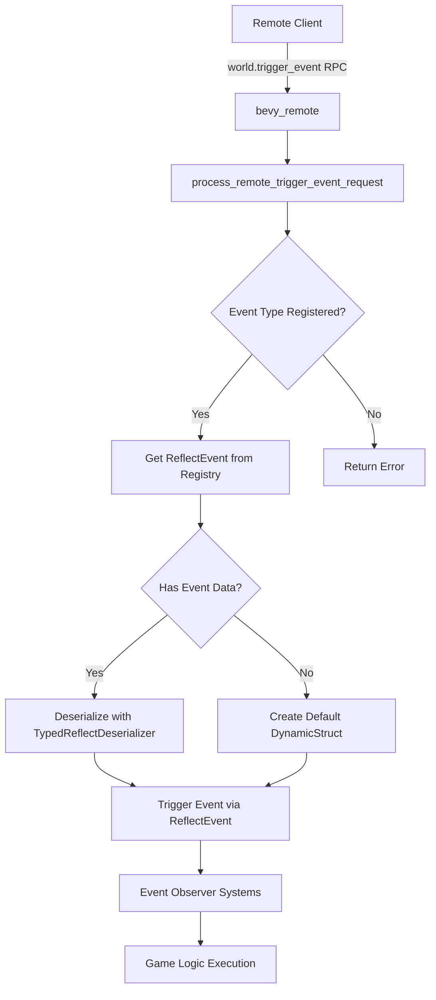

+++
title = "#21798 Implement world.trigger_event remote method"
date = "2025-12-08T00:00:00"
draft = false
template = "pull_request_page.html"
in_search_index = false

[extra]
current_language = "zh-cn"
available_languages = {"en" = { name = "English", url = "/pull_request/bevy/2025-12/pr-21798-en-20251208" }, "zh-cn" = { name = "中文", url = "/pull_request/bevy/2025-12/pr-21798-zh-cn-20251208" }}
+++

# Title: Implement world.trigger_event remote method

## Basic Information
- **标题**: 实现 world.trigger_event 远程方法
- **PR链接**: https://github.com/bevyengine/bevy/pull/21798
- **作者**: Lancelotbronner
- **状态**: 已合并
- **标签**: C-Feature, S-Ready-For-Final-Review, A-Dev-Tools, X-Uncontroversial
- **创建时间**: 2025-11-10T06:57:09Z
- **合并时间**: 2025-12-08T22:01:20Z
- **合并者**: mockersf

## 描述翻译

### 目标
使用 `bevy_remote` 的工具能够通过模式识别事件并触发它们。

- [x] 编写 `bevy_ecs/src/reflect/event.rs` 的文档

### 解决方案
我添加了 `world.trigger_event` 方法，将 `Event` 添加到模式（schema）的反射元数据中，并添加 `ReflectEvent` 来实现此功能。

### 测试
我从我的游戏中复制了（经过测试的）代码，但尚未测试此分支。
我是 Rust/Cargo 的新手，现在需要去睡觉，明天我会解决这个问题并进行测试。

---

### 展示
以下是我在游戏中添加的代码，以允许我的编辑器访问和触发事件：

```rust
#[derive(Event, Reflect)]
#[reflect(Event)]
pub struct AssignToRoute {
    pub vehicle: Entity,
    pub route: Entity,
    pub origin: Entity,
}
```

以下是我的编辑器使用此功能的截图：


## 本次PR的技术解析

这个PR的核心需求很明确：为Bevy的远程工具提供事件触发能力。在游戏开发工具链中，编辑器需要能够与运行中的游戏实例交互，而事件系统是这种交互的关键机制之一。现有的 `bevy_remote` 模块已经支持通过远程过程调用（RPC）操作组件和资源，但缺少触发事件的能力，这限制了工具的能力。

### 问题与背景
在Bevy的ECS架构中，事件（Event）是一种重要的通信机制，允许系统间进行松散耦合的通信。对于外部工具（如编辑器、调试工具）来说，能够触发特定事件意味着可以实现更高级的交互功能，比如：
- 在编辑器中点击按钮触发游戏内事件
- 远程测试特定事件处理逻辑
- 构建自动化测试工具

现有的 `bevy_remote` 模块已经实现了对组件和资源的远程操作，但事件系统还没有相应的支持。这意味着工具无法通过远程接口触发游戏内事件，这限制了工具的能力范围。

### 解决方案架构
开发者的解决方案遵循了Bevy现有的反射和远程调用模式。核心思路是：
1. 为事件系统创建反射支持，类似于现有的组件反射
2. 在远程调用系统中添加对应的方法来处理事件触发请求
3. 确保类型信息和序列化能够正确工作

这种方法的好处是保持了API的一致性，开发者如果熟悉现有的组件和资源远程操作，就能很快理解事件的操作方式。

### 具体实现分析

首先在 `bevy_ecs` 中添加了事件反射模块。这个模块的结构与现有的组件反射非常相似，这是明智的设计决策，因为它保持了代码的一致性：

```rust
// 新的事件反射模块
pub struct ReflectEvent(ReflectEventFns);

pub struct ReflectEventFns {
    trigger: fn(&mut World, &dyn PartialReflect, &TypeRegistry),
}
```

`ReflectEventFns` 结构体封装了触发事件的函数指针，这种模式在Bevy的反射系统中很常见。`FromType<E>` 的实现展示了如何为具体事件类型生成默认的反射实现：

```rust
impl<'a, E: Event + Reflect + TypePath> FromType<E> for ReflectEvent {
    fn from_type() -> Self {
        ReflectEvent(ReflectEventFns {
            trigger: |world, reflected_event, registry| {
                let event = from_reflect_with_fallback::<E>(reflected_event, world, registry);
                world.trigger(event);
            },
        })
    }
}
```

这里的关键是 `from_reflect_with_fallback` 函数，它负责将反射数据转换回具体的事件实例，然后调用 `world.trigger()`。这种模式确保了即使反射数据不完整，也能提供合理的默认值。

在 `bevy_remote` 模块中，新增的远程方法处理函数 `process_remote_trigger_event_request` 是这个PR的核心：

```rust
pub fn process_remote_trigger_event_request(
    In(params): In<Option<Value>>,
    world: &mut World,
) -> BrpResult {
    let BrpTriggerEventParams { event, value } = parse_some(params)?;
    
    world.resource_scope(|world, registry: Mut<AppTypeRegistry>| {
        let registry = registry.read();
        
        let Some(registration) = registry.get_with_type_path(&event) else {
            return Err(BrpError::resource_error(format!(
                "Unknown event type: `{event}`"
            )));
        };
        
        // 检查事件是否可反射
        let Some(reflect_event) = registration.data::<ReflectEvent>() else {
            return Err(BrpError::resource_error(format!(
                "Event `{event}` is not reflectable"
            )));
        };
        
        // 处理事件数据
        if let Some(payload) = value {
            let payload: Box<dyn PartialReflect> =
                TypedReflectDeserializer::new(registration, &registry)
                    .deserialize(payload.into_deserializer())
                    .map_err(|err| {
                        BrpError::resource_error(format!("{event} is invalid: {err}"))
                    })?;
            reflect_event.trigger(world, &*payload, &registry);
        } else {
            // 无数据时使用默认值
            let payload = DynamicStruct::default();
            reflect_event.trigger(world, &payload, &registry);
        }
        
        Ok(Value::Null)
    })
}
```

这个实现有几个值得注意的技术点：
1. **错误处理**：明确检查事件类型是否存在和是否可反射，提供清晰的错误信息
2. **资源作用域**：使用 `resource_scope` 来安全地访问类型注册表
3. **灵活的数据处理**：支持带有数据的触发和空数据触发两种情况
4. **类型安全的反序列化**：使用 `TypedReflectDeserializer` 确保反序列化的类型正确性

### 技术细节与设计决策

1. **反射元数据注册**：为了让远程客户端知道哪些类型是事件，需要在模式信息中添加事件标记。这是在 `schemas/mod.rs` 中完成的：

```rust
data_types.map_type_data::<ReflectEvent>("Event");
```

这行代码确保了当客户端查询模式信息时，能够识别哪些类型是事件。

2. **API一致性**：新方法被命名为 `world.trigger_event`，这与其他远程方法（如 `world.spawn`、`world.insert`）保持了命名一致性。参数结构也遵循了现有模式。

3. **向后兼容性**：这个PR完全向后兼容，因为它是纯新增功能。现有代码不需要任何修改。

4. **测试覆盖**：PR包含了一个完整的单元测试，验证了事件触发功能：

```rust
#[test]
fn trigger_reflect_only_event() {
    #[derive(Event, Reflect)]
    #[reflect(Event)]
    struct Pass;
    
    #[derive(Resource)]
    struct TestResult(pub bool);
    
    // 测试设置...
    assert!(world.resource::<TestResult>().0); // 验证事件被触发
}
```

这个测试很有价值，因为它验证了：
- 事件类型的注册和反射
- 远程触发的基本功能
- 观察者系统对事件的响应

### 对代码库的影响

这个PR的影响主要集中在两个模块：
1. **bevy_ecs**：增加了事件反射的基础设施
2. **bevy_remote**：扩展了远程调用的能力范围

新增的代码量不大（约200行），但功能完整。代码质量很高，遵循了项目的编码标准和设计模式。

### 潜在改进方向

虽然这个实现已经很完整，但未来可能有几个扩展方向：
1. **批量事件触发**：目前一次只能触发一个事件，未来可能支持批量触发
2. **事件查询**：扩展远程API以查询已触发的事件
3. **更复杂的事件验证**：在远程触发前进行更严格的验证

## 可视化表示



## 关键文件变更

### 1. `crates/bevy_ecs/src/reflect/event.rs` (+76/-0)
**变更说明**：新增事件反射模块，提供了通过反射触发事件的机制。

**关键代码片段**：
```rust
pub struct ReflectEvent(ReflectEventFns);

pub struct ReflectEventFns {
    trigger: fn(&mut World, &dyn PartialReflect, &TypeRegistry),
}

impl ReflectEvent {
    pub fn trigger(&self, world: &mut World, event: &dyn PartialReflect, registry: &TypeRegistry) {
        (self.0.trigger)(world, event, registry);
    }
}
```

**与PR目标的关系**：这是实现事件远程触发的核心基础，提供了类型安全的反射接口。

### 2. `crates/bevy_remote/src/builtin_methods.rs` (+94/-4)
**变更说明**：添加了 `world.trigger_event` 远程方法的实现和处理逻辑。

**关键代码片段**：
```rust
/// The method path for a `world.trigger_event` request.
pub const BRP_TRIGGER_EVENT_METHOD: &str = "world.trigger_event";

#[derive(Debug, Serialize, Deserialize, Clone, PartialEq)]
struct BrpTriggerEventParams {
    pub event: String,
    pub value: Option<Value>,
}

pub fn process_remote_trigger_event_request(
    In(params): In<Option<Value>>,
    world: &mut World,
) -> BrpResult {
    // 实现详情见上文
}
```

**与PR目标的关系**：这是PR的主要功能实现，提供了远程触发事件的入口点。

### 3. `crates/bevy_remote/src/lib.rs` (+15/-1)
**变更说明**：更新文档并注册新的远程方法。

**关键代码片段**：
```rust
.with_method(
    builtin_methods::BRP_TRIGGER_EVENT_METHOD,
    builtin_methods::process_remote_trigger_event_request,
)
```

**与PR目标的关系**：将新方法集成到远程插件系统中。

### 4. `crates/bevy_remote/src/schemas/mod.rs` (+2/-1)
**变更说明**：将 `ReflectEvent` 添加到模式元数据中。

**关键代码片段**：
```rust
data_types.map_type_data::<ReflectEvent>("Event");
```

**与PR目标的关系**：使客户端能够通过模式识别哪些类型是事件。

### 5. `crates/bevy_ecs/src/lib.rs` (+1/-1)
**变更说明**：在预导出模块中添加 `ReflectEvent`。

**关键代码片段**：
```rust
pub use crate::reflect::{
    AppTypeRegistry, ReflectComponent, ReflectEvent, ReflectFromWorld, ReflectResource,
};
```

**与PR目标的关系**：确保 `ReflectEvent` 类型对用户可用。

## 延伸阅读

1. **Bevy反射系统文档**：了解Bevy如何通过反射实现运行时类型信息
2. **Bevy事件系统指南**：深入理解Bevy中的事件驱动架构
3. **远程过程调用模式**：学习RPC在游戏引擎中的应用模式
4. **Rust的序列化/反序列化**：掌握 `serde` 和 `bevy_reflect` 如何处理复杂类型的序列化

# Full Code Diff
完整代码差异已包含在分析中。