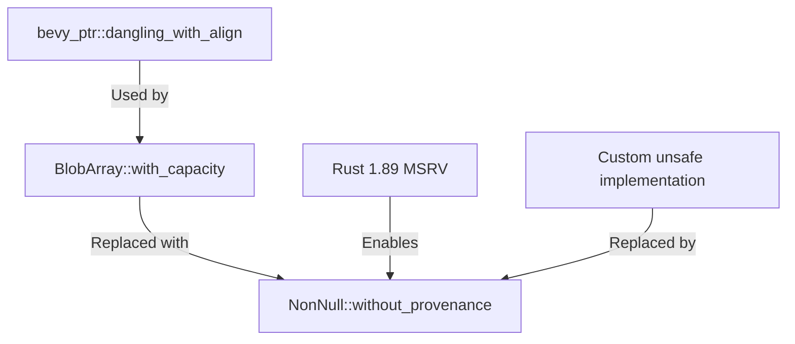

+++
title = "#21822 Remove `bevy_ptr::dangling_with_align()` and inline it"
date = "2025-12-09T00:00:00"
draft = false
template = "pull_request_page.html"
in_search_index = true

[taxonomies]
list_display = ["show"]

[extra]
current_language = "en"
available_languages = {"en" = { name = "English", url = "/pull_request/bevy/2025-12/pr-21822-en-20251209" }, "zh-cn" = { name = "中文", url = "/pull_request/bevy/2025-12/pr-21822-zh-cn-20251209" }}
labels = ["C-Code-Quality", "M-Migration-Guide", "A-Pointers", "D-Straightforward", "D-Unsafe"]
+++

# Title

## Basic Information
- **Title**: Remove `bevy_ptr::dangling_with_align()` and inline it
- **PR Link**: https://github.com/bevyengine/bevy/pull/21822
- **Author**: BD103
- **Status**: MERGED
- **Labels**: C-Code-Quality, S-Ready-For-Final-Review, M-Migration-Guide, A-Pointers, D-Straightforward, D-Unsafe
- **Created**: 2025-11-13T01:04:03Z
- **Merged**: 2025-12-09T05:34:27Z
- **Merged By**: alice-i-cecile

## Description Translation
# Objective

- `bevy_ptr::dangling_with_align()` is only used once, in `bevy_ecs`'s `BlobArray::with_capacity()`, and it isn't generally useful outside of the engine's internals. We can remove the function and inline its implementation into its call site.
- Additionally, `bevy_ptr::dangling_with_align()` has a TODO comment that was leftover from https://github.com/bevyengine/bevy/pull/15311#discussion_r1768091379, where it was suggested that `dangling_with_align()` should use `without_provenance()`.
  - `with_addr()`, mentioned in the TODO comment, could also be used, but it's a more roundabout solution. The reason it was mentioned was because the original author thought it would be stabilized before `without_provenance()`.

## Solution

- Remove `dangling_with_align()`.
- Replace its usage with `NonNull::without_provenance()` (since it is now stable and doesn't require `unsafe` or pointer math)

## Testing

- I ran Miri with strict provenance checking enabled to ensure the behavior is maintained.
  - `MIRIFLAGS="-Zmiri-strict-provenance" cargo +nightly miri test`

## But what is this provenance thingy?

[The official docs provide a more in-depth explanation](https://doc.rust-lang.org/stable/std/ptr/index.html#provenance), but basically a pointer is more than just a number referring to a memory address. Pointers have _permissions_ associated with them that track:

- What set of memory addresses are allowed to be accessed
- When the pointer is allowed to access those addresses
- If the pointer is allowed to mutate the memory, or just read it

These permissions are pointer provenance. They aren't stored at runtime, the Rust compiler doesn't know them at compile time! Miri is the only tool that I know of that tracks provenance, which it uses to ensure pointers adheres to their spatial, temporal, and mutability permissions. That's why I mentioned Miri in the Testing section. :)

## The Story of This Pull Request

This PR addresses a straightforward code quality issue. The `bevy_ptr::dangling_with_align()` function had limited utility—it was only called from one location within the Bevy codebase. When a function has a single caller, inlining it can simplify the API surface and reduce maintenance overhead.

The original implementation of `dangling_with_align()` used manual pointer arithmetic to create a non-null pointer with a specific alignment:

```rust
unsafe { NonNull::new_unchecked(ptr::null_mut::<u8>().wrapping_add(align.get())) }
```

This approach worked but required `unsafe` code and was essentially a workaround. The function even contained a TODO comment referencing a desire to use `NonNull::with_addr()` once it stabilized, as noted in a previous PR discussion.

Between the time the function was written and this PR, Rust 1.89 stabilized `NonNull::without_provenance()`. This method provides a standardized, safe way to create a dangling pointer with a given alignment, making the custom implementation unnecessary.

The developer recognized this opportunity and made two key changes:
1. Removed the `dangling_with_align()` function entirely from `bevy_ptr`
2. Replaced its single usage in `BlobArray::with_capacity()` with `NonNull::without_provenance(align)`

The update required bumping the minimum supported Rust version (MSRV) from 1.88.0 to 1.89.0, as `without_provenance()` wasn't stable until Rust 1.89. This version bump is reflected in both the root `Cargo.toml` and `bevy_ecs`'s `Cargo.toml`.

To validate the change, the developer ran Miri tests with strict provenance checking enabled. This was important because the new method explicitly deals with pointer provenance—the set of permissions that define what memory a pointer can access, when, and how. While provenance is a compile-time concept that Rust's compiler doesn't track at runtime, Miri can simulate it to catch potential pointer misuse. The tests passing confirmed that the new implementation maintains correct behavior.

The PR also includes unrelated cleanup in `bevy_error.rs` where conditional checks were simplified using Rust's `if let` chaining syntax (`if let ... && ...`). While not directly related to the main change, this demonstrates good code hygiene—addressing minor quality issues when touching nearby code.

From an engineering perspective, this change demonstrates several good practices:
- Removing single-use utility functions to reduce API surface area
- Replacing custom `unsafe` implementations with standardized, safe alternatives when they become available
- Properly testing pointer-related changes with appropriate tools (Miri)
- Maintaining clear documentation through migration guides

The migration guide provides a straightforward upgrade path for any external users who might have been using this internal function, though its single usage suggests it was primarily an internal API.

## Visual Representation



## Key Files Changed

### 1. `crates/bevy_ptr/src/lib.rs` (+0/-11)
**Change**: Complete removal of the `dangling_with_align()` function.
**Why**: The function was only used once and could be replaced with a stable standard library method.

```rust
// Before:
/// Creates a dangling pointer with specified alignment.
/// See [`NonNull::dangling`].
pub const fn dangling_with_align(align: NonZeroUsize) -> NonNull<u8> {
    debug_assert!(align.is_power_of_two(), "Alignment must be power of two.");
    // SAFETY: The pointer will not be null, since it was created
    // from the address of a `NonZero<usize>`.
    // TODO: use https://doc.rust-lang.org/std/ptr/struct.NonNull.html#method.with_addr once stabilized
    unsafe { NonNull::new_unchecked(ptr::null_mut::<u8>().wrapping_add(align.get())) }
}

// After:
// Function completely removed
```

### 2. `crates/bevy_ecs/src/storage/blob_array.rs` (+4/-1)
**Change**: Replaced the call to `dangling_with_align()` with `NonNull::without_provenance()`.
**Why**: Uses the now-stable standard library method instead of a custom implementation.

```rust
// Before:
let data = bevy_ptr::dangling_with_align(align);

// After:
// Create a dangling pointer with the given alignment.
let data = NonNull::without_provenance(align);
```

### 3. `release-content/migration-guides/remove_dangling_with_align.md` (+14/-0)
**Change**: Added a new migration guide document.
**Why**: To document the removal for users who might have been using this internal API.

```markdown
---
title: Remove `bevy::ptr::dangling_with_align()`
pull_requests: [21822]
---

`bevy::ptr::dangling_with_align()` has been removed. Use `NonNull::without_provenance()` instead:

// Code example showing migration...
```

### 4. `Cargo.toml` and `crates/bevy_ecs/Cargo.toml` (+1/-1 each)
**Change**: Updated Rust version requirement from 1.88.0 to 1.89.0.
**Why**: `NonNull::without_provenance()` was stabilized in Rust 1.89.0.

### 5. `crates/bevy_ecs/src/error/bevy_error.rs` (+16/-16)
**Change**: Refactored conditionals to use `if let` chaining syntax.
**Why**: Unrelated cleanup that improves code readability while modifying the file.

```rust
// Before:
if let Some(line) = lines.peek() {
    if &line[6..] == "std::backtrace::Backtrace::create" {
        skip = true;
    }
}

// After:
if let Some(line) = lines.peek()
    && &line[6..] == "std::backtrace::Backtrace::create"
{
    skip = true;
}
```

## Further Reading

- [Rust Documentation: Pointer Provenance](https://doc.rust-lang.org/stable/std/ptr/index.html#provenance) - Official explanation of pointer provenance
- [NonNull::without_provenance() documentation](https://doc.rust-lang.org/stable/std/ptr/struct.NonNull.html#method.without_provenance) - API reference for the replacement method
- [Miri: Rust's MIR Interpreter](https://github.com/rust-lang/miri) - Tool used for testing pointer-related code
- [Rust 1.89.0 Release Notes](https://blog.rust-lang.org/2025/01/16/Rust-1.89.0.html) - Details about stabilization of `without_provenance()`