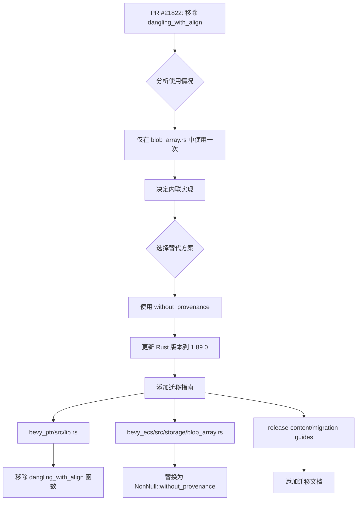

+++
title = "#21822 Remove `bevy_ptr::dangling_with_align()` and inline it"
date = "2025-12-09T00:00:00"
draft = false
template = "pull_request_page.html"
in_search_index = false

[extra]
current_language = "zh-cn"
available_languages = {"en" = { name = "English", url = "/pull_request/bevy/2025-12/pr-21822-en-20251209" }, "zh-cn" = { name = "中文", url = "/pull_request/bevy/2025-12/pr-21822-zh-cn-20251209" }}
+++

# Title

## 基本信息
- **标题**: Remove `bevy_ptr::dangling_with_align()` and inline it
- **PR链接**: https://github.com/bevyengine/bevy/pull/21822
- **作者**: BD103
- **状态**: 已合并
- **标签**: C-Code-Quality, S-Ready-For-Final-Review, M-Migration-Guide, A-Pointers, D-Straightforward, D-Unsafe
- **创建时间**: 2025-11-13T01:04:03Z
- **合并时间**: 2025-12-09T05:34:27Z
- **合并人**: alice-i-cecile

## 描述翻译

### 目标
- `bevy_ptr::dangling_with_align()` 仅在 `bevy_ecs` 的 `BlobArray::with_capacity()` 中使用了一次，并且在引擎内部之外并不通用。我们可以移除这个函数并将其实现内联到调用处。
- 此外，`bevy_ptr::dangling_with_align()` 有一个 TODO 注释，这是从 https://github.com/bevyengine/bevy/pull/15311#discussion_r1768091379 遗留下来的，当时建议 `dangling_with_align()` 应该使用 `without_provenance()`。
  - TODO 注释中提到的 `with_addr()` 也可以使用，但这是一个更迂回的解决方案。当时提到它的原因是原作者认为它会比 `without_provenance()` 更早稳定。

### 解决方案
- 移除 `dangling_with_align()`。
- 用 `NonNull::without_provenance()` 替换其用法（因为它现在已经稳定，并且不需要 `unsafe` 或指针运算）

### 测试
- 我运行了启用了严格来源（strict provenance）检查的 Miri 以确保行为得以维持。
  - `MIRIFLAGS="-Zmiri-strict-provenance" cargo +nightly miri test`

### 但是这个"来源"（provenance）是什么？
[官方文档提供了更深入的解释](https://doc.rust-lang.org/stable/std/ptr/index.html#provenance)，但基本上指针不仅仅是引用内存地址的数字。指针具有与之关联的**权限**，这些权限跟踪：
- 允许访问哪些内存地址集合
- 指针何时允许访问这些地址
- 指针是否允许修改内存，还是仅允许读取

这些权限就是指针的来源（provenance）。它们在运行时并不存储，Rust编译器在编译时也不知道它们！Miri 是我所知道的唯一跟踪来源的工具，它使用这些信息来确保指针遵守其空间、时间和可变性权限。这就是为什么我在测试部分提到 Miri。 :)

## 这个PR的故事

### 问题和上下文
在 Bevy 引擎的代码库中，有一个名为 `bevy_ptr::dangling_with_align()` 的辅助函数，它创建一个具有特定对齐方式的悬垂指针（dangling pointer）。这个函数只在一个地方被使用：在 `bevy_ecs` 模块的 `BlobArray::with_capacity()` 方法中，用于处理容量为0的情况。

`BlobArray` 是 ECS（Entity Component System）存储系统的一部分，用于管理动态大小的数据块。当容量为0时，不需要分配内存，但需要创建一个对齐正确的悬垂指针。最初，这个功能被抽象为一个独立的函数，可能因为预期它会多次使用，但实际上只使用了一次。

此外，`dangling_with_align()` 函数中有一个 TODO 注释，建议使用更现代的 Rust 指针 API。这个注释源于之前的讨论，其中开发者考虑了两种可能的替代方案：`with_addr()` 和 `without_provenance()`。当时认为 `with_addr()` 会更早稳定，但实际情况是 `without_provenance()` 先稳定了。

### 解决方案方法
开发者选择了最直接的解决方案：移除这个单一用途的函数，并将其实现内联到唯一的使用处。这样做有几个好处：
1. 减少了公共API的复杂度
2. 消除了未使用的函数
3. 可以利用新稳定的 `NonNull::without_provenance()` API，这比原始的手动指针运算更安全、更清晰

技术决策基于以下考虑：
- `without_provenance()` 现在在稳定版 Rust 中可用，不需要 `unsafe` 代码
- 内联简化了代码结构，因为函数只在一个地方使用
- 移除未使用的函数有助于保持代码库的整洁

### 实现细节
主要的更改发生在两个关键文件：`bevy_ptr/src/lib.rs` 和 `bevy_ecs/src/storage/blob_array.rs`。

在 `bevy_ptr` 模块中，`dangling_with_align()` 函数被完全移除：

```rust
// 文件: crates/bevy_ptr/src/lib.rs
// 之前:
pub const fn dangling_with_align(align: NonZeroUsize) -> NonNull<u8> {
    debug_assert!(align.is_power_of_two(), "Alignment must be power of two.");
    // SAFETY: The pointer will not be null, since it was created
    // from the address of a `NonZero<usize>`.
    // TODO: use https://doc.rust-lang.org/std/ptr/struct.NonNull.html#method.with_addr once stabilized
    unsafe { NonNull::new_unchecked(ptr::null_mut::<u8>().wrapping_add(align.get())) }
}

// 之后:
// 函数被完全移除
```

在 `bevy_ecs` 的 `blob_array.rs` 中，函数调用被替换为直接使用 `NonNull::without_provenance()`：

```rust
// 文件: crates/bevy_ecs/src/storage/blob_array.rs
// 之前:
if capacity == 0 {
    let align = NonZeroUsize::new(item_layout.align()).expect("alignment must be > 0");
    let data = bevy_ptr::dangling_with_align(align);
    // ...

// 之后:
if capacity == 0 {
    let align = NonZeroUsize::new(item_layout.align()).expect("alignment must be > 0");

    // Create a dangling pointer with the given alignment.
    let data = NonNull::without_provenance(align);
    // ...
```

这个变化很直接：用更现代的、稳定的API替换了自定义的指针创建逻辑。`without_provenance()` 方法创建一个具有给定对齐方式的悬垂指针，这正是原始函数的功能。

### 技术见解
这个PR涉及几个重要的技术概念：

1. **指针来源（Pointer Provenance）**：这是一个高级的Rust概念，指的是指针不仅仅是一个内存地址，还带有关于它可以访问哪些内存的元数据。来源信息帮助编译器进行优化并防止未定义行为。`without_provenance()` 创建一个没有来源信息的指针，适用于悬垂指针的情况。

2. **悬垂指针（Dangling Pointers）**：这些是指向无效内存的指针，但在Rust中，只要不解引用，创建悬垂指针是安全的。它们通常用于表示"无数据"状态，特别是在容量为0的集合中。

3. **API演进**：这个变化展示了Rust标准库的演进。随着 `without_provenance()` 的稳定，之前需要手动指针运算或等待 `with_addr()` 的功能现在可以用更安全、更清晰的API实现。

4. **Miri测试**：开发者使用Miri（Rust的内存检查器）进行测试，特别是启用了严格来源检查。这确保了新代码在指针来源方面的行为与旧代码一致，防止了微妙的未定义行为。

### 影响和迁移
这个变化的主要影响是：
- **代码简化**：移除了一个单一用途的辅助函数
- **API清理**：减少了 `bevy_ptr` 模块的公共API表面积
- **现代化**：利用了Rust 1.89.0的新稳定功能

对于使用者，如果他们在自己的代码中使用了 `dangling_with_align()`，需要迁移到 `NonNull::without_provenance()`。PR包含了迁移指南：

```rust
// 0.17 版本
let ptr = dangling_with_align(align);

// 0.18 版本
let ptr = NonNull::without_provenance(align);
```

值得注意的是，PR还更新了项目的Rust版本要求从1.88.0到1.89.0，因为 `without_provenance()` 在1.89.0中才稳定。

### 相关代码改进
除了主要更改，PR还包含了一些代码风格改进。在 `bevy_error.rs` 中，多个条件判断被重构为使用Rust的新 `let-else` 样式，使代码更简洁：

```rust
// 之前:
if let Some(line) = lines.peek() {
    if &line[6..] == "std::backtrace::Backtrace::create" {
        skip = true;
    }
}

// 之后:
if let Some(line) = lines.peek()
    && &line[6..] == "std::backtrace::Backtrace::create"
{
    skip = true;
}
```

这种重构不改变功能，但提高了代码的可读性。

## 可视化表示



## 关键文件变更

### 1. `crates/bevy_ptr/src/lib.rs` (+0/-11)
**变更描述**：移除了 `dangling_with_align()` 函数及其相关导入。

**关键代码**：
```rust
// 移除的函数:
/// Creates a dangling pointer with specified alignment.
/// See [`NonNull::dangling`].
pub const fn dangling_with_align(align: NonZeroUsize) -> NonNull<u8> {
    debug_assert!(align.is_power_of_two(), "Alignment must be power of two.");
    // SAFETY: The pointer will not be null, since it was created
    // from the address of a `NonZero<usize>`.
    // TODO: use https://doc.rust-lang.org/std/ptr/struct.NonNull.html#method.with_addr once stabilized
    unsafe { NonNull::new_unchecked(ptr::null_mut::<u8>().wrapping_add(align.get())) }
}
```

### 2. `crates/bevy_ecs/src/storage/blob_array.rs` (+4/-1)
**变更描述**：将 `dangling_with_align()` 的调用替换为 `NonNull::without_provenance()`。

**关键代码**：
```rust
// 之前:
let data = bevy_ptr::dangling_with_align(align);

// 之后:
// Create a dangling pointer with the given alignment.
let data = NonNull::without_provenance(align);
```

### 3. `release-content/migration-guides/remove_dangling_with_align.md` (+14/-0)
**变更描述**：添加了从 `dangling_with_align()` 迁移到 `NonNull::without_provenance()` 的指南。

**关键代码**：
```markdown
---
title: Remove `bevy::ptr::dangling_with_align()`
pull_requests: [21822]
---

`bevy::ptr::dangling_with_align()` has been removed. Use `NonNull::without_provenance()` instead:

```rust
// 0.17
let ptr = dangling_with_align(align);

// 0.18
let ptr = NonNull::without_provenance(align);
```
```

### 4. `Cargo.toml` 和 `crates/bevy_ecs/Cargo.toml` (各 +1/-1)
**变更描述**：将Rust版本要求从1.88.0更新到1.89.0，以支持 `without_provenance()` 方法。

**关键代码**：
```toml
# 之前:
rust-version = "1.88.0"

# 之后:
rust-version = "1.89.0"
```

### 5. `crates/bevy_ecs/src/error/bevy_error.rs` (+16/-16)
**变更描述**：代码风格改进，将嵌套的if语句重构为使用 `let-else` 样式。

**关键代码**：
```rust
// 之前:
if let Some(line) = lines.peek() {
    if &line[6..] == "std::backtrace::Backtrace::create" {
        skip = true;
    }
}

// 之后:
if let Some(line) = lines.peek()
    && &line[6..] == "std::backtrace::Backtrace::create"
{
    skip = true;
}
```

## 延伸阅读

1. **Rust指针来源（Pointer Provenance）**：
   - 官方文档：https://doc.rust-lang.org/stable/std/ptr/index.html#provenance
   - Ralf Jung的博客文章：https://www.ralfj.de/blog/2020/12/14/provenance.html

2. **NonNull::without_provenance()**：
   - Rust文档：https://doc.rust-lang.org/std/ptr/struct.NonNull.html#method.without_provenance
   - 稳定化PR：https://github.com/rust-lang/rust/pull/115150

3. **Miri内存检查器**：
   - 官方仓库：https://github.com/rust-lang/miri
   - 使用指南：https://github.com/rust-lang/miri#running-miri

4. **Rust的悬垂指针**：
   - Nomicon相关章节：https://doc.rust-lang.org/nomicon/vec/vec-alloc.html
   - 关于安全悬垂指针的讨论：https://github.com/rust-lang/rust/issues/54628

5. **Bevy的ECS架构**：
   - Bevy ECS指南：https://bevy-cheatbook.github.io/programming/ecs-intro.html
   - `BlobArray` 在存储系统中的作用：https://github.com/bevyengine/bevy/blob/main/crates/bevy_ecs/src/storage/blob_array.rs