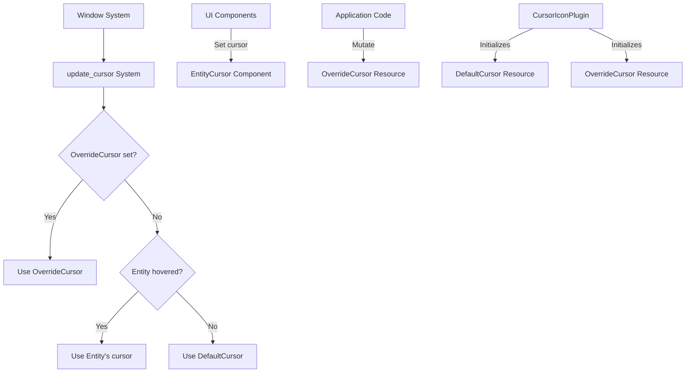

+++
title = "#21824 Feathers: add override cursor"
date = "2025-12-10T00:00:00"
draft = false
template = "pull_request_page.html"
in_search_index = true

[taxonomies]
list_display = ["show"]

[extra]
current_language = "en"
available_languages = {"en" = { name = "English", url = "/pull_request/bevy/2025-12/pr-21824-en-20251210" }, "zh-cn" = { name = "中文", url = "/pull_request/bevy/2025-12/pr-21824-zh-cn-20251210" }}
labels = ["C-Feature", "A-UI", "D-Straightforward"]
+++

# Feathers: add override cursor

## Basic Information
- **Title**: Feathers: add override cursor
- **PR Link**: https://github.com/bevyengine/bevy/pull/21824
- **Author**: rudderbucky
- **Status**: MERGED
- **Labels**: C-Feature, A-UI, S-Ready-For-Final-Review, D-Straightforward
- **Created**: 2025-11-13T04:35:11Z
- **Merged**: 2025-12-10T00:44:27Z
- **Merged By**: alice-i-cecile

## Description Translation
# Objective

Fixes #21801 and tweaks the feathers example to exhibit the new behavior.

## Solution

What the issue suggested. Added a new resource and adjusted the `EntityCursor` interaction logic in `cursor.rs`.

## Testing

Tested it via the example tweak where the wide button now toggles the override logic.
(Note: I wasn't able to get the load cursor to show up on macOS, but I think this is a `winit` issue: `cursor `busyButClickableCursor` appears to be invalid`)

## The Story of This Pull Request

The problem addressed by this PR originates from a limitation in Bevy's Feathers UI system. Before this change, the cursor icon system in Feathers allowed developers to specify cursor icons for UI elements and set a default cursor when not hovering over anything. However, there was no way to programmatically override the cursor icon globally, which is needed for scenarios like showing a loading cursor during long operations or temporarily disabling interactive cursor feedback.

The core issue was that the cursor update logic in `cursor.rs` only considered the hover state and default cursor. When an application needed to temporarily change the cursor (for example, to indicate a loading state), there was no clean mechanism to do so without manipulating the hover state or default cursor, which could have unintended side effects.

The developer approached this problem by adding a new resource called `OverrideCursor` that provides a straightforward way to temporarily override any cursor changes. This design follows Bevy's resource-based patterns and integrates cleanly with the existing cursor system. The implementation is minimal and focused, adding only what's necessary to solve the problem.

The key change is in the `update_cursor` system in `cursor.rs`. Previously, the system would:
1. Check for hovered entities with cursor components
2. Fall back to the default cursor if nothing was hovered

The updated logic now:
1. First checks if an override cursor is set
2. If an override exists, uses it
3. Otherwise, proceeds with the original hover/default logic

Here's how the logic changed:

```rust
// Before:
let cursor = hover_map
    .and_then(|hover_map| match hover_map.get(&PointerId::Mouse) {
        // ... hover logic ...
    })
    .unwrap_or(&r_default_cursor.0);

// After:
let cursor = r_override_cursor.0.as_ref().unwrap_or_else(|| {
    hover_map
        .and_then(|hover_map| match hover_map.get(&PointerId::Mouse) {
            // ... same hover logic ...
        })
        .unwrap_or(&r_default_cursor)
});
```

This change uses Rust's `Option::as_ref()` and `unwrap_or_else()` to create a clean conditional flow. The override cursor takes precedence, but when it's `None` (the default), the system behaves exactly as before. This maintains backward compatibility while adding the new functionality.

The `OverrideCursor` resource itself is straightforward:

```rust
#[derive(Deref, Resource, Debug, Clone, Default, Reflect)]
pub struct OverrideCursor(pub Option<EntityCursor>);
```

By making it an `Option<EntityCursor>`, the resource can be in three states:
1. `Some(EntityCursor::System(SystemCursorIcon::Wait))` - override with a wait cursor
2. `Some(EntityCursor::Custom(...))` - override with a custom cursor
3. `None` - no override (default behavior)

The `Deref` derivation provides ergonomic access to the inner `Option`, which is why the code uses `r_override_cursor.0` to access the value.

The example update demonstrates the practical use of this feature. Previously, the wide button just logged a message when clicked. Now, it toggles between setting and clearing the override cursor:

```rust
observe(|_activate: On<Activate>, mut ovr: ResMut<OverrideCursor>| {
    ovr.0 = if ovr.0.is_some() {
        None
    } else {
        Some(EntityCursor::System(SystemCursorIcon::Wait))
    };
    info!("Override cursor button clicked!");
})
```

This demonstrates how an application can temporarily change the cursor during a loading operation and then restore normal behavior. The developer noted a platform-specific issue with the wait cursor not showing up on macOS, but correctly identified this as a potential winit issue rather than a problem with their implementation.

From an architectural perspective, this change follows several good practices:
1. It uses the existing `EntityCursor` enum type, avoiding type duplication
2. It integrates with the resource system, making it accessible throughout the ECS
3. It maintains full backward compatibility
4. The override is temporary and doesn't require modifying existing cursor components

One technical insight worth noting is the use of `bevy_derive::Deref`. This was added as a dependency in `Cargo.toml` to enable the `#[derive(Deref)]` attribute on both `DefaultCursor` and `OverrideCursor`. This provides cleaner API ergonomics by allowing direct access to the inner values through dereferencing.

The impact of this change is that Feathers applications now have a clean, official way to temporarily override cursor icons. This is particularly useful for:
- Loading states during asset loading or network requests
- Disabling interactive feedback during modal dialogs or popups
- Temporarily changing cursor behavior during specific application states

The implementation is efficient, adding only a single optional check to the cursor update logic. The resource-based approach means it can be accessed from any system that has the appropriate resource access, providing flexibility for different use cases.

## Visual Representation



## Key Files Changed

### `crates/bevy_feathers/src/cursor.rs` (+25/-13)
This file contains the core implementation of the cursor override feature.

**Key changes:**
1. Added `OverrideCursor` resource definition with `Deref` derivation
2. Modified `update_cursor` system to check the override cursor first
3. Updated `DefaultCursor` to also derive `Deref` for consistency
4. Added `bevy_derive` import to support `#[derive(Deref)]`

```rust
// New resource added:
#[derive(Deref, Resource, Debug, Clone, Default, Reflect)]
pub struct OverrideCursor(pub Option<EntityCursor>);

// Logic change in update_cursor:
let cursor = r_override_cursor.0.as_ref().unwrap_or_else(|| {
    // Original hover/default logic here
    // ...
});

// Plugin updated to initialize the resource:
if app.world().get_resource::<DefaultCursor>().is_none() {
    app.init_resource::<DefaultCursor>();
    app.init_resource::<OverrideCursor>();  // New line
}
```

### `examples/ui/feathers.rs` (+10/-3)
Updated the example to demonstrate the new override cursor functionality.

**Key changes:**
1. Changed button text from "Button" to "Toggle override"
2. Updated the button's click handler to toggle the override cursor
3. Added necessary imports for `EntityCursor` and `OverrideCursor`

```rust
// Before:
observe(|_activate: On<Activate>| {
    info!("Wide button clicked!");
})

// After:
observe(|_activate: On<Activate>, mut ovr: ResMut<OverrideCursor>| {
    ovr.0 = if ovr.0.is_some() {
        None
    } else {
        Some(EntityCursor::System(SystemCursorIcon::Wait))
    };
    info!("Override cursor button clicked!");
})
```

### `crates/bevy_feathers/Cargo.toml` (+1/-0)
Added `bevy_derive` as a dependency to support the `Deref` derivation macro.

```toml
bevy_derive = { path = "../bevy_derive", version = "0.18.0-dev" }
```

## Further Reading

1. **Bevy Resources Documentation**: Understanding how resources work in Bevy's ECS is fundamental to using features like `OverrideCursor`. The official Bevy book covers resources in detail.

2. **Rust Option and Result Types**: The implementation makes good use of Rust's `Option` type. The Rust Book chapter on error handling provides excellent background on working with `Option` and `Result`.

3. **Derive Macros in Rust**: The PR uses `#[derive(Deref)]` from `bevy_derive`. The Rust Reference section on derive macros explains how these work.

4. **UI/UX Best Practices for Cursor Feedback**: While not technical, understanding when and why to change cursor icons is important for creating good user experiences. Material Design and other UI frameworks provide guidelines on cursor usage.

5. **Bevy Input Handling**: The cursor system interacts with Bevy's input handling. The Bevy cheatbook has sections on input systems that complement the cursor override feature.