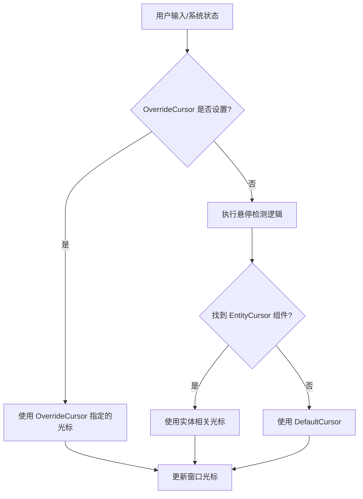

+++
title = "#21824 Feathers: add override cursor"
date = "2025-12-10T00:00:00"
draft = false
template = "pull_request_page.html"
in_search_index = false

[extra]
current_language = "zh-cn"
available_languages = {"en" = { name = "English", url = "/pull_request/bevy/2025-12/pr-21824-en-20251210" }, "zh-cn" = { name = "中文", url = "/pull_request/bevy/2025-12/pr-21824-zh-cn-20251210" }}
+++

# Feathers: add override cursor

## 基本信息
- **标题**: Feathers: add override cursor
- **PR链接**: https://github.com/bevyengine/bevy/pull/21824
- **作者**: rudderbucky
- **状态**: 已合并
- **标签**: C-Feature, A-UI, S-Ready-For-Final-Review, D-Straightforward
- **创建时间**: 2025-11-13T04:35:11Z
- **合并时间**: 2025-12-10T00:44:27Z
- **合并者**: alice-i-cecile

## 描述翻译

### 目标
修复 #21801，并调整 feathers 示例以展示新行为。

### 解决方案
按照 issue 的建议实现。添加了新的资源，并调整了 `cursor.rs` 中的 `EntityCursor` 交互逻辑。

### 测试
通过示例调整进行了测试，现在宽按钮会切换覆盖逻辑。
（注：我无法在 macOS 上显示加载光标，但我认为这是 `winit` 的问题：`cursor 'busyButClickableCursor' appears to be invalid`）

## 该 PR 的技术分析

这个 PR 解决了一个具体的 UI 交互问题：在某些场景下，需要临时覆盖系统的光标逻辑。主要应用场景是在加载状态中，此时不希望光标提示用户可以与界面元素交互，而应该显示一个等待状态的光标。

### 问题背景与上下文
在 Bevy 的 Feathers UI 系统中，光标图标通常基于鼠标悬停的实体来决定。系统会检查悬停的实体或其祖先是否具有 `EntityCursor` 组件，并使用该组件指定的光标。如果没有找到，则使用 `DefaultCursor` 资源中定义的默认光标。

然而，在某些情况下，如应用处于加载状态时，开发者需要临时覆盖这种基于悬停的光标逻辑，强制显示特定的光标（如等待光标），无论用户悬停在哪个元素上。Issue #21801 正是提出了这一需求：需要一个机制来临时覆盖光标图标。

### 解决方案的实现方法
该 PR 采用了一种简洁的资源覆盖机制来实现这一功能。核心思路是引入一个新的 `OverrideCursor` 资源，当该资源被设置时，系统会优先使用它指定的光标，而忽略基于悬停的逻辑。

实现主要包含三个部分：
1. 新增 `OverrideCursor` 资源类型
2. 修改光标更新逻辑以支持覆盖
3. 在示例中添加演示代码

### 具体实现细节
在 `crates/bevy_feathers/src/cursor.rs` 中，新增了 `OverrideCursor` 资源，它是一个包含 `Option<EntityCursor>` 的包装器。使用 `Option` 类型使得覆盖可以被启用和禁用：

```rust
#[derive(Deref, Resource, Debug, Clone, Default, Reflect)]
pub struct OverrideCursor(pub Option<EntityCursor>);
```

在 `update_cursor` 函数中，逻辑被修改为首先检查 `OverrideCursor` 资源。如果覆盖被设置，则使用覆盖的光标；否则，回退到原有的悬停逻辑：

```rust
let cursor = r_override_cursor.0.as_ref().unwrap_or_else(|| {
    hover_map
        .and_then(|hover_map| match hover_map.get(&PointerId::Mouse) {
            Some(hover_set) => hover_set.keys().find_map(|entity| {
                cursor_query.get(*entity).ok().or_else(|| {
                    parent_query
                        .iter_ancestors(*entity)
                        .find_map(|e| cursor_query.get(e).ok())
                })
            }),
            None => None,
        })
        .unwrap_or(&r_default_cursor)
});
```

注意这里使用了 `unwrap_or_else` 来延迟原有逻辑的执行，只有当覆盖不存在时才执行悬停检查，这是一个合理的性能优化。

在插件初始化时，系统会自动创建默认的 `OverrideCursor` 资源：

```rust
if app.world().get_resource::<DefaultCursor>().is_none() {
    app.init_resource::<DefaultCursor>();
    app.init_resource::<OverrideCursor>();
}
```

### 工程决策与技术考量
1. **资源优先的设计**：选择使用资源（Resource）而不是组件（Component）来实现覆盖，是因为光标覆盖是全局状态，而非实体特定的。这个设计决策与现有的 `DefaultCursor` 资源保持一致。

2. **Optional 设计**：`OverrideCursor` 包装在 `Option` 中，使得禁用覆盖非常简单（设置为 `None`）。这比使用单独的布尔标志更符合 Rust 的惯用法。

3. **向后兼容性**：此实现完全向后兼容。如果没有系统设置 `OverrideCursor`，它的值将是 `None`，此时行为与修改前完全一致。

4. **系统集成**：光标更新系统仍然在 `PickingSystems::Last` 中运行，确保所有悬停检测完成后再计算最终的光标。

### 示例与使用方式
为了演示新功能，示例代码被修改为包含一个切换覆盖的按钮。当点击按钮时，会在等待光标和无覆盖之间切换：

```rust
observe(|_activate: On<Activate>, mut ovr: ResMut<OverrideCursor>| {
    ovr.0 = if ovr.0.is_some() {
        None
    } else {
        Some(EntityCursor::System(SystemCursorIcon::Wait))
    };
    info!("Override cursor button clicked!");
})
```

这种设计使得开发者可以轻松地在自己的应用中集成类似的功能，只需在适当的系统中修改 `OverrideCursor` 资源即可。

### 潜在问题与限制
作者在测试时发现，在 macOS 上无法显示加载光标，这可能是底层 `winit` 库的问题。这表明虽然 API 设计良好，但实际效果可能受限于底层平台的实现。

### 总结
这个 PR 通过添加一个简单的资源覆盖机制，优雅地解决了临时覆盖光标图标的需求。实现干净、简洁，符合 Bevy 的 ECS 架构模式，并且保持了向后兼容性。这种模式可以扩展到其他类似的全局状态覆盖场景中。

## 可视化表示



## 关键文件变更

### 1. `crates/bevy_feathers/src/cursor.rs` (+25/-13)
**变更说明**：这是核心实现文件，添加了 `OverrideCursor` 资源并修改了光标更新逻辑。

**关键代码片段**：
```rust
// 新增的 OverrideCursor 资源定义
#[derive(Deref, Resource, Debug, Clone, Default, Reflect)]
pub struct OverrideCursor(pub Option<EntityCursor>);

// 修改后的光标更新逻辑
let cursor = r_override_cursor.0.as_ref().unwrap_or_else(|| {
    // 原有的悬停检测逻辑...
});
```

**与 PR 目的的关系**：这些变更直接实现了光标覆盖机制的核心功能。

### 2. `examples/ui/feathers.rs` (+10/-3)
**变更说明**：修改示例以演示新功能，添加了一个按钮来切换覆盖光标。

**关键代码片段**：
```rust
// 按钮现在切换覆盖光标
observe(|_activate: On<Activate>, mut ovr: ResMut<OverrideCursor>| {
    ovr.0 = if ovr.0.is_some() {
        None
    } else {
        Some(EntityCursor::System(SystemCursorIcon::Wait))
    };
    info!("Override cursor button clicked!");
})
```

**与 PR 目的的关系**：这提供了使用新 API 的具体示例，帮助开发者理解如何使用此功能。

### 3. `crates/bevy_feathers/Cargo.toml` (+1/-0)
**变更说明**：添加了对 `bevy_derive` 的依赖，以支持 `Deref` 派生宏。

**关键代码片段**：
```toml
bevy_derive = { path = "../bevy_derive", version = "0.18.0-dev" }
```

**与 PR 目的的关系**：这是实现 `OverrideCursor` 资源 `Deref` 特性所必需的，使得可以方便地访问内部值。

## 延伸阅读

1. **Bevy ECS 资源系统**：了解如何通过 `Res` 和 `ResMut` 在系统中访问和修改全局资源
2. **Feathers UI 系统**：了解 Bevy 的 Feathers UI 架构及其组件系统
3. **winit 光标 API**：了解底层窗口库的光标支持情况，特别是跨平台差异
4. **Rust 的 Option 模式**：学习如何使用 `Option` 类型表示可选状态，这是 Rust 中处理可选值的标准方式