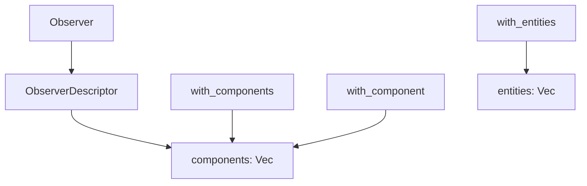

+++
title = "#21857 Add `Observer::with_components`"
date = "2025-12-07T00:00:00"
draft = false
template = "pull_request_page.html"
in_search_index = true

[taxonomies]
list_display = ["show"]

[extra]
current_language = "en"
available_languages = {"en" = { name = "English", url = "/pull_request/bevy/2025-12/pr-21857-en-20251207" }, "zh-cn" = { name = "中文", url = "/pull_request/bevy/2025-12/pr-21857-zh-cn-20251207" }}
labels = ["A-ECS", "C-Usability", "D-Straightforward"]
+++

# Title

## Basic Information
- **Title**: Add `Observer::with_components`
- **PR Link**: https://github.com/bevyengine/bevy/pull/21857
- **Author**: Shatur
- **Status**: MERGED
- **Labels**: A-ECS, C-Usability, S-Ready-For-Final-Review, X-Uncontroversial, D-Straightforward
- **Created**: 2025-11-16T10:47:48Z
- **Merged**: 2025-12-07T23:15:48Z
- **Merged By**: mockersf

## Description Translation
**Objective**

- Closes #21848.

**Solution**

- Add `Observer::with_components`, for consistency with `Observer::with_entities` for entities.

**Testing**

- I didn't test it, but it's a very simple helper function, similar to already existing `Observer::with_component` (singular).

## The Story of This Pull Request

This PR addresses a minor API inconsistency in Bevy's ECS observer system. Observers in Bevy allow systems to react to specific events, and they can be configured to trigger based on various criteria, including which components are involved in the event.

The existing observer API provided a `with_component` method for observing a single component, but only had `with_entities` (plural) for observing multiple entities. There was no corresponding plural method for components, which created an asymmetry in the API. When developers needed to observe multiple components, they had to chain multiple `with_component` calls, which was less ergonomic than having a dedicated plural method.

The implementation follows a straightforward pattern. The `Observer` struct maintains a `descriptor` field that contains various trigger criteria. The `components` field within this descriptor is a collection of `ComponentId`s. The new `with_components` method accepts an iterator of `ComponentId`s and extends this collection, similar to how `with_entities` works.

This is a small quality-of-life improvement that enhances API consistency. It doesn't introduce new functionality but provides a more convenient way to express intent when observers need to monitor multiple components. The implementation is minimal and low-risk, following established patterns in the codebase.

## Visual Representation



## Key Files Changed

**File: crates/bevy_ecs/src/observer/distributed_storage.rs**
This file contains the `Observer` struct definition and its builder methods. The change adds a new method `with_components` that allows adding multiple component IDs to the observer's trigger criteria.

**Before:** The file had methods for adding single components (`with_component`) and multiple entities (`with_entities`), but no method for adding multiple components.

**After:** Added the `with_components` method:

```rust
/// Observes the given `components`. This will cause the [`Observer`] to run whenever the [`Event`] has
/// an [`EntityComponentsTrigger`](crate::event::EntityComponentsTrigger) that targets any of the `components`.
pub fn with_components<I: IntoIterator<Item = ComponentId>>(mut self, components: I) -> Self {
    self.descriptor.components.extend(components);
    self
}
```

The method follows the same pattern as `with_entities`:
- Takes an iterator of `ComponentId`s
- Extends the internal `components` collection
- Returns `self` for method chaining

This change provides symmetry with the existing `with_entities` method and improves ergonomics when setting up observers that need to monitor multiple components.

## Further Reading

1. **Bevy Observer Documentation**: For understanding the observer pattern in Bevy's ECS
2. **Bevy Events System**: To understand how events and observers work together
3. **Iterator Pattern in Rust**: For understanding the `IntoIterator` trait used in the method signature
4. **Builder Pattern**: This PR follows the builder pattern common in Bevy's API design