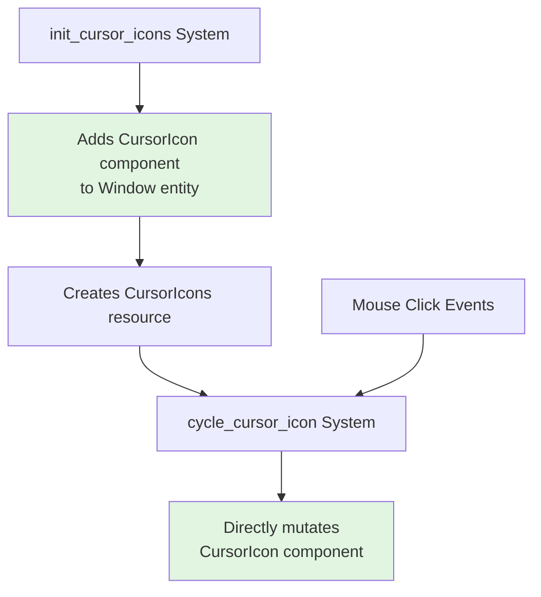

+++
title = "#21862 Slightly improve the window settings example"
date = "2025-12-07T00:00:00"
draft = false
template = "pull_request_page.html"
in_search_index = true

[taxonomies]
list_display = ["show"]

[extra]
current_language = "en"
available_languages = {"en" = { name = "English", url = "/pull_request/bevy/2025-12/pr-21862-en-20251207" }, "zh-cn" = { name = "中文", url = "/pull_request/bevy/2025-12/pr-21862-zh-cn-20251207" }}
labels = ["D-Trivial", "C-Examples", "A-Windowing"]
+++

# Title
Slightly improve the window settings example

## Basic Information
- **Title**: Slightly improve the window settings example
- **PR Link**: https://github.com/bevyengine/bevy/pull/21862
- **Author**: rmsthebest
- **Status**: MERGED
- **Labels**: D-Trivial, C-Examples, A-Windowing, S-Ready-For-Final-Review
- **Created**: 2025-11-16T19:49:19Z
- **Merged**: 2025-12-07T23:26:10Z
- **Merged By**: mockersf

## Description Translation
# Objective

Update the example to avoid teaching new people that the recommended way of updating a component is to re-insert it.

## Solution

Instead of inserting the component every time we want to change it, update the value.

## Testing

- Did you test these changes? If so, how? Yes, ran the example
- Are there any parts that need more testing? I don't think so?
- How can other people (reviewers) test your changes? Is there anything specific they need to know? Run the example, press left and right mouse.
- If relevant, what platforms did you test these changes on, and are there any important ones you can't test? (linux/wayland)

## The Story of This Pull Request

This PR addresses a minor but important issue in Bevy's window settings example code. The problem was pedagogical: the example was demonstrating an inefficient and non-idiomatic way to update component values. Specifically, it was using a re-insertion pattern where components were completely removed and re-added each time they needed to be modified, rather than directly updating their values.

The context here is that examples in a framework like Bevy serve dual purposes. They demonstrate functionality, but they also teach best practices to new users who study them. When an example uses non-optimal patterns, it risks teaching those patterns to developers who might assume "this is how the framework intends it to be done." In this case, the `cycle_cursor_icon` system was teaching the wrong approach to component updates.

The solution approach was straightforward: replace the re-insertion pattern with direct mutation. Instead of using `commands.entity(*window).insert(cursor_icons.0[*index].clone())` on every mouse click, the system now takes a mutable reference to the `CursorIcon` component and updates it directly: `**cursor = cursor_icons.0[*index].clone()`. This approach is more efficient because it doesn't trigger unnecessary component removal and addition events, and it's more idiomatic in the ECS paradigm where direct mutation of existing components is preferred when possible.

An important technical insight from this implementation is the change in system parameters. The original system used `mut commands: Commands` and `window: Single<Entity, With<Window>>` to get the window entity ID and then issue commands to modify it. The new approach uses `mut cursor: Single<&mut CursorIcon>` to get direct mutable access to the component. This change illustrates a key principle in ECS design: when you have direct access to a component and only need to modify its value (not its presence or type), direct mutation is cleaner and more performant than command-based approaches.

The implementation also required a change to the initialization system. Since the `CursorIcon` component wasn't initially present on the window entity (the default window doesn't have a cursor icon set), the `init_cursor_icons` system now adds it during initialization. This ensures the `cycle_cursor_icon` system can query for it as a mutable reference later. The system signature changed to include `window: Single<Entity, With<Window>>` so it can access the window entity and insert the initial cursor icon.

Two minor documentation improvements were also made: converting a regular comment to a doc comment for the `toggle_theme` system, and adding a doc comment for the `CursorIcons` resource. These improve the example's self-documentation.

The impact of these changes is primarily educational. The example now teaches the correct way to update component values in Bevy. For performance, the difference is negligible in this specific case, but the pattern matters more for complex systems where unnecessary re-insertions could have measurable overhead. The changes also make the code cleaner and more aligned with Bevy's ECS idioms.

## Visual Representation



## Key Files Changed

### `examples/window/window_settings.rs` (+11/-11)

This file contains the window settings example that demonstrates various window configuration options. The changes refactor how cursor icons are updated to use direct component mutation instead of re-insertion.

**Key changes:**

1. **Documentation improvements:**
```rust
// Before:
// This system will toggle the color theme used by the window

// After:
/// This system will toggle the color theme used by the window
```

2. **Resource documentation added:**
```rust
// Added doc comment:
/// Resource with a set of cursor icons we want to cycle through
#[derive(Resource)]
struct CursorIcons(Vec<CursorIcon>);
```

3. **Initialization system updated to add CursorIcon component:**
```rust
// Before:
fn init_cursor_icons(
    mut commands: Commands,
    #[cfg(feature = "custom_cursor")] asset_server: Res<AssetServer>,
) {
    commands.insert_resource(CursorIcons(vec![
        // ... cursor icons
    ]));
}

// After:
fn init_cursor_icons(
    mut commands: Commands,
    window: Single<Entity, With<Window>>,
    #[cfg(feature = "custom_cursor")] asset_server: Res<AssetServer>,
) {
    let cursor_icons = CursorIcons(vec![
        // ... cursor icons
    ]);
    // By default the Window entity does not have a CursorIcon component, so we add it here.
    commands.entity(*window).insert(cursor_icons.0[0].clone());
    commands.insert_resource(cursor_icons);
}
```

4. **Cursor cycling system refactored to use direct mutation:**
```rust
// Before:
fn cycle_cursor_icon(
    mut commands: Commands,
    window: Single<Entity, With<Window>>,
    input: Res<ButtonInput<MouseButton>>,
    mut index: Local<usize>,
    cursor_icons: Res<CursorIcons>,
) {
    if input.just_pressed(MouseButton::Left) {
        *index = (*index + 1) % cursor_icons.0.len();
        commands
            .entity(*window)
            .insert(cursor_icons.0[*index].clone());
    } else if input.just_pressed(MouseButton::Right) {
        *index = if *index == 0 {
            cursor_icons.0.len() - 1
        } else {
            *index - 1
        };
        commands
            .entity(*window)
            .insert(cursor_icons.0[*index].clone());
    }
}

// After:
fn cycle_cursor_icon(
    mut cursor: Single<&mut CursorIcon>,
    input: Res<ButtonInput<MouseButton>>,
    mut index: Local<usize>,
    cursor_icons: Res<CursorIcons>,
) {
    if input.just_pressed(MouseButton::Left) {
        *index = (*index + 1) % cursor_icons.0.len();
        **cursor = cursor_icons.0[*index].clone();
    } else if input.just_pressed(MouseButton::Right) {
        *index = if *index == 0 {
            cursor_icons.0.len() - 1
        } else {
            *index - 1
        };
        **cursor = cursor_icons.0[*index].clone();
    }
}
```

## Further Reading

1. **Bevy ECS Components Documentation**: For understanding how to work with components in Bevy's ECS system
2. **Bevy Commands vs Direct Access**: Documentation on when to use `Commands` versus direct component access
3. **Entity Component System Patterns**: General ECS patterns and best practices
4. **Bevy Window API**: Documentation on window management and configuration in Bevy
5. **Rust Ownership and Borrowing**: Understanding mutable references and the double dereference (`**cursor`) pattern used in the updated code