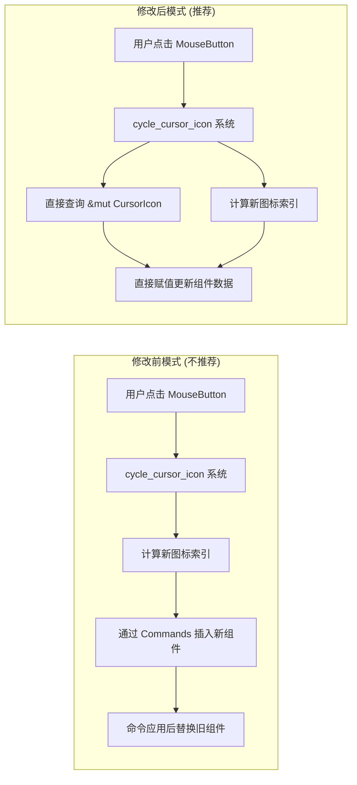

+++
title = "#21862 Slightly improve the window settings example"
date = "2025-12-07T00:00:00"
draft = false
template = "pull_request_page.html"
in_search_index = false

[extra]
current_language = "zh-cn"
available_languages = {"en" = { name = "English", url = "/pull_request/bevy/2025-12/pr-21862-en-20251207" }, "zh-cn" = { name = "中文", url = "/pull_request/bevy/2025-12/pr-21862-zh-cn-20251207" }}
labels = ["D-Trivial", "C-Examples", "A-Windowing"]
+++

# Title

## Basic Information
- **Title**: Slightly improve the window settings example
- **PR Link**: https://github.com/bevyengine/bevy/pull/21862
- **Author**: rmsthebest
- **Status**: MERGED
- **Labels**: D-Trivial, C-Examples, A-Windowing, S-Ready-For-Final-Review
- **Created**: 2025-11-16T19:49:19Z
- **Merged**: 2025-12-07T23:26:10Z
- **Merged By**: mockersf

## Description Translation

### 目标
更新示例，避免教新用户更新组件的推荐方式是重新插入它。

### 解决方案
不是每次想改变组件时都插入它，而是更新其值。

### 测试
- 你测试过这些更改吗？如果是，如何测试的？是的，运行了示例。
- 是否有任何部分需要更多测试？我不这么认为？
- 其他人（评审者）如何测试你的更改？有什么需要特别注意的吗？运行示例，按鼠标左键和右键。
- 如果相关，你在哪些平台上测试了这些更改，是否有你无法测试的重要平台？（linux/wayland）

## The Story of This Pull Request

这个 PR 的核心是一个关于代码教学质量的修正。问题出现在一个官方示例 `window_settings.rs` 中。这个示例用于演示如何操作窗口的各类属性，例如主题和光标图标。

具体问题是，在 `cycle_cursor_icon` 系统里，为了响应用户点击来改变光标图标，代码使用了 `commands.entity(*window).insert(cursor_icons.0[*index].clone())`。这种方法虽然能工作，但它执行的是**重新插入**（re-insert）整个 `CursorIcon` 组件。对于新接触 Bevy 或 ECS（Entity Component System）模式的开发者来说，这个示例无意中传递了一个错误的最佳实践：即通过插入新组件来更新现有组件的值。这是一种开销更大且不直观的做法。ECS 的核心优势之一就是能够高效地查询和直接修改（mutate）组件数据，而示例代码却掩盖了这个能力。

因此，这个 PR 的目标非常明确且聚焦：将示例代码从使用“插入”模式改为使用“更新”模式。这是一个典型的“授人以渔”的改动，旨在通过示例教导正确的 API 使用方式。

解决方案的实施相当直接。开发者需要做两件事：
1.  确保目标实体（窗口）从一开始就拥有 `CursorIcon` 组件，以便后续可以直接查询和修改它。
2.  修改响应点击的系统，使其直接更新现有组件的值，而不是通过命令队列重新插入。

为了实现第一步，代码修改了初始化系统 `init_cursor_icons`。原来它只是创建了一个包含光标图标列表的 `Resource`。现在，它在创建资源后，立即从该列表中取出第一个图标，并将其作为 `CursorIcon` 组件插入到窗口实体上。这样，窗口实体在游戏开始时就已经具备了可被修改的 `CursorIcon` 组件。

关键的第二步是重构 `cycle_cursor_icon` 系统。这是改动的主要部分：
*   **系统签名改变**：系统不再需要 `Commands` 参数来发送插入命令，也不再需要查询窗口的 `Entity` ID。相反，它现在直接查询一个可变的 `CursorIcon` 组件引用（`Single<&mut CursorIcon>`）。这个签名变化清晰地表明了该系统的作用是修改一个已有的组件。
*   **逻辑简化**：系统内部计算新光标索引的逻辑保持不变。但更新光标的核心操作从复杂的 `commands.entity(*window).insert(...)` 简化为直接赋值 `**cursor = cursor_icons.0[*index].clone()`。这里的双解引用（`**cursor`）是因为 `Single<&mut T>` 包装了一层，需要先解引用 `Single` 得到 `&mut CursorIcon`，再对其赋值。这种写法更加符合 Rust 的直觉，也清晰地展示了“修改数据”这一意图。

此外，PR 还附带了一个非常小的文档改进：将 `toggle_theme` 函数上方的行内注释 `// This system will ...` 改成了更正式的文档注释 `/// This system will ...`。同时，为新增的 `CursorIcons` 资源结构体也添加了文档注释 `/// Resource with a set of cursor icons we want to cycle through`。这些改动提升了代码的可读性和文档生成效果。

从技术角度看，这个改动的优势很明显：
1.  **性能**：避免了每次点击都通过命令队列调度一个插入操作的开销。直接修改内存中的数据更高效。
2.  **清晰性**：代码意图更明确。`&mut CursorIcon` 的查询直接宣告“我要改光标”，而 `Commands` 的使用则隐含了更复杂的实体操作。
3.  **教学价值**：示例现在演示了处理组件更新的正确方式，这对于初学者理解 Bevy ECS 的工作模式至关重要。

这个 PR 虽然只修改了一个示例文件，变动行数也不多（+11/-11），但其影响是深远的。示例代码是项目对外的接口之一，尤其对于游戏引擎这样的框架，示例是用户学习的首要资料。一个不良的示例会像“破窗理论”那样，导致用户在自己的项目中复制次优模式。通过这次修正，Bevy 项目维护了其代码库的教学质量，确保新手开发者从官方渠道学到的是高效、地道的 ECS 用法。

## Visual Representation



## Key Files Changed

**修改文件：`examples/window/window_settings.rs` (+11/-11)**

该文件是一个演示窗口设置的示例。PR 修正了其中更新光标图标的实现方式，从“重新插入组件”改为“直接修改组件值”，以展示正确的最佳实践。

**关键改动 1：初始化时添加组件**
为了后续能直接修改 `CursorIcon`，需要在初始化阶段确保窗口实体拥有该组件。
```rust
// After:
fn init_cursor_icons(
    mut commands: Commands,
    window: Single<Entity, With<Window>>, // 新增查询：获取窗口实体
    #[cfg(feature = "custom_cursor")] asset_server: Res<AssetServer>,
) {
    let cursor_icons = CursorIcons(vec![ ... ]); // 创建资源
    // By default the Window entity does not have a CursorIcon component, so we add it here.
    commands.entity(*window).insert(cursor_icons.0[0].clone()); // 插入初始组件
    commands.insert_resource(cursor_icons); // 插入资源
}
```

**关键改动 2：更新系统的重构**
`cycle_cursor_icon` 系统的签名和实现被彻底重构，移除了对 `Commands` 的依赖。
```rust
// Before:
fn cycle_cursor_icon(
    mut commands: Commands,
    window: Single<Entity, With<Window>>,
    input: Res<ButtonInput<MouseButton>>,
    mut index: Local<usize>,
    cursor_icons: Res<CursorIcons>,
) {
    if input.just_pressed(MouseButton::Left) {
        *index = (*index + 1) % cursor_icons.0.len();
        commands
            .entity(*window)
            .insert(cursor_icons.0[*index].clone()); // 通过Commands插入
    }
    // ... 处理右键逻辑类似
}

// After:
fn cycle_cursor_icon(
    mut cursor: Single<&mut CursorIcon>, // 新的查询：直接获取可变组件引用
    input: Res<ButtonInput<MouseButton>>,
    mut index: Local<usize>,
    cursor_icons: Res<CursorIcons>,
) {
    if input.just_pressed(MouseButton::Left) {
        *index = (*index + 1) % cursor_icons.0.len();
        **cursor = cursor_icons.0[*index].clone(); // 直接赋值修改
    } else if input.just_pressed(MouseButton::Right) {
        // ... 计算索引
        **cursor = cursor_icons.0[*index].clone(); // 直接赋值修改
    }
}
```

## Further Reading
*   **Bevy ECS 官方文档**：了解 `Query`、`&mut` 组件访问以及 `Commands` 的正确使用场景。
    *   链接：https://bevyengine.org/learn/book/2/programming/ecs/
*   **《Effective Rust》或类似风格指南**：其中关于 API 设计和“使正确的事情更容易做”的章节，与此 PR 的教学意义高度相关。
*   **Bevy 官方示例仓库**：查看其他示例，学习更多关于组件更新、状态管理和系统组织的模式。
    *   链接：https://github.com/bevyengine/bevy/tree/main/examples