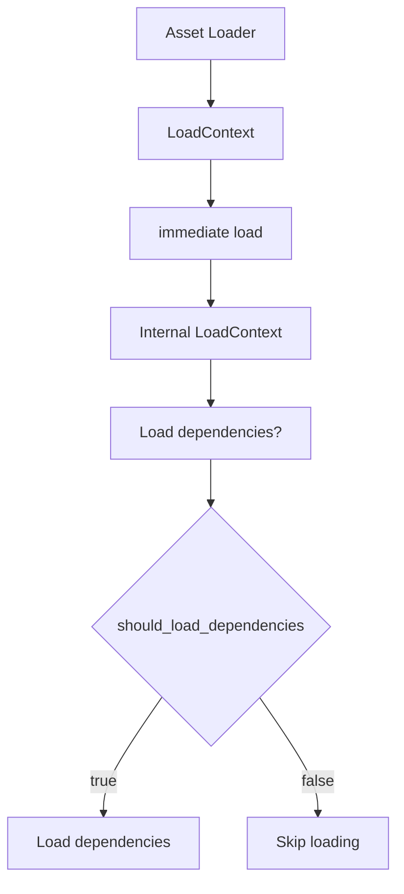

+++
title = "#21863 Fix immediate nested loaded assets not loading their dependencies."
date = "2025-12-10T00:00:00"
draft = false
template = "pull_request_page.html"
in_search_index = false

[extra]
current_language = "zh-cn"
available_languages = {"en" = { name = "English", url = "/pull_request/bevy/2025-12/pr-21863-en-20251210" }, "zh-cn" = { name = "中文", url = "/pull_request/bevy/2025-12/pr-21863-zh-cn-20251210" }}
+++

# Title

## 基本信息
- **标题**: Fix immediate nested loaded assets not loading their dependencies.
- **PR链接**: https://github.com/bevyengine/bevy/pull/21863
- **作者**: andriyDev
- **状态**: 已合并
- **标签**: C-Bug, D-Trivial, A-Assets, S-Ready-For-Final-Review
- **创建时间**: 2025-11-16T22:00:32Z
- **合并时间**: 2025-12-09T23:50:10Z
- **合并者**: alice-i-cecile

## 描述翻译

# 目标

- 之前，如果你立即加载一个嵌套资产（immediate nested asset），它不会加载其任何依赖项。这意味着你的资产中可能包含永远不会加载的句柄（handles）。
- 修复 #20988

## 解决方案

- 将加载依赖项传播到立即资产加载。
- 我还删除了一些测试应用设置代码的重复。

## 测试

- 添加了一个测试。

有一个情况会产生稍微不理想的效果：当你立即加载一个资产，从中获取一些数据（但没有依赖句柄），然后丢弃这个立即加载的资产。现在，这个更改将启动依赖加载，即使我们不会使用它。
然而，A) 拥有一个永远不会加载的句柄更令人惊讶，B) 一旦我们丢弃该句柄，我们应该取消依赖加载，所以我们不应该承担太多的加载成本。

## 这个 Pull Request 的故事

### 问题和背景

在 Bevy 的资产系统中，资产可以引用其他资产，形成依赖关系。开发者可以通过两种方式加载资产：标准异步加载和“立即”加载（immediate load）。立即加载通常用于在资产处理过程中同步地获取另一个资产，例如在加载一个主资产时，其配置文件中指定了需要立即使用的子资产。

问题出现在当一个资产通过立即加载方式加载另一个嵌套资产时。在 PR #21863 修复之前，这个立即加载的嵌套资产不会触发其自身依赖项的加载。这意味着，如果嵌套资产本身包含指向其他资产的句柄，这些句柄将永远不会被加载，导致资产处于不完整状态。这是一个严重的 Bug，因为它破坏了资产依赖链的可靠性，开发者可能会发现他们的资产中部分内容缺失，而没有任何错误提示。

该问题由 issue #20988 记录，指出了在某些情况下资产句柄永远不会加载的问题。

### 解决方案方法

问题的根源在于资产加载上下文中一个标志位的传播。在 Bevy 的资产加载器（AssetLoader）中，`LoadContext` 结构体有一个 `should_load_dependencies` 字段，用于控制是否应该实际加载依赖项（而不仅仅是记录它们）。在立即加载嵌套资产时，这个标志没有被传递给内部加载过程，导致内部加载过程默认不加载依赖。

解决方案很直接：在立即加载嵌套资产时，将当前上下文的 `should_load_dependencies` 标志传播给内部加载。这样，如果父级加载需要依赖，那么嵌套资产的依赖也会被加载；反之，如果父级加载只是为了获取信息而不需要实际加载依赖（例如在资产预处理阶段），那么嵌套资产的依赖也不会被加载，从而保持原有行为。

开发者还借此机会重构了测试代码，提取了通用的应用创建逻辑，消除了多个测试中重复的设置代码。

### 具体实现

实现主要集中在 `crates/bevy_asset/src/loader.rs` 文件中。修改了 `LoadContext` 的 `load_direct_untyped` 方法（或相关内部方法），将当前上下文的 `should_load_dependencies` 标志传递给内部加载调用。

具体来说，在 `loader.rs` 的 `load_direct_untyped` 函数中（由 `LoadContext` 的 `load` 方法调用），当执行立即加载时，现在将 `self.should_load_dependencies` 作为参数传递给内部加载函数，而不是之前的硬编码 `false`。

修改前，立即加载嵌套资产时，内部加载调用忽略依赖加载；修改后，内部加载会根据外部上下文的标志决定是否加载依赖。

此外，在 `crates/bevy_asset/src/lib.rs` 中，开发者重构了测试工具函数，将原来的 `test_app` 函数拆分为更通用的 `create_app` 和 `create_app_with_gate`，以减少代码重复。最重要的是，添加了一个新的测试 `immediate_nested_asset_loads_dependency`，专门验证立即加载嵌套资产时其依赖是否被正确加载。

### 技术见解

这个修复涉及 Bevy 资产系统的核心概念：**依赖跟踪**和**加载策略**。

资产加载分为两个阶段：1) 解析资产并识别依赖；2) 实际加载依赖资产。`should_load_dependencies` 标志用于控制第二阶段是否执行。在某些场景下，例如资产预处理（preprocessing），我们只需要知道资产依赖哪些其他资产，而不需要立即加载它们，这时可以设置 `should_load_dependencies = false`。

立即加载（immediate load）是一种特殊的同步加载方式，它会在当前加载过程中直接返回加载的资产，而不是异步等待。在修复前，立即加载内部硬编码了 `should_load_dependencies = false`，这意味着立即加载的资产永远不会触发其依赖的加载。这显然是不合理的，因为立即加载的资产可能也需要其依赖才能正常工作。

修复方案确保了加载策略的一致性：如果外部加载需要依赖，那么内部立即加载也应该需要依赖。这符合开发者的直觉。

性能方面，PR 描述中提到了一个可能的轻微性能下降：如果开发者立即加载一个资产，只读取一些数据（不涉及依赖句柄），然后丢弃该资产，现在会触发不必要的依赖加载。但作者指出，这比拥有一个永不加载的句柄（会导致资产不完整）更可取，而且系统会在句柄被丢弃后取消加载，因此实际成本有限。

### 影响

这个修复解决了资产依赖链中的一个关键漏洞，确保了立即加载的嵌套资产也能正确加载其依赖。这使得资产系统的行为更加一致和可靠。

代码重构部分提高了测试代码的可维护性，减少了重复。

新添加的测试为这一特定场景提供了保护，防止未来回归。

总体而言，这是一个小而重要的修复，增强了 Bevy 资产系统的健壮性。

## 视觉表示



## 关键文件更改

### `crates/bevy_asset/src/loader.rs` (+5/-1)

这个文件修改了 `LoadContext` 中立即加载的逻辑，将 `should_load_dependencies` 标志传播给嵌套的立即加载。

关键修改：

```rust
// 在 load_direct_untyped 或相关函数中，之前可能是：
let loaded_asset = self.asset_server.load_direct_untyped(
    &asset_path,
    meta,
    loader,
    reader,
    false, // 硬编码为 false，不加载依赖
    self.populate_hashes,
).await?;

// 修改后：
let loaded_asset = self.asset_server.load_direct_untyped(
    &asset_path,
    meta,
    loader,
    reader,
    self.should_load_dependencies, // 传播外部标志
    self.populate_hashes,
).await?;
```

这个改动确保了立即加载的嵌套资产会遵循外部加载上下文的依赖加载策略。

### `crates/bevy_asset/src/lib.rs` (+162/-96)

这个文件主要包含测试代码的修改：
1. 重构了测试应用创建函数，提取了 `create_app` 和 `create_app_with_gate`。
2. 添加了新测试 `immediate_nested_asset_loads_dependency`。

新测试的关键代码：

```rust
#[test]
fn immediate_nested_asset_loads_dependency() {
    let (mut app, dir) = create_app();

    // ... 定义了几个测试资产和加载器 ...

    dir.insert_asset_text(Path::new("a.immediate"), "b.defer");
    dir.insert_asset_text(Path::new("b.defer"), "c.txt");
    dir.insert_asset_text(Path::new("c.txt"), "hiya");

    let server = app.world().resource::<AssetServer>().clone();
    let immediate_handle: Handle<ImmediateNested> = server.load("a.immediate");

    // 运行应用直到条件满足
    run_app_until(&mut app, |world| {
        // 验证立即加载的资产及其依赖都已加载
        let immediate_assets = world.resource::<Assets<ImmediateNested>>();
        let immediate = immediate_assets.get(&immediate_handle)?;

        let test_asset_handle = immediate.0.clone();
        world
            .resource::<Assets<TestAsset>>()
            .get(&test_asset_handle)?;

        Some(())
    });
}
```

这个测试模拟了一个三层依赖链：一个立即加载的资产 `a.immediate` 立即加载 `b.defer`，而 `b.defer` 又异步加载 `c.txt`。测试验证了最终 `c.txt` 被正确加载。

## 进一步阅读

- [Bevy Asset System Documentation](https://docs.rs/bevy_asset/latest/bevy_asset/) - Bevy 资产系统的官方文档。
- [Bevy Assets and Loaders](https://bevy-cheatbook.github.io/features/assets.html) - Bevy 资产和加载器的指南。
- [Issue #20988](https://github.com/bevyengine/bevy/issues/20988) - 该 PR 修复的原始问题。

# Full Code Diff

<details>
<summary>展开查看完整代码差异</summary>

```diff
diff --git a/crates/bevy_asset/src/lib.rs b/crates/bevy_asset/src/lib.rs
index add1b42c35553..f381a74e507a9 100644
--- a/crates/bevy_asset/src/lib.rs
+++ b/crates/bevy_asset/src/lib.rs
@@ -718,8 +718,8 @@ mod tests {
         },
         loader::{AssetLoader, LoadContext},
         Asset, AssetApp, AssetEvent, AssetId, AssetLoadError, AssetLoadFailedEvent, AssetPath,
-        AssetPlugin, AssetServer, Assets, InvalidGenerationError, LoadState, UnapprovedPathMode,
-        UntypedHandle,
+        AssetPlugin, AssetServer, Assets, InvalidGenerationError, LoadState, LoadedAsset,
+        UnapprovedPathMode, UntypedHandle,
     };
     use alloc::{
         boxed::Box,
@@ -743,6 +743,7 @@ mod tests {
     };
     use bevy_reflect::TypePath;
     use core::time::Duration;
+    use futures_lite::AsyncReadExt;
     use serde::{Deserialize, Serialize};
     use std::path::{Path, PathBuf};
     use thiserror::Error;
@@ -762,7 +763,7 @@ mod tests {
         pub text: String,
     }
 
-    #[derive(Serialize, Deserialize)]
+    #[derive(Serialize, Deserialize, Default)]
     pub struct CoolTextRon {
         pub text: String,
         pub dependencies: Vec<String>,
@@ -901,7 +902,28 @@ mod tests {
         }
     }
 
-    fn test_app(dir: Dir) -> (App, GateOpener) {
+    /// Creates a basic asset app and an in-memory file system.
+    fn create_app() -> (App, Dir) {
+        let mut app = App::new();
+        let dir = Dir::default();
+        let dir_clone = dir.clone();
+        app.register_asset_source(
+            AssetSourceId::Default,
+            AssetSourceBuilder::new(move || {
+                Box::new(MemoryAssetReader {
+                    root: dir_clone.clone(),
+                })
+            }),
+        )
+        .add_plugins((
+            TaskPoolPlugin::default(),
+            AssetPlugin::default(),
+            DiagnosticsPlugin,
+        ));
+        (app, dir)
+    }
+
+    fn create_app_with_gate(dir: Dir) -> (App, GateOpener) {
         let mut app = App::new();
         let (gated_memory_reader, gate_opener) = GatedReader::new(MemoryAssetReader { root: dir });
         app.register_asset_source(
@@ -1007,7 +1029,7 @@ mod tests {
             d_id: AssetId<CoolText>,
         }
 
-        let (mut app, gate_opener) = test_app(dir);
+        let (mut app, gate_opener) = create_app_with_gate(dir);
         app.init_asset::<CoolText>()
             .init_asset::<SubText>()
             .init_resource::<StoredEvents>()
@@ -1312,7 +1334,7 @@ mod tests {
         dir.insert_asset_text(Path::new(c_path), c_ron);
         dir.insert_asset_text(Path::new(d_path), d_ron);
 
-        let (mut app, gate_opener) = test_app(dir);
+        let (mut app, gate_opener) = create_app_with_gate(dir);
         app.init_asset::<CoolText>()
             .register_asset_loader(CoolTextLoader);
         let asset_server = app.world().resource::<AssetServer>().clone();
@@ -1437,7 +1459,7 @@ mod tests {
         dir.insert_asset_text(Path::new(b_path), b_ron);
         dir.insert_asset_text(Path::new(c_path), c_ron);
 
-        let (mut app, gate_opener) = test_app(dir);
+        let (mut app, gate_opener) = create_app_with_gate(dir);
         app.init_asset::<CoolText>()
             .register_asset_loader(CoolTextLoader);
         let asset_server = app.world().resource::<AssetServer>().clone();
@@ -1514,7 +1536,7 @@ mod tests {
         let dir = Dir::default();
         dir.insert_asset_text(Path::new("dep.cool.ron"), SIMPLE_TEXT);
 
-        let (mut app, _) = test_app(dir);
+        let (mut app, _) = create_app_with_gate(dir);
         app.init_asset::<CoolText>()
             .init_asset::<SubText>()
             .init_resource::<StoredEvents>()
@@ -1551,7 +1573,7 @@ mod tests {
 
         dir.insert_asset_text(Path::new(dep_path), SIMPLE_TEXT);
 
-        let (mut app, gate_opener) = test_app(dir);
+        let (mut app, gate_opener) = create_app_with_gate(dir);
         app.init_asset::<CoolText>()
             .init_asset::<SubText>()
             .init_resource::<StoredEvents>()
@@ -1692,7 +1714,7 @@ mod tests {
         dir.insert_asset_text(Path::new(b_path), b_ron);
         dir.insert_asset_text(Path::new(c_path), c_ron);
 
-        let (mut app, gate_opener) = test_app(dir);
+        let (mut app, gate_opener) = create_app_with_gate(dir);
         app.init_asset::<CoolText>()
             .init_asset::<SubText>()
             .register_asset_loader(CoolTextLoader);
@@ -1878,9 +1900,8 @@ mod tests {
 
     #[test]
     fn ignore_system_ambiguities_on_assets() {
-        let mut app = App::new();
-        app.add_plugins(AssetPlugin::default())
-            .init_asset::<CoolText>();
+        let mut app = create_app().0;
+        app.init_asset::<CoolText>();
 
         fn uses_assets(_asset: ResMut<Assets<CoolText>>) {}
         app.add_systems(Update, (uses_assets, uses_assets));
@@ -1899,9 +1920,7 @@ mod tests {
     // not capable of loading subassets when doing nested immediate loads.
     #[test]
     fn error_on_nested_immediate_load_of_subasset() {
-        let mut app = App::new();
-
-        let dir = Dir::default();
+        let (mut app, dir) = create_app();
         dir.insert_asset_text(
             Path::new("a.cool.ron"),
             r#"(
@@ -1913,12 +1932,6 @@ mod tests {
         );
         dir.insert_asset_text(Path::new("empty.txt"), "");
 
-        app.register_asset_source(
-            AssetSourceId::Default,
-            AssetSourceBuilder::new(move || Box::new(MemoryAssetReader { root: dir.clone() })),
-        )
-        .add_plugins((TaskPoolPlugin::default(), AssetPlugin::default()));
-
         app.init_asset::<CoolText>()
             .init_asset::<SubText>()
             .register_asset_loader(CoolTextLoader);
@@ -2110,10 +2123,9 @@ mod tests {
 
     #[test]
     fn insert_dropped_handle_returns_error() {
-        let mut app = App::new();
+        let mut app = create_app().0;
 
-        app.add_plugins((TaskPoolPlugin::default(), AssetPlugin::default()))
-            .init_asset::<TestAsset>();
+        app.init_asset::<TestAsset>();
 
         let handle = app.world().resource::<Assets<TestAsset>>().reserve_handle();
         // We still have the asset ID, but we've dropped the handle so the asset is no longer live.
@@ -2171,14 +2183,7 @@ mod tests {
 
     #[test]
     fn dropping_handle_while_loading_cancels_load() {
-        let dir = Dir::default();
-        let mut app = App::new();
-        let reader = MemoryAssetReader { root: dir.clone() };
-        app.register_asset_source(
-            AssetSourceId::Default,
-            AssetSourceBuilder::new(move || Box::new(reader.clone())),
-        )
-        .add_plugins((TaskPoolPlugin::default(), AssetPlugin::default()));
+        let (mut app, dir) = create_app();
 
         let (in_loader_sender, in_loader_receiver) = async_channel::bounded(1);
         let (gate_sender, gate_receiver) = async_channel::bounded(1);
@@ -2227,14 +2232,7 @@ mod tests {
 
     #[test]
     fn dropping_subasset_handle_while_loading_cancels_load() {
-        let dir = Dir::default();
-        let mut app = App::new();
-        let reader = MemoryAssetReader { root: dir.clone() };
-        app.register_asset_source(
-            AssetSourceId::Default,
-            AssetSourceBuilder::new(move || Box::new(reader.clone())),
-        )
-        .add_plugins((TaskPoolPlugin::default(), AssetPlugin::default()));
+        let (mut app, dir) = create_app();
 
         let (in_loader_sender, in_loader_receiver) = async_channel::bounded(1);
         let (gate_sender, gate_receiver) = async_channel::bounded(1);
@@ -2481,22 +2479,12 @@ mod tests {
             }
         }
 
-        // Create a test asset.
+        // Create a test asset and setup the app.
 
-        let dir = Dir::default();
+        let (mut app, dir) = create_app();
         dir.insert_asset(Path::new("test.u8"), &[]);
 
-        let asset_source =
-            AssetSourceBuilder::new(move || Box::new(MemoryAssetReader { root: dir.clone() }));
-
-        // Set up the app.
-
-        let mut app = App::new();
-
-        app.register_asset_source(AssetSourceId::Default, asset_source)
-            .add_plugins((TaskPoolPlugin::default(), AssetPlugin::default()))
-            .init_asset::<U8Asset>()
-            .register_asset_loader(U8Loader);
+        app.init_asset::<U8Asset>().register_asset_loader(U8Loader);
 
         let asset_server = app.world().resource::<AssetServer>();
 
@@ -2545,18 +2533,9 @@ mod tests {
 
     #[test]
     fn loading_two_subassets_does_not_start_two_loads() {
-        let mut app = App::new();
-
-        let dir = Dir::default();
+        let (mut app, dir) = create_app();
         dir.insert_asset(Path::new("test.txt"), &[]);
 
-        let asset_source =
-            AssetSourceBuilder::new(move || Box::new(MemoryAssetReader { root: dir.clone() }));
-
-        app.register_asset_source(AssetSourceId::Default, asset_source)
-            .add_plugins((TaskPoolPlugin::default(), AssetPlugin::default()))
-            .init_asset::<TestAsset>();
-
         struct TwoSubassetLoader;
 
         impl AssetLoader for TwoSubassetLoader {
@@ -2580,7 +2559,8 @@ mod tests {
             }
         }
 
-        app.register_asset_loader(TwoSubassetLoader);
+        app.init_asset::<TestAsset>()
+            .register_asset_loader(TwoSubassetLoader);
 
         let asset_server = app.world().resource::<AssetServer>().clone();
         let _subasset_1: Handle<TestAsset> = asset_server.load("test.txt#A");
@@ -2595,42 +2575,35 @@ mod tests {
         assert_eq!(get_started_load_count(app.world()), 2);
     }
 
-    #[test]
-    fn get_strong_handle_prevents_reload_when_asset_still_alive() {
-        let mut app = App::new();
-
-        let dir = Dir::default();
-        dir.insert_asset(Path::new("test.txt"), &[]);
-
-        let asset_source =
-            AssetSourceBuilder::new(move || Box::new(MemoryAssetReader { root: dir.clone() }));
-
-        app.register_asset_source(AssetSourceId::Default, asset_source)
-            .add_plugins((TaskPoolPlugin::default(), AssetPlugin::default()))
-            .init_asset::<TestAsset>();
+    /// A loader that immediately returns a [`TestAsset`].
+    struct TrivialLoader;
 
-        struct TrivialLoader;
-
-        impl AssetLoader for TrivialLoader {
-            type Asset = TestAsset;
-            type Settings = ();
-            type Error = std::io::Error;
+    impl AssetLoader for TrivialLoader {
+        type Asset = TestAsset;
+        type Settings = ();
+        type Error = std::io::Error;
 
-            async fn load(
-                &self,
-                _reader: &mut dyn Reader,
-                _settings: &Self::Settings,
-                _load_context: &mut LoadContext<'_>,
-            ) -> Result<Self::Asset, Self::Error> {
-                Ok(TestAsset)
-            }
+        async fn load(
+            &self,
+            _reader: &mut dyn Reader,
+            _settings: &Self::Settings,
+            _load_context: &mut LoadContext<'_>,
+        ) -> Result<Self::Asset, Self::Error> {
+            Ok(TestAsset)
+        }
 
-            fn extensions(&self) -> &[&str] {
-                &["txt"]
-            }
+        fn extensions(&self) -> &[&str] {
+            &["txt"]
         }
+    }
+
+    #[test]
+    fn get_strong_handle_prevents_reload_when_asset_still_alive() {
+        let (mut app, dir) = create_app();
+        dir.insert_asset(Path::new("test.txt"), &[]);
 
-        app.register_asset_loader(TrivialLoader);
+        app.init_asset::<TestAsset>()
+            .register_asset_loader(TrivialLoader);
 
         let asset_server = app.world().resource::<AssetServer>().clone();
         let original_handle: Handle<TestAsset> = asset_server.load("test.txt");
@@ -2672,4 +2645,97 @@ mod tests {
         // assert_eq!(get_started_load_count(app.world()), 1);
         assert_eq!(get_started_load_count(app.world()), 2);
     }
+
+    #[test]
+    fn immediate_nested_asset_loads_dependency() {
+        let (mut app, dir) = create_app();
+
+        /// This asset holds a handle to its dependency.
+        #[derive(Asset, TypePath)]
+        struct DeferredNested(Handle<TestAsset>);
+
+        struct DeferredNestedLoader;
+
+        impl AssetLoader for DeferredNestedLoader {
+            type Asset = DeferredNested;
+            type Settings = ();
+            type Error = std::io::Error;
+
+            async fn load(
+                &self,
+                reader: &mut dyn Reader,
+                _: &Self::Settings,
+                load_context: &mut LoadContext<'_>,
+            ) -> Result<Self::Asset, Self::Error> {
+                let mut nested_path = String::new();
+                reader.read_to_string(&mut nested_path).await?;
+                Ok(DeferredNested(load_context.load(nested_path)))
+            }
+
+            fn extensions(&self) -> &[&str] {
+                &["defer"]
+            }
+        }
+
+        /// This asset holds a handle a dependency of one of its dependencies.
+        #[derive(Asset, TypePath)]
+        struct ImmediateNested(Handle<TestAsset>);
+
+        struct ImmediateNestedLoader;
+
+        impl AssetLoader for ImmediateNestedLoader {
+            type Asset = ImmediateNested;
+            type Settings = ();
+            type Error = std::io::Error;
+
+            async fn load(
+                &self,
+                reader: &mut dyn Reader,
+                _: &Self::Settings,
+                load_context: &mut LoadContext<'_>,
+            ) -> Result<Self::Asset, Self::Error> {
+                let mut nested_path = String::new();
+                reader.read_to_string(&mut nested_path).await?;
+                let deferred_nested: LoadedAsset<DeferredNested> = load_context
+                    .loader()
+                    .immediate()
+                    .load(nested_path)
+                    .await
+                    .unwrap();
+                Ok(ImmediateNested(deferred_nested.get().0.clone()))
+            }
+
+            fn extensions(&self) -> &[&str] {
+                &["immediate"]
+            }
+        }
+
+        app.init_asset::<TestAsset>()
+            .init_asset::<DeferredNested>()
+            .init_asset::<ImmediateNested>()
+            .register_asset_loader(TrivialLoader)
+            .register_asset_loader(DeferredNestedLoader)
+            .register_asset_loader(ImmediateNestedLoader);
+
+        dir.insert_asset_text(Path::new("a.immediate"), "b.defer");
+        dir.insert_asset_text(Path::new("b.defer"), "c.txt");
+        dir.insert_asset_text(Path::new("c.txt"), "hiya");
+
+        let server = app.world().resource::<AssetServer>().clone();
+        let immediate_handle: Handle<ImmediateNested> = server.load("a.immediate");
+
+        run_app_until(&mut app, |world| {
+            let immediate_assets = world.resource::<Assets<ImmediateNested>>();
+            let immediate = immediate_assets.get(&immediate_handle)?;
+
+            let test_asset_handle = immediate.0.clone();
+            world
+                .resource::<Assets<TestAsset>>()
+                .get(&test_asset_handle)?;
+
+            // The immediate asset is loaded, and the asset it got from its immediate load is also
+            // loaded.
+            Some(())
+        });
+    }
 }
diff --git a/crates/bevy_asset/src/loader.rs b/crates/bevy_asset/src/loader.rs
index a56aab4a05740..cf40e8840ad50 100644
--- a/crates/bevy_asset/src/loader.rs
+++ b/crates/bevy_asset/src/loader.rs
@@ -321,6 +321,10 @@ pub enum DeserializeMetaError {
 /// Any asset state accessed by [`LoadContext`] will be tracked and stored for use in dependency events and asset preprocessing.
 pub struct LoadContext<'a> {
     pub(crate) asset_server: &'a AssetServer,
+    /// Specifies whether dependencies that are loaded deferred should be loaded.
+    ///
+    /// This allows us to skip loads for cases where we're never going to use the asset and we just
+    /// need the dependency information, for example during asset processing.
     pub(crate) should_load_dependencies: bool,
     populate_hashes: bool,
     asset_path: AssetPath<'static>,
@@ -536,7 +540,7 @@ impl<'a> LoadContext<'a> {
                 meta,
                 loader,
                 reader,
-                false,
+                self.should_load_dependencies,
                 self.populate_hashes,
             )
             .await
```

</details>