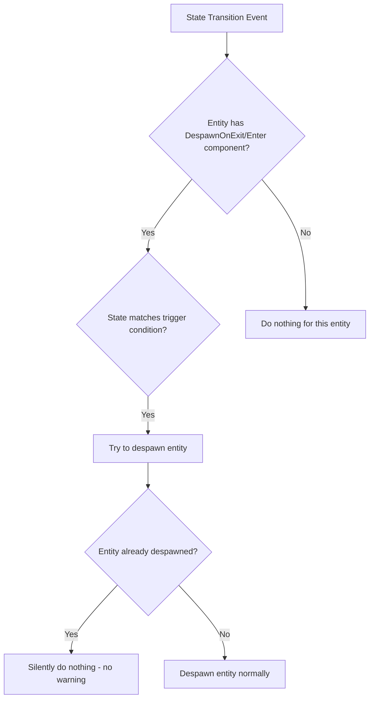

+++
title = "#21864 DespawnOnExit / DespawnOnEnter fix log spam"
date = "2025-12-09T00:00:00"
draft = false
template = "pull_request_page.html"
in_search_index = true

[taxonomies]
list_display = ["show"]

[extra]
current_language = "en"
available_languages = {"en" = { name = "English", url = "/pull_request/bevy/2025-12/pr-21864-en-20251209" }, "zh-cn" = { name = "中文", url = "/pull_request/bevy/2025-12/pr-21864-zh-cn-20251209" }}
labels = ["C-Bug", "D-Straightforward", "A-States", "C-Refinement"]
+++

# Title: DespawnOnExit / DespawnOnEnter fix log spam

## Basic Information
- **Title**: DespawnOnExit / DespawnOnEnter fix log spam 
- **PR Link**: https://github.com/bevyengine/bevy/pull/21864
- **Author**: Lyndon-Mackay
- **Status**: MERGED
- **Labels**: C-Bug, S-Ready-For-Final-Review, D-Straightforward, A-States, C-Refinement
- **Created**: 2025-11-16T23:39:36Z
- **Merged**: 2025-12-09T01:10:26Z
- **Merged By**: alice-i-cecile

## Description Translation
if entity was despawned such as in a hierachy

# Objective

- DespawnOnExit / DespawnOnEnter logs errors with despawning. 
    Most if not all use cases don't care if the item is already despawned.
    The user is typically saying "Ensure it is despawned" rather then "You should be the one to despawn"
- Fixes #21832

## Solution

- Changes the state_scoped code to use try despawn

## Testing

- I updated example state_scoped to include children with DespawnOnExit/DespawnOnEnter and added a brief explanation then I ran the examples

## The Story of This Pull Request

This PR addresses a logging issue in Bevy's state-scoped entity despawn system. The problem occurs when entities with `DespawnOnExit` or `DespawnOnEnter` components are despawned through hierarchical operations (like despawning a parent entity), and then the state transition systems attempt to despawn them again.

The core issue is that when you have a hierarchy of entities and a parent gets despawned, all its children are automatically despawned. If any of those children also have `DespawnOnExit` or `DespawnOnEnter` components, the state transition systems will still try to despawn them when the relevant state changes occur. This leads to warning logs like "warning: bevy_ecs::system: Failed to despawn entity X because it doesn't exist in this World."

From a user's perspective, this is noisy and unnecessary. When developers use `DespawnOnExit` or `DespawnOnEnter`, they're expressing an intent: "this entity should not exist in this state." They typically don't care whether the system that does the despawning is the state transition system or some other system (like a parent despawn). The semantics are about ensuring the entity is gone, not about who does the work.

The solution implemented here is straightforward but important: replace `.despawn()` calls with `.try_despawn()` in both state transition systems. The `try_despawn()` method handles the case where an entity might already be despawned by doing nothing in that scenario, avoiding the warning log.

Looking at the implementation changes, we can see the pattern clearly. In `crates/bevy_state/src/state_scoped.rs`, both `despawn_entities_on_exit_state` and `despawn_entities_on_enter_state` functions now use `try_despawn()`:

```rust
// Before:
commands.entity(entity).despawn();

// After:
commands.entity(entity).try_despawn();
```

This change preserves the system's core functionality while making it more robust to real-world usage patterns. The documentation has also been updated to explicitly state the new behavior: "If the entity has already been despawned no warning will be emitted."

The example updates are particularly instructive. The PR author modified `examples/ecs/state_scoped.rs` to demonstrate that you can safely add `DespawnOnExit` and `DespawnOnEnter` components to children in a hierarchy without worrying about duplicate despawning attempts. The example shows that even when a parent has state-scoped components, you can still apply these components to children. As the comments explain: "It is unnecessary but in complex hierarchies it saves you from having to mentally track which components are found at the top level."

This change reflects a common pattern in game development: making systems more forgiving and less noisy. Game development involves complex entity hierarchies and state transitions, and developers need systems that work well together without requiring perfect coordination. By making `DespawnOnExit` and `DespawnOnEnter` idempotent (calling them multiple times has the same effect as calling them once), the API becomes more robust and easier to use correctly.

The engineering trade-off here is minimal. The `try_despawn()` method has a trivial performance cost (checking if the entity exists before attempting to despawn it), but this is negligible compared to the clarity and usability benefits. More importantly, it aligns with the principle of least surprise: users expect "ensure this entity is despawned" semantics, not "you must be the one to despawn it" semantics.

This fix also demonstrates good API design practices. When you have a system that operates on entities that might be managed by multiple systems, it's often better to use idempotent operations. This prevents conflicts and makes the system more composable with other parts of the engine.

## Visual Representation



## Key Files Changed

### `crates/bevy_state/src/state_scoped.rs` (+6/-2)
This file contains the core logic for state-scoped entity despawning. The changes switch from `despawn()` to `try_despawn()` in both state transition systems.

**Before:**
```rust
for (entity, binding) in &query {
    if binding.0 == *exited {
        commands.entity(entity).despawn();
    }
}
```

**After:**
```rust
for (entity, binding) in &query {
    if binding.0 == *exited {
        commands.entity(entity).try_despawn();
    }
}
```

The documentation was also updated to clarify the new behavior: "If the entity has already been despawned no warning will be emitted."

### `examples/ecs/state_scoped.rs` (+11/-0)
The example file was updated to demonstrate the fix and provide guidance to users. Key additions include:

1. **Documentation**: Added explanation that if an entity was already despawned, no error will be logged.
2. **Example Code**: Added `DespawnOnExit` and `DespawnOnEnter` components to children in the hierarchy to show that duplicate components are handled gracefully.

Example addition:
```rust
// Added to children to show that duplicate despawning is handled gracefully
(children![DespawnOnExit(GameState::A)]),
```

The comments explain: "You can apply this even when the parent has a state scoped component. It is unnecessary but in complex hierarchies it saves you from having to mentally track which components are found at the top level."

## Further Reading

1. **Bevy States Documentation**: For understanding how Bevy's state system works
2. **Entity Commands API**: Documentation for `Commands::entity()` and related methods like `despawn()` and `try_despawn()`
3. **Idempotent Operations**: General software design principle where operations can be applied multiple times without changing the result beyond the initial application
4. **Entity Component System Patterns**: Common patterns in ECS architecture for managing entity lifecycle across different systems