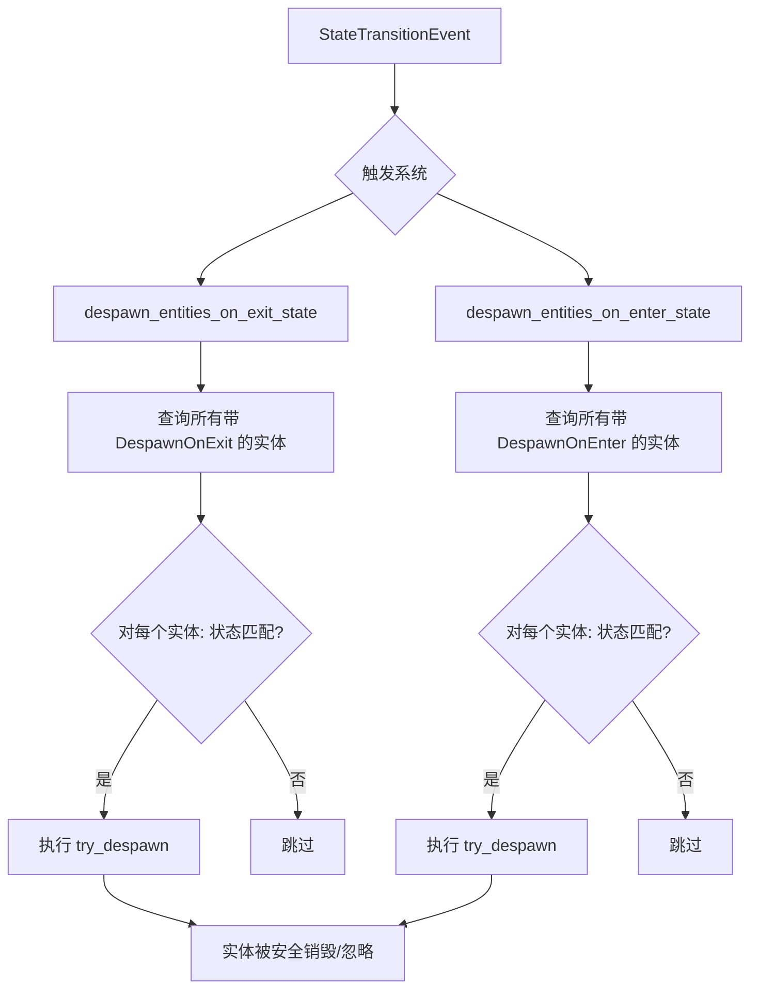

+++
title = "#21864 DespawnOnExit / DespawnOnEnter fix log spam"
date = "2025-12-09T00:00:00"
draft = false
template = "pull_request_page.html"
in_search_index = false

[extra]
current_language = "zh-cn"
available_languages = {"en" = { name = "English", url = "/pull_request/bevy/2025-12/pr-21864-en-20251209" }, "zh-cn" = { name = "中文", url = "/pull_request/bevy/2025-12/pr-21864-zh-cn-20251209" }}
+++

# Title

## 基本信息
- **标题**: DespawnOnExit / DespawnOnEnter fix log spam
- **PR 链接**: https://github.com/bevyengine/bevy/pull/21864
- **作者**: Lyndon-Mackay
- **状态**: 已合并 (MERGED)
- **标签**: C-Bug, S-Ready-For-Final-Review, D-Straightforward, A-States, C-Refinement
- **创建时间**: 2025-11-16T23:39:36Z
- **合并时间**: 2025-12-09T01:10:26Z
- **合并者**: alice-i-cecile

## 描述翻译

如果实体已被销毁，例如在一个层级结构 (hierarchy) 中

### 目标 (Objective)

- `DespawnOnExit` / `DespawnOnEnter` 在销毁实体时会记录错误日志。
   绝大多数（如果不是全部）用例并不关心该实体是否已经被销毁。
   用户的意图通常是“确保它被销毁”，而不是“必须由你来执行销毁”。
- 修复 #21832

### 解决方案 (Solution)

- 将状态作用域 (`state_scoped`) 代码改为使用 `try_despawn`

### 测试 (Testing)

- 我更新了 `state_scoped` 示例，使其包含带有 `DespawnOnExit`/`DespawnOnEnter` 的子实体，并添加了简要说明，然后我运行了该示例。

## 本次 PR 的故事

这个 PR 始于一个虽小却恼人的问题：当游戏状态改变，触发了 `DespawnOnExit` 或 `DespawnOnEnter` 系统时，如果目标实体因为层级关系（例如其父实体被销毁）等原因已经被销毁了，那么系统会报告一个警告日志。这个警告对于用户而言是噪音，因为它偏离了用户使用这些组件的真实意图。

在 Bevy 的 ECS 架构中，`DespawnOnExit<S>` 和 `DespawnOnEnter<S>` 是两个方便的状态作用域 (state-scoped) 组件。它们的作用很直观：当游戏离开状态 `S` 时，销毁所有带有 `DespawnOnExit(S)` 的实体；当游戏进入状态 `S` 时，销毁所有带有 `DespawnOnEnter(S)` 的实体。这是一个管理临时 UI、关卡对象或菜单等资源的常用模式。

问题的根源在于，原始的实现使用了强保证的 `despawn()` 命令。`Commands::entity(entity).despawn()` 会尝试销毁一个实体，但如果该实体已经不存在（例如，已被父实体的销毁操作连带销毁），Bevy 的命令队列系统会记录一个 `WARN` 级别的日志。这给开发者带来了不必要的干扰，因为从逻辑上讲，组件的语义是“确保实体在此状态下不存在”，而不是“必须由我亲手销毁这个实体”。实体已经被其他机制销毁，完全符合最终目标。

解决方案非常直接且符合工程直觉：用等价的“尝试”版本替换“强制”操作。开发者将 `commands.entity(entity).despawn()` 改为 `commands.entity(entity).try_despawn()`。`try_despawn` 方法会执行相同的操作，但在实体已不存在时会安静地返回 `false`，而不会记录警告。这个改动完全符合组件的行为契约，同时消除了虚假的日志输出。

让我们看看具体的实现。在 `crates/bevy_state/src/state_scoped.rs` 文件中，`despawn_entities_on_exit_state` 和 `despawn_entities_on_enter_state` 这两个系统函数是核心。它们的逻辑是监听 `StateTransitionEvent`，查询所有绑定了相应组件的实体，并在状态匹配时触发销毁。

修改前的代码是这样的：
```rust
// 在 for 循环内
if binding.0 == *exited {
    commands.entity(entity).despawn(); // 会为已销毁的实体产生 WARN 日志
}
```

修改后的代码变成了：
```rust
// 在 for 循环内
if binding.0 == *exited {
    commands.entity(entity).try_despawn(); // 静默失败，不产生日志
}
```

这是一个典型的“防御性编程” (defensive programming) 模式。在分布式系统或复杂的、事件驱动的框架（如游戏引擎）中，一个操作可能通过多种路径被触发。确保组件或函数在面对冗余或重复调用时表现良好（幂等性）是一项重要的工程实践。`try_despawn` 在这里完美地实现了这种幂等性。

为了清晰地展示这一改进并防止回归，开发者还更新了对应的示例文件 `examples/ecs/state_scoped.rs`。他们在示例中显式地给子实体添加了 `DespawnOnExit` 和 `DespawnOnEnter` 组件。这模拟了之前会导致警告的场景：当父实体因状态改变被销毁时，其子实体也会被自动销毁。随后，当系统试图再次“销毁”这些已不存在的子实体时，旧代码会警告，而新代码则不会。示例的注释也更新了，解释了这一行为：
```
// If the entity was already despawned then no error will be logged. This means
// that you don't have to worry about duplicate [`DespawnOnExit`] and
// [`DespawnOnEnter`] components deep in your hierarchy.
```

这个 PR 的影响是立竿见影的：它移除了一个让开发者分心的源头，使日志输出更干净。更重要的是，它通过采用更宽容的 `try_*` 模式，正确地反映了 API 的设计意图，并提升了框架在复杂实体层级场景下的健壮性。这是一个小而精的修复，体现了对 API 使用体验和开发者心智模型的细致考量。

## 视觉表示



## 关键文件更改

### 1. `crates/bevy_state/src/state_scoped.rs` (+6/-2)
这是本次修复的核心文件，包含了两个处理状态作用域实体销毁的系统逻辑。

**修改内容与原因**：
修改了两个系统函数（`despawn_entities_on_exit_state` 和 `despawn_entities_on_enter_state`）中的核心命令，将 `despawn()` 替换为 `try_despawn()`，以消除实体已被销毁时产生的警告日志。同时，为两个系统函数添加了文档注释，说明新行为。

**关键代码片段**：
```rust
// 修改前 (despawn_entities_on_exit_state 函数内):
for (entity, binding) in &query {
    if binding.0 == *exited {
        commands.entity(entity).despawn(); // 会产生警告
    }
}

// 修改后 (despawn_entities_on_exit_state 函数内):
for (entity, binding) in &query {
    if binding.0 == *exited {
        commands.entity(entity).try_despawn(); // 静默失败
    }
}

// 新增的文档注释:
/// If the entity has already been despawned no warning will be emitted.
```
`despawn_entities_on_enter_state` 函数做了完全相同的替换。

### 2. `examples/ecs/state_scoped.rs` (+11/-0)
这是用于演示状态作用域功能的示例文件，被更新以更好地展示修复后的行为。

**修改内容与原因**：
1.  在示例文件的顶部模块文档中添加了说明，解释 `try_despawn` 的行为优势。
2.  在四个不同的生成实体的系统（`on_a_enter`, `on_a_exit`, `on_b_enter`, `on_b_exit`）中，为生成的实体添加了 `DespawnOnExit` 或 `DespawnOnEnter` 组件作为 `children`。这创建了一个场景：子实体可能因父实体的状态作用域组件而被销毁，然后其自身的状态作用域组件会再次尝试销毁它（现在会静默失败）。

**关键代码片段**：
```rust
// 新增的模块文档说明:
//!
//! If the entity was already despawned then no error will be logged. This means
//! that you don't have to worry about duplicate [`DespawnOnExit`] and
//! [`DespawnOnEnter`] components deep in your hierarchy.

// 在系统函数中新增的组件 (例如在 on_a_enter 中):
commands.spawn((
    TextBundle {
        // ... 样式省略
    },
    // 新增这一行，为生成的实体添加一个带有 DespawnOnExit 的虚拟子实体
    (children![DespawnOnExit(GameState::A)]),
));

// 在 on_a_exit 中新增的注释，解释了这种做法的意图:
// You can apply this even when the parent has a state scoped component.
// It is unnecessary but in complex hierarchies it saves you from having to
// mentally track which components are found at the top level.
(children![DespawnOnEnter(GameState::A)]),
```

## 进一步阅读

1.  **Bevy Commands API**: 了解 `Commands` 结构体以及 `despawn()` 与 `try_despawn()` 等命令的工作原理。
    -   [Bevy Cheatbook - Commands](https://bevy-cheatbook.github.io/programming/commands.html)
2.  **幂等性 (Idempotency)**: 这是一个重要的分布式系统和 API 设计概念。理解幂等性有助于设计更健壮的系统。
    -   [维基百科 - 幂等性](https://zh.wikipedia.org/wiki/%E5%B9%82%E7%AD%89)
3.  **Bevy States**: 深入了解 Bevy 的状态管理机制，它是 `DespawnOnExit` 和 `DespawnOnEnter` 组件工作的基础。
    -   [Bevy Cheatbook - States](https://bevy-cheatbook.github.io/programming/states.html)
4.  **Defensive Programming (防御性编程)**: 一种编程范式，旨在确保软件在遇到意外输入或状态时仍能正常运行。
    -   相关软件工程书籍或文章通常涵盖此主题。