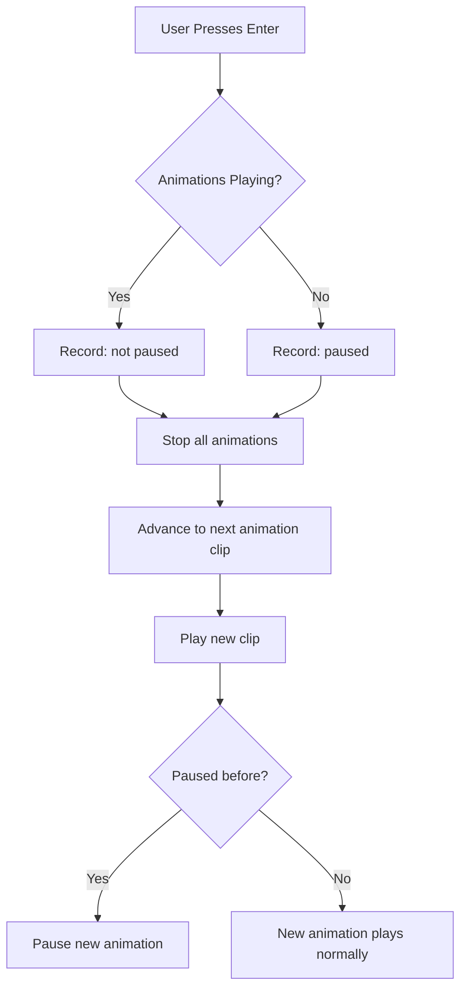

+++
title = "#21871 Fix scene viewer animation switching"
date = "2025-12-10T00:00:00"
draft = false
template = "pull_request_page.html"
in_search_index = true

[taxonomies]
list_display = ["show"]

[extra]
current_language = "en"
available_languages = {"en" = { name = "English", url = "/pull_request/bevy/2025-12/pr-21871-en-20251210" }, "zh-cn" = { name = "中文", url = "/pull_request/bevy/2025-12/pr-21871-zh-cn-20251210" }}
labels = ["C-Bug", "C-Examples", "A-Animation", "D-Straightforward"]
+++

# Fix scene viewer animation switching

## Basic Information
- **Title**: Fix scene viewer animation switching
- **PR Link**: https://github.com/bevyengine/bevy/pull/21871
- **Author**: greeble-dev
- **Status**: MERGED
- **Labels**: C-Bug, C-Examples, S-Ready-For-Final-Review, A-Animation, D-Straightforward
- **Created**: 2025-11-17T16:10:50Z
- **Merged**: 2025-12-10T00:19:59Z
- **Merged By**: alice-i-cecile

## Description Translation
The PR description is already in English and remains unchanged.

## The Story of This Pull Request

The scene_viewer example in Bevy is a tool for previewing 3D scenes and their animations. It allows users to load a model and cycle through its available animations using the Enter key. However, there was a bug where switching between animations didn't properly stop the previous animation - instead, it kept playing in the background, causing multiple animations to blend together in unexpected ways.

The issue appears to have been introduced when animation graphs were added in PR #11989, though the author notes they haven't confirmed this definitively. Animation graphs in Bevy allow multiple animations to play simultaneously and blend together, which is useful for complex animation states. However, for the scene_viewer example's specific use case of previewing individual animations sequentially, this behavior was incorrect.

Looking at the original code, the problem was in how animation switching was handled. When the user pressed Enter to switch animations, the code would:
1. Check if any animations were playing (not paused)
2. Rewind all animations and pause them
3. Advance to the next animation clip
4. Play the new clip
5. If animations were playing before, resume all animations

The critical issue was in step 5: `player.resume_all()` would resume ALL animations, including the ones that were supposed to be stopped. This happened because the code only paused animations rather than stopping them entirely. In Bevy's animation system, paused animations are still part of the animation graph and will resume playing when unpaused.

The fix is straightforward: instead of pausing all animations and then resuming them, we need to actually stop the previous animations. The `stop_all()` method removes animations from the animation graph entirely, ensuring they don't continue to affect the model. The implementation maintains the pause state correctly - if animations were paused before switching, the new animation should also start paused.

The revised logic now:
1. Records whether animations are currently paused
2. Stops all animations (removing them from the animation graph)
3. Advances to the next clip
4. Plays the new clip
5. If animations were paused before, pauses the new animation

This approach ensures clean transitions between animations without residual animation state bleeding through. The change is minimal - just 4 lines added and 5 lines removed - but it corrects the fundamental misunderstanding of how the animation system should be used for this specific use case.

The fix demonstrates an important distinction in animation systems: the difference between pausing an animation (temporarily halting playback while keeping it in the animation graph) versus stopping an animation (removing it from the animation graph entirely). For single-animation preview tools like scene_viewer, stopping is the correct approach. For more complex animation state machines where animations might need to resume from where they left off, pausing would be appropriate.

## Visual Representation



## Key Files Changed

### `examples/tools/scene_viewer/animation_plugin.rs` (+4/-5)
This file contains the animation handling logic for the scene_viewer example. The changes fix a bug where switching animations would cause multiple animations to play simultaneously instead of cleanly switching between them.

**Key Changes:**
```rust
// Before:
if keyboard_input.just_pressed(KeyCode::Enter) {
    info!("switching to new animation for {display_entity_name}");

    let resume = !player.all_paused();
    // set the current animation to its start and pause it to reset to its starting state
    player.rewind_all().pause_all();

    clips.advance_to_next();
    let current_clip = clips.current();
    player.play(current_clip).repeat();
    if resume {
        player.resume_all();
    }
}

// After:
if keyboard_input.just_pressed(KeyCode::Enter) {
    info!("switching to new animation for {display_entity_name}");

    let paused = player.all_paused();
    player.stop_all();

    clips.advance_to_next();
    let current_clip = clips.current();
    player.play(current_clip).repeat();
    if paused {
        player.pause_all();
    }
}
```

The key differences:
1. Changed from `let resume = !player.all_paused()` to `let paused = player.all_paused()` (more direct semantics)
2. Replaced `player.rewind_all().pause_all()` with `player.stop_all()` (actually removes animations instead of just pausing them)
3. Changed from checking `resume` to checking `paused` and using `pause_all()` instead of `resume_all()`

These changes ensure that when switching animations, previous animations are completely stopped rather than just paused, preventing multiple animations from playing simultaneously.

## Further Reading

1. **Bevy Animation Documentation**: Official documentation for Bevy's animation system
2. **PR #11989**: The original PR that added animation graphs to Bevy (may provide context for when this bug was introduced)
3. **Bevy Examples**: Other animation examples in the Bevy repository demonstrate different animation patterns
4. **Animation State Machines**: Concepts for managing complex animation transitions in game engines
5. **glTF Animation Format**: Understanding how animations are stored and played from glTF files