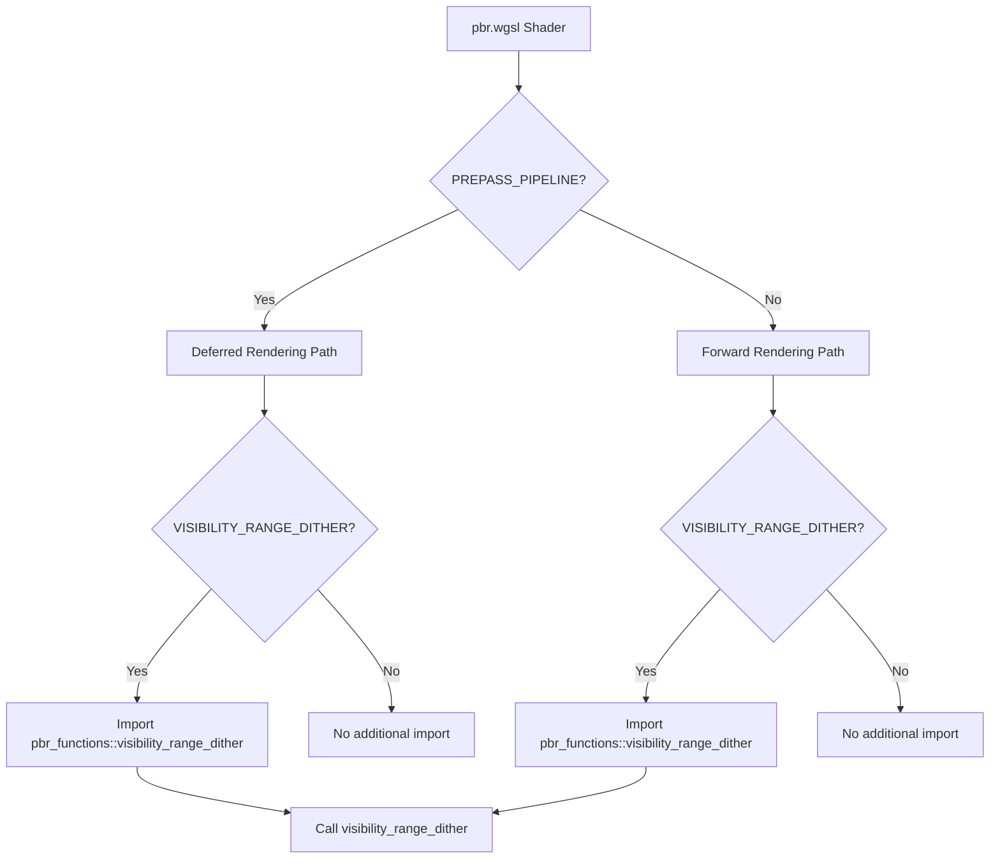

+++
title = "#21879 Fix shader compilation fail when using visibility range"
date = "2025-12-09T00:00:00"
draft = false
template = "pull_request_page.html"
in_search_index = true

[taxonomies]
list_display = ["show"]

[extra]
current_language = "en"
available_languages = {"en" = { name = "English", url = "/pull_request/bevy/2025-12/pr-21879-en-20251209" }, "zh-cn" = { name = "中文", url = "/pull_request/bevy/2025-12/pr-21879-zh-cn-20251209" }}
labels = ["C-Bug", "A-Rendering", "D-Straightforward", "D-Shaders"]
+++

# Title
Fix shader compilation fail when using visibility range

## Basic Information
- **Title**: Fix shader compilation fail when using visibility range
- **PR Link**: https://github.com/bevyengine/bevy/pull/21879
- **Author**: newDINO
- **Status**: MERGED
- **Labels**: C-Bug, A-Rendering, S-Ready-For-Final-Review, D-Straightforward, D-Shaders
- **Created**: 2025-11-18T07:46:21Z
- **Merged**: 2025-12-09T05:45:42Z
- **Merged By**: alice-i-cecile

## Description Translation
# Objective
When using both deferred rendering and visibility range, shader `pbr.wgsl` can't be compiled because `pbr_functions` is not imported.

The issue can be reproduced by using `DefaultOpaqueRendererMethod::deferred()` and adding `DeferredPrepass` to camera at the visibility_range example.

## Solution
Import `pbr_functions` when using `PREPASS_PIPELINE`.

## Testing
I tested on visibility_range and deferred_rendering example. However, importing something usually doesn't break anything.

## The Story of This Pull Request

This PR addresses a shader compilation failure that occurs when combining two specific rendering features in the Bevy game engine: deferred rendering and visibility range. The issue was straightforward but revealed an interesting edge case in how shader modules manage their dependencies.

The problem manifested when developers enabled both deferred rendering (using `DefaultOpaqueRendererMethod::deferred()`) and visibility range features together. In this configuration, the PBR (Physically Based Rendering) shader (`pbr.wgsl`) would fail to compile with an error indicating that `pbr_functions` was not imported. This was reproducible in the visibility_range example by simply adding the `DeferredPrepass` component to the camera.

Looking at the shader code structure, Bevy uses conditional compilation via preprocessor-style directives (`#ifdef`) to include different code paths based on active rendering features. The `pbr.wgsl` file had two main import paths:

1. When `PREPASS_PIPELINE` was defined (for deferred rendering), it imported a specific set of modules
2. Otherwise, it imported a different set that included `pbr_functions`

The issue arose because the visibility range dithering functionality - which requires the `visibility_range_dither` function from `pbr_functions` - was conditionally compiled when `VISIBILITY_RANGE_DITHER` was defined, but this function wasn't available in the deferred rendering import path.

The solution was elegant in its simplicity. Rather than restructuring the entire import system or duplicating function definitions, the fix added a targeted import specifically for the visibility range functionality when it was needed. The implementation added:

```wgsl
#ifdef VISIBILITY_RANGE_DITHER
#import bevy_pbr::pbr_functions::visibility_range_dither;
#endif
```

This conditional import ensured that when visibility range dithering was active, the required function would be available regardless of whether the shader was compiled for forward or deferred rendering. The corresponding function call was also updated to reference the directly imported function rather than going through the `pbr_functions` module prefix.

The change demonstrates a common pattern in shader programming where careful management of dependencies is necessary due to the different compilation paths. By adding a minimal, targeted import, the fix resolved the compilation error without affecting other rendering paths or adding unnecessary dependencies to shaders that don't use visibility range functionality.

From an architectural perspective, this fix highlights the importance of considering all possible feature combinations when designing conditional compilation systems. While forward and deferred rendering paths might seem mutually exclusive, features like visibility range can be orthogonal and need to work with both. The solution shows good engineering judgment by addressing the specific missing dependency rather than over-engineering a broader solution.

The impact of this fix is that developers can now safely combine deferred rendering with visibility range functionality without encountering shader compilation errors. This resolves what would otherwise be a blocking issue for games wanting to use both performance-enhancing rendering techniques.

## Visual Representation



## Key Files Changed

**File: `crates/bevy_pbr/src/render/pbr.wgsl`**

This is the main PBR shader file where the compilation error occurred. The changes fix a missing import dependency when both deferred rendering and visibility range features are enabled together.

**Key modifications:**

1. **Added conditional import for visibility range dithering:**
```wgsl
// Before: No import for pbr_functions when VISIBILITY_RANGE_DITHER is defined
// (in the PREPASS_PIPELINE code path)

// After: Added targeted import
#ifdef VISIBILITY_RANGE_DITHER
#import bevy_pbr::pbr_functions::visibility_range_dither;
#endif
```

2. **Updated function call to use directly imported function:**
```wgsl
// Before: Called through pbr_functions module
#ifdef VISIBILITY_RANGE_DITHER
    pbr_functions::visibility_range_dither(in.position, in.visibility_range_dither);
#endif

// After: Calls directly imported function
#ifdef VISIBILITY_RANGE_DITHER
    visibility_range_dither(in.position, in.visibility_range_dither);
#endif
```

**Why these changes matter:**
- The conditional import ensures the `visibility_range_dither` function is available in both forward and deferred rendering paths
- The direct function call eliminates the dependency on the `pbr_functions` module being fully imported in the deferred rendering path
- This maintains clean separation of concerns while fixing the compilation error

## Further Reading

For those interested in understanding the broader context:
- [Bevy's PBR Rendering Documentation](https://bevyengine.org/learn/book/getting-started/rendering/pbr/) - Overview of Bevy's physically-based rendering system
- [WGSL Shader Language Specification](https://www.w3.org/TR/WGSL/) - The WebGPU Shading Language used by Bevy
- [Deferred Rendering vs Forward Rendering](https://learnopengl.com/Advanced-Lighting/Deferred-Shading) - Technical comparison of rendering approaches
- [Visibility Buffer Techniques](https://advances.realtimerendering.com/s2015/2015_02_04_Dynamic_Visibility_Driven_Rendering.pdf) - Advanced visibility techniques in modern rendering

# Full Code Diff
```
diff --git a/crates/bevy_pbr/src/render/pbr.wgsl b/crates/bevy_pbr/src/render/pbr.wgsl
index 1722ab9d91940..e4d8fe63791d7 100644
--- a/crates/bevy_pbr/src/render/pbr.wgsl
+++ b/crates/bevy_pbr/src/render/pbr.wgsl
@@ -13,12 +13,15 @@
 #else
 #import bevy_pbr::{
     forward_io::{VertexOutput, FragmentOutput},
-    pbr_functions,
     pbr_functions::{apply_pbr_lighting, main_pass_post_lighting_processing},
     pbr_types::STANDARD_MATERIAL_FLAGS_UNLIT_BIT,
 }
 #endif
 
+#ifdef VISIBILITY_RANGE_DITHER
+#import bevy_pbr::pbr_functions::visibility_range_dither;
+#endif
+
 #ifdef MESHLET_MESH_MATERIAL_PASS
 #import bevy_pbr::meshlet_visibility_buffer_resolve::resolve_vertex_output
 #endif
@@ -50,7 +53,7 @@ fn fragment(
     // If we're in the crossfade section of a visibility range, conditionally
     // discard the fragment according to the visibility pattern.
 #ifdef VISIBILITY_RANGE_DITHER
-    pbr_functions::visibility_range_dither(in.position, in.visibility_range_dither);
+    visibility_range_dither(in.position, in.visibility_range_dither);
 #endif
 
 #ifdef FORWARD_DECAL
```