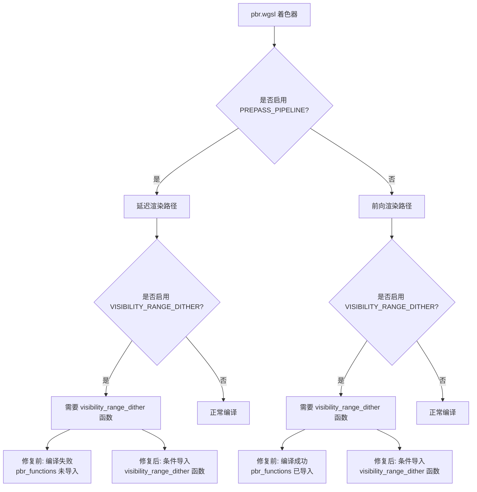

+++
title = "#21879 Fix shader compilation fail when using visibility range"
date = "2025-12-09T00:00:00"
draft = false
template = "pull_request_page.html"
in_search_index = false

[extra]
current_language = "zh-cn"
available_languages = {"en" = { name = "English", url = "/pull_request/bevy/2025-12/pr-21879-en-20251209" }, "zh-cn" = { name = "中文", url = "/pull_request/bevy/2025-12/pr-21879-zh-cn-20251209" }}
labels = ["C-Bug", "A-Rendering", "D-Straightforward", "D-Shaders"]
+++

# Title
Fix shader compilation fail when using visibility range

## Basic Information
- **Title**: Fix shader compilation fail when using visibility range
- **PR Link**: https://github.com/bevyengine/bevy/pull/21879
- **Author**: newDINO
- **Status**: MERGED
- **Labels**: C-Bug, A-Rendering, S-Ready-For-Final-Review, D-Straightforward, D-Shaders
- **Created**: 2025-11-18T07:46:21Z
- **Merged**: 2025-12-09T05:45:42Z
- **Merged By**: alice-i-cecile

## Description Translation
**目标**
当同时使用延迟渲染（deferred rendering）和可见性范围（visibility range）时，着色器 `pbr.wgsl` 无法编译，因为未导入 `pbr_functions`。

该问题可以通过在 visibility_range 示例中使用 `DefaultOpaqueRendererMethod::deferred()` 并向相机添加 `DeferredPrepass` 来复现。

**解决方案**
在使用 `PREPASS_PIPELINE` 时导入 `pbr_functions`。

**测试**
我在 visibility_range 和 deferred_rendering 示例上进行了测试。不过，导入某些内容通常不会破坏任何东西。

## The Story of This Pull Request

这是一个关于着色器编译依赖关系的修复。问题的核心在于当特定渲染特性组合使用时，WGSL 着色器中的导入语句缺失导致的编译失败。

开发者 newDINO 发现，在 Bevy 渲染系统中同时启用延迟渲染和可见性范围时，PBR 着色器会编译失败。具体来说，当使用 `DefaultOpaqueRendererMethod::deferred()` 方法并给相机添加 `DeferredPrepass` 组件时，系统尝试编译 `pbr.wgsl` 着色器，但该着色器缺少必要的函数导入。

问题的技术根源在于条件编译逻辑的不一致性。在 Bevy 的 PBR 渲染系统中，根据是否使用预处理器宏 `PREPASS_PIPELINE`，着色器导入不同的模块。当启用延迟渲染时，系统使用 `PREPASS_PIPELINE` 分支，但这个分支没有导入 `pbr_functions` 模块。然而，当同时启用可见性范围时，着色器代码尝试调用 `pbr_functions::visibility_range_dither` 函数，但这个函数在延迟渲染路径下不可用。

查看修改前的代码可以清楚地看到这个问题：
```wgsl
#ifdef PREPASS_PIPELINE
#import bevy_pbr::forward_io::{VertexOutput, FragmentOutput}
#else
#import bevy_pbr::{
    forward_io::{VertexOutput, FragmentOutput},
    pbr_functions,  // 注意：这只在非 PREPASS_PIPELINE 时导入
    pbr_functions::{apply_pbr_lighting, main_pass_post_lighting_processing},
    pbr_types::STANDARD_MATERIAL_FLAGS_UNLIT_BIT,
}
#endif
```

后来在代码中，当 `VISIBILITY_RANGE_DITHER` 宏定义时，代码尝试调用：
```wgsl
pbr_functions::visibility_range_dither(in.position, in.visibility_range_dither);
```

但在 `PREPASS_PIPELINE` 路径下，`pbr_functions` 模块从未被导入，因此编译失败。

解决方案相当直接：为 `VISIBILITY_RANGE_DITHER` 特性添加条件导入。新的导入逻辑被放置在条件编译块的主导入之后：

```wgsl
#ifdef VISIBILITY_RANGE_DITHER
#import bevy_pbr::pbr_functions::visibility_range_dither;
#endif
```

然后相应地更新函数调用，移除 `pbr_functions::` 前缀：
```wgsl
visibility_range_dither(in.position, in.visibility_range_dither);
```

这个修复展示了着色器模块化中的一个重要原则：当通过条件编译启用特定功能时，必须确保所有必要的依赖项都被导入。在这个案例中，可见性范围抖动功能依赖于 `pbr_functions` 模块中的一个特定函数，但该依赖关系在延迟渲染路径下没有被正确处理。

从工程角度看，这个修复采用了最小化变更原则。它没有为整个 `PREPASS_PIPELINE` 路径导入完整的 `pbr_functions` 模块，而只是导入了实际需要的特定函数。这避免了不必要的依赖膨胀，同时解决了编译问题。

这个问题的发现和修复也说明了测试覆盖的重要性。虽然基本的延迟渲染和可见性范围示例可能各自工作正常，但它们的组合使用暴露了条件编译路径中的疏漏。在复杂的渲染系统中，条件编译的组合测试是确保所有功能组合正常工作的重要环节。

## Visual Representation



## Key Files Changed

### `crates/bevy_pbr/src/render/pbr.wgsl` (+5/-2)

这个文件是 Bevy 物理基础渲染（PBR）系统的核心着色器。它负责处理材质、光照和可见性等渲染计算。

**修改内容：**
1. 在主要条件导入块之后添加了对 `visibility_range_dither` 函数的条件导入
2. 更新了函数调用，从使用完整模块路径改为直接调用导入的函数

**代码对比：**
```wgsl
// 修改前：
#ifdef PREPASS_PIPELINE
#import bevy_pbr::forward_io::{VertexOutput, FragmentOutput}
#else
#import bevy_pbr::{
    forward_io::{VertexOutput, FragmentOutput},
    pbr_functions,
    pbr_functions::{apply_pbr_lighting, main_pass_post_lighting_processing},
    pbr_types::STANDARD_MATERIAL_FLAGS_UNLIT_BIT,
}
#endif

// ... 后续代码 ...

#ifdef VISIBILITY_RANGE_DITHER
    pbr_functions::visibility_range_dither(in.position, in.visibility_range_dither);
#endif
```

```wgsl
// 修改后：
#ifdef PREPASS_PIPELINE
#import bevy_pbr::forward_io::{VertexOutput, FragmentOutput}
#else
#import bevy_pbr::{
    forward_io::{VertexOutput, FragmentOutput},
    pbr_functions,
    pbr_functions::{apply_pbr_lighting, main_pass_post_lighting_processing},
    pbr_types::STANDARD_MATERIAL_FLAGS_UNLIT_BIT,
}
#endif

#ifdef VISIBILITY_RANGE_DITHER
#import bevy_pbr::pbr_functions::visibility_range_dither;
#endif

// ... 后续代码 ...

#ifdef VISIBILITY_RANGE_DITHER
    visibility_range_dither(in.position, in.visibility_range_dither);
#endif
```

**这些修改与 PR 目的的关系：**
这些修改确保了当同时启用延迟渲染（通过 `PREPASS_PIPELINE`）和可见性范围抖动（通过 `VISIBILITY_RANGE_DITHER`）时，着色器能够正确编译。通过条件导入所需的函数，而不是依赖可能不存在的模块导入，解决了编译时依赖缺失的问题。

## Further Reading

1. **WGSL 着色语言规范**：了解 WGSL 的模块导入系统和条件编译机制
   - https://www.w3.org/TR/WGSL/

2. **Bevy 渲染架构文档**：了解 Bevy 的 PBR 渲染系统和延迟/前向渲染路径
   - https://bevyengine.org/learn/books/introduction/

3. **可见性范围技术**：学习关于可见性范围（visibility range）和屏幕空间抖动的实现原理
   - 常见于大规模地形渲染和 LOD 系统

4. **条件编译在图形编程中的应用**：了解如何在着色器中有效使用条件编译来支持多种渲染特性
   - 这是现代图形引擎中管理着色器变体的关键技术