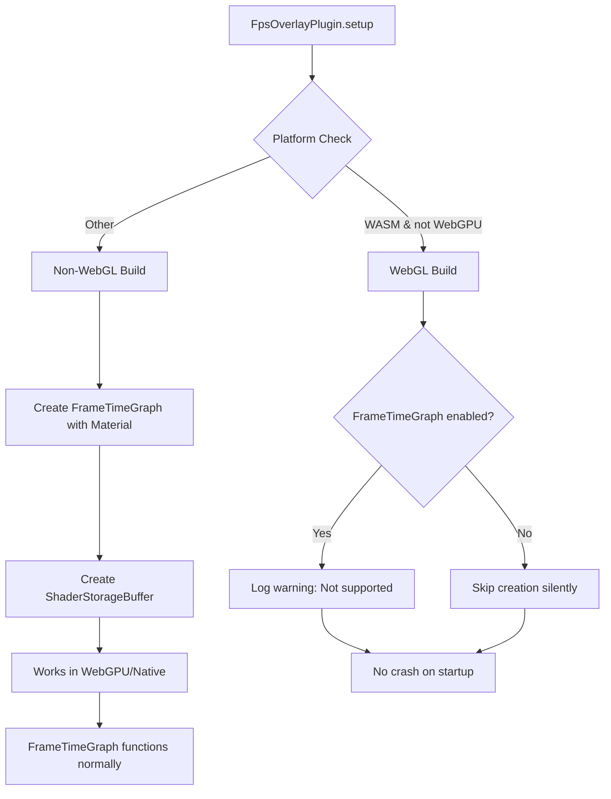

+++
title = "#21885 Prevent WebGL builds from crashing on startup when using FpsOverlayPlugin"
date = "2025-12-08T00:00:00"
draft = false
template = "pull_request_page.html"
in_search_index = true

[taxonomies]
list_display = ["show"]

[extra]
current_language = "en"
available_languages = {"en" = { name = "English", url = "/pull_request/bevy/2025-12/pr-21885-en-20251208" }, "zh-cn" = { name = "中文", url = "/pull_request/bevy/2025-12/pr-21885-zh-cn-20251208" }}
labels = ["C-Bug", "A-Rendering", "O-WebGL2", "D-Straightforward", "S-Waiting-on-Author"]
+++

# Title
## Basic Information
- **Title**: Prevent WebGL builds from crashing on startup when using FpsOverlayPlugin
- **PR Link**: https://github.com/bevyengine/bevy/pull/21885
- **Author**: it-me-joda
- **Status**: MERGED
- **Labels**: C-Bug, A-Rendering, O-WebGL2, D-Straightforward, S-Waiting-on-Author
- **Created**: 2025-11-19T18:21:43Z
- **Merged**: 2025-12-08T12:19:16Z
- **Merged By**: mockersf

## Description Translation
The PR description is already in English.

# Objective

- Fixes #21362
- The FrameTimeGraph uses a material that crashes in WebGL (but not WebGPU) even if the FrameTimeGraph is disabled. We need to prevent the FrameTimeGraph from being created when we build for WASM.

## Solution

- If the build is for WASM with only WebGL, we skip the creation of the FrameTimeGraph. Additionally, if the FrameTimeGraph is enabled, we provide a warning to inform the user that the FrameTimeGraph isn't supported on WebGL.

## Testing

- I used the repro provided in the issue.

## The Story of This Pull Request

The issue started with a WebGL-specific crash in Bevy when using the FpsOverlayPlugin. The problem was reported in issue #21362, where developers observed that WebGL builds would crash on startup if they included the FpsOverlayPlugin, even when the FrameTimeGraph component of the overlay was disabled. This was a significant problem because it prevented developers from using the FPS overlay for debugging WebGL applications.

The root cause was that the FrameTimeGraph uses a custom material called FrametimeGraphMaterial that depends on shader storage buffers (SSBOs). Shader storage buffers are not available in WebGL's feature set, only in WebGPU. Even when the FrameTimeGraph was disabled via configuration (with `frame_time_graph_config.enabled` set to false), the code would still create the material and its associated shader storage buffer. This caused a WebGL runtime error because the shader attempted to access an unsupported buffer type.

The developer approached this problem with a targeted solution: conditionally skip the creation of the FrameTimeGraph entirely when building for WebGL. The implementation uses Rust's conditional compilation system with `#[cfg]` attributes to control what code gets compiled for different target configurations. This is a practical approach because it completely avoids the problematic code path in WebGL builds.

The key insight was that the crash wasn't just about whether the graph was enabled at runtime, but about the compilation of incompatible GPU code. Even with runtime checks to hide the UI element (using `Display::None`), the material and its shader storage buffer were still created, which caused the WebGL context to reject the shader program. The solution needed to prevent the material from being compiled and instantiated at all in WebGL builds.

The implementation wraps the FrameTimeGraph creation code in a conditional block that only runs when NOT building for WASM without WebGPU support. For WebGL builds (WASM without WebGPU), the code instead checks if the graph is enabled and logs a warning using the tracing crate's `warn!` macro. This warning informs developers that the feature isn't available in their current configuration.

The developer also needed to update the Cargo.toml files to expose feature flags for WebGL and WebGPU in the bevy_dev_tools crate. This allowed the conditional compilation to work correctly by enabling the appropriate backend features. The bevy_internal crate's Cargo.toml was updated to propagate these feature flags, ensuring that when someone builds Bevy with WebGL support, the dev tools crate properly compiles for that backend.

This solution has minimal performance impact since it simply excludes code at compile time for WebGL builds. For non-WebGL builds (including WebGPU and native), the FrameTimeGraph continues to work as before. The warning message is helpful because it lets developers know why they're not seeing the frame time graph when they enable it in a WebGL build.

The fix is a good example of handling platform-specific limitations in a graphics engine. Rather than trying to make the shader storage buffer work in WebGL (which isn't possible due to API limitations), the code avoids using the feature entirely on that platform. This is a common pattern in cross-platform graphics programming where different backends support different feature sets.

## Visual Representation



## Key Files Changed

### `crates/bevy_dev_tools/src/fps_overlay.rs` (+39/-28)
This is the main file containing the FPS overlay logic. The changes add conditional compilation to skip creating the FrameTimeGraph in WebGL builds.

**Key modification:**
The code that creates the FrameTimeGraph entity is now wrapped in conditional compilation blocks:

```rust
#[cfg(all(target_arch = "wasm32", not(feature = "webgpu")))]
{
    if overlay_config.frame_time_graph_config.enabled {
        use tracing::warn;
        warn!("Frame time graph is not supported with WebGL. Consider if WebGPU is viable for your usecase.");
    }
}
#[cfg(not(all(target_arch = "wasm32", not(feature = "webgpu"))))]
{
    // Original FrameTimeGraph creation code here
    let font_size = overlay_config.text_config.font_size;
    p.spawn((
        Node { /* ... */ },
        Pickable::IGNORE,
        MaterialNode::from(frame_time_graph_materials.add(FrametimeGraphMaterial {
            values: buffers.add(ShaderStorageBuffer {
                data: Some(vec![0, 0, 0, 0]),
                ..Default::default()
            }),
            config: FrameTimeGraphConfigUniform::new(/* ... */),
        })),
        FrameTimeGraph,
    ));
}
```

### `crates/bevy_dev_tools/Cargo.toml` (+2/-0)
Added WebGL and WebGPU feature flags that propagate to the render backend.

**Key addition:**
```toml
[features]
bevy_ci_testing = ["serde", "ron"]
webgl = ["bevy_render/webgl"]
webgpu = ["bevy_render/webgpu"]
```

### `crates/bevy_internal/Cargo.toml` (+2/-0)
Updated to include bevy_dev_tools in the WebGL and WebGPU feature chains.

**Key additions:**
```toml
webgl = [
  # ... other dependencies
  "bevy_dev_tools?/webgl",
]

webgpu = [
  # ... other dependencies
  "bevy_dev_tools?/webgpu",
]
```

## Further Reading

1. **Bevy WebGL/WebGPU Documentation**: Official Bevy documentation on Web platform support and backend differences.
2. **Rust Conditional Compilation**: The Rust Reference section on `#[cfg]` attributes and feature-based compilation.
3. **WebGL vs WebGPU Feature Sets**: Comparison of WebGL 2.0 and WebGPU capabilities, particularly regarding shader storage buffers.
4. **Bevy Shader Storage Buffers**: How Bevy uses SSBOs for GPU data transfer and their limitations on different platforms.