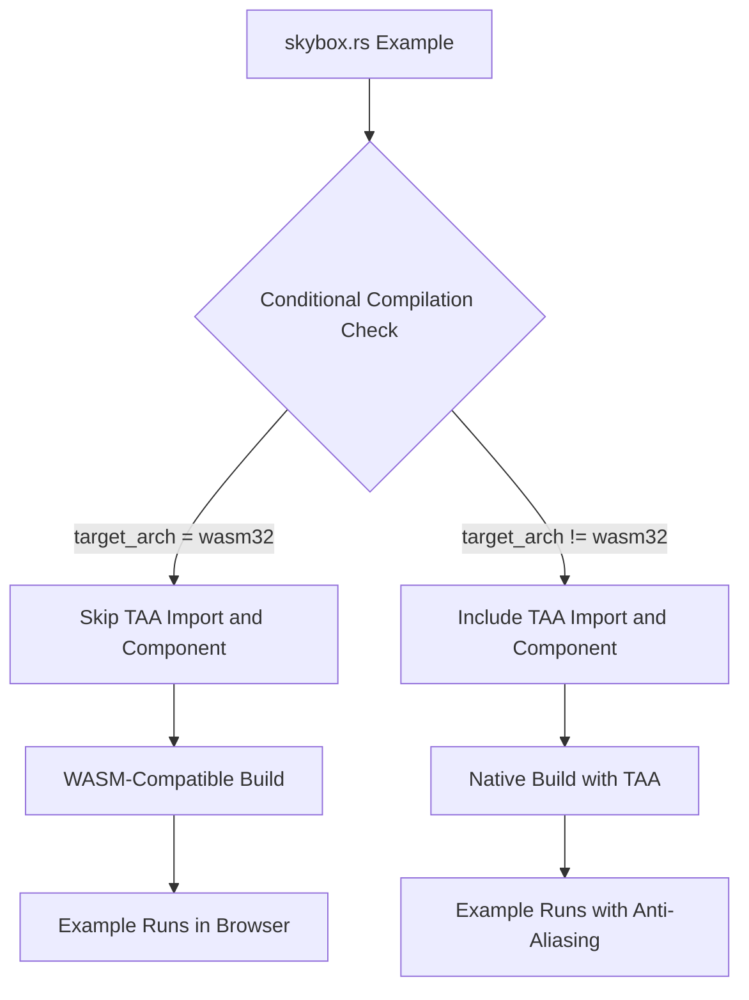

+++
title = "#21887 Fix skybox example crashing in WASM by skipping unsupported TAA"
date = "2025-12-10T00:00:00"
draft = false
template = "pull_request_page.html"
in_search_index = true

[taxonomies]
list_display = ["show"]

[extra]
current_language = "en"
available_languages = {"en" = { name = "English", url = "/pull_request/bevy/2025-12/pr-21887-en-20251210" }, "zh-cn" = { name = "中文", url = "/pull_request/bevy/2025-12/pr-21887-zh-cn-20251210" }}
labels = ["C-Bug", "D-Trivial", "A-Rendering"]
+++

# Fix skybox example crashing in WASM by skipping unsupported TAA

## Basic Information
- **Title**: Fix skybox example crashing in WASM by skipping unsupported TAA
- **PR Link**: https://github.com/bevyengine/bevy/pull/21887
- **Author**: it-me-joda
- **Status**: MERGED
- **Labels**: C-Bug, D-Trivial, A-Rendering, S-Ready-For-Final-Review
- **Created**: 2025-11-20T00:41:16Z
- **Merged**: 2025-12-09T23:51:20Z
- **Merged By**: alice-i-cecile

## Description Translation

# Objective

- Fixes #21731
- Resolve the skybox example not functioning as intended. Currently, the skybox example compiles but can't run due to TAA not being supported for WASM builds.

## Solution

- Skip TAA if in a building for a WASM environment.

## Testing

- I ran the skybox example locally with: `bevy run --example skybox --features="free_camera" web` and the example now compiles and runs in the browser.

## The Story of This Pull Request

This PR addresses a straightforward but important compatibility issue in Bevy's example code. The skybox example, which demonstrates how to load and use cubemap textures for skybox effects, was failing when built for WebAssembly (WASM) targets. The root cause was that the example unconditionally included Temporal Anti-Aliasing (TAA), a graphics enhancement feature that isn't currently supported in WASM builds of Bevy.

The problem manifested as a runtime crash rather than a compilation error, which is particularly problematic for an example meant to demonstrate functionality. When developers tried to run the skybox example in a browser environment, they encountered failures that prevented them from seeing the example work as intended. This issue was tracked in GitHub issue #21731.

The solution implemented here is a classic approach to platform-specific code: conditional compilation using Rust's `#[cfg]` attribute. The developer made two targeted changes to the example code. First, they added a conditional import statement for the `TemporalAntiAliasing` type, ensuring it's only imported when not targeting WASM32 architecture. Second, they applied the same conditional attribute to the component insertion in the camera setup system, preventing the component from being added to the camera entity in WASM builds.

This approach has several advantages. It maintains the TAA functionality for native builds where it's supported and provides a working example for WASM targets by simply omitting the unsupported feature. The alternative would have been to disable the entire example for WASM or to create a separate WASM-specific version, both of which would have been more complex and less maintainable.

From an implementation perspective, the changes are minimal and focused. The developer added `#[cfg(not(target_arch = "wasm32"))]` before the import statement and before the `TemporalAntiAliasing::default()` component in the camera spawning code. This ensures that during WASM compilation, the code referencing TAA is completely excluded from the build, avoiding any runtime attempts to use unsupported APIs.

The testing approach was pragmatic and effective. The developer ran the example locally with the web target using Bevy's built-in commands, verifying that the example now compiles and runs successfully in a browser environment. This direct testing approach is appropriate for this type of platform-specific fix.

This fix demonstrates good practices for handling platform limitations in cross-platform game engines. By using conditional compilation at the point of use, the solution keeps the code clean and maintains a single code path for the majority of the example, only diverging where absolutely necessary for compatibility reasons. The fix also doesn't introduce any runtime overhead or complexity—it's purely a compile-time decision.

## Visual Representation



## Key Files Changed

**File: `examples/3d/skybox.rs` (4 lines added, 1 line removed)**

This file contains the skybox example that demonstrates loading cubemap textures. The changes ensure the example works in WASM environments by conditionally excluding Temporal Anti-Aliasing, which isn't supported on that platform.

**Key Changes:**

1. **Conditional Import**: The import of `TemporalAntiAliasing` is now wrapped in a `#[cfg(not(target_arch = "wasm32"))]` attribute, preventing it from being imported in WASM builds.

2. **Conditional Component**: The `TemporalAntiAliasing::default()` component is now only added to the camera when not targeting WASM32.

**Code Snippets:**

```rust
// File: examples/3d/skybox.rs
// Before (lines 1-9):
use bevy::{
    anti_alias::taa::TemporalAntiAliasing,
    camera_controller::free_camera::{FreeCamera, FreeCameraPlugin},
    // ... other imports
};

// In setup function:
commands.spawn((
    Camera3d::default(),
    Msaa::Off,
    TemporalAntiAliasing::default(),  // Always added
    // ... other components
));

// After:
#[cfg(not(target_arch = "wasm32"))]
use bevy::anti_alias::taa::TemporalAntiAliasing;

use bevy::{
    // Note: TemporalAntiAliasing removed from here
    camera_controller::free_camera::{FreeCamera, FreeCameraPlugin},
    // ... other imports
};

// In setup function:
commands.spawn((
    Camera3d::default(),
    Msaa::Off,
    #[cfg(not(target_arch = "wasm32"))]
    TemporalAntiAliasing::default(),  // Only added for non-WASM
    // ... other components
));
```

## Further Reading

1. **Rust Conditional Compilation**: The official Rust book section on conditional compilation using `#[cfg]` attributes: https://doc.rust-lang.org/reference/conditional-compilation.html

2. **Bevy WebAssembly Support**: Bevy's documentation on building for the web, including limitations and supported features: https://bevyengine.org/learn/quick-start/getting-started/setup/#wasm-webassembly

3. **Temporal Anti-Aliasing in Computer Graphics**: Technical explanation of TAA and why it might not be supported in certain WebGL/WebGPU contexts: https://en.wikipedia.org/wiki/Temporal_anti-aliasing

4. **Bevy Examples Structure**: How Bevy organizes its examples and best practices for writing cross-platform examples: https://github.com/bevyengine/bevy/tree/main/examples