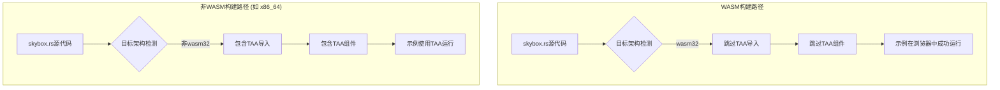

+++
title = "#21887 通过跳过不支持的TAA修复skybox示例在WASM中崩溃的问题"
date = "2025-12-10T00:00:00"
draft = false
template = "pull_request_page.html"
in_search_index = false

[extra]
current_language = "zh-cn"
available_languages = {"en" = { name = "English", url = "/pull_request/bevy/2025-12/pr-21887-en-20251210" }, "zh-cn" = { name = "中文", url = "/pull_request/bevy/2025-12/pr-21887-zh-cn-20251210" }}
+++

# Title
Fix skybox example crashing in WASM by skipping unsupported TAA

## Basic Information
- **标题**: 通过跳过不支持的TAA修复skybox示例在WASM中崩溃的问题
- **PR链接**: https://github.com/bevyengine/bevy/pull/21887
- **作者**: it-me-joda
- **状态**: 已合并
- **标签**: C-Bug, D-Trivial, A-Rendering, S-Ready-For-Final-Review
- **创建时间**: 2025-11-20T00:41:16Z
- **合并时间**: 2025-12-09T23:51:20Z
- **合并者**: alice-i-cecile

## 描述翻译
### 目标
- 修复 #21731
- 解决skybox示例无法按预期运行的问题。当前，skybox示例可以编译但无法运行，因为WASM构建不支持TAA（时域抗锯齿）。

### 解决方案
- 如果构建环境为WASM，则跳过TAA。

### 测试
- 我本地运行了skybox示例：`bevy run --example skybox --features="free_camera" web`，现在示例可以在浏览器中编译并运行。

## 这个Pull Request的故事

这个PR解决了一个相对简单但重要的问题：Bevy的skybox示例在WebAssembly（WASM）环境下崩溃。问题的根源在于示例代码使用了TemporalAntiAliasing（TAA，时域抗锯齿），而TAA目前在WASM平台上不受支持。

当开发者尝试在浏览器中运行skybox示例时，会遭遇运行时崩溃，这使得示例无法展示其预期功能，即加载立方体贴图到立方体上并循环显示不同的压缩纹理格式。这对于想要了解如何在Bevy中使用skybox，特别是在Web环境中使用的开发者来说，是一个明显的障碍。

开发者it-me-joda识别到了这个问题并提出了一个直接的解决方案：通过条件编译（conditional compilation）在WASM构建中排除TAA。这个方案的核心是使用Rust的条件编译属性`#[cfg(not(target_arch = "wasm32"))]`。这意味着只有当目标架构不是`wasm32`时，相关的代码（导入和使用TAA组件）才会被包含在构建中。

具体来看，修改涉及两个部分：

1. **条件化导入（Import）**：将`TemporalAntiAliasing`的导入语句用`#[cfg(not(target_arch = "wasm32"))]`包裹。这样，在针对WASM进行编译时，这个导入根本不会存在，避免了因缺少WASM实现而导致的编译或链接错误。

2. **条件化组件添加（Component Addition）**：在生成（spawn）相机实体时，将`TemporalAntiAliasing::default()`的调用同样用条件属性包裹。这确保了在WASM构建中，相机实体不会尝试添加一个不存在的组件，从而防止了运行时错误。

这是一个典型的跨平台兼容性修复。在许多游戏引擎和框架中，某些高级渲染功能可能并非在所有目标平台（尤其是资源受限或API不同的平台如WebGL）上都可用。处理这种情况的标准做法就是通过条件编译或运行时特性检测来优雅地降级（fallback）。

从技术角度看，这个修复是保守且安全的。它没有改变非WASM平台的行为，skybox示例在原生（native）平台上仍然会使用TAA。对于WASM平台，它只是移除了一个不支持的功能，使示例的核心功能（显示skybox）能够正常运行。如果未来Bevy在WASM上实现了TAA支持，只需要移除这些条件编译属性即可恢复功能。

这个PR被标记为`D-Trivial`（微小修改）和`C-Bug`（错误修复），准确地反映了其性质和范围。合并这个修复提升了Bevy示例在Web平台上的可用性，确保了学习材料对于所有目标平台的开发者都是有效的。

## 视觉表示



## 关键文件变更

- `examples/3d/skybox.rs` (+4/-1)

**变更详情**:

这个文件是Bevy的3D示例之一，展示如何在立方体上使用立方体贴图创建天空盒效果，并循环不同的压缩纹理格式。

**关键修改**:

```rust
// 文件: examples/3d/skybox.rs
// 修改前（相关部分）:
use bevy::{
    anti_alias::taa::TemporalAntiAliasing,  // 始终导入TAA
    // ... 其他导入
};

fn setup(mut commands: Commands, asset_server: Res<AssetServer>) {
    // ...
    commands.spawn((
        Camera3d::default(),
        Msaa::Off,
        TemporalAntiAliasing::default(),  // 始终添加TAA组件
        // ... 其他组件
    ));
}

// 修改后（相关部分）:
#[cfg(not(target_arch = "wasm32"))]  // 新增：条件编译属性
use bevy::anti_alias::taa::TemporalAntiAliasing;  // 仅在非WASM时导入

use bevy::{
    // anti_alias::taa::TemporalAntiAliasing,  // 从通用导入中移除
    // ... 其他导入保持不变
};

fn setup(mut commands: Commands, asset_server: Res<AssetServer>) {
    // ...
    commands.spawn((
        Camera3d::default(),
        Msaa::Off,
        #[cfg(not(target_arch = "wasm32"))]  // 新增：条件编译属性
        TemporalAntiAliasing::default(),  // 仅在非WASM时添加
        // ... 其他组件
    ));
}
```

**这些变更如何关联PR的整体目的**:

1. 通过条件编译，在WASM目标架构下完全排除对`TemporalAntiAliasing`的依赖，解决了因缺少WASM实现而导致的崩溃问题。
2. 保持非WASM平台的功能不变，确保示例在桌面等平台仍然使用TAA以获得更好的视觉质量。
3. 使skybox示例能够在浏览器中运行，达到了修复#21731问题的目标。

## 延伸阅读

- **[Bevy 官方文档：条件编译](https://doc.rust-lang.org/reference/conditional-compilation.html)** - 深入了解Rust中`#[cfg]`属性的使用，这是处理跨平台代码差异的核心机制。
- **[Bevy 渲染管线](https://bevy-cheatbook.github.io/pipeline.html)** - 了解Bevy的渲染系统，包括抗锯齿等后处理效果。
- **[WebAssembly 与 WebGL](https://developer.mozilla.org/en-US/docs/Web/API/WebGL_API)** - 了解WASM环境下图形渲染的限制和可能性，特别是WebGL API与原生图形API的差异。
- **[Bevy 示例仓库](https://github.com/bevyengine/bevy/tree/main/examples)** - 查看其他Bevy示例，了解不同功能在不同平台上的实现方式。

# 完整代码差异
```
diff --git a/examples/3d/skybox.rs b/examples/3d/skybox.rs
index fc32289f973fa..0cfe1cec93607 100644
--- a/examples/3d/skybox.rs
+++ b/examples/3d/skybox.rs
@@ -1,7 +1,9 @@
 //! Load a cubemap texture onto a cube like a skybox and cycle through different compressed texture formats
 
+#[cfg(not(target_arch = "wasm32"))]
+use bevy::anti_alias::taa::TemporalAntiAliasing;
+
 use bevy::{
-    anti_alias::taa::TemporalAntiAliasing,
     camera_controller::free_camera::{FreeCamera, FreeCameraPlugin},
     core_pipeline::Skybox,
     image::CompressedImageFormats,
@@ -71,6 +73,7 @@ fn setup(mut commands: Commands, asset_server: Res<AssetServer>) {
     commands.spawn((
         Camera3d::default(),
         Msaa::Off,
+        #[cfg(not(target_arch = "wasm32"))]
         TemporalAntiAliasing::default(),
         ScreenSpaceAmbientOcclusion::default(),
         Transform::from_xyz(0.0, 0.0, 8.0).looking_at(Vec3::ZERO, Vec3::Y),
```