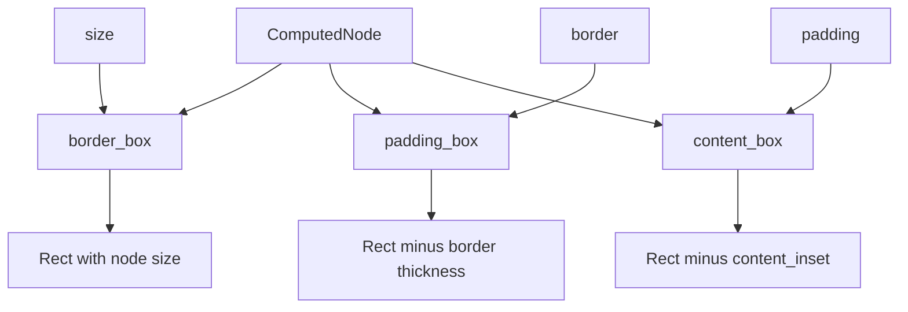

+++
title = "#21903 `ComputedNode` box model helper functions"
date = "2025-12-15T00:00:00"
draft = false
template = "pull_request_page.html"
in_search_index = true

[taxonomies]
list_display = ["show"]

[extra]
current_language = "en"
available_languages = {"en" = { name = "English", url = "/pull_request/bevy/2025-12/pr-21903-en-20251215" }, "zh-cn" = { name = "中文", url = "/pull_request/bevy/2025-12/pr-21903-zh-cn-20251215" }}
labels = ["A-UI", "D-Straightforward"]
+++

# Title

## Basic Information
- **Title**: `ComputedNode` box model helper functions
- **PR Link**: https://github.com/bevyengine/bevy/pull/21903
- **Author**: ickshonpe
- **Status**: MERGED
- **Labels**: A-UI, S-Ready-For-Final-Review, D-Straightforward
- **Created**: 2025-11-21T15:43:02Z
- **Merged**: 2025-12-15T02:24:32Z
- **Merged By**: alice-i-cecile

## Description Translation
# Objective

Add helper functions to `ComputedNode` that return the bounds of the node's border, padding, and content areas.

## Solution

Add helper functions `border_box`, `padding_box`, and `content_box` to `ComputedNode`.

#

Included a release note. These changes are very trivial and don't really need one, but I've got quite a few more less trivial changes to `ComputedNode` that I want to add later.

## Testing

This PR also includes a couple of trivial tests.

# The Story of This Pull Request

This pull request addresses a common usability issue when working with UI nodes in Bevy's layout system. The `ComputedNode` struct, which represents the final computed layout properties of a UI node after all constraints and styles have been applied, previously lacked convenient methods for accessing the standard CSS box model regions.

When developers need to work with the various regions of a UI element - the full outer bounds (border box), the area inside the borders (padding box), or the innermost content area - they previously had to manually calculate these rectangles. This required understanding the node's size, border properties, and padding properties, and then performing the appropriate arithmetic. While this calculation is straightforward, it's repetitive and error-prone, especially when dealing with different sides of the box having different thicknesses.

The solution implemented in this PR is clean and minimal: add three helper methods to `ComputedNode` that return `Rect` values representing each box region. These methods follow standard CSS box model terminology and conventions:

1. **`border_box()`** returns the full rectangle enclosing the node, which is simply a rectangle centered at the origin (object-centered coordinates) with the node's overall size.
2. **`padding_box()`** returns the region inside the borders, calculated by subtracting the border thickness from each side of the border box.
3. **`content_box()`** returns the innermost content region, calculated by subtracting both border and padding (via the existing `content_inset()` method) from the border box.

All three methods are marked as `#[inline]`, which is appropriate since they're simple calculations that will likely be called frequently in layout and rendering code. The inline hint suggests to the compiler that these functions are good candidates for inlining, potentially reducing function call overhead.

The implementation takes advantage of existing code structure - `content_box()` uses the existing `content_inset()` method, which already correctly calculates the total inset from borders and padding. This demonstrates good code reuse and maintains consistency with existing calculations.

The PR also includes unit tests for each new method, which is important even for "trivial" code. The tests verify the calculations are correct for various border and padding configurations. Interestingly, the tests reveal the coordinate system being used: object-centered coordinates where (0,0) is the center of the node. This is consistent with Bevy's transform system but important to document for developers using these methods.

The author mentions that a release note is included despite the changes being trivial, noting that more significant changes to `ComputedNode` are planned for the future. This suggests this PR is part of a larger effort to improve the UI layout API, making it more ergonomic and complete. By starting with these simple helper functions, the foundation is laid for more complex layout operations that will need to work with these box regions.

From an architectural perspective, these helper methods improve the encapsulation of `ComputedNode`. Instead of exposing raw fields (size, border, padding) and requiring callers to understand how to combine them correctly, the struct now provides a clean interface for accessing computed geometric properties. This reduces cognitive load for developers and decreases the likelihood of calculation errors in client code.

## Visual Representation



## Key Files Changed

### `crates/bevy_ui/src/ui_node.rs` (+82/-3)

This file contains the main implementation changes. Three new methods were added to the `ComputedNode` struct, and corresponding unit tests were added.

Key changes:

1. **Added helper methods to ComputedNode**:
```rust
/// Returns the node's border-box in object-centered physical coordinates.
/// This is the full rectangle enclosing the node.
#[inline]
pub fn border_box(&self) -> Rect {
    Rect::from_center_size(Vec2::ZERO, self.size)
}

/// Returns the node's padding-box in object-centered physical coordinates.
/// This is the region inside the border containing the node's padding and content areas.
#[inline]
pub fn padding_box(&self) -> Rect {
    let mut out = self.border_box();
    out.min.x += self.border.left;
    out.max.x -= self.border.right;
    out.min.y += self.border.top;
    out.max.y -= self.border.bottom;
    out
}

/// Returns the node's content-box in object-centered physical coordinates.
/// This is the innermost region of the node, where its content is placed.
#[inline]
pub fn content_box(&self) -> Rect {
    let mut out = self.border_box();
    let content_inset = self.content_inset();
    out.min.x += content_inset.left;
    out.max.x -= content_inset.right;
    out.min.y += content_inset.top;
    out.max.y -= content_inset.bottom;
    out
}
```

2. **Added unit tests**:
```rust
#[test]
fn border_box_is_centered_rect_of_node_size() {
    let node = ComputedNode {
        size: Vec2::new(100.0, 50.0),
        ..Default::default()
    };
    let border_box = node.border_box();
    
    assert_eq!(border_box.min, Vec2::new(-50.0, -25.0));
    assert_eq!(border_box.max, Vec2::new(50.0, 25.0));
}

#[test]
fn padding_box_subtracts_border_thickness() {
    let node = ComputedNode {
        size: Vec2::new(100.0, 60.0),
        border: BorderRect {
            left: 5.0,
            right: 7.0,
            top: 3.0,
            bottom: 9.0,
        },
        ..Default::default()
    };
    let padding_box = node.padding_box();
    
    assert_eq!(padding_box.min, Vec2::new(-50.0 + 5.0, -30.0 + 3.0));
    assert_eq!(padding_box.max, Vec2::new(50.0 - 7.0, 30.0 - 9.0));
}

#[test]
fn content_box_uses_content_inset() {
    let node = ComputedNode {
        size: Vec2::new(80.0, 40.0),
        padding: BorderRect {
            left: 4.0,
            right: 6.0,
            top: 2.0,
            bottom: 8.0,
        },
        ..Default::default()
    };
    let content_box = node.content_box();
    
    assert_eq!(content_box.min, Vec2::new(-40.0 + 4.0, -20.0 + 2.0));
    assert_eq!(content_box.max, Vec2::new(40.0 - 6.0, 20.0 - 8.0));
}
```

### `release-content/release-notes/computed_node_helper_functions.md` (+7/-0)

A simple release note was added to document the new helper functions:

```markdown
---
title: "`ComputedNode` helper functions"
authors: ["@ickshonpe"]
pull_requests: [21903]
---

Helper functions `border_box`, `padding_box`, and `content_box` that return a node's object-centered border, padding, and content boxes have been added to `ComputedNode`.
```

## Further Reading

1. **CSS Box Model**: The concepts of border-box, padding-box, and content-box originate from the CSS box model. Understanding this model is helpful when working with UI layout systems. [MDN: CSS Box Model](https://developer.mozilla.org/en-US/docs/Web/CSS/CSS_Box_Model/Introduction_to_the_CSS_box_model)

2. **Bevy UI System**: For more context on how `ComputedNode` fits into Bevy's UI system, see the Bevy UI documentation and source code. These helper functions are part of making the UI layout system more ergonomic.

3. **Inlining in Rust**: The use of `#[inline]` on these methods is a performance consideration. For small, frequently called functions, inlining can eliminate function call overhead. [Rust Reference: Inline Attributes](https://doc.rust-lang.org/reference/attributes/codegen.html#the-inline-attribute)

4. **Test-Driven Development**: Even simple functions benefit from tests, as demonstrated in this PR. Tests ensure correctness and prevent regressions when the codebase evolves.