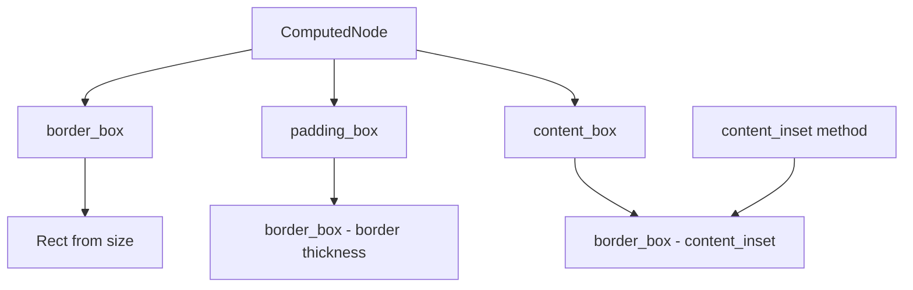

+++
title = "#21903 ComputedNode` box model helper functions"
date = "2025-12-15T00:00:00"
draft = false
template = "pull_request_page.html"
in_search_index = false

[extra]
current_language = "zh-cn"
available_languages = {"en" = { name = "English", url = "/pull_request/bevy/2025-12/pr-21903-en-20251215" }, "zh-cn" = { name = "中文", url = "/pull_request/bevy/2025-12/pr-21903-zh-cn-20251215" }}
+++

# ComputedNode Box Model Helper Functions

## 基本信息
- **标题**: `ComputedNode` box model helper functions
- **PR链接**: https://github.com/bevyengine/bevy/pull/21903
- **作者**: ickshonpe
- **状态**: 已合并
- **标签**: A-UI, S-Ready-For-Final-Review, D-Straightforward
- **创建时间**: 2025-11-21T15:43:02Z
- **合并时间**: 2025-12-15T02:24:32Z
- **合并人**: alice-i-cecile

## 描述翻译

# 目标

为 `ComputedNode` 添加辅助函数，返回节点边框（border）、内边距（padding）和内容区域（content）的边界。

## 解决方案

向 `ComputedNode` 添加辅助函数 `border_box`、`padding_box` 和 `content_box`。

#

包含一个发布说明。这些更改非常简单，实际上并不需要发布说明，但我计划后续添加更多非简单的 `ComputedNode` 更改。

## 测试

此 PR 还包含几个简单的测试。

## PR 的技术分析

这次 PR 的核心是为 Bevy 引擎的 UI 系统添加了一组实用的辅助函数。在 UI 布局计算中，准确获取节点的不同区域边界是常见需求，但之前开发者需要手动计算这些值。

**问题背景**
在 Bevy 的 UI 系统中，`ComputedNode` 存储了节点计算后的布局信息。开发者经常需要获取节点的三个关键区域：
1. 边框盒（border box）：包含边框、内边距和内容的完整区域
2. 内边距盒（padding box）：边框内部，包含内边距和内容的区域
3. 内容盒（content box）：最内层的实际内容区域

在没有这些辅助函数的情况下，开发者每次都需要手动从 `size`、`border` 和 `padding` 属性计算这些矩形区域，容易出错且代码重复。

**解决方案实现**
作者添加了三个简洁的辅助函数，每个函数都返回一个 `Rect` 结构体，使用对象中心坐标系（以节点中心为原点）：

```rust
/// 返回节点的边框盒（object-centered 物理坐标）。
/// 这是包围节点的完整矩形。
#[inline]
pub fn border_box(&self) -> Rect {
    Rect::from_center_size(Vec2::ZERO, self.size)
}
```

`border_box()` 是最简单的实现，直接从节点大小创建居中矩形。更复杂的是 `padding_box()` 和 `content_box()`：

```rust
/// 返回节点的内边距盒（object-centered 物理坐标）。
/// 这是边框内部包含节点内边距和内容区域的区域。
#[inline]
pub fn padding_box(&self) -> Rect {
    let mut out = self.border_box();
    out.min.x += self.border.left;
    out.max.x -= self.border.right;
    out.min.y += self.border.top;
    out.max.y -= self.border.bottom;
    out
}
```

`padding_box()` 从边框盒开始，减去边框厚度。关键细节是它从 `min` 坐标加边框（左下角）和从 `max` 坐标减边框（右上角），因为坐标系向右和向上为正。

```rust
/// 返回节点的内容盒（object-centered 物理坐标）。
/// 这是节点最内部的区域，内容放置的位置。
#[inline]
pub fn content_box(&self) -> Rect {
    let mut out = self.border_box();
    let content_inset = self.content_inset();
    out.min.x += content_inset.left;
    out.max.x -= content_inset.right;
    out.min.y += content_inset.top;
    out.max.y -= content_inset.bottom;
    out
}
```

`content_box()` 使用现有的 `content_inset()` 方法，它返回边框和内边距的总和。这体现了良好的代码复用 - 使用现有计算而不是重新实现。

**技术细节**
- 所有函数都标记为 `#[inline]`，因为它们是简单的 getter，内联可避免函数调用开销
- 使用对象中心坐标系（中心在 (0,0)）符合 Bevy 的 UI 坐标系统约定
- 函数返回 `Rect` 类型，这是 Bevy 数学库中的标准矩形表示

**测试策略**
作者添加了三个对应的测试用例，每个测试都验证特定场景：
1. `border_box_is_centered_rect_of_node_size`: 验证边框盒是否正确以原点为中心
2. `padding_box_subtracts_border_thickness`: 验证内边距盒是否正确减去边框厚度
3. `content_box_uses_content_inset`: 验证内容盒使用正确的内边距和边框总和

测试使用了具体数值和明确断言，确保计算逻辑正确。值得注意的是，测试代码重构了导入语句，将 `bevy_math` 的导入合并到一行，这是次要但良好的代码风格改进。

**架构影响**
这些辅助函数不会改变现有行为，只是提供更便捷的 API。它们符合 Rust 的惯例：提供清晰的、类型安全的辅助方法，而不是让用户手动计算。在 UI 渲染、碰撞检测、事件处理等场景中，这些函数能显著简化代码。

虽然 PR 作者提到这些更改"非常简单"，但在工程实践中，正是这种简单、聚焦的辅助函数提升了代码库的可维护性和开发者体验。这种改进是渐进式的，但累积起来能显著减少错误和提高开发效率。

## 可视化表示



## 主要文件变更

### `crates/bevy_ui/src/ui_node.rs` (+82/-3)

**变更说明**：向 `ComputedNode` 结构体添加三个辅助函数和相关测试。

**关键代码变更**：
```rust
// 添加的三个辅助函数：
pub fn border_box(&self) -> Rect {
    Rect::from_center_size(Vec2::ZERO, self.size)
}

pub fn padding_box(&self) -> Rect {
    let mut out = self.border_box();
    out.min.x += self.border.left;
    out.max.x -= self.border.right;
    out.min.y += self.border.top;
    out.max.y -= self.border.bottom;
    out
}

pub fn content_box(&self) -> Rect {
    let mut out = self.border_box();
    let content_inset = self.content_inset();
    out.min.x += content_inset.left;
    out.max.x -= content_inset.right;
    out.min.y += content_inset.top;
    out.max.y -= content_inset.bottom;
    out
}

// 相关的测试用例：
#[test]
fn border_box_is_centered_rect_of_node_size() {
    // 测试实现...
}

#[test]
fn padding_box_subtracts_border_thickness() {
    // 测试实现...
}

#[test]
fn content_box_uses_content_inset() {
    // 测试实现...
}
```

### `release-content/release-notes/computed_node_helper_functions.md` (+7/-0)

**变更说明**：创建新的发布说明文档，记录这次 API 添加。

**关键代码变更**：
```markdown
---
title: "`ComputedNode` helper functions"
authors: ["@ickshonpe"]
pull_requests: [21903]
---

Helper functions `border_box`, `padding_box`, and `content_box` that return a node's object-centered border, padding, and content boxes have been added to `ComputedNode`.
```

## 进一步阅读

1. **CSS 盒模型**：Bevy 的 UI 系统受到 CSS 盒模型的启发，了解 CSS 的 border-box、padding-box 和 content-box 有助于理解这些概念
2. **Bevy UI 文档**：官方文档中关于 UI 布局和 `ComputedNode` 的部分
3. **Rust 的 `#[inline]` 属性**：了解何时以及为什么使用内联函数对性能的影响
4. **测试驱动开发**：这个 PR 展示了即使对简单函数也编写测试的良好实践