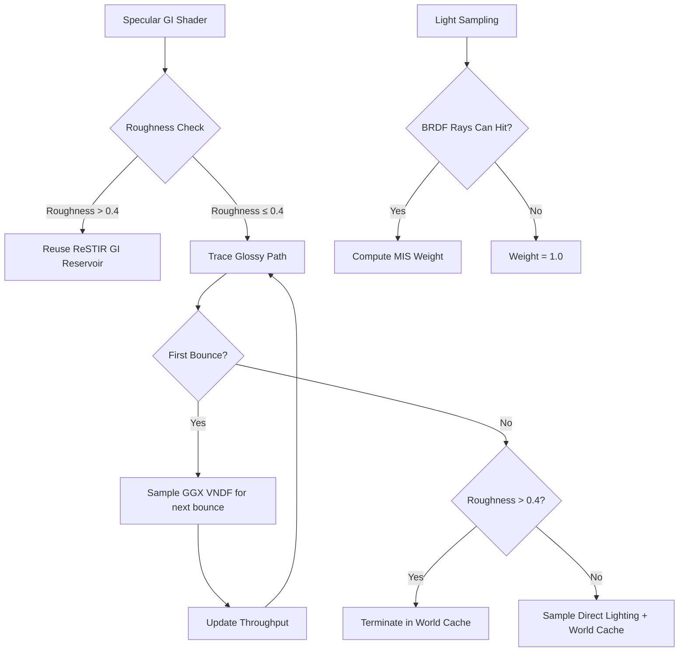

+++
title = "#21907 Solari: Improve specular GI"
date = "2025-12-08T00:00:00"
draft = false
template = "pull_request_page.html"
in_search_index = true

[taxonomies]
list_display = ["show"]

[extra]
current_language = "en"
available_languages = {"en" = { name = "English", url = "/pull_request/bevy/2025-12/pr-21907-en-20251208" }, "zh-cn" = { name = "中文", url = "/pull_request/bevy/2025-12/pr-21907-zh-cn-20251208" }}
labels = ["A-Rendering", "D-Complex", "C-Refinement"]
+++

# Title
## Basic Information
- **Title**: Solari: Improve specular GI
- **PR Link**: https://github.com/bevyengine/bevy/pull/21907
- **Author**: JMS55
- **Status**: MERGED
- **Labels**: A-Rendering, S-Ready-For-Final-Review, D-Complex, C-Refinement
- **Created**: 2025-11-21T19:47:20Z
- **Merged**: 2025-12-07T23:57:22Z
- **Merged By**: james7132

## Description Translation

Go back to only sampling the world cache for rough and non-first-bounce surfaces, but sample direct lighting when that doesn't happen.

Mainline


This PR


Pathtraced reference


Fixes https://github.com/bevyengine/bevy/issues/21967.

## The Story of This Pull Request

This PR addresses a problem with the specular global illumination (GI) implementation in Bevy's Solari renderer. The issue was that the previous implementation had an overly simplistic approach to handling multiple importance sampling (MIS) and path termination decisions for glossy surfaces, which resulted in visual artifacts and energy loss compared to a path-traced reference.

The core problem stemmed from how the renderer decided when to use the world cache (a precomputed lighting cache) versus performing direct lighting calculations. Previously, the system would sample the world cache for all surfaces with roughness greater than 0.1, regardless of whether it was the first bounce or not. This approach missed important direct lighting contributions for moderately glossy surfaces and didn't properly handle MIS weights between different sampling strategies.

The solution involved three key changes: refining the roughness thresholds for cache usage, properly implementing MIS for both emissive and direct lighting contributions, and fixing a subtle bug in the light sampling probability calculation.

In the `specular_gi.wgsl` file, the developer introduced two new roughness thresholds: `DIFFUSE_GI_REUSE_ROUGHNESS_THRESHOLD` (0.4) and `WORLD_CACHE_TERMINATION_ROUGHNESS_THRESHOLD` (0.4). These values replaced the previous hardcoded 0.1 threshold, allowing moderately rough surfaces to benefit from both direct lighting calculations and the world cache. The logic now follows a more principled approach:
- For very rough surfaces (roughness > 0.4), reuse the ReSTIR GI reservoir
- For moderately rough surfaces, sample direct lighting via next event estimation (NEE)
- Only terminate paths in the world cache for rough surfaces after the first bounce

The implementation properly handles MIS weights between BRDF sampling and light sampling. Two new helper functions were added: `emissive_mis_weight` for weighting emissive surface contributions and `nee_mis_weight` for weighting direct lighting contributions. These functions use the power heuristic to balance between the probability of sampling a direction via the BRDF versus sampling a light source.

A related fix was made in the pathtracer to ensure consistency. The `random_light_pdf` function was renamed to `random_emissive_light_pdf` and its calculation was corrected to properly account for the probability of hitting an emissive triangle. Additionally, the direct lighting calculation now checks the `brdf_rays_can_hit` flag before computing MIS weights, preventing incorrect weighting when BRDF rays cannot hit the sampled light.

The changes in `sampling.wgsl` include an optimization for nearly mirror-like surfaces (roughness ≤ 0.01), where the sampling function now returns the perfect reflection direction instead of performing expensive VNDF sampling. This is both mathematically correct and performance beneficial.

The result is a specular GI implementation that more closely matches the path-traced reference, with better handling of glossy surfaces and proper energy conservation. The render shows improved specular highlights and more accurate indirect lighting for materials with moderate roughness.

## Visual Representation



## Key Files Changed

### `crates/bevy_solari/src/realtime/specular_gi.wgsl` (+56/-13)
This file contains the main changes to the specular GI shader. The key modifications include:
1. Introducing roughness threshold constants for better control over when to use different lighting strategies
2. Refactoring the `trace_glossy_path` function to properly handle MIS weights and direct lighting
3. Adding helper functions for computing MIS weights for emissive surfaces and next event estimation

Key code changes:
```wgsl
// Before: Hardcoded threshold of 0.1
if surface.material.roughness > 0.1 {
    // Reuse GI reservoir
}

// After: Configurable threshold
const DIFFUSE_GI_REUSE_ROUGHNESS_THRESHOLD: f32 = 0.4;
if surface.material.roughness > DIFFUSE_GI_REUSE_ROUGHNESS_THRESHOLD {
    // Reuse GI reservoir
}

// New helper function for emissive MIS weighting
fn emissive_mis_weight(p_bounce: f32, ray_hit: ResolvedRayHitFull, previous_surface_perfectly_specular: bool) -> f32 {
    if previous_surface_perfectly_specular { return 1.0; }
    
    let p_light = random_emissive_light_pdf(ray_hit);
    return power_heuristic(p_bounce, p_light);
}
```

### `crates/bevy_solari/src/pathtracer/pathtracer.wgsl` (+9/-4)
This file updates the pathtracer to use the corrected light PDF calculation and properly handle the `brdf_rays_can_hit` flag for MIS weights.

Key code changes:
```wgsl
// Before: Using old function name and simple MIS weight calculation
let p_light = random_light_pdf(ray_hit);
mis_weight = power_heuristic(p_bounce, p_light);

// After: Using corrected function name
let p_light = random_emissive_light_pdf(ray_hit);
mis_weight = power_heuristic(p_bounce, p_light);

// New check for brdf_rays_can_hit flag
mis_weight = 1.0;
if direct_lighting.brdf_rays_can_hit {
    let pdf_of_bounce = brdf_pdf(wo, direct_lighting.wi, ray_hit);
    mis_weight = power_heuristic(1.0 / direct_lighting.inverse_pdf, pdf_of_bounce);
}
```

### `crates/bevy_solari/src/scene/sampling.wgsl` (+8/-4)
This file contains improvements to the sampling functions, including an optimization for near-mirror surfaces and a correction to the emissive light PDF calculation.

Key code changes:
```wgsl
// Optimization for near-mirror surfaces
fn sample_ggx_vndf(wi_tangent: vec3<f32>, roughness: f32, rng: ptr<function, u32>) -> vec3<f32> {
    if roughness <= 0.01 {
        return vec3(-wi_tangent.xy, wi_tangent.z);
    }
    // ... rest of the function
}

// Corrected PDF calculation for emissive lights
fn random_emissive_light_pdf(hit: ResolvedRayHitFull) -> f32 {
    let light_count = arrayLength(&light_sources);
    return 1.0 / (f32(light_count) * f32(hit.triangle_count) * hit.triangle_area);
}

// Added brdf_rays_can_hit flag to LightContribution struct
struct LightContribution {
    radiance: vec3<f32>,
    inverse_pdf: f32,
    wi: vec3<f32>,
    brdf_rays_can_hit: bool,
}
```

## Further Reading

1. **Multiple Importance Sampling (MIS)**: Eric Veach's PhD thesis "Robust Monte Carlo Methods for Light Transport Simulation" provides the foundational theory for MIS and the power heuristic used in this PR.
2. **GGX VNDF Sampling**: The paper "Bounded VNDF Sampling for Smith-GGX Reflections" by Heitz et al. describes the sampling technique used for glossy surfaces.
3. **ReSTIR GI**: The original ReSTIR GI paper "Spatiotemporal reservoir resampling for real-time ray tracing with dynamic direct lighting" by Bitterli et al. explains the technique used for diffuse GI reuse.
4. **Physically Based Rendering**: The PBRT book by Matt Pharr, Wenzel Jakob, and Greg Humphreys covers the fundamental concepts of light transport and importance sampling.