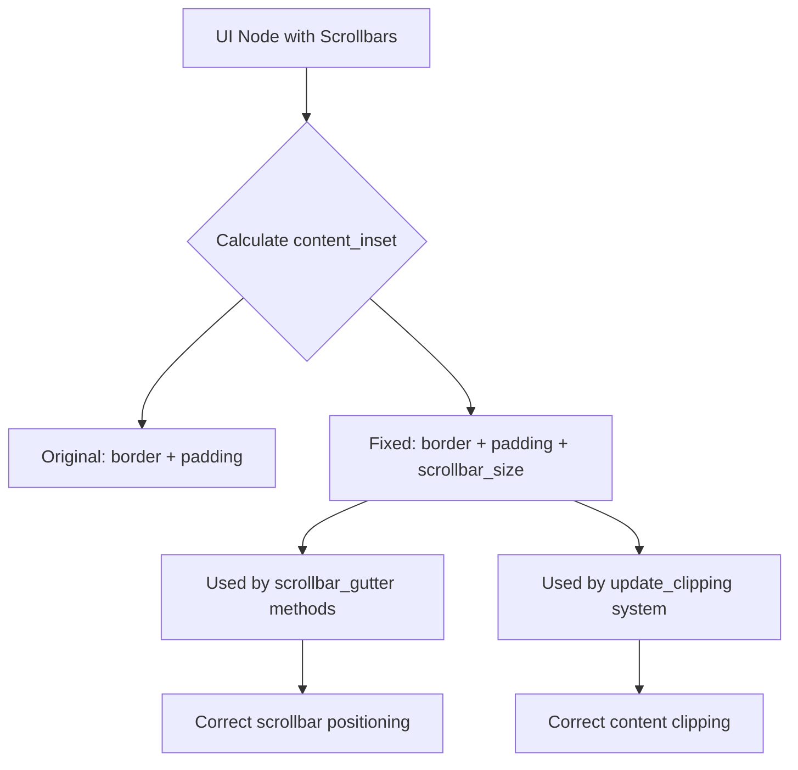

+++
title = "#21910 UI scrollbars clipping fix"
date = "2025-12-15T00:00:00"
draft = false
template = "pull_request_page.html"
in_search_index = true

[taxonomies]
list_display = ["show"]

[extra]
current_language = "en"
available_languages = {"en" = { name = "English", url = "/pull_request/bevy/2025-12/pr-21910-en-20251215" }, "zh-cn" = { name = "中文", url = "/pull_request/bevy/2025-12/pr-21910-zh-cn-20251215" }}
labels = ["C-Bug", "A-UI", "D-Straightforward"]
+++

# UI scrollbars clipping fix

## Basic Information
- **Title**: UI scrollbars clipping fix
- **PR Link**: https://github.com/bevyengine/bevy/pull/21910
- **Author**: ickshonpe
- **Status**: MERGED
- **Labels**: C-Bug, A-UI, S-Ready-For-Final-Review, D-Straightforward
- **Created**: 2025-11-22T11:31:43Z
- **Merged**: 2025-12-15T00:56:35Z
- **Merged By**: alice-i-cecile

## Description

# Objective
#### Fix two problems
1. Scrollbars are placed in the padding region of the node, not the content region. The content insets returned by `ComputedNode::content_inset` should account for the sizes of the scrollbars.
2. In `update_clipping_system` the clipping rect calculations are incorrect, `scrollbar_size` should only be added to the `right` and `bottom` when `visual_area` is set to `ContentBox`. For `BorderBox` and `PaddingBox`, the scrollbars are inside the clipping rect.

## Solution

1. Add the scrollbar size to the `right` and `bottom` insets returned by `ComputedNode::content_inset`.
2. Since `content_inset` now includes `scrollbar size`, remove the subtraction from `clip_rect.max` in `update_clipping_system`.

## Testing

Look at:
```
cargo run --example scrollbars --features="experimental_bevy_ui_widgets"
```

## The Story of This Pull Request

This pull request addresses a subtle bug in Bevy's UI system related to scrollbar placement and clipping calculations. The issue was discovered when developers noticed that scrollbars were appearing in incorrect positions relative to their containing nodes, and content was being improperly clipped when scrollbars were present.

The core problem stemmed from an inconsistency in how the system calculated content insets for nodes with scrollbars. In UI layout systems, a node typically has several conceptual regions: border, padding, content, and potentially scrollbars. The content inset defines how much space is reserved on each side of a node before the actual content area begins, accounting for borders and padding. However, the original implementation didn't account for scrollbars in this calculation.

When examining the `ComputedNode::content_inset()` method, we can see the original implementation simply returned the sum of border and padding:

```rust
pub fn content_inset(&self) -> BorderRect {
    self.border + self.padding
}
```

This was problematic because scrollbars occupy space at the edges of a node's content area. Specifically, horizontal scrollbars appear at the bottom, and vertical scrollbars appear at the right. These scrollbars should reduce the available content area, so they need to be included in the content inset calculation.

The fix modifies the `content_inset()` method to add the scrollbar dimensions to the right and bottom insets:

```rust
pub fn content_inset(&self) -> BorderRect {
    let mut content_inset = self.border + self.padding;
    content_inset.right += self.scrollbar_size.x;
    content_inset.bottom += self.scrollbar_size.y;
    content_inset
}
```

This change has a cascading effect on other calculations that depend on `content_inset()`. The `horizontal_scrollbar_gutter()` and `vertical_scrollbar_gutter()` methods, which calculate the rectangular areas where scrollbars should be rendered, needed adjustments. These methods use the content inset to position the scrollbars within the node.

Looking at the `horizontal_scrollbar_gutter()` method before the fix:

```rust
let max_x = half_size.x - content_inset.right - self.scrollbar_size.x;
let max_y = half_size.y - content_inset.bottom;
let min_y = max_y - self.scrollbar_size.y;
```

After the fix, with the scrollbar size now included in `content_inset.right` and `content_inset.bottom`, the calculation simplifies:

```rust
let max_x = half_size.x - content_inset.right;
let min_y = half_size.y - content_inset.bottom;
let max_y = min_y + self.scrollbar_size.y;
```

The same pattern applies to the `vertical_scrollbar_gutter()` method. These changes ensure scrollbars are positioned correctly within the padding region of the node, not overlapping the content area.

The second part of the fix addresses a related issue in the clipping system. The `update_clipping()` function calculates a clipping rectangle for nodes, which defines what portion of the node's content is visible. The function needed to consider different visual area types: `BorderBox`, `PaddingBox`, and `ContentBox`.

The key insight is that for `BorderBox` and `PaddingBox`, scrollbars should be inside the clipping rect (visible), while for `ContentBox`, scrollbars should be outside the clipping rect (content is clipped to make room for scrollbars). The original code was incorrectly subtracting scrollbar size from the clipping rect for all visual area types:

```rust
clip_rect.max.x -= clip_inset.right + computed_node.scrollbar_size.x;
clip_rect.max.y -= clip_inset.bottom + computed_node.scrollbar_size.y;
```

With the updated `content_inset()` method already including scrollbar size for `ContentBox`, the fix removes the extra subtraction:

```rust
clip_rect.max.x -= clip_inset.right;
clip_rect.max.y -= clip_inset.bottom;
```

Now, when `clip_inset` is derived from `content_inset()` (for `ContentBox`), it already includes the scrollbar size. For `BorderBox` and `PaddingBox`, `clip_inset` doesn't include scrollbar size, which is correct because scrollbars should remain visible inside those clipping areas.

This fix demonstrates a common pattern in UI systems: ensuring consistency between different calculations that depend on the same underlying data. By centralizing the scrollbar size calculation in `content_inset()`, we prevent drift between related computations and make the system more maintainable.

From an architectural perspective, this change improves the separation of concerns. The `content_inset()` method now properly represents all elements that reduce the available content area, making it a more reliable abstraction for other parts of the UI system to use.

## Visual Representation



## Key Files Changed

### `crates/bevy_ui/src/ui_node.rs` (+10/-7)

This file contains the `ComputedNode` struct and its methods. The main changes involve updating the `content_inset()` method to include scrollbar dimensions, and adjusting the scrollbar gutter calculations to work with the updated content inset.

Key changes:
1. **Updated `content_inset()` method**:
```rust
// Before:
pub fn content_inset(&self) -> BorderRect {
    self.border + self.padding
}

// After:
pub fn content_inset(&self) -> BorderRect {
    let mut content_inset = self.border + self.padding;
    content_inset.right += self.scrollbar_size.x;
    content_inset.bottom += self.scrollbar_size.y;
    content_inset
}
```

2. **Updated `horizontal_scrollbar_gutter()` method**:
```rust
// Before:
let max_x = half_size.x - content_inset.right - self.scrollbar_size.x;
let max_y = half_size.y - content_inset.bottom;
let min_y = max_y - self.scrollbar_size.y;

// After:
let max_x = half_size.x - content_inset.right;
let min_y = half_size.y - content_inset.bottom;
let max_y = min_y + self.scrollbar_size.y;
```

3. **Updated `vertical_scrollbar_gutter()` method**:
```rust
// Before:
let max_x = half_size.x - content_inset.right;
let min_x = max_x - self.scrollbar_size.x;
let min_y = -half_size.y + content_inset.top;
let max_y = half_size.y - content_inset.bottom - self.scrollbar_size.y;

// After:
let min_x = half_size.x - content_inset.right;
let max_x = min_x + self.scrollbar_size.x;
let min_y = -half_size.y + content_inset.top;
let max_y = half_size.y - content_inset.bottom;
```

### `crates/bevy_ui/src/update.rs` (+2/-2)

This file contains the `update_clipping()` function which calculates clipping rectangles for UI nodes. The change removes the redundant subtraction of scrollbar size since it's now included in the content inset.

Key changes:
```rust
// Before:
clip_rect.max.x -= clip_inset.right + computed_node.scrollbar_size.x;
clip_rect.max.y -= clip_inset.bottom + computed_node.scrollbar_size.y;

// After:
clip_rect.max.x -= clip_inset.right;
clip_rect.max.y -= clip_inset.bottom;
```

## Further Reading

1. **Bevy UI Layout System**: Understanding Bevy's UI layout model, including borders, padding, and content areas
2. **CSS Box Model**: The web's CSS box model (border, padding, margin, content) provides useful analogies for understanding UI layout systems
3. **Clipping in Computer Graphics**: Fundamentals of clipping rectangles and viewport management in 2D graphics
4. **Scrollbar Design Patterns**: Common approaches to scrollbar placement and interaction in UI frameworks