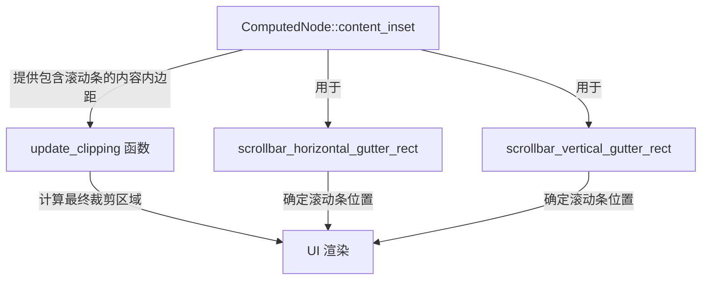

+++
title = "#21910 UI scrollbars clipping fix"
date = "2025-12-15T00:00:00"
draft = false
template = "pull_request_page.html"
in_search_index = false

[extra]
current_language = "zh-cn"
available_languages = {"en" = { name = "English", url = "/pull_request/bevy/2025-12/pr-21910-en-20251215" }, "zh-cn" = { name = "中文", url = "/pull_request/bevy/2025-12/pr-21910-zh-cn-20251215" }}
+++

# UI Scrollbars Clipping Fix

## 基本信息
- **标题**: UI scrollbars clipping fix
- **PR 链接**: https://github.com/bevyengine/bevy/pull/21910
- **作者**: ickshonpe
- **状态**: 已合并
- **标签**: C-Bug, A-UI, S-Ready-For-Final-Review, D-Straightforward
- **创建时间**: 2025-11-22T11:31:43Z
- **合并时间**: 2025-12-15T00:56:35Z
- **合并者**: alice-i-cecile

## 描述翻译
# 目标
#### 修复两个问题
1. 滚动条被放置在节点的填充(padding)区域，而不是内容区域。`ComputedNode::content_inset` 返回的内容内边距应该考虑滚动条的大小。
2. 在 `update_clipping_system` 中，裁剪矩形(clipping rect)的计算不正确。只有当 `visual_area` 设置为 `ContentBox` 时，才应该将 `scrollbar_size` 添加到 `right` 和 `bottom`。对于 `BorderBox` 和 `PaddingBox`，滚动条位于裁剪矩形内部。

## 解决方案
1. 将滚动条的大小添加到 `ComputedNode::content_inset` 返回的 `right` 和 `bottom` 内边距中。
2. 由于 `content_inset` 现在包含了 `scrollbar size`，从 `update_clipping_system` 中的 `clip_rect.max` 移除对应的减法。

## 测试
查看：
```
cargo run --example scrollbars --features="experimental_bevy_ui_widgets"
```

## 这次 PR 的技术分析

### 问题背景与上下文
这个 PR 解决了 Bevy UI 系统中滚动条定位和裁剪的两个相关 bug。第一个问题是滚动条错误地放置在节点的填充区域而非内容区域内，这导致滚动条的位置计算不准确。第二个问题更严重：在 `update_clipping_system` 中，裁剪矩形的计算逻辑存在缺陷，错误地处理了滚动条尺寸对裁剪区域的影响。

理解这两个 bug 的关键在于理解 Bevy UI 的盒子模型(box model)：`BorderBox`（边框盒）、`PaddingBox`（填充盒）和 `ContentBox`（内容盒）。滚动条应该位于内容区域内，但现有的实现没有正确考虑滚动条尺寸对内容内边距的影响。

### 解决方案的技术实现

开发者采用了直接的修复方法，修改了两个核心函数：

首先，在 `ComputedNode::content_inset()` 方法中，现在正确地包含了滚动条尺寸：
```rust
// 修改前：
pub fn content_inset(&self) -> BorderRect {
    self.border + self.padding
}

// 修改后：
pub fn content_inset(&self) -> BorderRect {
    let mut content_inset = self.border + self.padding;
    content_inset.right += self.scrollbar_size.x;
    content_inset.bottom += self.scrollbar_size.y;
    content_inset
}
```

这个修改是逻辑修复的核心。通过将滚动条尺寸加入到内容内边距中，后续使用 `content_inset` 的所有计算都会自动考虑滚动条占据的空间。

第二个修改在 `update_clipping()` 函数中：
```rust
// 修改前：
clip_rect.max.x -= clip_inset.right + computed_node.scrollbar_size.x;
clip_rect.max.y -= clip_inset.bottom + computed_node.scrollbar_size.y;

// 修改后：
clip_rect.max.x -= clip_inset.right;
clip_rect.max.y -= clip_inset.bottom;
```

由于 `clip_inset` 基于 `content_inset` 计算，而 `content_inset` 现在已经包含了滚动条尺寸，这里不需要再额外减去滚动条尺寸。移除这个双重减法避免了裁剪区域过小的问题。

### 技术细节与实现考量

这个 PR 的修复涉及两个相关的滚动条位置计算函数：`scrollbar_horizontal_gutter_rect()` 和 `scrollbar_vertical_gutter_rect()`。这些函数计算滚动条轨道（gutter）的矩形区域。

在水平滚动条的计算中：
```rust
// 修改前的逻辑存在问题
let min_x = -half_size.x + content_inset.left;
let max_x = half_size.x - content_inset.right - self.scrollbar_size.x;  // 这里额外减去了 scrollbar_size
let max_y = half_size.y - content_inset.bottom;
let min_y = max_y - self.scrollbar_size.y;

// 修改后的逻辑更清晰
let min_x = -half_size.x + content_inset.left;
let max_x = half_size.x - content_inset.right;  // content_inset.right 已包含 scrollbar_size
let min_y = half_size.y - content_inset.bottom;
let max_y = min_y + self.scrollbar_size.y;
```

垂直滚动条的修复采用了类似的逻辑调整。这些修改的关键在于：`content_inset.right` 和 `content_inset.bottom` 现在已经包含了滚动条尺寸，所以不需要在计算中再次减去滚动条尺寸。

### 影响与学习点

这个修复的直接影响是滚动条现在正确地放置在内容区域内，而不是错误地占据填充区域。对于使用滚动条的 UI 组件，这意味着：
1. 滚动条的位置计算更准确
2. 裁剪区域不会因为滚动条而过度缩小
3. UI 布局更加符合开发者的预期

从工程角度看，这个修复展示了几个重要的原则：
- **关注点分离**：通过修正 `content_inset()` 这个基础方法，所有依赖它的计算都自动获得了正确的行为
- **避免重复计算**：之前系统在多个地方手动处理滚动条尺寸，现在这个逻辑集中在一个地方
- **边界情况处理**：正确区分了不同盒子模型（BorderBox、PaddingBox、ContentBox）中滚动条的定位逻辑

### 潜在考虑与进一步优化

虽然这个修复解决了当前的问题，但值得注意的是，Bevy 的 UI 系统仍在开发中（从 `experimental_bevy_ui_widgets` 特性标志可以看出）。这个 PR 为更复杂的滚动条交互和布局逻辑奠定了基础。

未来可能需要考虑：
1. 滚动条可见性对布局的动态影响
2. 嵌套滚动容器的正确处理
3. 滚动条交互状态（悬停、点击）的视觉反馈

## 组件关系图



## 关键文件修改

### `crates/bevy_ui/src/ui_node.rs` (+10/-7)

这个文件包含了 `ComputedNode` 结构体的实现，主要修改了三个方法：

1. **content_inset() 方法**：
```rust
// 修改前：
pub fn content_inset(&self) -> BorderRect {
    self.border + self.padding
}

// 修改后：
pub fn content_inset(&self) -> BorderRect {
    let mut content_inset = self.border + self.padding;
    content_inset.right += self.scrollbar_size.x;
    content_inset.bottom += self.scrollbar_size.y;
    content_inset
}
```
这个修改确保内容内边距包含了滚动条尺寸，是所有其他修改的基础。

2. **scrollbar_horizontal_gutter_rect() 方法**：
```rust
// 修改前：
let min_x = -half_size.x + content_inset.left;
let max_x = half_size.x - content_inset.right - self.scrollbar_size.x;
let max_y = half_size.y - content_inset.bottom;
let min_y = max_y - self.scrollbar_size.y;

// 修改后：
let min_x = -half_size.x + content_inset.left;
let max_x = half_size.x - content_inset.right;
let min_y = half_size.y - content_inset.bottom;
let max_y = min_y + self.scrollbar_size.y;
```
这个修改调整了水平滚动条轨道的计算逻辑，现在正确地使用已包含滚动条尺寸的 `content_inset`。

3. **scrollbar_vertical_gutter_rect() 方法**：
```rust
// 修改前：
let max_x = half_size.x - content_inset.right;
let min_x = max_x - self.scrollbar_size.x;
let min_y = -half_size.y + content_inset.top;
let max_y = half_size.y - content_inset.bottom - self.scrollbar_size.y;

// 修改后：
let min_x = half_size.x - content_inset.right;
let max_x = min_x + self.scrollbar_size.x;
let min_y = -half_size.y + content_inset.top;
let max_y = half_size.y - content_inset.bottom;
```
类似的修改应用于垂直滚动条轨道的计算。

### `crates/bevy_ui/src/update.rs` (+2/-2)

这个文件处理 UI 的更新逻辑，主要修改了 `update_clipping()` 函数：

```rust
// 修改前：
clip_rect.max.x -= clip_inset.right + computed_node.scrollbar_size.x;
clip_rect.max.y -= clip_inset.bottom + computed_node.scrollbar_size.y;

// 修改后：
clip_rect.max.x -= clip_inset.right;
clip_rect.max.y -= clip_inset.bottom;
```

这个修改移除了重复的滚动条尺寸减法，因为 `clip_inset`（基于 `content_inset`）已经包含了滚动条尺寸。这确保了裁剪区域的正确计算。

## 进一步阅读

1. **CSS 盒子模型**：了解标准 CSS 盒子模型（border box, padding box, content box）有助于理解 Bevy UI 的设计理念
2. **Bevy UI 文档**：https://bevyengine.org/learn/book/features/ui/
3. **Bevy GitHub 仓库中的 UI 示例**：查看其他 UI 组件如何实现布局和交互
4. **滚动条设计模式**：了解不同 UI 框架中滚动条的实现方式和最佳实践