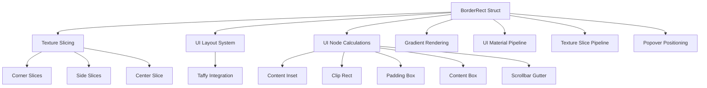

+++
title = "#21915 Resolve `BorderRect` Ambiguity"
date = "2025-12-16T00:00:00"
draft = false
template = "pull_request_page.html"
in_search_index = true

[taxonomies]
list_display = ["show"]

[extra]
current_language = "en"
available_languages = {"en" = { name = "English", url = "/pull_request/bevy/2025-12/pr-21915-en-20251216" }, "zh-cn" = { name = "中文", url = "/pull_request/bevy/2025-12/pr-21915-zh-cn-20251216" }}
labels = ["D-Trivial", "A-Rendering", "A-UI", "C-Code-Quality", "M-Migration-Guide"]
+++

# Title: Resolve `BorderRect` Ambiguity

## Basic Information
- **Title**: Resolve `BorderRect` ambiguity
- **PR Link**: https://github.com/bevyengine/bevy/pull/21915
- **Author**: ickshonpe
- **Status**: MERGED
- **Labels**: D-Trivial, A-Rendering, A-UI, C-Code-Quality, S-Ready-For-Final-Review, M-Migration-Guide
- **Created**: 2025-11-23T10:38:21Z
- **Merged**: 2025-12-16T20:39:19Z
- **Merged By**: alice-i-cecile

## Description Translation
# Objective

In UI and world coordinates, "top" and "bottom" mean opposite things, so these fields are ambiguous. Anyone using `BorderRect` must decide themselves how to interpret the vertical inset values.

Fixes #21913

For more in detail motivation, see the replies to issue #21913

## Solution

Replace the directional `BorderRect` fields (`left`, `right`, `top`, and `bottom`) with `min_inset` and `max_inset` `Vec2` fields.

Using `min_inset` and `max_inset` removes the need to interpret `top` or `bottom` relative to the coordinate system, so the same logic will work consistently in both UI and 2D.

## The Story of This Pull Request

This pull request addresses a subtle but important inconsistency in Bevy's coordinate system handling. The core issue was that the `BorderRect` struct, used to define border insets for UI elements and sprites, contained ambiguous field names that meant different things in different coordinate systems.

In traditional 2D world coordinates, the Y-axis typically increases upward, making "top" the maximum Y value. However, in UI coordinate systems (and many computer graphics contexts), the Y-axis often increases downward, making "top" the minimum Y value. This created a situation where developers had to manually interpret what `BorderRect.top` and `BorderRect.bottom` meant in their specific context, leading to potential bugs and inconsistent behavior.

The solution was straightforward in concept but required careful implementation: replace the four directional fields (`left`, `right`, `top`, `bottom`) with two vector fields (`min_inset` and `max_inset`). This change eliminates the ambiguity because `min_inset` and `max_inset` are defined relative to a rectangle's minimum and maximum corners, which are consistent regardless of coordinate system orientation.

The implementation required changes across multiple crates in the Bevy codebase. The core `BorderRect` struct definition was updated in `border_rect.rs`, changing from individual float fields to `Vec2` fields. This structural change then propagated through all code that used `BorderRect`, including texture slicing logic, UI node calculations, gradient rendering, and UI material pipelines.

One important aspect of this change was maintaining backward compatibility through the `From` trait implementations. The `From<[f32; 4]>` implementation was updated to map the four-value array to the new vector fields, with the understanding that the array elements represent `[min_x, max_x, min_y, max_y]`. This maintains a similar API for constructing `BorderRect` instances while using the new internal representation.

The mathematical operations (`Add`, `Sub`, `Mul`, `Div`) were also updated to work with the vector fields, which actually simplified the implementations. Instead of four separate operations, each operation now handles two vectors, making the code more concise and potentially more efficient.

In the texture slicing code, the change required careful handling of how border values were extracted and used. The code was updated to destructure the `Vec2` fields into the familiar `left`, `right`, `top`, `bottom` names within local scopes where the coordinate system context was clear. This approach maintained readability in complex calculations while eliminating the ambiguity at the API level.

For UI systems, the change required updates to how borders are calculated for layout, clipping, and rendering. The use of vector operations (`min_inset` and `max_inset` addition/subtraction) made the code more consistent and eliminated repetitive individual field operations.

A migration guide was added to help developers update their code. The guide explains that the directional fields have been replaced with `Vec2` fields and provides context about why this change improves consistency between UI and 2D coordinate systems.

## Visual Representation



## Key Files Changed

### `crates/bevy_sprite/src/texture_slice/border_rect.rs` (+29/-45)

This file contains the core `BorderRect` struct definition. The change replaced four individual float fields with two `Vec2` fields:

```rust
// Before:
pub struct BorderRect {
    pub left: f32,
    pub right: f32,
    pub top: f32,
    pub bottom: f32,
}

// After:
pub struct BorderRect {
    pub min_inset: Vec2,
    pub max_inset: Vec2,
}
```

All associated methods and trait implementations were updated to work with the new vector fields. The `From` trait implementations were adjusted to map array indices to the appropriate vector components.

### `crates/bevy_sprite/src/texture_slice/slicer.rs` (+29/-38)

This file handles texture slicing for sprites. The changes involved updating the border extraction pattern and using vector operations:

```rust
// Before:
let BorderRect { left, right, top, bottom } = self.border;

// After:
let BorderRect {
    min_inset: Vec2 { x: left, y: top },
    max_inset: Vec2 { x: right, y: bottom },
} = self.border;
```

The slicing calculations were updated to use `min_inset` and `max_inset` instead of individual fields, and the validation logic was simplified using vector comparisons.

### `crates/bevy_ui/src/ui_node.rs` (+19/-35)

This file contains UI node calculations. The changes involved updating border and padding calculations to use vector operations:

```rust
// Before:
content_inset.right += self.scrollbar_size.x;
content_inset.bottom += self.scrollbar_size.y;

// After:
content_inset.max_inset += self.scrollbar_size;
```

Similarly, rectangle manipulation code was simplified from individual field operations to vector operations:

```rust
// Before:
clip_rect.min.x += clip_inset.left;
clip_rect.min.y += clip_inset.top;
clip_rect.max.x -= clip_inset.right;
clip_rect.max.y -= clip_inset.bottom;

// After:
clip_rect.min += clip_inset.min_inset;
clip_rect.max -= clip_inset.max_inset;
```

### `crates/bevy_ui_render/src/ui_texture_slice_pipeline.rs` (+8/-8)

This file handles UI texture slice rendering. The changes updated the border value extraction for shader parameters:

```rust
// Before:
let slices = [
    border_rect.left / image_size.x,
    border_rect.top / image_size.y,
    1. - border_rect.right / image_size.x,
    1. - border_rect.bottom / image_size.y,
];

// After:
let slices = [
    border_rect.min_inset.x / image_size.x,
    border_rect.min_inset.y / image_size.y,
    1. - border_rect.max_inset.x / image_size.x,
    1. - border_rect.max_inset.y / image_size.y,
];
```

### `crates/bevy_ui_render/src/gradient.rs` (+4/-4)

This file handles gradient rendering. The changes updated the border array construction for gradient data:

```rust
// Before:
border: [
    gradient.border.left,
    gradient.border.top,
    gradient.border.right,
    gradient.border.bottom,
],

// After:
border: [
    gradient.border.min_inset.x,
    gradient.border.min_inset.y,
    gradient.border.max_inset.x,
    gradient.border.max_inset.y,
],
```

## Further Reading

1. **Bevy UI Coordinate System**: The Bevy documentation on UI coordinate systems and how they differ from world coordinates.
2. **Vector Operations in Graphics**: Resources on using vector mathematics for graphics programming, particularly for rectangle manipulation.
3. **Nine-Patch Scaling**: Documentation on nine-patch or 9-slice scaling techniques commonly used in UI systems.
4. **Migration Strategies**: Best practices for API migrations in game engines, particularly when changing core data structures.