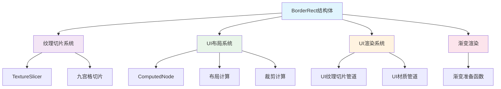

+++
title = "#21915 Resolve `BorderRect` ambiguity"
date = "2025-12-16T00:00:00"
draft = false
template = "pull_request_page.html"
in_search_index = false

[extra]
current_language = "zh-cn"
available_languages = {"en" = { name = "English", url = "/pull_request/bevy/2025-12/pr-21915-en-20251216" }, "zh-cn" = { name = "中文", url = "/pull_request/bevy/2025-12/pr-21915-zh-cn-20251216" }}
+++

# 标题
## 基本信息
- **标题**: Resolve `BorderRect` ambiguity
- **PR链接**: https://github.com/bevyengine/bevy/pull/21915
- **作者**: ickshonpe
- **状态**: 已合并
- **标签**: D-Trivial, A-Rendering, A-UI, C-Code-Quality, S-Ready-For-Final-Review, M-Migration-Guide
- **创建时间**: 2025-11-23T10:38:21Z
- **合并时间**: 2025-12-16T20:39:19Z
- **合并者**: alice-i-cecile

## 描述翻译
### 目标

在UI坐标和世界坐标中，"顶部"和"底部"表示相反的含义，因此这些字段存在歧义。使用`BorderRect`的开发者需要自行决定如何解释垂直方向的插入值。

修复 #21913

关于更详细的动机，请参考issue #21913的回复。

### 解决方案

将方向性的`BorderRect`字段（`left`、`right`、`top`和`bottom`）替换为`min_inset`和`max_inset`两个`Vec2`字段。

使用`min_inset`和`max_inset`消除了根据坐标系解释`top`或`bottom`的需要，因此相同的逻辑可以在UI和2D中一致地工作。

## 这个PR的技术分析

这个PR的核心问题是坐标系统歧义。在Bevy中，UI使用屏幕坐标系统，其中Y轴向下为正，而世界坐标使用笛卡尔坐标系统，其中Y轴向上为正。这意味着"顶部"和"底部"在不同上下文中表示相反的方向。

`BorderRect`结构体原本使用四个方向性字段：`left`、`right`、`top`、`bottom`。这种设计存在两个主要问题：
1. **语义歧义**：开发者需要根据上下文决定`top`是表示最小Y值（UI坐标）还是最大Y值（世界坐标）
2. **代码复杂性**：在处理矩形时，经常需要同时操作对应的左/右或上/下值

解决方案是用两个`Vec2`字段替换四个标量字段：
- `min_inset`: 从矩形最小角（左下角）的插入值
- `max_inset`: 从矩形最大角（右上角）的插入值

这种设计有几个优势：
1. **消除歧义**：`min_inset`和`max_inset`的定义与坐标系无关
2. **简化计算**：可以使用向量运算同时处理两个轴
3. **类型安全**：`Vec2`类型提供了丰富的数学运算方法

从实现角度看，这次重构涉及整个代码库中所有使用`BorderRect`的地方。最大的挑战是保持向后兼容性，同时更新所有相关代码。PR作者通过提供从`[f32; 4]`数组的转换和更新所有使用点来解决这个问题。

一个关键的技术细节是边界检查的更新。在`slicer.rs`中，原来的边界检查：
```rust
if self.border.left + self.border.right >= rect.size().x
    || self.border.top + self.border.bottom >= rect.size().y
```

被替换为更简洁的向量运算：
```rust
if (self.border.min_inset + self.border.max_inset)
    .cmpge(rect.size())
    .any()
```

这种变化不仅更简洁，而且利用了`Vec2`的比较方法，提高了代码的可读性。

在UI系统中，这个变化简化了许多矩形的计算。例如，计算内容框现在只需要简单的向量加法：
```rust
// 之前
out.min.x += content_inset.left;
out.max.x -= content_inset.right;
out.min.y += content_inset.top;
out.max.y -= content_inset.bottom;

// 之后
out.min += content_inset.min_inset;
out.max -= content_inset.max_inset;
```

这种变化减少了代码行数，降低了出错的可能性。

从性能角度看，这个变化是中性的。`Vec2`操作在现代CPU上通常与标量操作一样快，而且编译器能够很好地优化向量运算。实际上，在某些情况下，使用`Vec2`可能还会带来微小的性能提升，因为它允许更好的指令级并行。

这个PR的一个重要部分是包含了一个迁移指南，帮助开发者从旧API迁移到新API。这是良好的工程实践，特别是在游戏引擎这样的底层库中。

总结来说，这个PR通过将`BorderRect`从方向性字段改为基于最小/最大角的字段，解决了坐标系统歧义问题。这种设计更符合计算机图形学中处理矩形的常见模式，简化了代码，并提高了API的一致性。

## 可视化表示



## 关键文件更改

### 1. `crates/bevy_sprite/src/texture_slice/border_rect.rs` (+29/-45)

**变化描述**: 重新定义`BorderRect`结构体的核心字段

**关键修改**:
```rust
// 之前:
pub struct BorderRect {
    pub left: f32,
    pub right: f32,
    pub top: f32,
    pub bottom: f32,
}

// 之后:
pub struct BorderRect {
    pub min_inset: Vec2,
    pub max_inset: Vec2,
}
```

**相关修改**:
- 更新了`all()`、`axes()`等构造函数
- 更新了从`f32`和`[f32; 4]`的转换实现
- 更新了算术运算实现（`Add`、`Sub`、`Mul`、`Div`）

**与PR目的的关系**: 这是PR的核心变化，定义了新的API结构

### 2. `crates/bevy_sprite/src/texture_slice/slicer.rs` (+29/-38)

**变化描述**: 更新纹理切片器以使用新的`BorderRect`格式

**关键修改**:
```rust
// 之前:
let BorderRect {
    left,
    right,
    top,
    bottom,
} = self.border;

// 之后:
let BorderRect {
    min_inset: Vec2 { x: left, y: top },
    max_inset: Vec2 { x: right, y: bottom },
} = self.border;
```

**边界检查的变化**:
```rust
// 之前:
if self.border.left + self.border.right >= rect.size().x
    || self.border.top + self.border.bottom >= rect.size().y

// 之后:
if (self.border.min_inset + self.border.max_inset)
    .cmpge(rect.size())
    .any()
```

**与PR目的的关系**: 展示了如何在实际算法中使用新的`BorderRect`格式

### 3. `crates/bevy_ui/src/ui_node.rs` (+19/-35)

**变化描述**: 更新UI节点计算以使用新的`BorderRect`格式

**关键修改**:
```rust
// 之前计算边框向量的方式:
let b = vec4(
    self.border.left,
    self.border.top,
    self.border.right,
    self.border.bottom,
);

// 之后:
let b = Vec4::from((self.border.min_inset, self.border.max_inset));
```

**矩形计算的变化**:
```rust
// 之前调整矩形边界:
out.min.x += content_inset.left;
out.max.x -= content_inset.right;
out.min.y += content_inset.top;
out.max.y -= content_inset.bottom;

// 之后:
out.min += content_inset.min_inset;
out.max -= content_inset.max_inset;
```

**与PR目的的关系**: 展示了在UI系统中如何使用新的API简化代码

### 4. `crates/bevy_ui_render/src/ui_texture_slice_pipeline.rs` (+8/-8)

**变化描述**: 更新UI纹理切片管道的边界计算

**关键修改**:
```rust
// 之前计算切片:
let slices = [
    border_rect.left / image_size.x,
    border_rect.top / image_size.y,
    1. - border_rect.right / image_size.x,
    1. - border_rect.bottom / image_size.y,
];

// 之后:
let slices = [
    border_rect.min_inset.x / image_size.x,
    border_rect.min_inset.y / image_size.y,
    1. - border_rect.max_inset.x / image_size.x,
    1. - border_rect.max_inset.y / image_size.y,
];
```

**与PR目的的关系**: 展示了在渲染管道中如何应用新的边界格式

### 5. `crates/bevy_ui_render/src/gradient.rs` (+4/-4)

**变化描述**: 更新渐变渲染的边界数据格式

**关键修改**:
```rust
// 之前:
border: [
    gradient.border.left,
    gradient.border.top,
    gradient.border.right,
    gradient.border.bottom,
],

// 之后:
border: [
    gradient.border.min_inset.x,
    gradient.border.min_inset.y,
    gradient.border.max_inset.x,
    gradient.border.max_inset.y,
],
```

**与PR目的的关系**: 展示了在着色器数据准备中如何转换新的边界格式

## 进一步阅读

1. **Bevy官方文档 - UI系统**: https://bevyengine.org/learn/quick-start/ui/
2. **计算机图形学中的坐标系统**: 了解不同坐标系统（屏幕坐标、世界坐标、标准化设备坐标）的区别
3. **游戏引擎中的九宫格渲染**: 了解九宫格切片技术及其在UI和2D精灵中的应用
4. **Rust向量运算**: 学习`Vec2`类型的数学运算和性能特性
5. **API设计原则**: 研究消除歧义、保持一致的API设计模式