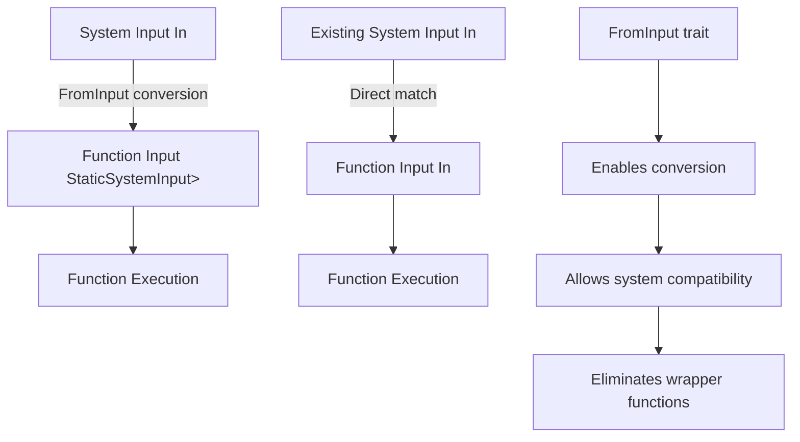

+++
title = "#21917 More flexible SystemInput"
date = "2025-12-11T00:00:00"
draft = false
template = "pull_request_page.html"
in_search_index = true

[taxonomies]
list_display = ["show"]

[extra]
current_language = "en"
available_languages = {"en" = { name = "English", url = "/pull_request/bevy/2025-12/pr-21917-en-20251211" }, "zh-cn" = { name = "中文", url = "/pull_request/bevy/2025-12/pr-21917-zh-cn-20251211" }}
labels = ["C-Feature", "A-ECS", "D-Modest"]
+++

# More flexible SystemInput

## Basic Information
- **Title**: More flexible SystemInput
- **PR Link**: https://github.com/bevyengine/bevy/pull/21917
- **Author**: ecoskey
- **Status**: MERGED
- **Labels**: C-Feature, A-ECS, S-Ready-For-Final-Review, D-Modest
- **Created**: 2025-11-23T20:00:43Z
- **Merged**: 2025-12-11T01:45:41Z
- **Merged By**: alice-i-cecile

## Description Translation

# Objective

Allow functions accepting `StaticSystemInput` as input to be used as systems accepting the inner type.

## Solution

- Add FromInput trait mirroring IntoResult

## Testing

- Compiles
- Added test to `input.rs`

---

## Showcase

<details>
  <summary>Click to view showcase</summary>

```rust
    #[test]
    fn compatible_input() {
        fn takes_usize(In(a): In<usize>) -> usize {
            a
        }

        fn takes_static_usize(StaticSystemInput(In(b)): StaticSystemInput<In<usize>>) -> usize {
            b
        }

        assert_is_system::<In<usize>, usize, _>(takes_usize);
        // test if StaticSystemInput is compatible with its inner type
        assert_is_system::<In<usize>, usize, _>(takes_static_usize);
    }
```

</details>

## The Story of This Pull Request

This PR addresses a limitation in Bevy's ECS where systems that accept `StaticSystemInput` as their input couldn't be used as systems that accept the inner type directly. The core problem was type incompatibility between `StaticSystemInput<In<T>>` and `In<T>`, even though these types represent essentially the same data.

The solution introduces a new `FromInput` trait that mirrors the existing `IntoResult` pattern in Bevy's system infrastructure. Just as `IntoResult` allows flexible return type conversions, `FromInput` enables flexible input type conversions between compatible input types.

The implementation required adding a new generic parameter `In` to the `FunctionSystem` struct to track the system's actual input type separately from the function's expected input type. This allows the system to accept input of type `In` while internally converting it to the function's expected input type via the `FromInput` trait.

The changes are primarily concentrated in three areas:
1. Adding the `FromInput` trait and its implementations in `input.rs`
2. Modifying `FunctionSystem` to support the new generic parameter and conversion logic
3. Updating type bounds throughout the codebase to ensure proper trait constraints

One key insight is that this approach maintains backward compatibility while adding new functionality. Systems that don't use `StaticSystemInput` continue to work unchanged because `In: FromInput<In>` is automatically satisfied. The new capability only comes into play when a system function specifically expects `StaticSystemInput`.

The PR includes a comprehensive test demonstrating the new functionality, showing how a function that takes `StaticSystemInput<In<usize>>` can now be used as a system that accepts `In<usize>` directly. This eliminates the need for wrapper functions or manual conversions in common use cases.

From an engineering perspective, this change follows Bevy's established patterns for type conversions in systems. The `FromInput` trait parallels `IntoResult`, creating a consistent mental model for developers. The implementation carefully preserves all existing functionality while extending the system to support more flexible input type relationships.

## Visual Representation



## Key Files Changed

1. **crates/bevy_ecs/src/system/input.rs** (+40/-1)
   - Added the new `FromInput` trait with implementations for `In: SystemInput` and `StaticSystemInput<'a, In>`
   - Added test demonstrating the new compatible input functionality

```rust
// Added FromInput trait
pub trait FromInput<In: SystemInput>: SystemInput {
    fn from_inner<'i>(inner: In::Inner<'i>) -> Self::Inner<'i>;
}

// Implementation for In: SystemInput
impl<In: SystemInput> FromInput<In> for In {
    #[inline]
    fn from_inner<'i>(inner: In::Inner<'i>) -> Self::Inner<'i> {
        inner
    }
}

// Implementation for StaticSystemInput
impl<'a, In: SystemInput> FromInput<In> for StaticSystemInput<'a, In> {
    #[inline]
    fn from_inner<'i>(inner: In::Inner<'i>) -> Self::Inner<'i> {
        inner
    }
}
```

2. **crates/bevy_ecs/src/system/function_system.rs** (+65/-47)
   - Modified `FunctionSystem` to include new `In` generic parameter
   - Updated `IntoSystem` and `System` implementations to use `FromInput` bounds
   - Modified system execution to convert input using `FromInput::from_inner`

```rust
// Changed FunctionSystem definition
pub struct FunctionSystem<Marker, In, Out, F>
// Added In parameter

// Updated IntoSystem implementation with FromInput bound
impl<Marker, In, Out, F> IntoSystem<In, Out, (IsFunctionSystem, Marker)> for F
where
    Marker: 'static,
    In: SystemInput + 'static,
    Out: 'static,
    F: SystemParamFunction<Marker, In: FromInput<In>, Out: IntoResult<Out>>,
{
    type System = FunctionSystem<Marker, In, Out, F>;
    // ...
}

// Input conversion in system run method
let input = F::In::from_inner(input);
```

3. **crates/bevy_ecs/src/schedule/set.rs** (+5/-6)
   - Updated `IntoSystemSet` implementation to work with new `FunctionSystem` signature

```rust
// Updated bounds for IntoSystemSet
impl<Marker, F> IntoSystemSet<(IsFunctionSystem, Marker)> for F
where
    Marker: 'static,
    F: SystemParamFunction<Marker, In: FromInput<()>, Out: IntoResult<()>>,
{
    type Set = SystemTypeSet<FunctionSystem<Marker, (), (), F>>;
    // Note the new (), () parameters for In and Out
}
```

4. **release-content/migration-guides/function_system_generics.md** (+21/-0)
   - Added migration guide explaining the new `FunctionSystem` generic parameter

## Further Reading

1. **Bevy ECS System Input Documentation**: For understanding how system inputs work in Bevy
2. **Rust Traits and Generics**: For deeper understanding of the trait-based approach used
3. **Bevy's IntoResult Pattern**: To understand the parallel with the existing `IntoResult` trait
4. **Type Conversion Patterns in Rust**: For general patterns of type conversion and compatibility