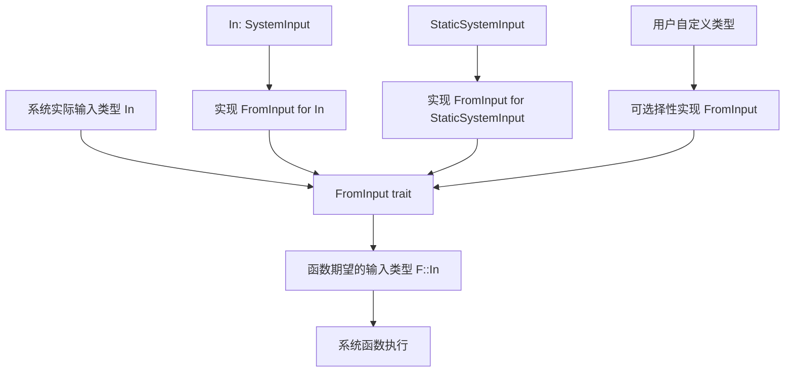

+++
title = "#21917 More flexible SystemInput"
date = "2025-12-11T00:00:00"
draft = false
template = "pull_request_page.html"
in_search_index = false

[extra]
current_language = "zh-cn"
available_languages = {"en" = { name = "English", url = "/pull_request/bevy/2025-12/pr-21917-en-20251211" }, "zh-cn" = { name = "中文", url = "/pull_request/bevy/2025-12/pr-21917-zh-cn-20251211" }}
+++

# 更灵活的系统输入：Bevy ECS 中 SystemInput 的兼容性增强

## 基本信息
- **标题**: More flexible SystemInput
- **PR 链接**: https://github.com/bevyengine/bevy/pull/21917
- **作者**: ecoskey
- **状态**: 已合并
- **标签**: C-Feature, A-ECS, S-Ready-For-Final-Review, D-Modest
- **创建时间**: 2025-11-23T20:00:43Z
- **合并时间**: 2025-12-11T01:45:41Z
- **合并者**: alice-i-cecile

## 描述翻译

### 目标

允许接受 `StaticSystemInput` 作为输入的函数，能够被用作接受内部类型作为输入的系统。

### 解决方案

- 添加 FromInput trait，其设计思路与 IntoResult 类似

### 测试

- 代码编译通过
- 在 `input.rs` 中添加了测试用例

---

### 示例展示

<details>
  <summary>点击查看示例</summary>

```rust
    #[test]
    fn compatible_input() {
        fn takes_usize(In(a): In<usize>) -> usize {
            a
        }

        fn takes_static_usize(StaticSystemInput(In(b)): StaticSystemInput<In<usize>>) -> usize {
            b
        }

        assert_is_system::<In<usize>, usize, _>(takes_usize);
        // 测试 StaticSystemInput 是否与其内部类型兼容
        assert_is_system::<In<usize>, usize, _>(takes_static_usize);
    }
```

</details>

## PR 的技术分析

这个 PR 的核心问题是解决 Bevy ECS 系统中输入类型的兼容性问题。在原来的实现中，如果一个系统函数声明接受 `StaticSystemInput<In<usize>>` 作为输入，那么这个函数就无法被用作输入类型为 `In<usize>` 的系统。这种限制在实际开发中会造成不必要的约束，特别是当开发者需要编写更通用的系统函数时。

### 问题根源与约束条件

Bevy ECS 的系统（System）通过 `SystemParamFunction` trait 来定义函数如何作为系统运行。系统的输入类型由 `SystemParamFunction::In` 关联类型定义。在 PR 修改前，系统的实际输入类型必须与函数声明的输入类型完全匹配。这意味着即使 `StaticSystemInput<T>` 本质上只是包装了 `T`，但系统无法自动将 `T` 转换为 `StaticSystemInput<T>`。

具体来说，如果开发者有这样的函数：

```rust
fn takes_static_usize(StaticSystemInput(In(b)): StaticSystemInput<In<usize>>) -> usize {
    b
}
```

这个函数无法被用作输入类型为 `In<usize>` 的系统，因为编译器会认为类型不匹配。

### 解决方案：FromInput trait

为了解决这个问题，作者引入了 `FromInput` trait，其设计思路与现有的 `IntoResult` trait 相似。`FromInput` trait 定义了一个类型如何从系统输入的内部表示构造出来：

```rust
pub trait FromInput<In: SystemInput>: SystemInput {
    fn from_inner<'i>(inner: In::Inner<'i>) -> Self::Inner<'i>;
}
```

这个 trait 有两个关键实现：
1. 对于任何 `In: SystemInput`，`In` 本身可以实现 `FromInput<In>`，这是自反的情况
2. 对于 `StaticSystemInput<'a, In>`，它也实现了 `FromInput<In>`，这解决了核心问题

通过这个 trait，系统现在可以接受任何"兼容"的输入类型，而不仅仅是完全匹配的类型。这里的兼容性定义为：如果类型 `T` 实现了 `FromInput<U>`，那么一个声明接受 `T` 作为输入的系统，实际上可以接受 `U` 作为输入。

### 实现细节与架构调整

在实现上，这个改动涉及多个文件，但核心修改集中在几个关键位置：

1. **`input.rs`**：定义了 `FromInput` trait 及其实现
2. **`function_system.rs`**：修改了 `FunctionSystem` 和相关 trait 实现来使用新的 `FromInput` 约束
3. **`set.rs`**：更新了系统集的实现以反映新的泛型参数

最显著的变化是 `FunctionSystem` 结构体增加了一个新的泛型参数 `In`：

```rust
// 之前：
pub struct FunctionSystem<Marker, Out, F>

// 之后：
pub struct FunctionSystem<Marker, In, Out, F>
```

这个新增的 `In` 参数代表了系统实际接受的输入类型，而函数本身可能声明接受一个与之兼容的不同类型（通过 `FromInput` trait）。

在 `function_system.rs` 中，系统执行的关键修改是在 `run` 方法中添加了输入转换：

```rust
let input = F::In::from_inner(input);
```

这一行代码使用 `FromInput::from_inner` 将实际输入转换为函数期望的输入类型。这使得系统能够自动处理输入类型的转换。

### 技术洞察与设计考量

这个实现展示了几个重要的设计模式：

1. **Trait 解耦**：通过添加 `FromInput` trait，将输入类型的兼容性逻辑从核心系统逻辑中分离出来。这与 Rust 中常见的通过 trait 实现灵活性的模式一致。

2. **向后兼容**：实现确保现有代码继续工作，因为所有现有类型都通过 `impl<In: SystemInput> FromInput<In> for In` 实现了自反的 `FromInput`。

3. **类型系统安全**：整个转换过程在编译时验证，没有运行时代价。`FromInput::from_inner` 方法通常是内联的，不会引入性能开销。

4. **可扩展性**：其他开发者可以为自己的类型实现 `FromInput` trait，实现自定义的输入类型兼容性。

### 实际影响与使用场景

这个改动的主要影响是增加了系统的灵活性。现在，开发者可以编写接受 `StaticSystemInput` 作为输入的系统，这些系统仍然可以被用作普通系统。这在以下场景中特别有用：

1. **系统组合**：当组合多个系统时，输入类型的兼容性减少了类型转换的样板代码。

2. **通用系统函数**：编写更通用的系统函数，这些函数可以接受多种形式的输入。

3. **API 设计**：库作者可以设计更灵活的 API，允许用户以多种方式提供输入。

测试用例清晰地展示了这种兼容性：

```rust
// 这个函数现在可以被用作 In<usize> 类型的系统
fn takes_static_usize(StaticSystemInput(b): StaticSystemInput<In<usize>>) -> usize {
    b
}
```

### 迁移指南

PR 包含了一个迁移指南，解释了 `FunctionSystem` 泛型参数的变化。对于大多数用户，这个变化是透明的，因为现有代码仍然可以工作。只有编写高度泛型代码的用户可能需要添加相应的 trait bound：

```rust
// 如果用户代码涉及到 FunctionSystem 的泛型参数
// 现在需要添加 In 参数和 FromInput bound
```

## 可视化表示



## 关键文件变更

### `crates/bevy_ecs/src/system/input.rs` (+40/-1)
1. **变更描述**：添加了 `FromInput` trait 及其实现，这是 PR 的核心功能
2. **关键代码**：
```rust
// 新增的 FromInput trait
pub trait FromInput<In: SystemInput>: SystemInput {
    fn from_inner<'i>(inner: In::Inner<'i>) -> Self::Inner<'i>;
}

// 为所有 SystemInput 类型实现自反的 FromInput
impl<In: SystemInput> FromInput<In> for In {
    #[inline]
    fn from_inner<'i>(inner: In::Inner<'i>) -> Self::Inner<'i> {
        inner
    }
}

// 为 StaticSystemInput 实现 FromInput，实现与内部类型的兼容性
impl<'a, In: SystemInput> FromInput<In> for StaticSystemInput<'a, In> {
    #[inline]
    fn from_inner<'i>(inner: In::Inner<'i>) -> Self::Inner<'i> {
        inner
    }
}
```
3. **与 PR 目标的关系**：这是实现输入类型兼容性的基础机制

### `crates/bevy_ecs/src/system/function_system.rs` (+65/-47)
1. **变更描述**：修改 `FunctionSystem` 和相关 trait 实现以支持新的 `FromInput` trait
2. **关键代码**：
```rust
// FunctionSystem 结构体新增 In 泛型参数
pub struct FunctionSystem<Marker, In, Out, F>

// 在系统执行时进行输入转换
let input = F::In::from_inner(input);

// 更新 IntoSystem 实现以包含 FromInput bound
impl<Marker, In, Out, F> IntoSystem<In, Out, (IsFunctionSystem, Marker)> for F
where
    Marker: 'static,
    In: SystemInput + 'static,
    Out: 'static,
    F: SystemParamFunction<Marker, In: FromInput<In>, Out: IntoResult<Out>>,
{
    type System = FunctionSystem<Marker, In, Out, F>;
    // ...
}
```
3. **与 PR 目标的关系**：这是将 `FromInput` trait 集成到系统执行流程中的关键

### `crates/bevy_ecs/src/schedule/set.rs` (+5/-6)
1. **变更描述**：更新系统集的实现以反映 `FunctionSystem` 的新泛型参数
2. **关键代码**：
```rust
// 更新 IntoSystemSet 实现
impl<Marker, F> IntoSystemSet<(IsFunctionSystem, Marker)> for F
where
    Marker: 'static,
    F: SystemParamFunction<Marker, In: FromInput<()>, Out: IntoResult<()>>,
{
    type Set = SystemTypeSet<FunctionSystem<Marker, (), (), F>>;
    // ...
}
```
3. **与 PR 目标的关系**：确保系统集与更新后的 `FunctionSystem` 兼容

### `release-content/migration-guides/function_system_generics.md` (+21/-0)
1. **变更描述**：添加迁移指南，解释 `FunctionSystem` 泛型参数的变化
2. **关键内容**：说明 `FunctionSystem` 现在有四个泛型参数，以及新增的 `FromInput` bound
3. **与 PR 目标的关系**：帮助用户理解 API 变化，特别是编写泛型代码的用户

## 进一步阅读

1. **Bevy ECS 文档**：关于系统输入和参数的详细说明
   - https://bevyengine.org/learn/books/bevy-ecs-docs-0.15

2. **Rust Trait 系统**：理解 trait 如何用于实现类型转换和兼容性
   - 《Rust 程序设计语言》中的 trait 章节

3. **泛型编程模式**：学习如何在 Rust 中设计灵活的泛型 API
   - Rust 设计模式：https://rust-unofficial.github.io/patterns/

4. **Bevy 系统管道**：了解系统如何组合和管道化
   - Bevy 官方示例中的系统管道示例

5. **类型转换 trait**：研究 Rust 中常见的类型转换 trait（如 `From`, `Into`, `TryFrom`）
   - Rust 标准库文档中的相关 trait