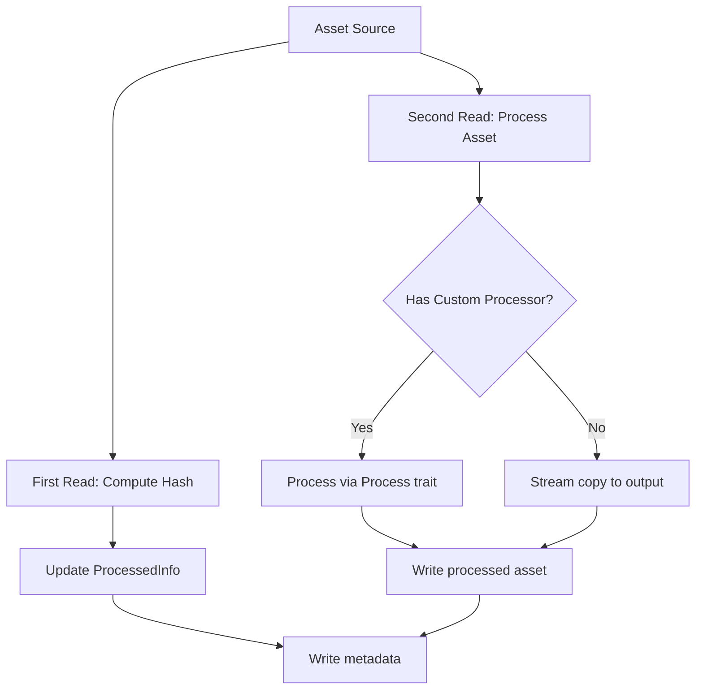

+++
title = "#21925 Avoid reading the entire asset into memory during asset processing."
date = "2025-12-10T00:00:00"
draft = false
template = "pull_request_page.html"
in_search_index = true

[taxonomies]
list_display = ["show"]

[extra]
current_language = "en"
available_languages = {"en" = { name = "English", url = "/pull_request/bevy/2025-12/pr-21925-en-20251210" }, "zh-cn" = { name = "中文", url = "/pull_request/bevy/2025-12/pr-21925-zh-cn-20251210" }}
labels = ["C-Bug", "A-Assets", "C-Performance", "D-Straightforward"]
+++

# Title

## Basic Information
- **Title**: Avoid reading the entire asset into memory during asset processing.
- **PR Link**: https://github.com/bevyengine/bevy/pull/21925
- **Author**: andriyDev
- **Status**: MERGED
- **Labels**: C-Bug, A-Assets, C-Performance, S-Ready-For-Final-Review, D-Straightforward
- **Created**: 2025-11-24T02:40:44Z
- **Merged**: 2025-12-10T00:19:59Z
- **Merged By**: alice-i-cecile

## Description Translation

# Objective

- When processing assets, we first read the whole asset into memory, then process the asset from that in-memory representation. This means that large assets may just not fit into memory causing much bigger issues (e.g., switching over to slow virtual memory).

## Solution

- Read the asset twice during processing: 1) once to determine the asset hash, 2) once to actually process the asset.

This means the processing code itself doesn't need to read the whole asset into memory at any point, meaning we can now process much bigger assets.

However, there are some risks. Asset sources which can't read chunks of an asset - which need to read the whole asset into memory anyway - now have to do so twice (not at the same time though). An example of this kind of asset source is the default Wasm source, or the HTTP asset source. In practice, I don't think this is a big issue - processing is likely to be happening on local assets anyway - it seems unlikely that users will want to download large assets from an HTTP asset source multiple times (which needs to happen any time you start the app, even ignoring this PR).

## Testing

- The processing tests all still pass.

## The Story of This Pull Request

The asset processing system in Bevy had a straightforward but problematic design: it would load entire asset files into memory before processing them. This approach worked well for small assets but created significant issues with large files. When processing multi-gigabyte assets like 3D models, textures, or video files, the system could exhaust available memory, leading to performance degradation from virtual memory swapping or outright failures.

The core issue was in the `AssetProcessor::process_asset` function, which followed a simple sequence: read the asset file entirely into a `Vec<u8>`, compute a hash of those bytes, then pass the entire byte array to the processing logic. While this was convenient for the processing code, it placed an upper limit on the size of assets that could be processed based on available system memory.

The solution required rethinking how asset bytes flow through the processing pipeline. Instead of buffering everything in memory, the system needed to stream assets in chunks. However, there was a complication: asset hashing required reading all bytes, and asset processing also required reading all bytes. The straightforward streaming approach would need to read the asset twice.

The implementation takes a pragmatic approach. First, the `get_asset_hash` function in `meta.rs` was modified to accept an async `Reader` instead of a byte slice. It now reads the asset in fixed-size chunks (using Blake3's `CHUNK_LEN` as the buffer size), updating the hash incrementally:

```rust
pub(crate) async fn get_asset_hash(
    meta_bytes: &[u8],
    asset_reader: &mut impl Reader,
) -> Result<AssetHash, AssetReaderError> {
    let mut hasher = blake3::Hasher::new();
    hasher.update(meta_bytes);
    let mut buffer = [0; blake3::CHUNK_LEN];
    loop {
        let bytes_read = asset_reader.read(&mut buffer).await?;
        hasher.update(&buffer[..bytes_read]);
        if bytes_read < buffer.len() {
            break;
        }
    }
    Ok(*hasher.finalize().as_bytes())
}
```

This change alone doesn't solve the memory issue because the processing code still expected the full byte array. The key insight was that the `ProcessContext`, which provides data to asset processors, could be modified to provide a `Reader` instead of a byte slice. This allows processors to stream the asset if they choose, or read it entirely into memory if they need random access.

In `processor/mod.rs`, the `process_asset` function was restructured to create two separate readers: one for hashing and one for processing. The code comments acknowledge the trade-off: "this means that we're performing two reads for the same file (but we avoid having to load the whole file into memory)." For local file systems, this is generally acceptable since disk I/O is relatively fast. For remote sources like HTTP, this could mean downloading the asset twice, but the PR author argues this is acceptable since asset processing typically happens with local files during development or build time.

The `ProcessContext` struct in `processor/process.rs` was updated to hold a `Box<dyn Reader>` instead of a byte slice reference:

```rust
pub struct ProcessContext<'a> {
    processor: &'a AssetProcessor,
    path: &'a AssetPath<'static>,
    reader: Box<dyn Reader + 'a>,
    new_processed_info: &'a mut ProcessedInfo,
}
```

The `asset_bytes()` method was replaced with `asset_reader()` which returns a mutable reference to the reader. This change required updating all existing `Process` implementations, which is why a migration guide was added.

When an asset doesn't need custom processing (i.e., it uses a `()` processor), the system now streams directly from the reader to the writer without buffering:

```rust
futures_lite::io::copy(&mut reader_for_process, &mut writer)
    .await
    .map_err(|err| ProcessError::AssetWriterError {
        path: asset_path.clone_owned(),
        err: err.into(),
    })?;
```

This change represents a shift from a memory-centric to a streaming-centric design. The performance characteristics change from being memory-bound to being I/O-bound, which is generally more predictable and scalable. Large assets that previously couldn't be processed can now be handled, albeit with potentially longer processing times due to multiple disk reads.

The trade-offs are clearly documented: assets from sources that don't support streaming (like HTTP or Wasm) will be downloaded twice. However, the assumption is that asset processing typically happens with local files during development or build processes, not with remote assets at runtime. If this assumption proves incorrect, future optimizations could include caching mechanisms or source-specific optimizations.

This change also demonstrates good API design practice: the migration from `asset_bytes()` to `asset_reader()` maintains backward compatibility in spirit while enabling new capabilities. Processors that need the entire asset in memory can still call `read_to_end()` on the reader, while processors that can work streamingly can process chunks as they arrive.

## Visual Representation



## Key Files Changed

### `crates/bevy_asset/src/meta.rs`
**What changed**: Modified `get_asset_hash` to accept a `Reader` and compute hash incrementally instead of requiring all bytes in memory.
**Why**: To avoid loading large assets entirely into memory just for hashing.
**Key code**:
```rust
// Before: Required full byte array
pub(crate) fn get_asset_hash(meta_bytes: &[u8], asset_bytes: &[u8]) -> AssetHash

// After: Streams from reader
pub(crate) async fn get_asset_hash(
    meta_bytes: &[u8],
    asset_reader: &mut impl Reader,
) -> Result<AssetHash, AssetReaderError>
```

### `crates/bevy_asset/src/processor/mod.rs`
**What changed**: Restructured asset processing to use two separate reads and avoid buffering the entire asset.
**Why**: To enable processing of assets larger than available memory.
**Key code**:
```rust
// Before: Single read into memory
let mut asset_bytes = Vec::new();
byte_reader.read_to_end(&mut asset_bytes).await?;
let new_hash = get_asset_hash(&meta_bytes, &asset_bytes);

// After: First read for hashing, second for processing
let new_hash = {
    let mut reader_for_hash = reader.read(path).await.map_err(reader_err)?;
    get_asset_hash(&meta_bytes, &mut reader_for_hash).await.map_err(reader_err)?
};
let mut reader_for_process = reader.read(path).await.map_err(reader_err)?;
```

### `crates/bevy_asset/src/processor/process.rs`
**What changed**: Updated `ProcessContext` to hold a `Reader` instead of byte slice, and modified related methods.
**Why**: To allow processors to stream assets rather than requiring full in-memory representation.
**Key code**:
```rust
// Before: Held byte slice
pub struct ProcessContext<'a> {
    asset_bytes: &'a [u8],
}

// After: Holds reader
pub struct ProcessContext<'a> {
    reader: Box<dyn Reader + 'a>,
}

// Method changed from:
pub fn asset_bytes(&self) -> &[u8]

// To:
pub fn asset_reader(&mut self) -> &mut dyn Reader
```

### `release-content/migration-guides/process_trait_changes.md`
**What changed**: Added migration guide for updating `Process` implementations.
**Why**: The API change from `asset_bytes()` to `asset_reader()` requires updates to custom processor code.
**Key content**: Shows how to convert code that used `asset_bytes()` to use `asset_reader()` with `read_to_end()` for backward compatibility.

## Further Reading

- [Bevy Asset System Documentation](https://bevyengine.org/learn/books/unofficial-bevy-book/features/assets/) - Overview of Bevy's asset system
- [Streaming vs Buffering I/O](https://en.wikipedia.org/wiki/Streaming_algorithm) - Concepts of streaming data processing
- [Blake3 Hash Algorithm](https://github.com/BLAKE3-team/BLAKE3) - Cryptographic hash function used by Bevy
- [Async I/O in Rust](https://rust-lang.github.io/async-book/) - Understanding async I/O patterns used in this PR