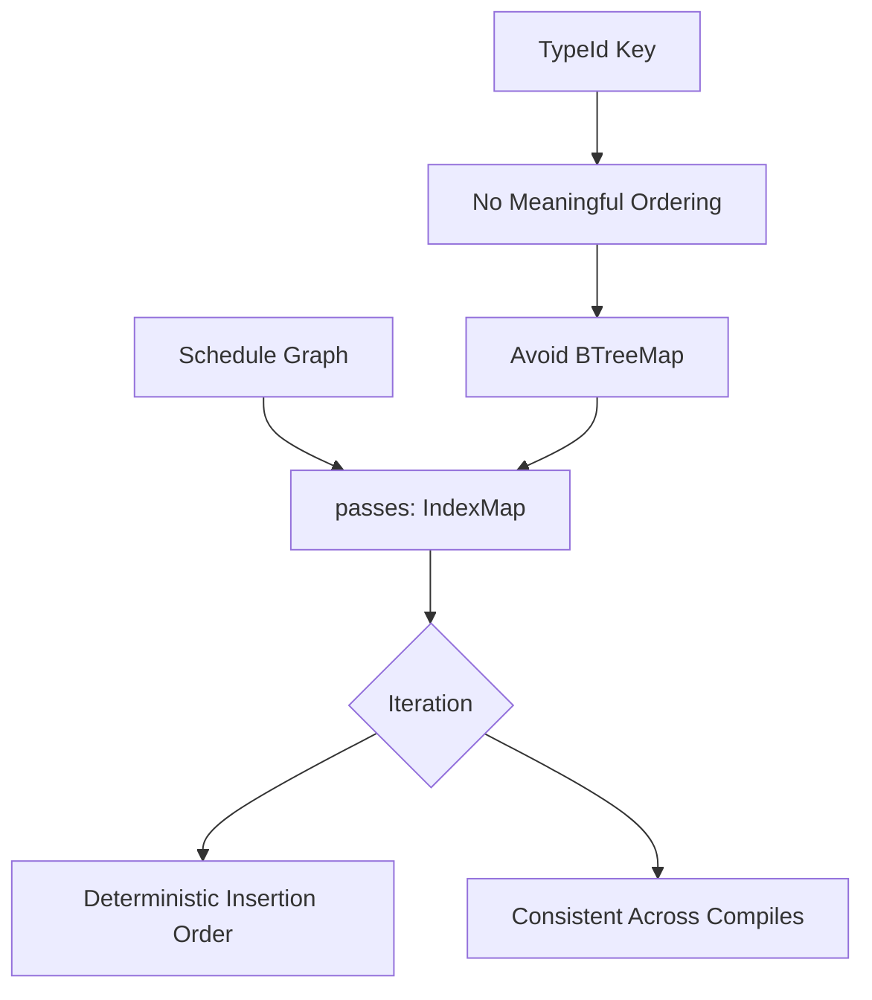

+++
title = "#21930 Replace `BTreeMap` with `IndexMap` for stored `ScheduleBuildPass`es"
date = "2025-12-07T00:00:00"
draft = false
template = "pull_request_page.html"
in_search_index = true

[taxonomies]
list_display = ["show"]

[extra]
current_language = "en"
available_languages = {"en" = { name = "English", url = "/pull_request/bevy/2025-12/pr-21930-en-20251207" }, "zh-cn" = { name = "中文", url = "/pull_request/bevy/2025-12/pr-21930-zh-cn-20251207" }}
labels = ["C-Bug", "A-ECS", "D-Straightforward"]
+++

# Title

## Basic Information
- **Title**: Replace `BTreeMap` with `IndexMap` for stored `ScheduleBuildPass`es
- **PR Link**: https://github.com/bevyengine/bevy/pull/21930
- **Author**: ItsDoot
- **Status**: MERGED
- **Labels**: C-Bug, A-ECS, S-Ready-For-Final-Review, D-Straightforward
- **Created**: 2025-11-24T08:43:19Z
- **Merged**: 2025-12-07T23:13:05Z
- **Merged By**: mockersf

## Description Translation

# Objective

- Part of #20115

We currently store schedule build passes as a `BTreeMap<TypeId, _>`; however `TypeId` doesn't have a useful ordering for us, and is subject to change across compiles.

## Solution

Switch to a `IndexMap<TypeId, _>`, so we can iterate in insertion order instead.

## Testing

Added a test to ensure consistent iteration order.

## The Story of This Pull Request

This PR addresses a subtle issue in Bevy's Entity Component System (ECS) schedule building mechanism. The problem centers around how schedule build passes are stored and iterated over during schedule construction.

In the Bevy ECS architecture, schedules are built using a collection of `ScheduleBuildPass` objects that modify the schedule graph. These passes are stored in a data structure keyed by their `TypeId`. The original implementation used a `BTreeMap<TypeId, Box<dyn ScheduleBuildPassObj>>` for this purpose. This choice was problematic because `TypeId` doesn't provide meaningful ordering for the application's logic—its ordering is arbitrary and can change between different compilation runs.

The issue became apparent when considering that build pass execution order matters. Different execution orders could potentially lead to different schedule structures, and with `TypeId` ordering being non-deterministic across compiles, this introduced an unwanted source of non-determinism in schedule building.

The developer addressed this by switching from `BTreeMap` to `IndexMap<TypeId, _, FixedHasher>`. `IndexMap` is a hash map that maintains insertion order, which provides two key benefits: deterministic iteration order based on when passes were added, and faster average lookup times compared to `BTreeMap`'s O(log n) operations.

The implementation required several coordinated changes. First, imports were updated to remove `BTreeMap` and add `IndexMap` and `FixedHasher`. The `FixedHasher` ensures consistent hashing behavior. Second, the `passes` field in the `ScheduleGraph` struct was changed from `BTreeMap` to `IndexMap`. Third, the `remove_build_pass` method was updated to use `shift_remove` instead of `remove`, since `IndexMap` has different API semantics for removal.

A key insight here is that while `BTreeMap` provides sorted iteration, that sorting wasn't useful for `TypeId` keys. What mattered more was predictable, deterministic iteration order, which `IndexMap` provides through insertion-order preservation. This change aligns with common patterns in game engine development where deterministic behavior is valued for debugging, testing, and multiplayer synchronization.

The developer added a comprehensive test to validate the iteration order behavior. The test creates multiple build pass types with different generic parameters, adds them in a specific order, and then verifies that they iterate in that same order. This test ensures that the default `AutoInsertApplyDeferredPass` always comes first, followed by user-added passes in insertion order.

## Visual Representation



## Key Files Changed

### `crates/bevy_ecs/src/schedule/schedule.rs` (+64/-6)

This file contains the core schedule implementation in Bevy's ECS. The changes primarily affect how schedule build passes are stored and managed.

**Key Changes:**

1. **Import Updates**:
```rust
// Before:
use alloc::collections::{BTreeMap, BTreeSet};

// After:
use alloc::collections::BTreeSet;
use bevy_platform::hash::FixedHasher;
use indexmap::IndexMap;
```

2. **Data Structure Change in ScheduleGraph**:
```rust
// Before:
passes: BTreeMap<TypeId, Box<dyn ScheduleBuildPassObj>>,

// After:
passes: IndexMap<TypeId, Box<dyn ScheduleBuildPassObj>, FixedHasher>,
```

3. **Method Update for Removal**:
```rust
// Before:
pub fn remove_build_pass<T: ScheduleBuildPass>(&mut self) {
    self.graph.passes.remove(&TypeId::of::<T>());
}

// After:
pub fn remove_build_pass<T: ScheduleBuildPass>(&mut self) {
    self.graph.passes.shift_remove(&TypeId::of::<T>());
}
```

4. **New Test Added**:
The test `build_pass_iteration_order` creates multiple generic build pass types, adds them in sequence, and verifies they iterate in insertion order:
```rust
#[test]
fn build_pass_iteration_order() {
    #[derive(Debug)]
    struct Pass<const N: usize>;
    
    impl<const N: usize> ScheduleBuildPass for Pass<N> {
        // Implementation details...
    }
    
    let mut schedule = Schedule::default();
    schedule.add_build_pass(Pass::<0>);
    schedule.add_build_pass(Pass::<1>);
    schedule.add_build_pass(Pass::<2>);
    
    let pass_order: Vec<TypeId> = schedule.graph().passes.keys().cloned().collect();
    
    assert_eq!(
        pass_order,
        vec![
            TypeId::of::<AutoInsertApplyDeferredPass>(),
            TypeId::of::<Pass<0>>(),
            TypeId::of::<Pass<1>>(),
            TypeId::of::<Pass<2>>()
        ]
    );
}
```

## Further Reading

- [Bevy ECS Schedule Documentation](https://docs.rs/bevy_ecs/latest/bevy_ecs/schedule/index.html)
- [IndexMap Crate Documentation](https://docs.rs/indexmap/latest/indexmap/)
- [Rust TypeId Documentation](https://doc.rust-lang.org/std/any/struct.TypeId.html)
- [Determinism in Game Engines](https://gafferongames.com/post/deterministic_lockstep/)
- [BTreeMap vs HashMap Performance Characteristics](https://github.com/rust-lang/hashbrown#performance)