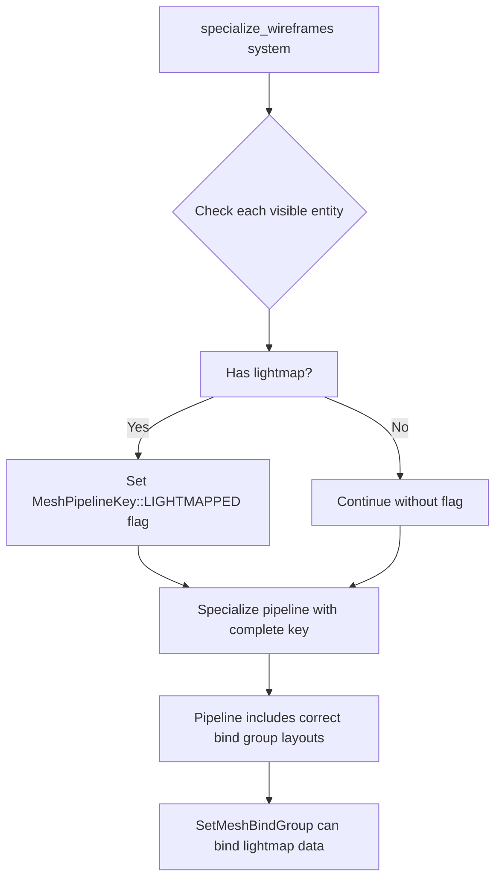

+++
title = "#21942 Add `MeshPipelineKey::LIGHTMAPPED` as applicable during the wireframe pass"
date = "2025-12-10T00:00:00"
draft = false
template = "pull_request_page.html"
in_search_index = true

[taxonomies]
list_display = ["show"]

[extra]
current_language = "en"
available_languages = {"en" = { name = "English", url = "/pull_request/bevy/2025-12/pr-21942-en-20251210" }, "zh-cn" = { name = "中文", url = "/pull_request/bevy/2025-12/pr-21942-zh-cn-20251210" }}
labels = ["C-Bug", "A-Rendering", "D-Straightforward"]
+++

# Title

## Basic Information
- **Title**: Add `MeshPipelineKey::LIGHTMAPPED` as applicable during the wireframe pass
- **PR Link**: https://github.com/bevyengine/bevy/pull/21942
- **Author**: mgi388
- **Status**: MERGED
- **Labels**: C-Bug, A-Rendering, S-Ready-For-Final-Review, D-Straightforward
- **Created**: 2025-11-25T23:54:19Z
- **Merged**: 2025-12-10T00:19:59Z
- **Merged By**: alice-i-cecile

## Description Translation
Fixes #21899. See that issue for details but this is the same sort of fix done by @pcwalton in #11910.

## The Story of This Pull Request

The pull request addresses a specific rendering bug that occurs when using wireframe mode on meshes with lightmaps. The issue (#21899) documents a scenario where enabling wireframe rendering for lightmapped meshes causes a panic because the pipeline specialization doesn't include the necessary bind group layouts.

Looking at the problem, the root cause is in how pipeline specialization works in Bevy's renderer. When a mesh is lightmapped, the `SetMeshBindGroup` render command requires additional bind group layout entries for the lightmap data. The `MeshPipelineKey` tracks which features are active for a given mesh, and one of these flags is `LIGHTMAPPED`, which tells the pipeline builder to include the lightmap bind group layout.

In the regular mesh rendering pipeline, this key is properly set when a mesh has lightmaps. However, in the wireframe rendering pass, the code wasn't checking for lightmaps and therefore wasn't setting the `LIGHTMAPPED` flag. This mismatch means that when the wireframe pipeline is specialized for a lightmapped mesh, it doesn't include the bind group layout that `SetMeshBindGroup` expects to use for binding lightmap data, leading to a panic at runtime.

The solution is straightforward: during wireframe pipeline specialization, we need to check if the entity being rendered has lightmaps and, if so, set the `LIGHTMAPPED` flag in the mesh pipeline key. This ensures the wireframe pipeline includes the appropriate bind group layouts, even though the wireframe shader itself doesn't use the lightmap data.

This fix follows the same pattern as a previous fix (#11910 by @pcwalton) which addressed a similar issue for another mesh feature. The consistency in approach demonstrates that this is an established pattern for handling mesh feature flags during pipeline specialization.

The implementation requires adding a system parameter to access the `RenderLightmaps` resource, which contains the mapping from entities to their lightmap data. For each visible entity during wireframe specialization, we check if it exists in the `render_lightmaps.render_lightmaps` map, and if so, set the `MeshPipelineKey::LIGHTMAPPED` flag.

One important insight from the code comment is that even though the wireframe shader doesn't use lightmap data, the `SetMeshBindGroup` command still binds it, so the pipeline must have the appropriate bind group layout entries. This highlights how the renderer's architecture separates data binding from data usage - bind groups must be set up correctly even if not all shaders in a pipeline use all bound resources.

The fix is minimal and focused, affecting only 16 lines added and 3 lines changed in a single file. It doesn't change the wireframe shader or how wireframes are rendered visually; it only ensures the pipeline has the correct bind group layouts to avoid runtime panics when rendering wireframes on lightmapped meshes.

From an engineering perspective, this fix demonstrates good attention to edge cases in rendering pipelines. The wireframe pass needs to handle all the same mesh features as the regular rendering pass, even if those features aren't visually used in wireframe mode, because the underlying render command infrastructure expects consistent bind group layouts.

## Visual Representation



## Key Files Changed

### `crates/bevy_pbr/src/wireframe.rs`

1. **Import Changes**: Added `RenderLightmaps` to the imports to make it available in the specialization system.

```rust
// Before:
use crate::{
    DrawMesh, MeshPipeline, MeshPipelineKey, RenderMeshInstanceFlags, RenderMeshInstances,
    SetMeshBindGroup, SetMeshViewBindGroup, SetMeshViewBindingArrayBindGroup, ViewKeyCache,
    ViewSpecializationTicks,
};

// After:
use crate::{
    DrawMesh, MeshPipeline, MeshPipelineKey, RenderLightmaps, RenderMeshInstanceFlags,
    RenderMeshInstances, SetMeshBindGroup, SetMeshViewBindGroup, SetMeshViewBindingArrayBindGroup,
    ViewKeyCache, ViewSpecializationTicks,
};
```

2. **System Parameter Addition**: Added `render_lightmaps: Res<RenderLightmaps>` to the `specialize_wireframes` system to access lightmap data.

```rust
// Before:
pub fn specialize_wireframes(
    mut pipelines: ResMut<SpecializedMeshPipelines<Wireframe3dPipeline>>,
    pipeline: Res<Wireframe3dPipeline>,
    pipeline_cache: Res<PipelineCache>,
    ticks: SystemChangeTick,
) {

// After:
pub fn specialize_wireframes(
    mut pipelines: ResMut<SpecializedMeshPipelines<Wireframe3dPipeline>>,
    pipeline: Res<Wireframe3dPipeline>,
    pipeline_cache: Res<PipelineCache>,
    render_lightmaps: Res<RenderLightmaps>,
    ticks: SystemChangeTick,
) {
```

3. **Lightmap Check Logic**: Added code to check if an entity has lightmaps and set the `LIGHTMAPPED` flag accordingly.

```rust
// Added code:
// Even though we don't use the lightmap in the wireframe, the
// `SetMeshBindGroup` render command will bind the data for it. So
// we need to include the appropriate flag in the mesh pipeline key
// to ensure that the necessary bind group layout entries are
// present.
if render_lightmaps
    .render_lightmaps
    .contains_key(visible_entity)
{
    mesh_key |= MeshPipelineKey::LIGHTMAPPED;
}
```

These changes ensure that when wireframe pipelines are specialized for lightmapped meshes, they include the necessary bind group layouts for lightmap data, preventing runtime panics when the `SetMeshBindGroup` command tries to bind lightmap resources.

## Further Reading

1. **Bevy Rendering Architecture**: Understanding how Bevy's renderer works with pipelines, bind groups, and specialization is key. The [Bevy Render Book](https://bevy-cheatbook.github.io/programming/render.html) provides a good starting point.

2. **Pipeline Specialization**: The concept of pipeline specialization in graphics APIs like Vulkan/Metal/D3D12, where pipelines are created with specific configurations. Bevy abstracts this with its `SpecializedMeshPipelines` system.

3. **Bind Groups and Layouts**: How modern graphics APIs use bind groups (descriptor sets in Vulkan) to make resources available to shaders, and why the layout must match between pipeline creation and resource binding.

4. **Issue #21899**: The original bug report provides context on the specific error case and reproduction steps.

5. **PR #11910**: The previous fix that established the pattern for handling mesh feature flags during pipeline specialization, mentioned as a reference in this PR.