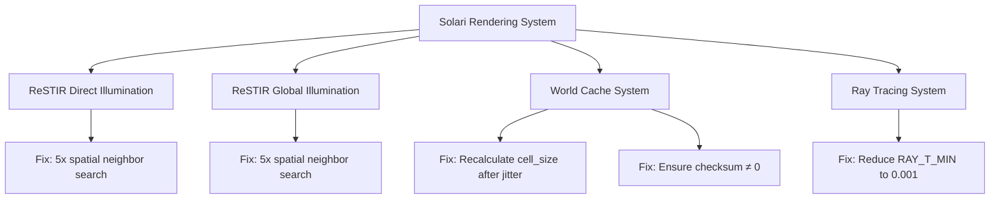

+++
title = "#21953 Solari: Misc improvements"
date = "2025-12-08T00:00:00"
draft = false
template = "pull_request_page.html"
in_search_index = true

[taxonomies]
list_display = ["show"]

[extra]
current_language = "en"
available_languages = {"en" = { name = "English", url = "/pull_request/bevy/2025-12/pr-21953-en-20251208" }, "zh-cn" = { name = "中文", url = "/pull_request/bevy/2025-12/pr-21953-zh-cn-20251208" }}
labels = ["A-Rendering", "C-Refinement"]
+++

# Title

## Basic Information
- **Title**: Solari: Misc improvements
- **PR Link**: https://github.com/bevyengine/bevy/pull/21953
- **Author**: JMS55
- **Status**: MERGED
- **Labels**: A-Rendering, S-Ready-For-Final-Review, C-Refinement
- **Created**: 2025-11-27T04:48:25Z
- **Merged**: 2025-12-07T23:57:22Z
- **Merged By**: james7132

## Description
* Search for a spatial neighbor up to 5 times for ReSTIR instead of just once.
* Bump RAY_T_MIN to 0.001. Prevents artifacts and doesn't really cause more self intersections.
* Re-calculate world cache cell_size after jittering the query position to prevent creating extra cells at the wrong LOD for a given position.
* Prevent the unlikely event of something checksumming to 0, which is reserved for empty cells.

## The Story of This Pull Request

This PR addresses four distinct but related issues in Bevy's Solari rendering system, each affecting different aspects of the real-time global illumination (ReSTIR GI) and direct illumination (ReSTIR DI) pipelines. The changes focus on improving robustness, reducing visual artifacts, and fixing edge cases in the rendering algorithms.

The first issue involves spatial neighbor selection in the ReSTIR algorithm. Previously, both the GI and DI implementations would sample exactly one neighboring pixel to reuse illumination data. This approach had a significant flaw: if the randomly selected neighbor was on a different surface (determined by depth, position, and normal similarity checks), the algorithm would simply return an empty reservoir, wasting an opportunity to reuse valid illumination data. The solution replaces this single-try approach with a loop that attempts up to 5 random neighbors. This simple but effective change increases the probability of finding a valid spatial neighbor, reducing noise and improving temporal stability in the rendered output. Both the GI and DI shaders now share this improved logic, though they handle the returned data slightly differently due to their specific requirements.

The second change addresses ray tracing precision. The `RAY_T_MIN` constant controls the minimum distance a ray can travel before hitting a surface, which helps prevent self-intersection artifacts. The original value of 0.01 was found to be too large in practice, causing artifacts in certain scenarios. The PR reduces this to 0.001, providing better precision while maintaining protection against self-intersection. This adjustment demonstrates the importance of tuning such constants based on real-world testing rather than theoretical assumptions.

The third fix corrects a subtle bug in the world cache query system. When querying the world cache for illumination data, the algorithm applies jitter to the world position to avoid aliasing artifacts. However, the cell size (which determines the level of detail for cache lookups) was being calculated using the original position before jittering. This could cause the system to create cache cells at incorrect LODs, potentially wasting memory or reducing cache efficiency. The fix recalculates the cell size after applying jitter, ensuring the cache operates at the correct resolution for the actual query point.

The final change handles an edge case in the world cache checksum calculation. The hash function could theoretically produce a value of 0, which is reserved to indicate empty cache cells. While statistically unlikely, this could cause valid cache entries to be incorrectly treated as empty. The fix adds a `max(key, 1u)` to ensure the checksum never returns 0, preserving the semantic meaning of this special value.

Together, these changes represent pragmatic improvements to the rendering system's reliability and visual quality. They demonstrate the iterative refinement process common in graphics programming, where small adjustments to algorithms and constants can have noticeable impacts on output quality and system robustness.

## Visual Representation



## Key Files Changed

### `crates/bevy_solari/src/realtime/restir_di.wgsl` (+15/-11)
This file implements ReSTIR Direct Illumination. The key change replaces a single spatial neighbor lookup with a loop that attempts up to 5 random neighbors.

```wgsl
// Before: Single attempt
fn load_spatial_reservoir(pixel_id: vec2<u32>, depth: f32, world_position: vec3<f32>, world_normal: vec3<f32>, rng: ptr<function, u32>) -> Reservoir {
    let spatial_pixel_id = get_neighbor_pixel_id(pixel_id, rng);

    let spatial_depth = textureLoad(depth_buffer, spatial_pixel_id, 0);
    let spatial_surface = gpixel_resolve(textureLoad(gbuffer, spatial_pixel_id, 0), spatial_depth, spatial_pixel_id, view.main_pass_viewport.zw, view.world_from_clip);
    if pixel_dissimilar(depth, world_position, spatial_surface.world_position, world_normal, spatial_surface.world_normal, view) {
        return empty_reservoir();
    }

    return load_reservoir_b(spatial_pixel_id);
}

// After: Up to 5 attempts
fn load_spatial_reservoir(pixel_id: vec2<u32>, depth: f32, world_position: vec3<f32>, world_normal: vec3<f32>, rng: ptr<function, u32>) -> Reservoir {
    for (var i = 0u; i < 5u; i++) {
        let spatial_pixel_id = get_neighbor_pixel_id(pixel_id, rng);

        let spatial_depth = textureLoad(depth_buffer, spatial_pixel_id, 0);
        let spatial_surface = gpixel_resolve(textureLoad(gbuffer, spatial_pixel_id, 0), spatial_depth, spatial_pixel_id, view.main_pass_viewport.zw, view.world_from_clip);
        if pixel_dissimilar(depth, world_position, spatial_surface.world_position, world_normal, spatial_surface.world_normal, view) {
            continue;
        }

        return load_reservoir_b(spatial_pixel_id);
    }

    return empty_reservoir();
}
```

### `crates/bevy_solari/src/realtime/restir_gi.wgsl` (+10/-6)
Similar to the DI shader, this file implements ReSTIR Global Illumination with the same spatial neighbor search improvement.

```wgsl
// After: Up to 5 attempts with GI-specific return structure
fn load_spatial_reservoir(pixel_id: vec2<u32>, depth: f32, world_position: vec3<f32>, world_normal: vec3<f32>, rng: ptr<function, u32>) -> NeighborInfo {
    for (var i = 0u; i < 5u; i++) {
        let spatial_pixel_id = get_neighbor_pixel_id(pixel_id, rng);

        let spatial_depth = textureLoad(depth_buffer, spatial_pixel_id, 0);
        let spatial_surface = gpixel_resolve(textureLoad(gbuffer, spatial_pixel_id, 0), spatial_depth, spatial_pixel_id, view.main_pass_viewport.zw, view.world_from_clip);
        let spatial_diffuse_brdf = spatial_surface.material.base_color / PI;
        if pixel_dissimilar(depth, world_position, spatial_surface.world_position, world_normal, spatial_surface.world_normal, view) {
            continue;
        }

        let spatial_pixel_index = spatial_pixel_id.x + spatial_pixel_id.y * u32(view.main_pass_viewport.z);
        var spatial_reservoir = gi_reservoirs_b[spatial_pixel_index];

        spatial_reservoir.radiance *= trace_point_visibility(world_position, spatial_reservoir.sample_point_world_position);

        return NeighborInfo(spatial_reservoir, spatial_surface.world_position, spatial_surface.world_normal, spatial_diffuse_brdf);
    }

    return NeighborInfo(empty_reservoir(), world_position, world_normal, vec3(0.0));
}
```

### `crates/bevy_solari/src/realtime/world_cache_query.wgsl` (+3/-2)
This file contains two important fixes for the world cache system.

```wgsl
// Fix 1: Recalculate cell_size after jittering
fn query_world_cache(world_position: vec3<f32>, world_normal: vec3<f32>, view_position: vec3<f32>, cell_lifetime: u32, rng: ptr<function, u32>) -> vec3<f32> {
    var cell_size = get_cell_size(world_position, view_position);  // Changed from 'let' to 'var'

    // https://tomclabault.github.io/blog/2025/regir, jitter_world_position_tangent_plane
    let TBN = orthonormalize(world_normal);
    let offset = (rand_vec2f(rng) * 2.0 - 1.0) * cell_size * 0.5;
    let jittered_position = world_position + offset.x * TBN[0] + offset.y * TBN[1];
    cell_size = get_cell_size(jittered_position, view_position);  // Added recalculation

    // ... rest of function
}

// Fix 2: Prevent checksum from returning 0
fn compute_checksum(world_position: vec3<u32>, world_normal: vec3<u32>) -> u32 {
    var key = pcg_hash(world_position.x);
    key = iqint_hash(key + world_position.y);
    key = iqint_hash(key + world_position.z);
    key = iqint_hash(key + world_normal.x);
    key = iqint_hash(key + world_normal.y);
    key = iqint_hash(key + world_normal.z);
    return max(key, 1u); // 0u is reserved for WORLD_CACHE_EMPTY_CELL
}
```

### `crates/bevy_solari/src/scene/raytracing_scene_bindings.wgsl` (+1/-1)
This file contains a simple but important constant adjustment.

```wgsl
// Before:
const RAY_T_MIN = 0.01f;

// After:
const RAY_T_MIN = 0.001f;
```

## Further Reading

1. **ReSTIR Algorithm**: The original paper "Spatio-temporal reservoir resampling for real-time ray tracing with dynamic direct lighting" by Bitterli et al. provides the theoretical foundation for these implementations.

2. **World Cache Systems**: For background on world cache and level-of-detail systems in real-time rendering, "Real-Time Rendering" by Akenine-Möller et al. covers relevant concepts.

3. **Ray Tracing Precision**: NVIDIA's "Ray Tracing Gems" series discusses practical considerations for ray tracing constants like `RAY_T_MIN` and techniques for avoiding self-intersection artifacts.

4. **Hash Functions in Graphics**: The PCG hash function used in the checksum is documented in "PCG: A Family of Simple Fast Space-Efficient Statistically Good Algorithms for Random Number Generation" by O'Neill.

5. **Jittering for Anti-Aliasing**: The referenced blog post at https://tomclabault.github.io/blog/2025/regir provides specific context for the jittering technique used in the world cache system.