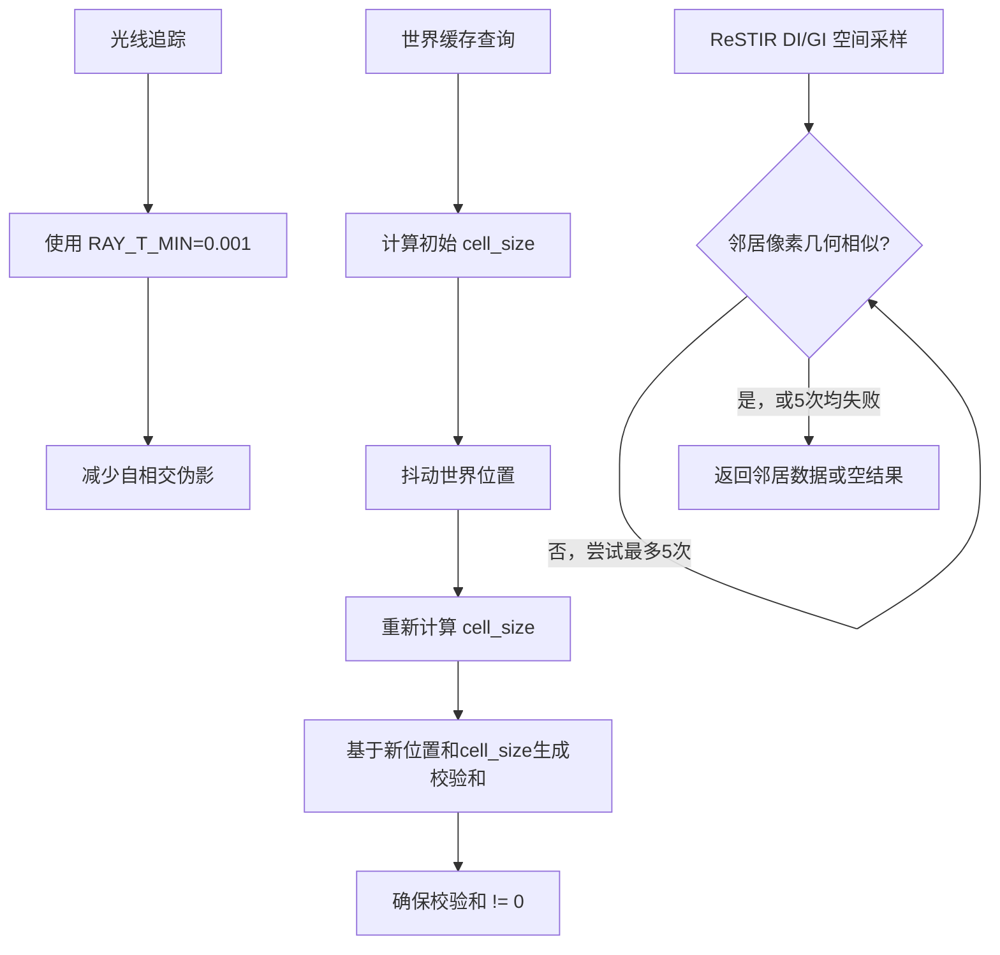

+++
title = "#21953 Solari: Misc improvements"
date = "2025-12-08T00:00:00"
draft = false
template = "pull_request_page.html"
in_search_index = false

[extra]
current_language = "zh-cn"
available_languages = {"en" = { name = "English", url = "/pull_request/bevy/2025-12/pr-21953-en-20251208" }, "zh-cn" = { name = "中文", url = "/pull_request/bevy/2025-12/pr-21953-zh-cn-20251208" }}
labels = ["A-Rendering", "C-Refinement"]
+++

# Solari: Misc improvements

## Basic Information
- **Title**: Solari: Misc improvements 
- **PR Link**: https://github.com/bevyengine/bevy/pull/21953
- **Author**: JMS55
- **Status**: MERGED
- **Labels**: A-Rendering, S-Ready-For-Final-Review, C-Refinement
- **Created**: 2025-11-27T04:48:25Z
- **Merged**: 2025-12-07T23:57:22Z
- **Merged By**: james7132

## Description Translation
Solari模块的多个改进：
* 对于 ReSTIR 算法，最多搜索空间邻居（spatial neighbor）5次，而不是仅1次。
* 将 RAY_T_MIN 增加到 0.001。这可以防止渲染伪影（artifacts），并且不会导致更多的自相交（self intersections）。
* 在抖动（jitter）查询位置后，重新计算世界缓存（world cache）的单元尺寸（cell_size），以防止在错误LOD（Level of Detail）下为给定位置创建额外的单元。
* 防止极低概率的校验和（checksum）计算结果为0的情况，该值被保留用于标识空单元。

## The Story of This Pull Request

这个Pull Request主要围绕Bevy引擎的Solari模块进行了一系列小范围但重要的改进。Solari是Bevy的全局光照（Global Illumination）系统，基于ReSTIR（Resampled Importance Sampling with Temporal and Spatial Reuse）算法实现实时动态光照。这次PR没有引入新功能，而是针对现有实现中可能导致渲染质量下降或潜在错误的边缘情况进行了修复和增强。

首先，PR对ReSTIR算法的空间重采样（spatial resampling）阶段进行了优化。原始实现在为当前像素查找空间邻居（用于共享和重用光照信息）时，仅随机选取一个邻居像素进行测试。如果该邻居在几何上不相似（例如，位于不同的表面或过远），算法将直接放弃本次空间重用机会，返回一个空的结果集。这在实践中降低了空间重采样的有效性，尤其是在噪点较多或几何不连续的区域。改进后的逻辑现在会进行最多5次尝试：循环中随机选择邻居像素，检查几何相似性，如果相似则使用该邻居的数据；如果不相似，则继续尝试下一个随机邻居。只有在连续5次尝试都失败后，才会返回空结果。这一改动显著提高了算法找到有效空间邻居的概率，从而提升了最终渲染图像的稳定性和质量。

第二项改进是调整了光线追踪（ray tracing）的初始参数。`RAY_T_MIN` 定义了从光线原点出发的最小有效距离，用于避免光线与自身发射表面发生自相交（self-intersection）导致的渲染伪影。原值`0.01`在某些情况下可能偏大，导致光线在靠近表面时过早地被截断，从而丢失本应采集到的光照信息，形成暗斑或黑点。将其减小到`0.001`能够在绝大多数场景下更好地避免自相交，同时由于现代GPU光线追踪的精度足够高，进一步减小该值并不会引入显著的性能开销或新的自相交问题。这是一个基于经验的参数调优。

第三项和第四项改进涉及世界缓存（World Cache）的查询机制。世界缓存用于加速复杂场景的查询，它将空间划分为不同尺寸的单元（Cell）。`get_cell_size`函数根据查询点的世界坐标和观察者位置，动态确定应该使用的单元尺寸（即LOD级别）。在实现中，查询位置会先在一个切平面（Tangent Plane）上进行随机抖动（jitter），以增加采样的多样性。然而，在原始代码中，单元尺寸是在抖动**之前**根据原始位置计算好的。这意味着，抖动后的新位置可能已经落入了另一个本应使用不同尺寸单元的区域内，但后续查询却错误地使用了基于原位置计算的尺寸。这可能导致缓存数据被存储在错误的LOD层级中，影响查询效率和准确性。修复方案很直接：在计算完抖动位置`jittered_position`后，立即基于这个新位置重新计算`cell_size`。这确保了缓存操作的LOD一致性。

最后一项是预防性修复。`compute_checksum`函数通过哈希函数为每个“世界位置+法线”的组合生成一个唯一的键（key），用作缓存的索引。哈希函数`iqint_hash`理论上有可能输出`0`（尽管概率极低）。在系统中，`0`被预定义为`WORLD_CACHE_EMPTY_CELL`，即空单元的标识符。如果一个有效数据的校验和恰好为`0`，它就会被错误地视为空单元，导致数据丢失。解决方法是强制校验和的结果至少为`1`：`return max(key, 1u);`。这是一个简单而健壮（robust）的防御性编程实践，消除了一个潜在的、难以调试的边界情况错误。

总的来说，这个PR体现了对实时渲染算法细节的持续打磨。每一项改动都针对一个具体的技术痛点：通过增加重试次数来提高算法的鲁棒性；通过微调参数来消除视觉伪影；通过修正计算顺序来保证逻辑正确性；通过防御性代码来排除极端情况下的错误。这些改进共同使得Solari渲染器更加稳定和可靠。

## Visual Representation



## Key Files Changed

List the most significant files changed in this PR:
- `crates/bevy_solari/src/realtime/restir_gi.wgsl` (+15/-11)
- `crates/bevy_solari/src/realtime/restir_di.wgsl` (+10/-6)
- `crates/bevy_solari/src/realtime/world_cache_query.wgsl` (+3/-2)
- `crates/bevy_solari/src/scene/raytracing_scene_bindings.wgsl` (+1/-1)

1. **`restir_di.wgsl` & `restir_gi.wgsl`**
    - **目的**：改进ReSTIR算法的空间重采样（Spatial Resampling）步骤，提高找到有效邻居的成功率。
    - **变更**：将单次邻居查找改为循环最多5次查找。
    - **代码差异 (`restir_di.wgsl`)**:
      ```wgsl
      // 之前:
      fn load_spatial_reservoir(...) -> Reservoir {
          let spatial_pixel_id = get_neighbor_pixel_id(pixel_id, rng);
          // ... 检查 dissimilar ...
          if pixel_dissimilar(...) {
              return empty_reservoir();
          }
          return load_reservoir_b(spatial_pixel_id);
      }

      // 之后:
      fn load_spatial_reservoir(...) -> Reservoir {
          for (var i = 0u; i < 5u; i++) {
              let spatial_pixel_id = get_neighbor_pixel_id(pixel_id, rng);
              // ... 检查 dissimilar ...
              if pixel_dissimilar(...) {
                  continue; // 继续尝试，而不是直接返回
              }
              return load_reservoir_b(spatial_pixel_id);
          }
          return empty_reservoir(); // 仅当5次都失败后返回空
      }
      ```
    - **关系**：这是PR描述中的第一项改进，直接影响ReSTIR的渲染质量。

2. **`world_cache_query.wgsl`**
    - **目的**：修复世界缓存查询中，抖动后使用错误LOD的问题；防止校验和冲突。
    - **变更**：
        1. 在位置抖动后重新计算`cell_size`。
        2. 确保`compute_checksum`函数不返回`0`。
    - **代码差异**:
      ```wgsl
      // 之前: (位置抖动部分)
      let cell_size = get_cell_size(world_position, view_position);
      let jittered_position = world_position + ...; // 使用旧的cell_size
      // ... 使用 jittered_position 和 旧的 cell_size 继续 ...

      // 之后:
      var cell_size = get_cell_size(world_position, view_position);
      let jittered_position = world_position + ...;
      cell_size = get_cell_size(jittered_position, view_position); // 关键：重新计算
      // ... 使用 jittered_position 和 新的 cell_size 继续 ...
      ```
      ```wgsl
      // 之前: (校验和部分)
      fn compute_checksum(...) -> u32 {
          // ... 计算 key ...
          return key; // 可能返回0
      }
      // 之后:
      fn compute_checksum(...) -> u32 {
          // ... 计算 key ...
          return max(key, 1u); // 确保不为0
      }
      ```
    - **关系**：对应PR描述中的第三和第四项改进。

3. **`raytracing_scene_bindings.wgsl`**
    - **目的**：微调光线追踪参数以减轻自相交伪影。
    - **变更**：将`RAY_T_MIN`常量从`0.01`减小为`0.001`。
    - **代码差异**:
      ```wgsl
      // 之前:
      const RAY_T_MIN = 0.01f;
      // 之后:
      const RAY_T_MIN = 0.001f;
      ```
    - **关系**：对应PR描述中的第二项改进。

## Further Reading
* **ReSTIR 论文**: ["Spatiotemporal reservoir resampling for real-time ray tracing with dynamic direct lighting"](https://research.nvidia.com/publication/2020-07_spatiotemporal-reservoir-resampling-real-time-ray-tracing-dynamic-direct) - 理解本次PR中改进的算法的原始论文。
* **Bevy 官方文档 - 渲染**: 了解Bevy引擎整体的渲染架构，有助于理解Solari模块的集成方式。
* **全局光照 (Global Illumination) 基础知识**: 理解间接光照、路径追踪等概念，是理解ReSTIR算法价值的前提。
* **WGSL 语言规范**: 由于改动位于着色器代码中，熟悉WebGPU Shading Language有助于深入理解代码细节。