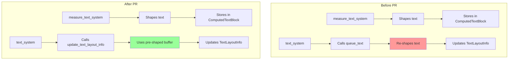

+++
title = "#21966 Don't update the text buffer in `text_system`"
date = "2025-12-06T00:00:00"
draft = false
template = "pull_request_page.html"
in_search_index = true

[taxonomies]
list_display = ["show"]

[extra]
current_language = "en"
available_languages = {"en" = { name = "English", url = "/pull_request/bevy/2025-12/pr-21966-en-20251206" }, "zh-cn" = { name = "中文", url = "/pull_request/bevy/2025-12/pr-21966-zh-cn-20251206" }}
labels = ["C-Performance", "A-UI", "A-Text", "D-Modest"]
+++

# Title

## Basic Information
- **Title**: Don't update the text buffer in `text_system`
- **PR Link**: https://github.com/bevyengine/bevy/pull/21966
- **Author**: ickshonpe
- **Status**: MERGED
- **Labels**: C-Performance, A-UI, S-Ready-For-Final-Review, A-Text, D-Modest
- **Created**: 2025-11-28T13:56:36Z
- **Merged**: 2025-12-06T17:33:42Z
- **Merged By**: mockersf

## Description Translation
# Objective

Text is shaped in `measure_text_system`. When the schedule reaches `text_system` there's no need to reupdate the cosmic-text buffer a second time. `text_system` should only be updating any stale `TextLayoutInfo` components.

## Solution

* Add a new method `update_text_layout_info` to `TextPipeline`. This method updates the given `TextLayoutInfo` without performing any shaping. 
* Call `update_text_layout_info` instead of `queue_text` from `text_system`.
* Only query for `TextFont`, instead of the full `TextUiReader`.

#

The next step is to remove `TextPipeline::queue_text`. I didn't do that here as it's a fairly large refactor and I have a bunch of other open text PRs I'd like to get merged first.

## Testing

#### yellow = this PR, red = main

```
cargo run --example many_glyphs --release --features trace_tracy,debug -- --no-text2d --recompute-text
```


```
cargo run --example many_buttons --release --features trace_tracy,debug -- --text --respawn
```


## The Story of This Pull Request

This PR addresses a performance inefficiency in Bevy's text rendering pipeline where text was being reshaped unnecessarily. The issue stemmed from the division of labor between two text-related systems: `measure_text_system` and `text_system`. 

In the existing architecture, `measure_text_system` was responsible for text shaping—the process of converting text strings into positioned glyphs using the cosmic-text library. This system computed the layout and stored it in a `ComputedTextBlock` component. Later, `text_system` would run and call `TextPipeline::queue_text()`, which would re-perform the entire text shaping process, essentially duplicating the work already done by `measure_text_system`.

The performance impact was significant because text shaping is computationally expensive. It involves parsing font files, calculating glyph positions, handling line breaks, and performing various typographic calculations. Doing this work twice for every text update was wasteful, especially in UI-heavy applications with many text elements.

The solution involved separating the text shaping logic from the layout update logic. Instead of modifying the existing `queue_text()` method, the developer introduced a new method `update_text_layout_info()` in the `TextPipeline` struct. This new method accepts a pre-shaped `ComputedTextBlock` buffer and only updates the `TextLayoutInfo` component with the glyph positioning and atlas information, without re-shaping the text.

Here's the key insight: `text_system` doesn't need to reshape text because `measure_text_system` has already done that work and stored the results in the `ComputedTextBlock`. The `text_system` should only be responsible for taking that pre-shaped buffer and converting it into renderable glyphs with proper atlas coordinates.

The implementation of `update_text_layout_info()` is carefully structured to reuse as much of the existing layout logic as possible while avoiding the expensive reshaping step. It processes the already-laid-out glyphs from the cosmic-text buffer, calculates their final screen positions, and ensures they're properly added to the texture atlas if needed.

An important optimization in this change was simplifying the query in `text_system`. Previously, the system used `TextUiReader`, a complex query that iterated through multiple component types. The new implementation only queries for `TextFont` components, which is sufficient since the text has already been shaped and we only need font information for glyph positioning and atlas management.

The performance improvements shown in the Tracy profiles are substantial. In the `many_glyphs` example, the yellow line (this PR) shows significantly reduced CPU time compared to the red line (main branch). Similar improvements are visible in the `many_buttons` example. These gains come directly from eliminating the duplicate text shaping work.

This change is also architecturally cleaner. It establishes a clear separation of concerns: `measure_text_system` handles text measurement and shaping, while `text_system` handles the conversion of shaped text into renderable components. This makes the codebase more maintainable and sets the stage for future optimizations.

The PR author noted that the next logical step would be to remove the now-redundant `TextPipeline::queue_text()` method entirely, but that's deferred to a future PR to avoid scope creep. This incremental approach is practical—it delivers immediate performance benefits while setting up a cleaner architecture for subsequent improvements.

From an engineering perspective, this PR demonstrates good optimization strategy: identify redundant work, separate concerns cleanly, measure the impact, and deliver incremental improvements. The change is relatively small (233 lines added, 53 removed) but delivers significant performance benefits by eliminating an entire category of redundant computation.

## Visual Representation



## Key Files Changed

### `crates/bevy_text/src/pipeline.rs` (+188/-2)

This file received the main logic addition: the new `update_text_layout_info()` method. This method takes a pre-shaped text buffer and updates the layout information without re-shaping.

Key changes:
1. Added the `update_text_layout_info()` method to `TextPipeline`
2. The method signature shows it operates on already-computed data:
```rust
pub fn update_text_layout_info<'a>(
    &mut self,
    layout_info: &mut TextLayoutInfo,
    text_font_query: Query<&'a TextFont>,
    scale_factor: f64,
    font_atlas_set: &mut FontAtlasSet,
    texture_atlases: &mut Assets<TextureAtlasLayout>,
    textures: &mut Assets<Image>,
    computed: &mut ComputedTextBlock,  // Pre-shaped buffer
    font_system: &mut CosmicFontSystem,
    swash_cache: &mut SwashCache,
    bounds: TextBounds,
) -> Result<(), TextError>
```
3. The method processes glyphs from `computed.buffer` (which was shaped in `measure_text_system`) rather than re-shaping text
4. It maintains all the existing glyph positioning, atlas management, and error handling logic

### `crates/bevy_ui/src/widget/text.rs` (+45/-51)

This file contains the `text_system` function that was modified to use the new method instead of `queue_text()`.

Key changes:
1. Removed unused dependencies (`fonts: Res<Assets<Font>>`)
2. Changed from `TextUiReader` to a simpler `Query<&TextFont>`
3. Updated to call `update_text_layout_info()` instead of `queue_text()`:

```rust
// Before:
match text_pipeline.queue_text(
    text_layout_info,
    &fonts,
    text_reader.iter(entity),
    node.inverse_scale_factor.recip() as f64,
    // ... other parameters
)

// After:
match text_pipeline.update_text_layout_info(
    &mut text_layout_info,
    text_font_query,
    scale_factor,
    // ... other parameters
)
```
4. The system now properly checks for changes and skips unnecessary work
5. Error handling remains consistent with the previous implementation

## Further Reading

1. **Cosmic-text library**: The text shaping engine used by Bevy - https://github.com/pop-os/cosmic-text
2. **Text Shaping concepts**: Understanding how text layout works - https://docs.microsoft.com/en-us/typography/opentype/spec/
3. **Bevy UI System**: Documentation on Bevy's UI architecture - https://bevyengine.org/learn/quick-start/ui/
4. **ECS Optimization**: Patterns for optimizing Entity Component Systems - https://github.com/bevyengine/bevy/blob/main/docs/plugins_guidelines.md#optimization

# Full Code Diff
*(Included in the original prompt as reference)*