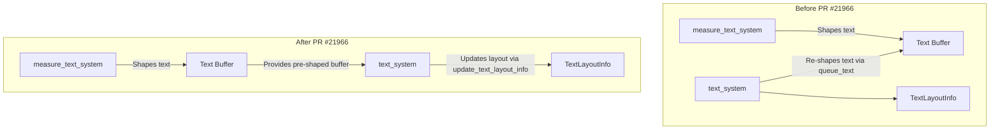

+++
title = "#21966 PR #21966 - 不在 `text_system` 中更新文本缓冲区"
date = "2025-12-06T00:00:00"
draft = false
template = "pull_request_page.html"
in_search_index = false

[extra]
current_language = "zh-cn"
available_languages = {"en" = { name = "English", url = "/pull_request/bevy/2025-12/pr-21966-en-20251206" }, "zh-cn" = { name = "中文", url = "/pull_request/bevy/2025-12/pr-21966-zh-cn-20251206" }}
labels = ["C-Performance", "A-UI", "A-Text", "D-Modest"]
+++

# Title: PR #21966 - 不在 `text_system` 中更新文本缓冲区

## Basic Information
- **Title**: Don't update the text buffer in `text_system`
- **PR Link**: https://github.com/bevyengine/bevy/pull/21966
- **Author**: ickshonpe
- **Status**: MERGED
- **Labels**: C-Performance, A-UI, S-Ready-For-Final-Review, A-Text, D-Modest
- **Created**: 2025-11-28T13:56:36Z
- **Merged**: 2025-12-06T17:33:42Z
- **Merged By**: mockersf

## 描述翻译

### 目标

文本在 `measure_text_system` 中进行字形排布 (shaping)。当调度执行到 `text_system` 时，没有必要第二次重新更新 cosmic-text 缓冲区。`text_system` 应该只更新任何过时的 `TextLayoutInfo` 组件。

### 解决方案

* 在 `TextPipeline` 中添加一个新方法 `update_text_layout_info`。此方法更新给定的 `TextLayoutInfo` 而不执行任何字形排布。
* 在 `text_system` 中调用 `update_text_layout_info` 而不是 `queue_text`。
* 只查询 `TextFont`，而不是完整的 `TextUiReader`。

下一步是移除 `TextPipeline::queue_text`。我在这里没有这样做，因为这是一个相当大的重构，而且我还有其他一些希望先合并的文本相关的 PR。

### 测试

#### 黄色 = 此 PR，红色 = main

```
cargo run --example many_glyphs --release --features trace_tracy,debug -- --no-text2d --recompute-text
```


```
cargo run --example many_buttons --release --features trace_tracy,debug -- --text --respawn
```


## 此 Pull Request 的技术故事

这个 PR 的核心目标是优化 Bevy 引擎中文本渲染的性能，通过消除一个冗余的文本缓冲区更新步骤。在 Bevy 的现有架构中，文本处理流程存在一个低效的设计：文本的字形排布（shaping）在 `measure_text_system` 中完成，但随后的 `text_system` 又重复了部分工作，导致不必要的性能开销。

### 问题与背景

在合并此 PR 之前，文本处理流程存在一个逻辑问题。`measure_text_system` 负责计算文本布局，包括使用 cosmic-text 库进行复杂的字形排布。然而，`text_system` 随后被调用时，会通过 `TextPipeline::queue_text` 方法再次处理文本缓冲区。这个设计导致了重复的 CPU 工作，尤其是在文本内容没有改变、仅布局信息需要更新的情况下。

问题的技术关键在于理解两个系统的分工：
- `measure_text_system`: 计算文本的测量值，执行字形排布，生成 `ComputedTextBlock`
- `text_system`: 基于测量结果更新实际的渲染组件

当文本节点的尺寸或布局发生变化时，确实需要重新计算。但问题在于，`text_system` 不应该重新执行已经在 `measure_text_system` 中完成的字形排布工作。

### 解决方案方法

开发者采取了直接且高效的方法来解决这个问题。他们没有尝试大规模重构整个文本系统，而是聚焦于消除冗余操作，同时保持现有的 API 和系统边界。这种方法降低了代码变更的风险，并使 PR 更容易被审查和合并。

技术方案包含三个关键部分：
1. 在 `TextPipeline` 中添加一个新的方法 `update_text_layout_info`，专门用于更新布局信息而不重新排布
2. 修改 `text_system` 以使用这个新方法
3. 优化查询，只获取必要的组件数据

这种方法体现了典型的性能优化模式：识别瓶颈，创建专门的快速路径，然后在调用点使用这个快速路径。

### 实现细节

**核心新增方法**：`TextPipeline::update_text_layout_info`

这个新方法是 PR 的核心。它接收已经排布好的 `ComputedTextBlock` 缓冲区，并基于此更新 `TextLayoutInfo`：

```rust
pub fn update_text_layout_info<'a>(
    &mut self,
    layout_info: &mut TextLayoutInfo,
    text_font_query: Query<&'a TextFont>,
    scale_factor: f64,
    font_atlas_set: &mut FontAtlasSet,
    texture_atlases: &mut Assets<TextureAtlasLayout>,
    textures: &mut Assets<Image>,
    computed: &mut ComputedTextBlock,
    font_system: &mut CosmicFontSystem,
    swash_cache: &mut SwashCache,
    bounds: TextBounds,
) -> Result<(), TextError>
```

方法的实现逻辑清晰：
1. 清理现有的布局信息
2. 收集字体相关信息（大小、平滑设置等）
3. 使用现有的缓冲区设置尺寸
4. 遍历缓冲区中的字形运行（glyph runs）来构建布局几何信息
5. 处理字形在纹理图集（atlas）中的位置
6. 生成最终的 `PositionedGlyph` 列表

重要的是，这个方法跳过了 `queue_text` 中执行的字形排布步骤，直接使用 `computed.buffer` 中已经计算好的布局。

**系统函数的优化**：`text_system`

系统函数被简化并优化：
```rust
pub fn text_system(
    mut textures: ResMut<Assets<Image>>,
    mut texture_atlases: ResMut<Assets<TextureAtlasLayout>>,
    mut font_atlas_set: ResMut<FontAtlasSet>,
    mut text_pipeline: ResMut<TextPipeline>,
    mut text_query: Query<(
        Ref<ComputedNode>,
        &TextLayout,
        &mut TextLayoutInfo,
        &mut TextNodeFlags,
        &mut ComputedTextBlock,
    )>,
    text_font_query: Query<&TextFont>, // 只查询 TextFont
    mut font_system: ResMut<CosmicFontSystem>,
    mut swash_cache: ResMut<SwashCache>,
)
```

关键变化：
1. 移除了对 `fonts: Res<Assets<Font>>` 和 `mut text_reader: TextUiReader` 的依赖
2. 查询更改为只获取 `TextFont`，而不是完整的实体遍历器
3. 使用 `update_text_layout_info` 替换 `queue_text` 调用

这种改变不仅移除了冗余操作，还简化了系统函数的职责。现在 `text_system` 明确地只做一件事：更新渲染所需的布局信息。

### 技术洞察

**性能影响**：PR 描述中的性能图表显示了显著的改进。在 `many_glyphs` 示例中，帧时间显著减少，黄色线（此 PR）明显低于红色线（主分支）。这表明移除冗余的字形排布操作对 CPU 密集型文本场景有实质性帮助。

**架构清晰度**：这个变更提高了系统的职责分离。`measure_text_system` 负责字形排布和测量，`text_system` 负责基于这些测量更新渲染组件。这种分离更符合单一职责原则。

**向前兼容性**：作者特意提到没有立即移除 `TextPipeline::queue_text` 方法，因为这会是一个更大的重构，并且与其他正在进行的文本相关 PR 有冲突。这种谨慎的做法允许渐进式改进，而不破坏现有代码或阻塞其他开发工作。

**错误处理一致性**：新的 `update_text_layout_info` 方法保持了与 `queue_text` 相同的错误处理模式，确保了一致的行为和错误报告。

### 影响

这个 PR 带来了以下具体改进：

1. **性能提升**：消除了文本渲染管道的冗余字形排布操作，降低了 CPU 使用率
2. **代码简化**：`text_system` 现在更简单，职责更清晰
3. **查询优化**：从使用 `TextUiReader` 遍历器改为直接查询 `TextFont`，减少了查询复杂度
4. **架构改进**：明确了系统的职责边界，为后续重构奠定了基础

从工程角度看，这个 PR 展示了一个有效的性能优化模式：先通过分析识别瓶颈，然后创建专门的快速路径，最后将调用点迁移到新路径。这种方法最小化了变更风险，同时提供了立竿见影的性能收益。

## 视觉表示



## 关键文件更改

### `crates/bevy_text/src/pipeline.rs` (+188/-2)

**更改描述**：添加了新的 `update_text_layout_info` 方法，用于更新文本布局信息而不重新排布文本。

**关键代码片段**：
```rust
/// Update [`TextLayoutInfo`] with the new [`PositionedGlyph`] layout.
pub fn update_text_layout_info<'a>(
    &mut self,
    layout_info: &mut TextLayoutInfo,
    text_font_query: Query<&'a TextFont>,
    scale_factor: f64,
    font_atlas_set: &mut FontAtlasSet,
    texture_atlases: &mut Assets<TextureAtlasLayout>,
    textures: &mut Assets<Image>,
    computed: &mut ComputedTextBlock,
    font_system: &mut CosmicFontSystem,
    swash_cache: &mut SwashCache,
    bounds: TextBounds,
) -> Result<(), TextError> {
    // 方法实现：直接使用已排布的缓冲区更新布局信息
    // ...
}
```

**与 PR 目标的关系**：这是实现性能优化的核心，提供了不进行冗余字形排布的快速路径。

### `crates/bevy_ui/src/widget/text.rs` (+45/-51)

**更改描述**：修改了 `text_system` 函数，使用新的 `update_text_layout_info` 方法并优化了查询。

**关键代码片段**：
```rust
// 之前：使用 queue_text，需要 fonts 和 text_reader
match text_pipeline.queue_text(
    text_layout_info,
    &fonts,
    text_reader.iter(entity),
    // ...
)

// 之后：使用 update_text_layout_info，只需要 text_font_query
match text_pipeline.update_text_layout_info(
    &mut text_layout_info,
    text_font_query,
    scale_factor,
    // ...
)
```

**与 PR 目标的关系**：这是调用侧的更改，将系统迁移到使用新的优化方法，同时简化了系统参数和查询。

## 进一步阅读

- [Bevy 文本渲染架构](https://bevyengine.org/learn/quick-start/getting-started/resources/) - 了解 Bevy 的资源管理和系统调度
- [Cosmic-text 库](https://github.com/pop-os/cosmic-text) - 了解 Bevy 使用的文本排布引擎
- [字形排布 (Text Shaping) 概念](https://en.wikipedia.org/wiki/Complex_text_layout) - 理解字形排布在文本渲染中的作用
- [ECS 模式中的系统优化](https://bevy-cheatbook.github.io/programming/systems.html) - 学习如何在 Entity-Component-System 架构中优化系统性能

此 PR 展示了在保持向后兼容性的同时进行渐进式性能优化的有效策略，对于处理复杂图形应用程序中的文本渲染性能问题具有参考价值。