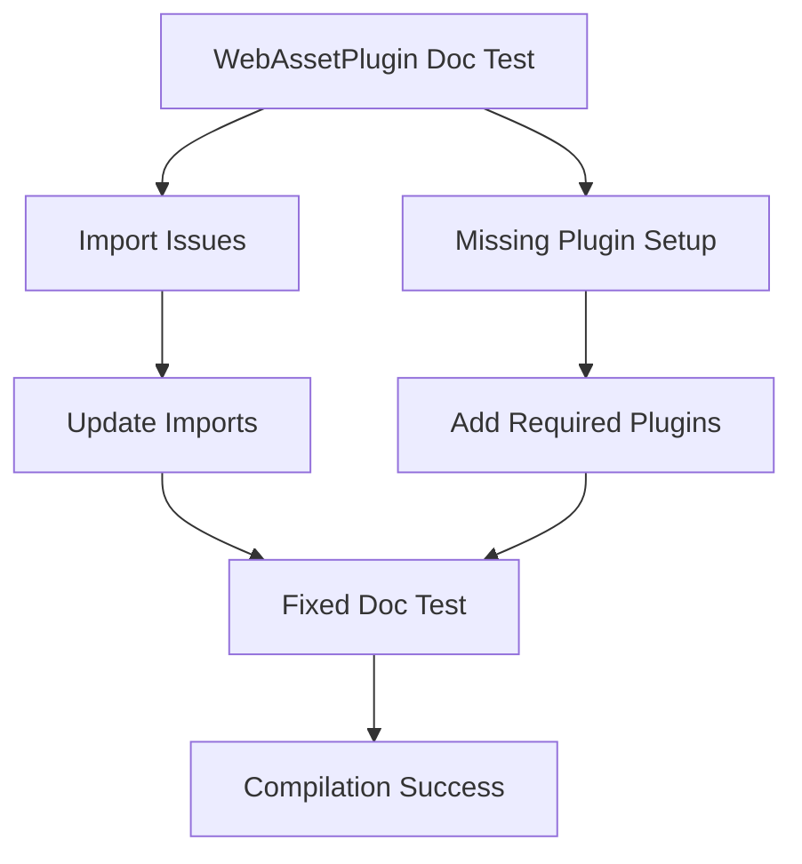

+++
title = "#21968 Fix the doc test for WebAssetPlugin"
date = "2025-12-07T00:00:00"
draft = false
template = "pull_request_page.html"
in_search_index = true

[taxonomies]
list_display = ["show"]

[extra]
current_language = "en"
available_languages = {"en" = { name = "English", url = "/pull_request/bevy/2025-12/pr-21968-en-20251207" }, "zh-cn" = { name = "中文", url = "/pull_request/bevy/2025-12/pr-21968-zh-cn-20251207" }}
labels = ["D-Trivial", "A-Assets", "C-Testing"]
+++

# Fix the doc test for WebAssetPlugin

## Basic Information
- **Title**: Fix the doc test for WebAssetPlugin
- **PR Link**: https://github.com/bevyengine/bevy/pull/21968
- **Author**: andriyDev
- **Status**: MERGED
- **Labels**: D-Trivial, A-Assets, S-Ready-For-Final-Review, C-Testing
- **Created**: 2025-11-28T19:13:52Z
- **Merged**: 2025-12-07T18:24:09Z
- **Merged By**: mockersf

## Description Translation
Objective

- Fix `cargo t -p bevy_asset --all-features`.
    - Note: `all-features` do not run on CI!
- The doc tests for the `WebAssetPlugin` don't compile at all. There are bad imports and we don't even add the `AssetPlugin`.

Solution

- Add missing imports, and add missing plugins to the `App`.

Testing

- Ran `cargo t -p bevy_asset --all-features` and it passes now!

## The Story of This Pull Request

This PR addresses a specific but important issue in Bevy's documentation: a broken doc test for the `WebAssetPlugin` that prevented compilation when running tests with the `--all-features` flag. The problem was that the example code in the documentation contained incorrect imports and was missing necessary plugin setup, making it non-compilable despite being presented as working example code.

The issue became apparent when running `cargo t -p bevy_asset --all-features`, which isn't part of the CI pipeline. This highlights a common problem in large codebases where certain configurations aren't regularly tested and can drift out of sync with code changes over time. In this case, the `WebAssetPlugin` example was likely correct when initially written but became outdated as the Bevy API evolved.

The solution is straightforward but important for documentation quality: update the imports to reference the correct paths and add the missing plugins that the example actually needs to function. The example was trying to use Bevy's asset system without actually including the `AssetPlugin`, which is a fundamental requirement. Similarly, the mock implementation of `DefaultPlugins` had an incorrect method signature that didn't match the actual API.

From an engineering perspective, this fix demonstrates several best practices:

1. **Documentation as executable code**: Doc tests in Rust are more than just examples - they're compiled and run, serving as living documentation that verifies the examples actually work.
2. **Testing edge cases**: While CI might not run all feature combinations, developers should still test these configurations locally to catch issues like this.
3. **API consistency**: The mock implementation in the example now correctly mirrors the real `DefaultPlugins` API with the `&self` receiver, making the example more accurate and educational.

The changes themselves are minimal but important for anyone trying to use the `WebAssetPlugin` in a web context. The updated imports now correctly reflect Bevy's module structure, with `Asset`, `AssetApp`, `AssetPlugin`, `AssetServer`, and `Handle` all properly imported from `bevy_asset`. The addition of `TypePath` from `bevy_reflect` is also necessary since the example defines an `Image` asset that derives `Asset` and `TypePath`.

The most significant addition is the explicit inclusion of `TaskPoolPlugin::default()` and `AssetPlugin::default()` in the app builder, followed by `init_asset::<Image>()`. This shows users that when mocking `DefaultPlugins` in a doc test, they need to manually include the essential plugins that would normally be part of the default set. This educational aspect is valuable for developers learning Bevy's plugin architecture.

## Visual Representation



## Key Files Changed

### `crates/bevy_asset/src/io/web.rs` (+7/-5)

This file contains the documentation for the `WebAssetPlugin`, including the example code that was broken. The changes fix the imports and plugin setup in the example.

**Key Changes:**

1. **Fixed imports** - Updated the import statements to include all necessary types and correct paths
2. **Fixed mock implementation** - Corrected the `DefaultPlugins` mock method signature
3. **Added required plugins** - Explicitly added `TaskPoolPlugin` and `AssetPlugin` to the app builder
4. **Added asset initialization** - Called `init_asset::<Image>()` to properly set up the asset type

**Code snippets showing the key modifications:**

```rust
// Before (incorrect imports and setup):
# use bevy_app::{App, Startup};
# use bevy_ecs::prelude::{Commands, Res};
# use bevy_asset::web::{WebAssetPlugin, AssetServer};
# struct DefaultPlugins;
# impl DefaultPlugins { fn set(plugin: WebAssetPlugin) -> WebAssetPlugin { plugin } }
# use bevy_asset::web::AssetServer;

// After (corrected imports and setup):
# use bevy_app::{App, Startup, TaskPoolPlugin};
# use bevy_ecs::prelude::{Commands, Component, Res};
# use bevy_asset::{Asset, AssetApp, AssetPlugin, AssetServer, Handle, io::web::WebAssetPlugin};
# use bevy_reflect::TypePath;
# struct DefaultPlugins;
# impl DefaultPlugins { fn set(&self, plugin: WebAssetPlugin) -> WebAssetPlugin { plugin } }

// Also added to the App builder:
#   .add_plugins((TaskPoolPlugin::default(), AssetPlugin::default()))
#   .init_asset::<Image>()
```

These changes ensure that the example code is actually compilable and serves as a valid reference for users wanting to use the `WebAssetPlugin` in web environments.

## Further Reading

- [Rust Documentation Tests](https://doc.rust-lang.org/rustdoc/write-documentation/documentation-tests.html) - Official guide to writing documentation tests in Rust
- [Bevy Plugin System](https://bevyengine.org/learn/book/getting-started/plugins/) - Documentation on Bevy's plugin architecture
- [Bevy Asset System](https://bevyengine.org/learn/book/assets/) - Guide to Bevy's asset management system
- [WebAssembly with Bevy](https://bevyengine.org/learn/book/platforms/wasm/) - Information on using Bevy in web environments with WebAssembly