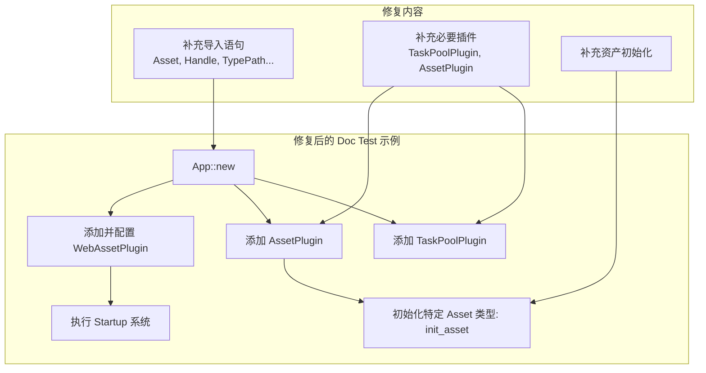

+++
title = "#21968 Fix the doc test for WebAssetPlugin"
date = "2025-12-07T00:00:00"
draft = false
template = "pull_request_page.html"
in_search_index = false

[extra]
current_language = "zh-cn"
available_languages = {"en" = { name = "English", url = "/pull_request/bevy/2025-12/pr-21968-en-20251207" }, "zh-cn" = { name = "中文", url = "/pull_request/bevy/2025-12/pr-21968-zh-cn-20251207" }}
labels = ["D-Trivial", "A-Assets", "C-Testing"]
+++

# Title: Fix the doc test for WebAssetPlugin

## Basic Information
- **Title**: Fix the doc test for WebAssetPlugin
- **PR Link**: https://github.com/bevyengine/bevy/pull/21968
- **Author**: andriyDev
- **Status**: MERGED
- **Labels**: D-Trivial, A-Assets, S-Ready-For-Final-Review, C-Testing
- **Created**: 2025-11-28T19:13:52Z
- **Merged**: 2025-12-07T18:24:09Z
- **Merged By**: mockersf

## Description Translation
**目标**
- 修复 `cargo t -p bevy_asset --all-features`。
    - 注意：`all-features` 不在 CI 上运行！
- `WebAssetPlugin` 的文档测试（doc tests）完全无法编译。存在错误的导入，并且我们甚至没有添加 `AssetPlugin`。

**解决方案**
- 添加缺失的导入，并将缺失的插件添加到 `App` 中。

**测试**
- 运行了 `cargo t -p bevy_asset --all-features`，现在测试通过了！

## The Story of This Pull Request

这个 Pull Request 的故事始于一个简单但容易在开发流程中被忽视的问题：文档测试（doc test）损坏了。具体来说，是 `bevy_asset` crate 中 `WebAssetPlugin` 的文档示例代码无法通过编译。这个问题之所以重要，是因为文档测试不仅是验证示例代码正确性的手段，更是大多数开发者学习和使用 API 的主要参考。一个无法编译的示例会严重误导用户，增加不必要的调试成本。

问题的触发条件是在特定功能集下运行测试。开发者 `andriyDev` 在运行 `cargo t -p bevy_asset --all-features` 命令时发现了编译失败。值得注意的是，如 PR 描述所指出，持续集成（CI）环境并未运行 `all-features` 这一配置，这意味着该问题可能会在 CI 检查中被漏掉，潜伏在代码库中，直到有开发者在本地使用该功能集时才会暴露。

分析失败的根本原因，主要有两个：
1.  **导入语句不完整**：文档示例中使用的类型（如 `Asset`, `Handle`, `TypePath`）没有从正确的模块导入。
2.  **运行时依赖缺失**：示例代码创建了一个 `App`，并添加了 `WebAssetPlugin`，但没有添加其必需的依赖插件，特别是 `AssetPlugin`。`WebAssetPlugin` 本身是一个针对 Web 平台的 IO 后端适配器，它依赖于 `AssetPlugin` 提供的核心资产管理基础设施。缺少这些依赖，App 无法正确初始化资产系统。

解决这个问题的技术方案非常直接：修复导入并补全依赖。开发者修改了 `crates/bevy_asset/src/io/web.rs` 文件中 `WebAssetPlugin` 的文档注释块。具体来说，他将原来不完整、导致编译错误的示例代码替换为完整、可运行的版本。

从实现角度看，这个修复展示了编写有效文档测试的几个关键点：
*   **自包含性**：文档测试必须能够在独立的环境中编译和运行。这意味着所有用到的外部类型都必须显式导入。
*   **环境模拟**：对于涉及框架（如 Bevy 的 `App` 和插件系统）的示例，必须正确设置运行时所需的所有组件。
*   **隐藏复杂度**：通过使用 `#` 开头的行，可以在文档中隐藏一些样板代码（如插件添加和资产注册），使核心示例更清晰，同时保证测试的可编译性。

这个 PR 的改动虽然很小，只涉及一个文件中的几行代码，但其影响是积极的：
1.  **提升了开发者体验**：修复了文档，确保了示例的准确性，避免用户被错误代码困扰。
2.  **维护了代码健康度**：确保了在 `--all-features` 标志下的测试套件能够通过，这对于项目在不同配置下的健壮性是有益的。
3.  **揭示了流程缺口**：它间接指出了 CI 流水线的一个覆盖盲点（未测试 `all-features`），这对团队来说是一个有价值的反馈。

总的来说，这是一个典型的“修复破损文档测试”的贡献。它不涉及核心逻辑变更，但通过关注细节和工程实践的完备性，维护了代码库的质量和可用性。

## Visual Representation



## Key Files Changed

### `crates/bevy_asset/src/io/web.rs` (+7/-5)
1.  **描述**：此文件包含了 `WebAssetPlugin` 的定义和其文档。修改内容是更新了该插件文档注释中的示例代码，修复了缺失的导入和必要的应用（App）配置。
2.  **关键代码修改**：
    ```rust
    // 修改前的导入和插件模拟（不完整）
    # use bevy_app::{App, Startup};
    # use bevy_ecs::prelude::{Commands, Res};
    # use bevy_asset::web::{WebAssetPlugin, AssetServer};
    # struct DefaultPlugins;
    # impl DefaultPlugins { fn set(plugin: WebAssetPlugin) -> WebAssetPlugin { plugin } }

    // 修改后的导入和插件模拟（完整）
    # use bevy_app::{App, Startup, TaskPoolPlugin};
    # use bevy_ecs::prelude::{Commands, Component, Res};
    # use bevy_asset::{Asset, AssetApp, AssetPlugin, AssetServer, Handle, io::web::WebAssetPlugin};
    # use bevy_reflect::TypePath;
    # struct DefaultPlugins;
    # impl DefaultPlugins { fn set(&self, plugin: WebAssetPlugin) -> WebAssetPlugin { plugin } }
    ```
    ```rust
    // 在 App 构建链中补充了必要的插件和初始化调用
    #   .add_plugins((TaskPoolPlugin::default(), AssetPlugin::default()))
    #   .init_asset::<Image>()
    ```
3.  **与 PR 目的的关系**：这些修改直接解决了 PR 描述中提到的两个问题：1) 补充了缺失的 `Asset`、`TypePath` 等导入；2) 在 App 构建器中添加了必需的 `TaskPoolPlugin`、`AssetPlugin` 并调用 `init_asset`，为 `WebAssetPlugin` 提供了完整的运行环境，从而使文档测试得以通过。

## Further Reading
1.  **Rust 文档测试（Doc Tests）**：Rust 官方书籍中关于文档注释和 `#[doc]` 属性的章节详细说明了如何编写文档测试。
2.  **Bevy 资产系统**：Bevy 官方手册的“资产”部分，介绍了 `AssetPlugin`、`AssetServer` 和自定义资产类型的基本用法。
3.  **Bevy 插件系统**：Bevy 官方手册中关于“插件”的章节，解释了如何构建和配置 App 以及插件之间的依赖关系。
4.  **Cargo 特性标志**：Cargo 文档中关于“特性”的部分，说明了如何定义和使用特性，以及 `--all-features` 标志的作用。