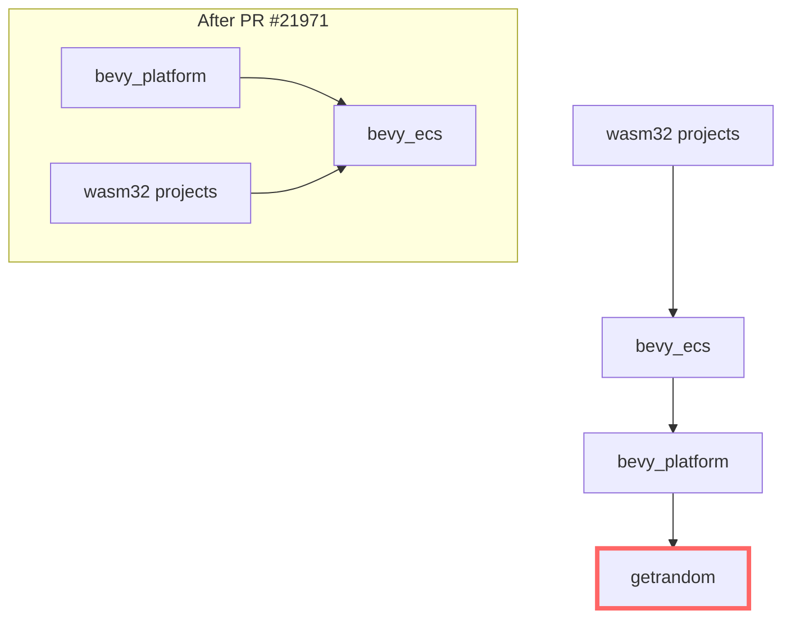

+++
title = "#21971 Remove `getrandom` dependency from `bevy_platform`."
date = "2025-12-07T00:00:00"
draft = false
template = "pull_request_page.html"
in_search_index = true

[taxonomies]
list_display = ["show"]

[extra]
current_language = "en"
available_languages = {"en" = { name = "English", url = "/pull_request/bevy/2025-12/pr-21971-en-20251207" }, "zh-cn" = { name = "中文", url = "/pull_request/bevy/2025-12/pr-21971-zh-cn-20251207" }}
labels = ["D-Trivial", "C-Dependencies"]
+++

# Title

## Basic Information
- **Title**: Remove `getrandom` dependency from `bevy_platform`.
- **PR Link**: https://github.com/bevyengine/bevy/pull/21971
- **Author**: kpreid
- **Status**: MERGED
- **Labels**: D-Trivial, C-Dependencies, S-Ready-For-Final-Review, X-Uncontroversial
- **Created**: 2025-11-28T22:48:57Z
- **Merged**: 2025-12-07T03:03:20Z
- **Merged By**: alice-i-cecile

## Description Translation
The original description is in English, so it's included as-is:

# Objective

Fixes #21336.

`bevy_platform` and dependents such as `bevy_ecs` may be used on web without incurring the `RUSTFLAGS` requirement of `getrandom`.

## Solution

Remove dependency `bevy_platform` → `getrandom`.

Note: There was a suggestion of adding a dependency `bevy_math` → `getrandom` to replace it, but `bevy_math` does not actually depend transitively on `getrandom` at all (except in its examples), nor does any other Bevy library. If making `getrandom` work is desired for convenience of Bevy users, we could add `bevy_internal/web` → `getrandom/wasm_js`, but that would not be for the use of Bevy itself at all, and it would mean that Bevy users would hit the `RUSTFLAGS` requirement even if they don't truly need it.

## Testing

- Ran `cargo run -p ci -- compile` and `cargo run -p ci -- test`.
- Tested depending on this version of `bevy_ecs` in my own wasm32 project.
- Have not tested any further feature combinations.

## The Story of This Pull Request

This pull request addresses a practical issue that affected developers using Bevy for WebAssembly (wasm) projects. The core problem was that `bevy_platform`, a low-level crate in the Bevy engine, had a transitive dependency on the `getrandom` crate when building for the web. This dependency came with a specific requirement: users needed to set certain `RUSTFLAGS` environment variables to make it work in wasm32-unknown-unknown targets. This created an unnecessary hurdle for developers who didn't actually need random number generation functionality but were just using parts of Bevy like `bevy_ecs` on the web.

The issue was reported in GitHub issue #21336, where developers encountered build failures when trying to use Bevy crates in wasm environments without the proper `RUSTFLAGS` configuration. The root cause was traced to `bevy_platform`'s `web` feature, which included `getrandom` as a dependency with the `wasm_js` feature enabled. This made sense if Bevy itself needed random number generation for web platforms, but upon investigation, it turned out that `bevy_platform` and its dependents didn't actually use `getrandom` at all—it was an unused dependency that was only pulling in the crate for potential convenience.

The developer approached this problem by analyzing the dependency chain. They first verified that `bevy_math` (which was suggested as an alternative location for the dependency) didn't actually use `getrandom` either, except in its examples. This meant the dependency wasn't essential for Bevy's core functionality. They then considered two options: completely removing the dependency or moving it to a different location like `bevy_internal/web`. They chose the former because adding it elsewhere would still impose the `RUSTFLAGS` requirement on all Bevy users targeting the web, regardless of whether they needed random number generation.

The implementation was straightforward but required careful consideration of feature flags and conditional compilation. In `bevy_platform`'s `Cargo.toml`, the `web` feature previously included `dep:getrandom` in its list of dependencies. The fix simply removed this line, along with the conditional dependency declaration for `getrandom` that was specific to `target_arch = "wasm32"`. This cleanly eliminated the transitive dependency without affecting any other functionality.

The change was tested by running Bevy's CI compile and test commands, and the author also verified it worked in their own wasm32 project. This validation confirmed that the removal didn't break existing functionality while solving the original problem. The PR demonstrates a good practice in dependency management: removing unused dependencies reduces build complexity and potential issues for downstream users, especially in constrained environments like web assembly.

## Visual Representation



## Key Files Changed

**File**: `crates/bevy_platform/Cargo.toml`

This is the only file changed in the PR. The modifications removed the `getrandom` dependency from the `web` feature and the wasm32-specific dependency section.

**Before the change:**
```toml
web = [
  "std",
  "dep:web-time",
  "dep:getrandom",  # This line was removed
  "dep:wasm-bindgen-futures",
  "dep:wasm-bindgen",
  "dep:js-sys",
  "dep:web-sys",
]

# ...

[target.'cfg(target_arch = "wasm32")'.dependencies]
web-time = { version = "1.1", default-features = false, optional = true }
getrandom = { version = "0.3.0", default-features = false, optional = true, features = [
  "wasm_js",
] }  # This entire block was removed
wasm-bindgen-futures = { version = "0.4", default-features = false, optional = true }
# ...
```

**After the change:**
```toml
web = [
  "std",
  "dep:web-time",
  # getrandom dependency removed here
  "dep:wasm-bindgen-futures",
  "dep:wasm-bindgen",
  "dep:js-sys",
  "dep:web-sys",
]

# ...

[target.'cfg(target_arch = "wasm32")'.dependencies]
web-time = { version = "1.1", default-features = false, optional = true }
# getrandom block removed entirely
wasm-bindgen-futures = { version = "0.4", default-features = false, optional = true }
# ...
```

**Explanation**: The changes are minimal but significant. By removing `getrandom` from the `web` feature list and deleting its conditional dependency declaration, the PR eliminates the transitive dependency that was causing the `RUSTFLAGS` requirement for wasm32 targets. This solves the original issue without affecting any functionality since the dependency wasn't being used.

## Further Reading

1. [Rust and WebAssembly documentation](https://rustwasm.github.io/docs/book/) - For understanding Rust's wasm target and common issues
2. [The `getrandom` crate documentation](https://docs.rs/getrandom/latest/getrandom/) - For understanding the random number generation capabilities
3. [Cargo features documentation](https://doc.rust-lang.org/cargo/reference/features.html) - For understanding feature flags and conditional dependencies
4. [Bevy's dependency management guide](https://github.com/bevyengine/bevy/blob/main/docs/dependencies.md) - For understanding Bevy's approach to dependencies

# Full Code Diff
```
diff --git a/crates/bevy_platform/Cargo.toml b/crates/bevy_platform/Cargo.toml
index c428a6bf7b79d..e17d5a4bc0c72 100644
--- a/crates/bevy_platform/Cargo.toml
+++ b/crates/bevy_platform/Cargo.toml
@@ -50,7 +50,6 @@ critical-section = ["dep:critical-section", "portable-atomic/critical-section"]
 web = [
   "std",
   "dep:web-time",
-  "dep:getrandom",
   "dep:wasm-bindgen-futures",
   "dep:wasm-bindgen",
   "dep:js-sys",
@@ -76,9 +75,6 @@ rayon = { version = "1", default-features = false, optional = true }
 
 [target.'cfg(target_arch = "wasm32")'.dependencies]
 web-time = { version = "1.1", default-features = false, optional = true }
-getrandom = { version = "0.3.0", default-features = false, optional = true, features = [
-  "wasm_js",
-] }
 wasm-bindgen-futures = { version = "0.4", default-features = false, optional = true }
 futures-channel = { version = "0.3", default-features = false }
 js-sys = { version = "0.3", default-features = false, optional = true }
```