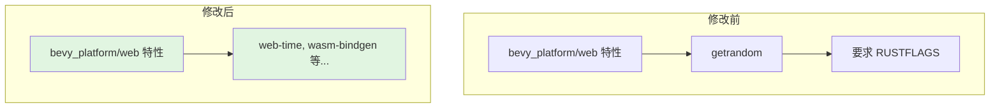

+++
title = "#21971 Remove `getrandom` dependency from `bevy_platform`."
date = "2025-12-07T00:00:00"
draft = false
template = "pull_request_page.html"
in_search_index = false

[extra]
current_language = "zh-cn"
available_languages = {"en" = { name = "English", url = "/pull_request/bevy/2025-12/pr-21971-en-20251207" }, "zh-cn" = { name = "中文", url = "/pull_request/bevy/2025-12/pr-21971-zh-cn-20251207" }}
+++

# Title

## Basic Information
- **Title**: Remove `getrandom` dependency from `bevy_platform`.
- **PR链接**: https://github.com/bevyengine/bevy/pull/21971
- **作者**: kpreid
- **状态**: 已合并
- **标签**: D-Trivial, C-Dependencies, S-Ready-For-Final-Review, X-Uncontroversial
- **创建时间**: 2025-11-28T22:48:57Z
- **合并时间**: 2025-12-07T03:03:20Z
- **合并者**: alice-i-cecile

## 描述翻译
### 目标 (Objective)

修复 #21336。

在不引入 `getrandom` 的 `RUSTFLAGS` 要求的情况下，`bevy_platform` 及其依赖项（例如 `bevy_ecs`）现在可以在 Web 上使用。

### 解决方案 (Solution)

移除 `bevy_platform` → `getrandom` 的依赖关系。

注意：有人建议添加 `bevy_math` → `getrandom` 的依赖来替代它，但 `bevy_math` 实际上并不传递地依赖 `getrandom`（除了在其示例中），其他任何 Bevy 库也不依赖。如果为了方便 Bevy 用户而希望让 `getrandom` 正常工作，我们可以添加 `bevy_internal/web` → `getrandom/wasm_js` 的依赖，但这完全不是为了 Bevy 自身的用途，并且这意味着即使 Bevy 用户并非真正需要，他们也会遇到 `RUSTFLAGS` 的要求。

### 测试 (Testing)

- 运行了 `cargo run -p ci -- compile` 和 `cargo run -p ci -- test`。
- 在我自己的 wasm32 项目中测试了依赖此版本的 `bevy_ecs`。
- 没有测试任何进一步的功能组合。

## 本次拉取请求的故事

本次拉取请求的核心故事是解决一个特定平台下的依赖冲突问题。`bevy_platform` 是 Bevy 游戏引擎中负责抽象跨平台差异的库。在某个时期，它的 `web` 特性包含了 `getrandom` 这个用于生成随机数的 Rust 库。这引发了一个问题：当开发者为 WebAssembly (wasm32) 目标编译项目时，即使他们自己的代码不直接需要随机数生成功能，`getrandom` 库也可能会因为其内部对特定 Web API 的依赖，而强制要求设置特定的 `RUSTFLAGS` 编译标志。

问题 #21336 具体指出了这一点：为了让 `getrandom` 在特定 Web 环境下工作，用户需要配置 `RUSTFLAGS`。对于只是想使用 `bevy_ecs`（它依赖 `bevy_platform`）等库，但并不需要随机数功能的开发者来说，这是一个不必要的障碍和配置负担。这使得构建过程复杂化，并可能成为新手入门的绊脚石。

开发者 kpreid 分析了依赖关系，发现 `bevy_platform` 引入 `getrandom` 并不是必需的。Bevy 的核心库（如 `bevy_math`）并没有真正传递性地依赖 `getrandom`，它只在示例代码中出现。因此，最直接、最干净的解决方案就是从 `bevy_platform` 中移除这个可选依赖项。

这个决策体现了软件工程中一个重要的原则：最小化依赖，特别是当依赖项会为最终用户带来额外的、非必要的配置或运行时要求时。在评估替代方案时，开发者明确拒绝了将依赖“转移”到另一个库（如 `bevy_math`）的想法，因为这并不能从根本上解决问题——它只是移动了问题，而没有消除它。同样，将依赖提升到更顶层的聚合包（`bevy_internal`）也被否决了，因为这会将配置负担强加给所有用户，无论他们是否需要该功能。

实现过程本身非常简单，只涉及修改 `Cargo.toml` 文件。在 `bevy_platform` 的 `web` 特性列表中，`"dep:getrandom"` 被移除了。同时，在针对 `wasm32` 架构的依赖项声明块中，`getrandom` 包的整个配置也被删除。这个改动是精确且局部的，只移除了一个未使用的可选依赖项，没有影响任何功能性代码。

这个改动的影响是直接的：任何依赖 `bevy_platform` 或 `bevy_ecs` 的 wasm32 项目，现在可以无需配置额外的 `RUSTFLAGS` 就能成功编译。这降低了在 Web 平台上使用 Bevy 相关组件的门槛，提高了开发体验。从架构角度来看，它简化了依赖图，使 `bevy_platform` 的职责更加清晰——专注于平台抽象，而不是承载并非其核心功能的间接依赖。

总结来说，这是一个典型的依赖管理优化。它识别并移除了一个非必要的、会给用户带来配置成本的依赖项，从而改善了库的易用性和清晰度，同时保持了功能的完整性。

## 可视化表示



## 关键文件变更

- `crates/bevy_platform/Cargo.toml` (+0/-4)

**变更说明**：
此文件是 `bevy_platform` 包的清单文件，定义了包的元数据、依赖项和特性。本次修改移除了对 `getrandom` 库的依赖声明，该依赖原先只在 `web` 特性和 `wasm32` 目标下被激活。移除后，构建 wasm32 目标时不再需要 `getrandom`，从而消除了相关的 `RUSTFLAGS` 配置要求。

**代码片段**：
```toml
# 文件: crates/bevy_platform/Cargo.toml
# 修改前（节选）:
[features]
web = [
  "std",
  "dep:web-time",
  "dep:getrandom", # 此行被移除
  "dep:wasm-bindgen-futures",
  "dep:wasm-bindgen",
  "dep:js-sys",
]

# ... 其他部分 ...

[target.'cfg(target_arch = "wasm32")'.dependencies]
web-time = { version = "1.1", default-features = false, optional = true }
getrandom = { version = "0.3.0", default-features = false, optional = true, features = [ # 整个 getrandom 条目被移除
  "wasm_js",
] }
wasm-bindgen-futures = { version = "0.4", default-features = false, optional = true }

# 修改后（节选）:
[features]
web = [
  "std",
  "dep:web-time",
  # "dep:getrandom", 已被移除
  "dep:wasm-bindgen-futures",
  "dep:wasm-bindgen",
  "dep:js-sys",
]

# ... 其他部分 ...

[target.'cfg(target_arch = "wasm32")'.dependencies]
web-time = { version = "1.1", default-features = false, optional = true }
# getrandom 依赖项已被完全移除
wasm-bindgen-futures = { version = "0.4", default-features = false, optional = true }
```
**与PR目标的关系**：
这个文件是本次PR的唯一修改点，直接实现了移除 `getrandom` 依赖的目标。改动清晰地展示了如何通过编辑 `Cargo.toml` 来管理依赖关系，特别是如何从特定平台的依赖和特性列表中移除一个库。

## 延伸阅读

1.  **Cargo 特性与依赖管理**：
    *   [Cargo Book - Features](https://doc.rust-lang.org/cargo/reference/features.html) - 了解 Rust Cargo 中特性的工作原理，包括可选依赖和条件编译。
    *   [Cargo Book - Specifying Dependencies](https://doc.rust-lang.org/cargo/reference/specifying-dependencies.html) - 学习如何指定平台特定的依赖项。

2.  **`getrandom` 库与 WebAssembly**：
    *   [`getrandom` crate 文档](https://docs.rs/getrandom/latest/getrandom/) - 了解该库的用途，特别是在 `wasm32-unknown-unknown` 等目标上所需的 JavaScript 绑定和 `RUSTFLAGS`。
    *   [Issue #21336](https://github.com/bevyengine/bevy/issues/21336) - 本次修复的原始问题，包含更详细的问题背景和讨论。

3.  **Bevy 引擎与平台抽象**：
    *   [`bevy_platform` crate](https://github.com/bevyengine/bevy/tree/main/crates/bevy_platform) - 查看该库的源码，了解 Bevy 如何处理不同平台（如 Web、Android、iOS）的抽象。
    *   [Bevy 官方手册 - Platforms](https://bevyengine.org/learn/quick-start/platforms/) - 了解如何在 Bevy 项目中进行跨平台开发。

# 完整代码差异 (Full Code Diff)
```diff
diff --git a/crates/bevy_platform/Cargo.toml b/crates/bevy_platform/Cargo.toml
index c428a6bf7b79d..e17d5a4bc0c72 100644
--- a/crates/bevy_platform/Cargo.toml
+++ b/crates/bevy_platform/Cargo.toml
@@ -50,7 +50,6 @@ critical-section = ["dep:critical-section", "portable-atomic/critical-section"]
 web = [
   "std",
   "dep:web-time",
-  "dep:getrandom",
   "dep:wasm-bindgen-futures",
   "dep:wasm-bindgen",
   "dep:js-sys",
@@ -76,9 +75,6 @@ rayon = { version = "1", default-features = false, optional = true }
 
 [target.'cfg(target_arch = "wasm32")'.dependencies]
 web-time = { version = "1.1", default-features = false, optional = true }
-getrandom = { version = "0.3.0", default-features = false, optional = true, features = [
-  "wasm_js",
-] }
 wasm-bindgen-futures = { version = "0.4", default-features = false, optional = true }
 futures-channel = { version = "0.3", default-features = false }
 js-sys = { version = "0.3", default-features = false, optional = true }
```