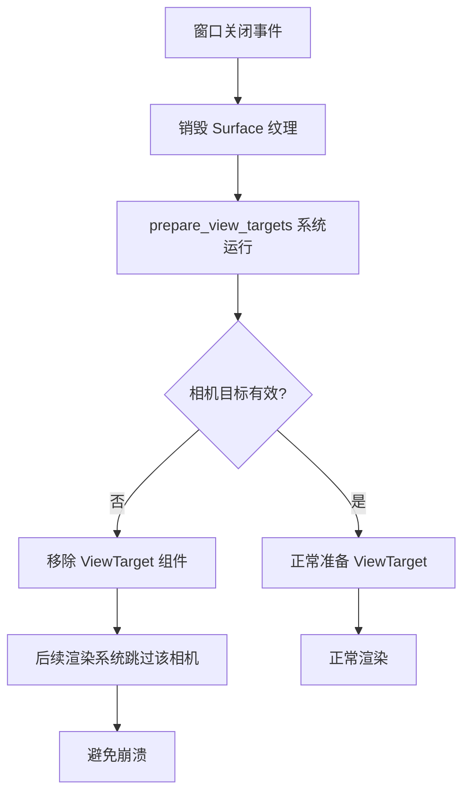

+++
title = "#21976 Fix crash on exit due to destroyed surface texture"
date = "2025-12-02T00:00:00"
draft = false
template = "pull_request_page.html"
in_search_index = false

[extra]
current_language = "zh-cn"
available_languages = {"en" = { name = "English", url = "/pull_request/bevy/2025-12/pr-21976-en-20251202" }, "zh-cn" = { name = "中文", url = "/pull_request/bevy/2025-12/pr-21976-zh-cn-20251202" }}
+++

# 标题

## 基本信息
- **标题**: Fix crash on exit due to destroyed surface texture
- **PR链接**: https://github.com/bevyengine/bevy/pull/21976
- **作者**: SarthakSingh31
- **状态**: 已合并
- **标签**: A-Rendering, A-Windowing, P-Crash, S-Ready-For-Final-Review, P-Regression
- **创建时间**: 2025-11-29T21:49:08Z
- **合并时间**: 2025-12-02T08:28:42Z
- **合并者**: mockersf

## 描述翻译

# 目标

修复当前主分支上关闭窗口时的崩溃问题

<details>
  <summary>崩溃日志</summary>

```
❯ RUST_BACKTRACE=full cargo run --example 3d_scene -F dev
    Finished `dev` profile [unoptimized + debuginfo] target(s) in 0.17s
     Running `target/debug/examples/3d_scene`
2025-11-29T21:39:06.551816Z  INFO bevy_diagnostic::system_information_diagnostics_plugin::internal: SystemInfo { os: "Linux (Arch Linux rolling)", kernel: "6.17.9-arch1-1", cpu: "AMD Ryzen 9 9950X 16-Core Processor", core_count: "16", memory: "186.4 GiB" }
2025-11-29T21:39:06.589438Z  INFO bevy_render::renderer: AdapterInfo { name: "NVIDIA GeForce RTX 5080", vendor: 4318, device: 11266, device_type: DiscreteGpu, driver: "NVIDIA", driver_info: "580.105.08", backend: Vulkan }
2025-11-29T21:39:06.953148Z  INFO bevy_render::batching::gpu_preprocessing: GPU preprocessing is fully supported on this device.
2025-11-29T21:39:06.959263Z  INFO bevy_winit::system: Creating new window 3d_scene (0v0)
2025-11-29T21:39:09.503214Z  INFO bevy_window::system: No windows are open, exiting
2025-11-29T21:39:09.504687Z  INFO bevy_winit::system: Closing window 0v0
2025-11-29T21:39:09.510808Z ERROR wgpu::backend::wgpu_core: Handling wgpu errors as fatal by default

thread '<unnamed>' (664835) panicked at /home/ssingh/.cargo/registry/src/index.crates.io-1949cf8c6b5b557f/wgpu-26.0.1/src/backend/wgpu_core.rs:1852:22:
wgpu error: Validation Error

Caused by:
  In Queue::submit
    In a pass parameter
      Texture with '<Surface Texture>' label has been destroyed


stack backtrace:
   // ... (完整的堆栈跟踪信息)
Encountered a panic in system `bevy_render::renderer::render_system`!

```

</details>

## 解决方案

- 当 `ViewTarget` 变为不可用时将其移除

## 测试

- 通过在 Linux 上运行 bevy 示例进行测试

# 该 Pull Request 的技术分析

## 问题背景与崩溃原因

这个 PR 解决了一个在窗口关闭时发生的崩溃问题。从错误日志可以看到，wgpu 报告了一个验证错误：`Texture with '<Surface Texture>' label has been destroyed`。这意味着渲染系统试图使用一个已经被销毁的纹理表面。

问题发生在 Bevy 的渲染系统中，具体在 `prepare_view_targets` 函数里。当窗口关闭时，窗口的 surface（表面）纹理会被销毁，但与之关联的相机（camera）组件仍然保留着指向这个已销毁纹理的 `ViewTarget`。当渲染系统继续运行时，它仍会尝试使用这个无效的 `ViewTarget` 进行渲染，从而导致 wgpu 验证错误并引发程序崩溃。

## 解决方案的设计思路

作者采用了一种直接而有效的方法：当检测到相机（camera）无法获取有效的输出附件（output attachment）时，立即移除该相机的 `ViewTarget` 组件。这样，在后续的渲染阶段，缺少 `ViewTarget` 组件的相机将被跳过，不会尝试渲染到无效的纹理。

这种方法的优点在于：
1. **简单直接**：只需在现有逻辑中添加组件移除操作
2. **符合 Bevy 的 ECS 模式**：通过组件的有无来控制行为
3. **及时处理**：在准备阶段就处理无效状态，避免后续渲染阶段的错误

## 具体实现分析

核心修改位于 `crates/bevy_render/src/view/mod.rs` 文件的 `prepare_view_targets` 函数。让我们详细分析代码的改动：

### 修改前的代码逻辑：

```rust
for (entity, camera, view, texture_usage, msaa) in cameras.iter() {
    let (Some(target_size), Some(target)) = (camera.physical_target_size, &camera.target)
    else {
        continue;
    };
    
    let Some(out_attachment) = view_target_attachments.get(target) else {
        continue;
    };
    // ... 继续处理
}
```

原来的逻辑是：如果相机没有物理目标大小或目标设置，或者找不到对应的输出附件，就直接跳过该相机。问题是，仅仅跳过不会移除 `ViewTarget` 组件，后续的渲染系统可能仍然会尝试使用它。

### 修改后的代码逻辑：

```rust
for (entity, camera, view, texture_usage, msaa) in cameras.iter() {
    let (Some(target_size), Some(out_attachment)) = (
        camera.physical_target_size,
        camera
            .target
            .as_ref()
            .and_then(|target| view_target_attachments.get(target)),
    ) else {
        // If we can't find an output attachment we need to remove the ViewTarget
        // component to make sure the camera doesn't try rendering to an invalid
        // output attachment.
        commands.entity(entity).try_remove::<ViewTarget>();
        
        continue;
    };
    // ... 继续处理
}
```

主要改动点：

1. **条件判断的合并**：将原来两步的条件检查合并为一步，同时检查物理目标大小和输出附件的存在性。使用 `and_then` 来链式处理可选的 `target`。

2. **`ViewTarget` 组件的移除**：在 `else` 分支中，当无法获取有效的输出附件时，调用 `commands.entity(entity).try_remove::<ViewTarget>()` 来移除 `ViewTarget` 组件。

3. **清晰的注释说明**：添加了注释解释为什么需要移除组件——确保相机不会尝试渲染到无效的输出附件。

这种实现方式确保了一旦相机的渲染目标变得无效（例如窗口关闭），系统会立即清理相关组件状态，防止后续渲染流程访问无效资源。

## 技术洞察与模式分析

### 资源生命周期管理

这个问题突显了在游戏引擎中管理 GPU 资源生命周期的重要性。特别是窗口 surface 这类与平台窗口系统紧密绑定的资源，它们的销毁时机不由渲染系统完全控制。引擎需要能够优雅地处理这类外部资源的失效。

### ECS 模式下的状态清理

在 Bevy 的 ECS 架构中，组件的存在与否通常用于表示实体的状态。当某个实体的依赖资源失效时，移除相关组件是一种标准的清理模式。这比设置标志位或尝试维护失效状态更符合 ECS 的设计哲学。

### 防御性编程

修改体现了防御性编程的原则：在资源可能失效的地方主动检查并清理状态，而不是假设资源总是可用。这对于构建健壮的渲染系统尤其重要，因为 GPU 资源错误往往会导致不可恢复的崩溃。

## 影响与改进

### 修复的回归问题

从标签 `P-Regression` 可以看出，这是一个回归问题——即之前能正常工作的功能现在出现了问题。这类修复通常优先级较高，因为它们直接影响用户体验。

### 性能影响

这个修改的运行时开销很小：只是在准备阶段多了一次组件移除操作。考虑到窗口关闭不是高频操作，这种开销可以忽略不计。

### 潜在的改进空间

虽然当前修复解决了崩溃问题，但从架构角度还可以考虑：

1. **更通用的资源失效处理机制**：可能需要一个更系统化的方法来处理各种 GPU 资源的失效情况。
2. **事件通知机制**：当 `ViewTarget` 被移除时，可能需要通知其他系统进行相应的清理。
3. **测试覆盖**：为这类边界情况添加专门的测试，确保类似问题不会再次出现。

## 视觉表示



## 关键文件修改

### `crates/bevy_render/src/view/mod.rs` (+11/-5)

这是本次 PR 唯一修改的文件，具体改动在 `prepare_view_targets` 函数中。

**修改内容**：
```rust
// 修改前：
let (Some(target_size), Some(target)) = (camera.physical_target_size, &camera.target)
else {
    continue;
};

let Some(out_attachment) = view_target_attachments.get(target) else {
    continue;
};

// 修改后：
let (Some(target_size), Some(out_attachment)) = (
    camera.physical_target_size,
    camera
        .target
        .as_ref()
        .and_then(|target| view_target_attachments.get(target)),
) else {
    // If we can't find an output attachment we need to remove the ViewTarget
    // component to make sure the camera doesn't try rendering to an invalid
    // output attachment.
    commands.entity(entity).try_remove::<ViewTarget>();

    continue;
};
```

**为什么需要这个修改**：
1. 原有的代码逻辑只会在找不到输出附件时跳过相机，但不会清理 `ViewTarget` 组件
2. 当窗口关闭时，其关联的 surface 纹理被销毁，但相机的 `ViewTarget` 组件仍然存在
3. 后续的渲染系统会尝试使用这个无效的 `ViewTarget`，导致 wgpu 验证错误和程序崩溃
4. 新代码在检测到无效状态时主动移除 `ViewTarget` 组件，防止渲染系统访问无效资源

**与 PR 整体目标的关系**：
这个修改直接解决了 PR 标题中描述的"由于销毁的表面纹理导致的退出时崩溃"问题。通过及时清理无效的渲染状态，确保了程序在窗口关闭时能够正常退出，而不会因 GPU 资源访问错误而崩溃。

## 扩展阅读

对于想深入了解相关概念的开发者，建议参考以下资源：

1. **wgpu 验证错误**：wgpu 作为 WebGPU 的 Rust 实现，有严格的验证机制确保 GPU 操作的安全性。了解这些验证规则有助于编写健壮的渲染代码。

2. **Bevy 的渲染架构**：理解 Bevy 的渲染图（render graph）、视图目标（view targets）和相机系统如何协同工作。

3. **ECS 中的状态管理**：学习如何在实体组件系统中管理资源依赖和状态转换，特别是在资源失效时的处理模式。

4. **Rust 的所有权与资源管理**：这个案例展示了 Rust 的所有权系统和 Bevy 的资源管理如何共同作用，防止悬垂指针和无效资源访问。