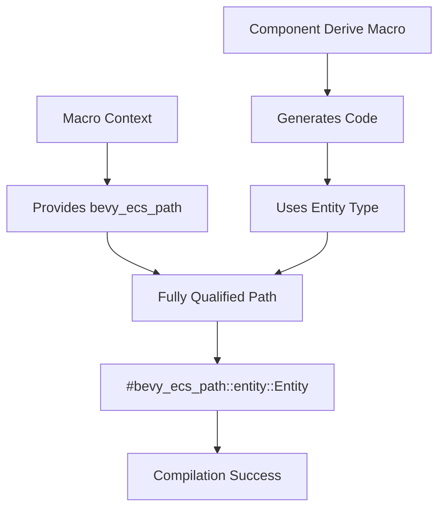

+++
title = "#21981 #21980 Fix Component/Relationship derive using non fully qualified path"
date = "2025-12-03T00:00:00"
draft = false
template = "pull_request_page.html"
in_search_index = true

[taxonomies]
list_display = ["show"]

[extra]
current_language = "en"
available_languages = {"en" = { name = "English", url = "/pull_request/bevy/2025-12/pr-21981-en-20251203" }, "zh-cn" = { name = "中文", url = "/pull_request/bevy/2025-12/pr-21981-zh-cn-20251203" }}
labels = ["D-Trivial", "A-ECS", "D-Macros"]
+++

# Title
#21980 Fix Component/Relationship derive using non fully qualified path

## Basic Information
- **Title**: #21980 Fix Component/Relationship derive using non fully qualified path
- **PR Link**: https://github.com/bevyengine/bevy/pull/21981
- **Author**: HeartofPhos
- **Status**: MERGED
- **Labels**: D-Trivial, A-ECS, S-Needs-Review, D-Macros
- **Created**: 2025-11-30T10:48:51Z
- **Merged**: 2025-12-03T00:59:24Z
- **Merged By**: mockersf

## Description Translation

# Objective

Fixes #21980

## Solution

Use fully qualified path for `Entity`

## Testing

The following code now compiles
```rust
mod test {
    fn derive_component_relationship_hygiene() {
        #[derive(Debug, bevy::prelude::Component)]
        #[relationship(relationship_target = RelTarget)]
        struct Rel(pub bevy::prelude::Entity);

        #[derive(Debug, bevy::prelude::Component)]
        #[relationship_target(relationship = Rel)]
        struct RelTarget(bevy::prelude::Entity);
    }
}
```

## The Story of This Pull Request

The issue began with a straightforward problem: the `Component` and `Relationship` derive macros in Bevy's ECS system had a hygiene issue. When developers used these macros within nested modules or contexts where the `Entity` type wasn't directly in scope, the generated code would fail to compile because it referenced `Entity` without a fully qualified path.

This type of issue is common in Rust macro development. Macros generate code, and that generated code needs to work correctly regardless of where the macro is invoked. The problem manifested specifically in the relationship derivation system, where the `set_risky` method in generated relationship implementations used the type `Entity` without specifying its full module path.

The developer encountered this when trying to use `bevy::prelude::Entity` explicitly in their component structs. The macro-generated code assumed `Entity` was in scope, but in this context, only the fully qualified path was available. This is a classic macro hygiene problem where generated code doesn't respect the caller's namespace context.

The solution was simple but important: change the generated code to use the fully qualified path `#bevy_ecs_path::entity::Entity` instead of just `Entity`. The `#bevy_ecs_path` variable is provided by the macro infrastructure and contains the path to the `bevy_ecs` crate, ensuring that the generated code always references the correct `Entity` type regardless of where the macro is called.

This change demonstrates an important principle in Rust macro design: when generating code that references types from external crates, always use fully qualified paths or paths provided by the macro's context. This prevents compilation errors when the macro is used in different namespace contexts.

The fix is minimal - just a single line change - but it addresses a real usability issue. Without this fix, developers would need to manually import `Entity` into every module where they use relationship derives, which is both inconvenient and error-prone. The fix ensures that the derive macros work correctly regardless of the user's import patterns.

From an engineering perspective, this fix highlights the importance of considering macro hygiene in library design. When creating derive macros or procedural macros, developers need to think about how the generated code will interact with different namespace contexts. Using fully qualified paths for external types is a standard practice that prevents these kinds of issues.

The testing example provided in the PR description shows exactly the scenario that was broken and is now fixed. By using `bevy::prelude::Entity` explicitly in the struct definitions, the test demonstrates that the generated relationship implementations now correctly reference the `Entity` type through the proper path, allowing the code to compile successfully.

This change fits into Bevy's broader architectural goal of providing a clean, ergonomic API. The ECS system's derive macros should "just work" without requiring developers to understand the internal implementation details or manually manage imports. This fix maintains that principle by ensuring the relationship derive macro works correctly in all reasonable usage contexts.

## Visual Representation



## Key Files Changed

- `crates/bevy_ecs/macros/src/component.rs` (+1/-1)

This file contains the derive macro implementation for the `Component` trait. The specific change is in the `derive_relationship` function, which generates the relationship implementation for components.

The key modification is in the generated `set_risky` method signature. Before the fix, it used a bare `Entity` type, which assumed the type was in scope. After the fix, it uses the fully qualified path provided by the macro context.

```rust
// File: crates/bevy_ecs/macros/src/component.rs
// Before:
fn set_risky(&mut self, entity: Entity) {
    self.#relationship_member = entity;
}

// After:
fn set_risky(&mut self, entity: #bevy_ecs_path::entity::Entity) {
    self.#relationship_member = entity;
}
```

The `#bevy_ecs_path` is a token that gets expanded to the correct path to the `bevy_ecs` crate based on where the macro is invoked. This ensures that the generated code always references the correct `Entity` type from the `bevy_ecs` crate's `entity` module.

This change directly addresses the issue described in the PR: when users reference `Entity` using a qualified path like `bevy::prelude::Entity`, the generated code now uses a similarly qualified path instead of assuming `Entity` is available in the local namespace.

## Further Reading

1. **Rust Macro Hygiene**: The Rust Reference section on macro hygiene explains how macros handle namespacing and how to write hygienic macros: https://doc.rust-lang.org/reference/macros.html#hygiene

2. **Bevy ECS Relationships**: The Bevy ECS documentation on relationships explains how to use the relationship system and derive macros: https://bevyengine.org/learn/ecs/relationships/

3. **Procedural Macros in Rust**: The "The Little Book of Rust Macros" provides practical guidance on writing procedural macros, including hygiene considerations: https://veykril.github.io/tlborm/

4. **Bevy's Component Derive Macro**: The Bevy source code for component derivation shows how macros are structured in the codebase: https://github.com/bevyengine/bevy/tree/main/crates/bevy_ecs/macros

# Full Code Diff
```
diff --git a/crates/bevy_ecs/macros/src/component.rs b/crates/bevy_ecs/macros/src/component.rs
index 5ec637da1a4f7..f37defab0b111 100644
--- a/crates/bevy_ecs/macros/src/component.rs
+++ b/crates/bevy_ecs/macros/src/component.rs
@@ -826,7 +826,7 @@ fn derive_relationship(
             }
 
             #[inline]
-            fn set_risky(&mut self, entity: Entity) {
+            fn set_risky(&mut self, entity: #bevy_ecs_path::entity::Entity) {
                 self.#relationship_member = entity;
             }
         }
```