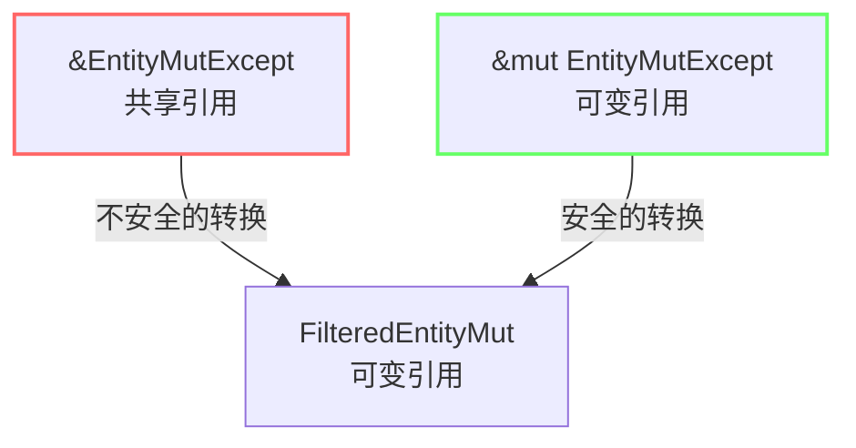

+++
title = "#21982 Fix unsound `&EntityMutExcept` to `FilteredEntityMut` conversion"
date = "2025-12-07T00:00:00"
draft = false
template = "pull_request_page.html"
in_search_index = false

[extra]
current_language = "zh-cn"
available_languages = {"en" = { name = "English", url = "/pull_request/bevy/2025-12/pr-21982-en-20251207" }, "zh-cn" = { name = "中文", url = "/pull_request/bevy/2025-12/pr-21982-zh-cn-20251207" }}
labels = ["C-Bug", "D-Trivial", "A-ECS", "P-Unsound"]
+++

# Fix unsound `&EntityMutExcept` to `FilteredEntityMut` conversion

## Basic Information
- **Title**: Fix unsound `&EntityMutExcept` to `FilteredEntityMut` conversion
- **PR Link**: https://github.com/bevyengine/bevy/pull/21982
- **Author**: ItsDoot
- **Status**: MERGED
- **Labels**: C-Bug, D-Trivial, A-ECS, S-Ready-For-Final-Review, P-Unsound
- **Created**: 2025-11-30T11:11:07Z
- **Merged**: 2025-12-07T19:10:07Z
- **Merged By**: mockersf

## Description Translation
### 目标
修复一个实际上是 `& &mut` -> `&mut` 的转换。

### 解决方案
将其改为 `&mut &mut` -> `&mut`。

## The Story of This Pull Request

这个PR修复了Bevy ECS中一个类型转换的soundness（内存安全性）问题。问题出现在`EntityMutExcept`到`FilteredEntityMut`的转换实现中。

### 问题核心：违反Rust借用规则

在Bevy的ECS系统中，`EntityMutExcept`是一个提供对实体可变访问的类型，但排除（except）了特定的组件包（Bundle）。它的内部结构包含了对实体的可变引用。`FilteredEntityMut`是另一个类似的类型，提供对实体的可变访问，但带有组件访问过滤。

问题出现在`From` trait的实现中。原来的代码允许通过一个共享引用（`&EntityMutExcept`）来创建`FilteredEntityMut`：

```rust
impl<'w, 's, B: Bundle> From<&'w EntityMutExcept<'_, 's, B>> for FilteredEntityMut<'w, 's>
```

这在Rust的借用规则中是不安全的。让我们分解一下这个类型关系：
- `EntityMutExcept`本身已经包含了对实体的可变访问（可以看作`&mut Entity`）
- `&EntityMutExcept`是一个共享引用，指向这个可变访问（即`& &mut Entity`）
- `FilteredEntityMut`需要提供可变访问（`&mut Entity`）

问题在于：从一个共享引用（`&`）可以创建多个拷贝，如果每个共享引用都能转换为一个独立的`FilteredEntityMut`，那么就会产生多个对同一数据的可变引用，这直接违反了Rust的核心安全保证——在任何时刻，要么只能有一个可变引用，要么只能有多个不可变引用。

### 技术背景：为什么这是个严重问题

在Rust中，这种soundness问题可能导致未定义行为（UB）。虽然在这个具体实现中，可能因为其他约束而没有立即导致崩溃，但这仍然是一个理论上不安全的转换。一旦编译器进行更激进的优化，或者代码以特定方式使用，就可能引发实际的问题。

`EntityMutExcept`设计用于安全地访问实体，同时排除某些组件。它通过`Access`类型跟踪哪些组件可以被访问。当转换为`FilteredEntityMut`时，这个访问信息需要被正确传递。

### 解决方案：正确的借用关系

修复方案直观但关键：将转换的输入从共享引用改为可变引用：

```rust
impl<'w, 's, B: Bundle> From<&'w mut EntityMutExcept<'_, 's, B>> for FilteredEntityMut<'w, 's>
```

现在的关系变成了：
- `&mut EntityMutExcept`：对`EntityMutExcept`的可变引用（`&mut &mut Entity`）
- 转换为`FilteredEntityMut`：对实体的可变引用（`&mut Entity`）

这个改变确保了Rust的借用规则得到遵守：
1. 要获得一个`FilteredEntityMut`，你必须首先拥有对`EntityMutExcept`的可变引用
2. Rust的可变引用规则保证：在同一作用域中，只能有一个对特定数据的可变引用
3. 这防止了创建多个`FilteredEntityMut`导致的多重可变引用问题

### 实现细节：安全注释保持不变

值得注意的是，虽然函数签名改变了，但安全注释（SAFETY comment）和内部实现保持不变：

```rust
// SAFETY:
// - The FilteredEntityMut has the same component access as the given EntityMutExcept.
unsafe { FilteredEntityMut::new(value.entity, value.access) }
```

这是因为安全性的关键在于外部借用关系的正确性，而不是内部实现的改变。`FilteredEntityMut::new`函数本身是`unsafe`的，调用者需要保证访问权限的正确传递。通过修复外部接口，我们现在能够提供这个保证。

### 影响和意义

这个修复：
1. **消除了潜在的内存安全问题**：确保不会违反Rust的别名规则
2. **保持API的一致性**：`FilteredEntityMut`应该只从独占访问中创建，这与Rust的所有权模型一致
3. **维护了Bevy ECS的安全性保证**：Bevy的ECS系统建立在Rust的安全保证之上，这种修复确保了这些保证不被破坏

从工程实践角度看，这种类型的soundness修复虽然代码改动很小，但对系统的长期稳定性和安全性至关重要。它体现了在系统编程中，类型系统和借用检查器不仅是编译时的约束，更是运行时安全的关键保障。

## Visual Representation



## Key Files Changed

### `crates/bevy_ecs/src/world/entity_access/except.rs`

**修改内容**：修复了`EntityMutExcept`到`FilteredEntityMut`转换的`From` trait实现，将参数从共享引用改为可变引用。

**修改前**：
```rust
impl<'w, 's, B: Bundle> From<&'w EntityMutExcept<'_, 's, B>> for FilteredEntityMut<'w, 's> {
    fn from(value: &'w EntityMutExcept<'_, 's, B>) -> Self {
        // SAFETY:
        // - The FilteredEntityMut has the same component access as the given EntityMutExcept.
        unsafe { FilteredEntityMut::new(value.entity, value.access) }
    }
}
```

**修改后**：
```rust
impl<'w, 's, B: Bundle> From<&'w mut EntityMutExcept<'_, 's, B>> for FilteredEntityMut<'w, 's> {
    fn from(value: &'w mut EntityMutExcept<'_, 's, B>) -> Self {
        // SAFETY:
        // - The FilteredEntityMut has the same component access as the given EntityMutExcept.
        unsafe { FilteredEntityMut::new(value.entity, value.access) }
    }
}
```

**与PR目标的关系**：这个修改直接实现了PR描述中的解决方案，将不安全的`& &mut` -> `&mut`转换改为安全的`&mut &mut` -> `&mut`转换。

## Further Reading

1. **Rust所有权和借用规则**：
   - [The Rust Programming Language - References and Borrowing](https://doc.rust-lang.org/book/ch04-02-references-and-borrowing.html)
   - [Rustonomicon - Working with Unsafe](https://doc.rust-lang.org/nomicon/working-with-unsafe.html)

2. **Bevy ECS架构**：
   - [Bevy ECS Documentation](https://docs.rs/bevy_ecs/latest/bevy_ecs/)
   - [Entity Component System Pattern](https://en.wikipedia.org/wiki/Entity_component_system)

3. **内存安全性和Soundness**：
   - [What is memory safety?](https://plv.mpi-sws.org/rustbelt/stacked-borrows/)
   - [Understanding Undefined Behavior in Rust](https://raphlinus.github.io/programming/rust/2018/08/17/undefined-behavior.html)