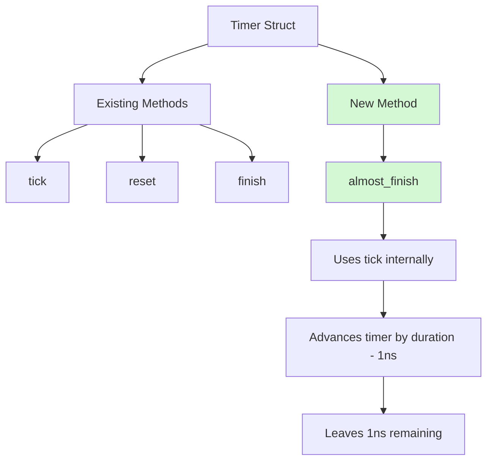

+++
title = "#21983 Add a new `almost_finish` method for `Timer` with immediate first `tick` action"
date = "2025-12-10T00:00:00"
draft = false
template = "pull_request_page.html"
in_search_index = true

[taxonomies]
list_display = ["show"]

[extra]
current_language = "en"
available_languages = {"en" = { name = "English", url = "/pull_request/bevy/2025-12/pr-21983-en-20251210" }, "zh-cn" = { name = "中文", url = "/pull_request/bevy/2025-12/pr-21983-zh-cn-20251210" }}
labels = ["C-Usability", "A-Time", "D-Straightforward"]
+++

# Title

## Basic Information
- **Title**: Add a new `almost_finish` method for `Timer` with immediate first `tick` action
- **PR Link**: https://github.com/bevyengine/bevy/pull/21983
- **Author**: Rajveer100
- **Status**: MERGED
- **Labels**: C-Usability, S-Ready-For-Final-Review, A-Time, X-Uncontroversial, D-Straightforward
- **Created**: 2025-11-30T11:38:10Z
- **Merged**: 2025-12-10T19:58:51Z
- **Merged By**: alice-i-cecile

## Description Translation
**Objective**

Resolves #21860

This new method would tick the timer by `duration - 1 ns` leaving a very short waiting time for the first tick initiated by the user allowing immediate action.

**Solution**

The `almost_finish` method updates the timer by ticking it with `1ns` remaining.

**Testing**

Tests have been added in `almost_finished_repeating`.

# The Story of This Pull Request

## The Problem and Context

The Bevy engine's `Timer` struct provides timing functionality for game development. Developers commonly use timers to trigger actions after a delay, such as spawning enemies or changing game states. However, there was a specific use case where developers wanted to initialize a timer so that its first completion would happen almost immediately when the game starts running, rather than waiting the full duration.

Issue #21860 identified this need. The problem was that when you set up a timer with a long duration, you had to wait that entire duration for the first tick to trigger an action. This created a delay at the start of gameplay or system initialization that wasn't always desirable. Developers needed a way to advance a timer to the point where it would finish on the next update cycle, enabling immediate action without manual time manipulation.

## The Solution Approach

The solution implemented is straightforward: add an `almost_finish` method that advances the timer by nearly its entire duration, leaving exactly 1 nanosecond remaining. This approach has several advantages:

1. **Minimal remaining time**: 1 nanosecond is effectively zero in game time terms, ensuring the timer finishes on the next tick
2. **No special handling**: The timer can still be used with existing `tick()` methods
3. **Preserves timer state**: The timer isn't marked as finished until the actual tick occurs, maintaining consistency

This method provides a cleaner alternative to manually calculating and calling `tick()` with a specific duration, reducing boilerplate code and potential errors.

## The Implementation

The implementation adds a single method to the `Timer` struct in `timer.rs`. The method is simple but well-considered:

```rust
#[inline]
pub fn almost_finish(&mut self) {
    let remaining = self.remaining() - Duration::from_nanos(1);
    self.tick(remaining);
}
```

The key technical aspects:
- It uses `self.remaining()` to get the current time left
- Subtracts 1 nanosecond to leave minimal time remaining
- Calls the existing `tick()` method with the calculated duration
- The `#[inline]` attribute suggests this is expected to be a performance-sensitive operation

This implementation leverages the existing `tick()` infrastructure, ensuring consistency with how timers normally progress. The method works correctly with both `TimerMode::Once` and `TimerMode::Repeating` timers because it simply advances the timer state without special-case logic.

The test added verifies the behavior:

```rust
#[test]
fn almost_finished_repeating() {
    let mut t = Timer::from_seconds(10.0, TimerMode::Repeating);
    let duration = Duration::from_nanos(1);
    
    t.almost_finish();
    assert!(!t.is_finished());
    assert_eq!(t.times_finished_this_tick(), 0);
    assert_eq!(t.remaining(), Duration::from_nanos(1));
    
    t.tick(duration);
    assert!(t.is_finished());
    assert_eq!(t.times_finished_this_tick(), 1);
}
```

This test confirms several important behaviors:
1. After `almost_finish()`, the timer is not yet marked as finished
2. Exactly 1 nanosecond remains
3. A subsequent tick of 1 nanosecond completes the timer
4. The timer properly reports finishing on that tick

## Technical Insights

The choice of 1 nanosecond is significant. While it's theoretically possible to use 0 time remaining, that would require special handling to avoid division by zero or other edge cases in the timer logic. By leaving 1 nanosecond, the timer maintains all its normal behavior while being practically ready to finish.

This implementation follows the principle of least surprise: `almost_finish()` doesn't immediately mark the timer as finished, which would be inconsistent with how timers normally work. Instead, it puts the timer in a state where the next update cycle will complete it.

The method also includes comprehensive documentation with examples, making it clear how to use it:

```rust
/// Almost finishes the timer leaving 1 ns of remaining time.
/// This can be useful when needing an immediate action without having
/// to wait for the set duration of the timer in the first tick.
///
/// # Examples
/// ```
/// # use bevy_time::*;
/// use std::time::Duration;
/// let mut timer = Timer::from_seconds(1.5, TimerMode::Once);
/// timer.almost_finish();
/// assert!(!timer.is_finished());
/// assert_eq!(timer.remaining(), Duration::from_nanos(1));
/// ```
```

## The Impact

This small addition provides significant quality-of-life improvement for Bevy developers. Game developers can now easily set up timers that trigger almost immediately when systems start running, which is particularly useful for:

1. **Initialization sequences**: Setting up initial game state without hardcoded delays
2. **Testing**: Quickly advancing to timer-triggered events during development
3. **UI transitions**: Creating smooth transitions that appear to start immediately
4. **Game mechanics**: Implementing cooldowns or delays that should be ready on first use

The method is simple, well-tested, and integrates cleanly with existing timer functionality. It demonstrates how small, focused API additions can solve practical development problems without complicating the codebase.

## Visual Representation



## Key Files Changed

### `crates/bevy_time/src/timer.rs` (+34/-0)

This file contains the `Timer` struct implementation. The PR adds a new method and corresponding test.

**Key Changes:**

1. **New `almost_finish` method**:
```rust
/// Almost finishes the timer leaving 1 ns of remaining time.
/// This can be useful when needing an immediate action without having
/// to wait for the set duration of the timer in the first tick.
///
/// # Examples
/// ```
/// # use bevy_time::*;
/// use std::time::Duration;
/// let mut timer = Timer::from_seconds(1.5, TimerMode::Once);
/// timer.almost_finish();
/// assert!(!timer.is_finished());
/// assert_eq!(timer.remaining(), Duration::from_nanos(1));
/// ```
#[inline]
pub fn almost_finish(&mut self) {
    let remaining = self.remaining() - Duration::from_nanos(1);
    self.tick(remaining);
}
```

2. **Test for the new method**:
```rust
#[test]
fn almost_finished_repeating() {
    let mut t = Timer::from_seconds(10.0, TimerMode::Repeating);
    let duration = Duration::from_nanos(1);

    t.almost_finish();
    assert!(!t.is_finished());
    assert_eq!(t.times_finished_this_tick(), 0);
    assert_eq!(t.remaining(), Duration::from_nanos(1));

    t.tick(duration);
    assert!(t.is_finished());
    assert_eq!(t.times_finished_this_tick(), 1);
}
```

**How these changes relate to the overall purpose:**

The new method directly addresses the requirement stated in issue #21860 by providing a way to advance a timer so it's ready to finish on the next update. The test validates that the method works correctly and documents the expected behavior for future maintainers.

## Further Reading

1. **Bevy Timer Documentation**: https://docs.rs/bevy/latest/bevy/time/struct.Timer.html
2. **Rust std::time::Duration**: https://doc.rust-lang.org/std/time/struct.Duration.html
3. **Game Timing Patterns**: Understanding fixed and variable timesteps in game engines
4. **Bevy Time Module Architecture**: How Bevy handles time management across systems

# Full Code Diff
```
diff --git a/crates/bevy_time/src/timer.rs b/crates/bevy_time/src/timer.rs
index bbf76aa1d93a6..a9ce7b3d6ce63 100644
--- a/crates/bevy_time/src/timer.rs
+++ b/crates/bevy_time/src/timer.rs
@@ -206,6 +206,25 @@ impl Timer {
         self.tick(remaining);
     }
 
+    /// Almost finishes the timer leaving 1 ns of remaining time.
+    /// This can be useful when needing an immediate action without having
+    /// to wait for the set duration of the timer in the first tick.
+    ///
+    /// # Examples
+    /// ```
+    /// # use bevy_time::*;
+    /// use std::time::Duration;
+    /// let mut timer = Timer::from_seconds(1.5, TimerMode::Once);
+    /// timer.almost_finish();
+    /// assert!(!timer.is_finished());
+    /// assert_eq!(timer.remaining(), Duration::from_nanos(1));
+    /// ```
+    #[inline]
+    pub fn almost_finish(&mut self) {
+        let remaining = self.remaining() - Duration::from_nanos(1);
+        self.tick(remaining);
+    }
+
     /// Returns the mode of the timer.
     ///
     /// # Examples
@@ -628,6 +647,21 @@ mod tests {
         assert_eq!(t.times_finished_this_tick(), 34);
     }
 
+    #[test]
+    fn almost_finished_repeating() {
+        let mut t = Timer::from_seconds(10.0, TimerMode::Repeating);
+        let duration = Duration::from_nanos(1);
+
+        t.almost_finish();
+        assert!(!t.is_finished());
+        assert_eq!(t.times_finished_this_tick(), 0);
+        assert_eq!(t.remaining(), Duration::from_nanos(1));
+
+        t.tick(duration);
+        assert!(t.is_finished());
+        assert_eq!(t.times_finished_this_tick(), 1);
+    }
+
     #[test]
     fn paused() {
         let mut t = Timer::from_seconds(10.0, TimerMode::Once);
```