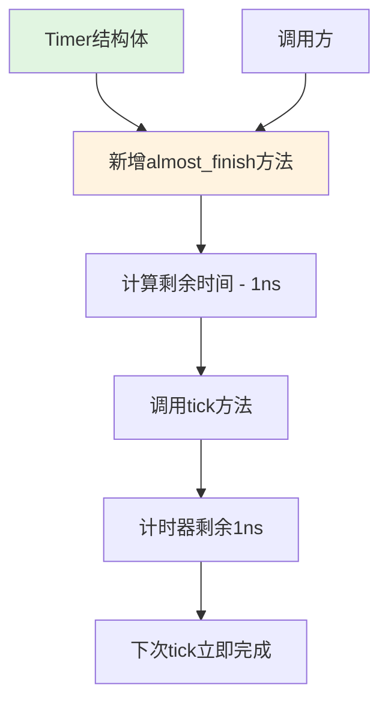

+++
title = "#21983 Add a new `almost_finish` method for `Timer` with immediate first `tick` action"
date = "2025-12-10T00:00:00"
draft = false
template = "pull_request_page.html"
in_search_index = false

[extra]
current_language = "zh-cn"
available_languages = {"en" = { name = "English", url = "/pull_request/bevy/2025-12/pr-21983-en-20251210" }, "zh-cn" = { name = "中文", url = "/pull_request/bevy/2025-12/pr-21983-zh-cn-20251210" }}
+++

# Title
## Add a new `almost_finish` method for `Timer` with immediate first `tick` action

## Basic Information
- **Title**: Add a new `almost_finish` method for `Timer` with immediate first `tick` action
- **PR Link**: https://github.com/bevyengine/bevy/pull/21983
- **作者**: Rajveer100
- **状态**: 已合并
- **标签**: C-Usability, S-Ready-For-Final-Review, A-Time, X-Uncontroversial, D-Straightforward
- **创建时间**: 2025-11-30T11:38:10Z
- **合并时间**: 2025-12-10T19:58:51Z
- **合并人**: alice-i-cecile

## Description Translation
### 目标
解决 #21860

这个新方法会将计时器推进 `duration - 1 ns`，为用户发起的第一个 tick 留下极短的等待时间，从而实现立即执行动作。

### 解决方案
`almost_finish` 方法通过将计时器推进到剩余 `1ns` 来更新计时器。

### 测试
已在 `almost_finished_repeating` 中添加测试。

## The Story of This Pull Request

在游戏引擎开发中，计时器（Timer）是处理延时、周期执行和动画等功能的常用工具。Bevy 引擎的 `Timer` 结构体提供了一个灵活的计时系统，开发者可以设置计时器模式和持续时间。然而，在实际使用场景中，开发者有时需要计时器能立即执行首次动作，而不必等待完整的计时周期。

问题的核心是 #21860 这个 issue 提出的需求。开发者需要一个方法，能够让计时器立即准备就绪，只需一个极小的 tick 就能触发完成状态。这在实际游戏逻辑中很有用，比如需要立即开始一个动画循环，或者实现一个几乎无延迟的初始触发。

原有的 `Timer` API 已经提供了 `tick` 方法来推进计时器，以及 `reset` 和 `finish` 等方法来控制状态。`finish` 方法会立即将计时器标记为完成状态，但这在某些场景下可能太"立即"了——有时我们希望计时器在第一次 tick 时就完成，但保持完整的计时周期行为。

解决这个问题的技术方案很直接：添加一个 `almost_finish` 方法，将计时器推进到剩余 1 纳秒的状态。这个设计的巧妙之处在于：
1. 计时器在调用 `almost_finish` 后不会立即标记为完成
2. 开发者只需再调用一次极小的 `tick(1ns)` 就能触发完成状态
3. 计时器仍保持了原有的周期行为模式

从实现角度看，`almost_finish` 方法的核心代码很简洁：
```rust
pub fn almost_finish(&mut self) {
    let remaining = self.remaining() - Duration::from_nanos(1);
    self.tick(remaining);
}
```
这里利用了现有的 `tick` 方法，将剩余时间减去 1 纳秒，然后推进计时器。这个实现避免了重复代码，确保了与现有计时逻辑的一致性。

选择 1 纳秒作为剩余时间是一个合理的工程决策。纳秒是 `std::time::Duration` 的最小精度单位，这样设置确保了：
1. 剩余的等待时间在实际应用中可以忽略不计
2. 仍然遵守了计时器的内部状态机逻辑
3. 不会因为浮点精度问题导致意外行为

测试用例 `almost_finished_repeating` 验证了这个新方法的行为：
```rust
#[test]
fn almost_finished_repeating() {
    let mut t = Timer::from_seconds(10.0, TimerMode::Repeating);
    let duration = Duration::from_nanos(1);

    t.almost_finish();
    assert!(!t.is_finished());
    assert_eq!(t.times_finished_this_tick(), 0);
    assert_eq!(t.remaining(), Duration::from_nanos(1));

    t.tick(duration);
    assert!(t.is_finished());
    assert_eq!(t.times_finished_this_tick(), 1);
}
```
测试验证了三个关键点：
1. 调用 `almost_finish` 后，计时器未完成但只剩下 1 纳秒
2. `times_finished_this_tick` 统计正确
3. 再 tick 1 纳秒后，计时器正确完成

这个改动对性能影响极小，因为只是添加了一个简单的方法调用。API 向后兼容，不影响现有代码。从架构角度看，这个改动遵循了 Rust 的 "零成本抽象" 原则——添加了便利性但没有引入运行时开销。

这个方法的使用场景很明确。例如，在游戏开发中，开发者可能需要一个周期性执行的系统，但希望第一帧就执行而不是等待完整周期。以前需要手动设置计时器初始状态或使用复杂的时间偏移，现在可以直接调用 `almost_finish` 来实现。

从代码质量角度看，这个 PR 有几个值得注意的细节：
1. 方法有完整的文档注释和示例
2. 使用了 `#[inline]` 属性，提示编译器内联这个简单方法
3. 测试覆盖了关键行为
4. 遵循了现有的代码风格和模式

整个 PR 体现了 Bevy 社区对 API 设计的注重。它添加了一个小但有用的功能，解决了实际开发中的痛点，同时保持了代码库的简洁性和一致性。这种渐进式的 API 扩展是成熟项目维护的良好实践。

## Visual Representation



## Key Files Changed

### `crates/bevy_time/src/timer.rs` (+34/-0)

这个文件是计时器实现的核心。新增的 `almost_finish` 方法扩展了 `Timer` 的 API，提供了立即准备就绪的功能。

#### 关键修改点：

1. **添加 `almost_finish` 方法实现**：
```rust
/// Almost finishes the timer leaving 1 ns of remaining time.
/// This can be useful when needing an immediate action without having
/// to wait for the set duration of the timer in the first tick.
///
/// # Examples
/// ```
/// # use bevy_time::*;
/// use std::time::Duration;
/// let mut timer = Timer::from_seconds(1.5, TimerMode::Once);
/// timer.almost_finish();
/// assert!(!timer.is_finished());
/// assert_eq!(timer.remaining(), Duration::from_nanos(1));
/// ```
#[inline]
pub fn almost_finish(&mut self) {
    let remaining = self.remaining() - Duration::from_nanos(1);
    self.tick(remaining);
}
```

2. **添加测试用例**：
```rust
#[test]
fn almost_finished_repeating() {
    let mut t = Timer::from_seconds(10.0, TimerMode::Repeating);
    let duration = Duration::from_nanos(1);

    t.almost_finish();
    assert!(!t.is_finished());
    assert_eq!(t.times_finished_this_tick(), 0);
    assert_eq!(t.remaining(), Duration::from_nanos(1));

    t.tick(duration);
    assert!(t.is_finished());
    assert_eq!(t.times_finished_this_tick(), 1);
}
```

## Further Reading

1. **Bevy Timer 文档**：了解计时器的完整 API 和用法模式
2. **Rust 的 std::time::Duration**：理解时间表示和精度限制
3. **游戏循环设计模式**：了解计时器在游戏引擎中的典型应用
4. **API 设计原则**：学习如何设计实用且一致的 API

这个 PR 展示了一个良好设计的 API 扩展应该具备的要素：明确的需求、简洁的实现、完整的文档和充分的测试。对于想要学习 Rust 游戏引擎开发的开发者来说，这是一个很好的研究案例。