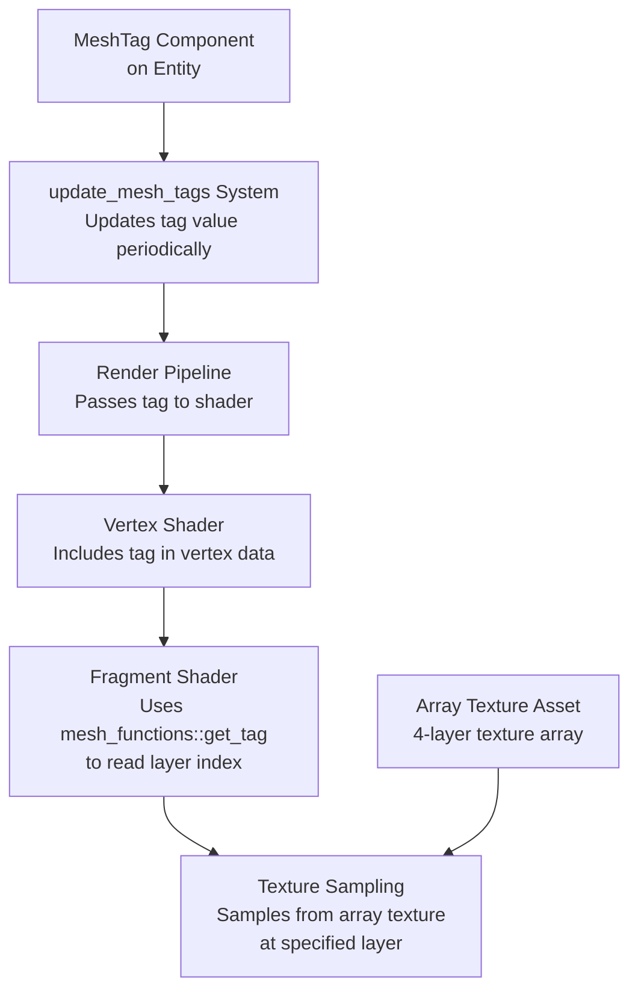

+++
title = "#21989 Add MeshTag to array_texture example to demonstrate layer selection in shader"
date = "2025-12-10T00:00:00"
draft = false
template = "pull_request_page.html"
in_search_index = true

[taxonomies]
list_display = ["show"]

[extra]
current_language = "en"
available_languages = {"en" = { name = "English", url = "/pull_request/bevy/2025-12/pr-21989-en-20251210" }, "zh-cn" = { name = "中文", url = "/pull_request/bevy/2025-12/pr-21989-zh-cn-20251210" }}
labels = ["A-Rendering", "C-Examples", "D-Shaders", "M-Deliberate-Rendering-Change"]
+++

# Title

## Basic Information
- **Title**: Add MeshTag to array_texture example to demonstrate layer selection in shader
- **PR Link**: https://github.com/bevyengine/bevy/pull/21989
- **Author**: mgi388
- **Status**: MERGED
- **Labels**: A-Rendering, C-Examples, S-Ready-For-Final-Review, D-Shaders, M-Deliberate-Rendering-Change
- **Created**: 2025-12-01T04:14:52Z
- **Merged**: 2025-12-10T00:19:59Z
- **Merged By**: alice-i-cecile

## Description Translation
The PR description is already in English, so it is included exactly as-is.

## The Story of This Pull Request

The `array_texture` example in Bevy needed clarification about how to pass layer selection data to shaders. When examining this example, a developer noticed that the existing implementation used a hack: it derived a fake "layer" value from the mesh's world position (`mesh.world_position.x`), which wasn't representative of how array texture layer selection typically works in real applications.

After consulting with the Bevy community on Discord, the developer learned that `MeshTag` is one recommended approach for passing per-instance data like texture layer indices to shaders. The existing example wasn't demonstrating this practical technique, which made it less useful for developers trying to understand how to work with array textures in Bevy.

The solution involved two main changes. First, the shader code was updated to use `MeshTag` instead of deriving layer information from position data. The shader imports `bevy_pbr::mesh_functions` and calls `mesh_functions::get_tag(mesh.instance_index)` to retrieve the layer index. This aligns with Bevy's established patterns for passing per-instance data.

Second, the example code was enhanced to demonstrate how `MeshTag` can be used dynamically. The developer added a system that periodically updates the `MeshTag` on all mesh entities, cycling through the available texture layers. This shows that layer selection isn't just static data - it can be changed at runtime, which is a common requirement for effects like animated textures or material switching.

A key implementation detail is the introduction of a `TEXTURE_COUNT` constant (set to 4) that's used consistently throughout the code. This constant controls both the image array layout configuration and the modulo operations for layer cycling, ensuring the example remains maintainable and the logic is clear.

The changes demonstrate a practical pattern for working with array textures: using `MeshTag` to pass layer indices from entity components to shaders. This approach is more realistic than the previous position-based hack and provides a template that developers can adapt for their own use cases, such as texture arrays for terrain, foliage variations, or animated sprite sheets.

## Visual Representation



## Key Files Changed

### 1. `examples/shader/array_texture.rs` (+33/-5)

**What changed and why**: The example was updated to demonstrate proper usage of `MeshTag` for array texture layer selection. The example now includes dynamic updates to show how layer selection can change at runtime.

**Key modifications**:
```rust
// File: examples/shader/array_texture.rs
// Before (simplified):
// No MeshTag usage, no update system

// After:
// Added constant for texture count
const TEXTURE_COUNT: u32 = 4;

// Updated image loading to use the constant
settings.array_layout = Some(ImageArrayLayout::RowCount {
    rows: TEXTURE_COUNT,
});

// Added MeshTag to spawned entities
commands.spawn((
    Mesh3d(mesh_handle.clone()),
    MeshMaterial3d(material_handle.clone()),
    // Pass a different mesh tag to allow selecting different layers of
    // the array texture in the shader.
    MeshTag(x as u32 % TEXTURE_COUNT),
    Transform::from_xyz(x as f32 + 0.5, 0.0, 0.0),
));

// Added system for dynamic updates
fn update_mesh_tags(time: Res<Time>, mut query: Query<&mut MeshTag>, mut timer: Local<Timer>) {
    // Initialize the timer on the first run.
    if timer.duration().is_zero() {
        *timer = Timer::from_seconds(1.5, TimerMode::Repeating);
    }

    timer.tick(time.delta());
    if timer.just_finished() {
        for mut tag in query.iter_mut() {
            // Cycle through the texture layers to demonstrate that we can
            // select different layers of the array texture at runtime.
            tag.0 = (tag.0 + 1) % TEXTURE_COUNT;
        }
    }
}
```

### 2. `assets/shaders/array_texture.wgsl` (+4/-1)

**What changed and why**: The shader was updated to use `MeshTag` for layer selection instead of deriving the layer from world position, which was an unrealistic hack.

**Key modifications**:
```rust
// File: assets/shaders/array_texture.wgsl
// Before:
let layer = i32(mesh.world_position.x) & 0x3;

// After:
#import bevy_pbr::mesh_functions
// ...
// Determine which layer of the array texture to sample from based on the
// mesh tag which originates from the MeshTag component on the entity.
let layer = mesh_functions::get_tag(mesh.instance_index);
```

## Further Reading

- [Bevy MeshTag Documentation](https://docs.rs/bevy/latest/bevy/mesh/struct.MeshTag.html) - Official documentation for the MeshTag component
- [WebGPU Shading Language (WGSL) Specification](https://www.w3.org/TR/WGSL/) - Reference for the shader language used in Bevy
- [Bevy Shader Examples](https://github.com/bevyengine/bevy/tree/main/examples/shader) - Other shader examples in the Bevy repository
- [Texture Arrays in Graphics Programming](https://learnopengl.com/Advanced-OpenGL/Textures) - General concepts about texture arrays (though OpenGL-specific, the concepts apply to WebGPU/WGSL)

# Full Code Diff
The full code diff is provided in the PR description above.