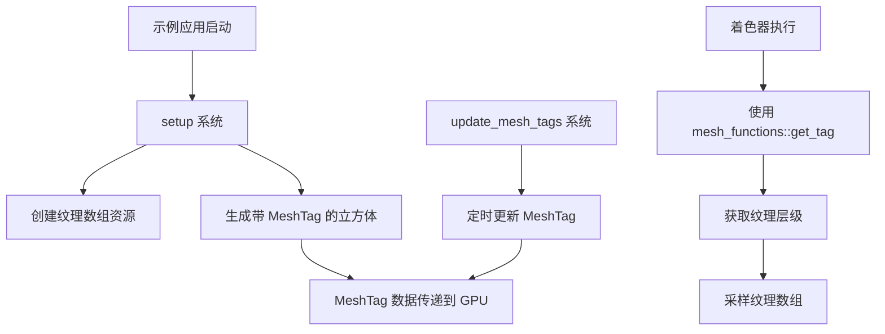

+++
title = "#21989 Add MeshTag to array_texture example to demonstrate layer selection in shader"
date = "2025-12-10T00:00:00"
draft = false
template = "pull_request_page.html"
in_search_index = false

[extra]
current_language = "zh-cn"
available_languages = {"en" = { name = "English", url = "/pull_request/bevy/2025-12/pr-21989-en-20251210" }, "zh-cn" = { name = "中文", url = "/pull_request/bevy/2025-12/pr-21989-zh-cn-20251210" }}
+++

# 添加 MeshTag 到 array_texture 示例以在着色器中演示层级选择

## 基本信息
- **标题**: Add MeshTag to array_texture example to demonstrate layer selection in shader
- **PR 链接**: https://github.com/bevyengine/bevy/pull/21989
- **作者**: mgi388
- **状态**: 已合并
- **标签**: A-Rendering, C-Examples, S-Ready-For-Final-Review, D-Shaders, M-Deliberate-Rendering-Change
- **创建时间**: 2025-12-01T04:14:52Z
- **合并时间**: 2025-12-10T00:19:59Z
- **合并人**: alice-i-cecile

## 描述翻译
### 目标
- 当我查看 `array_texture` 示例时，我不清楚如何将"层级"(layer)发送到 GPU，但事实证明[推荐使用 MeshTag 的方式](https://discord.com/channels/691052431525675048/866787577687310356/1444495450999754823)来传递这个信息。
- 该示例之前从世界位置中提取一个假的"层级"，但据我所知，这不是演示层级选择的最实际方式。

### 解决方案
- 通过使用 `MeshTag` 更新 `array_texture` 示例。
- 向示例添加一个系统，定期更改实体上的 `MeshTag`，以显示网格标签也可以在运行时动态更改（并展示其简便性）。

### 测试与展示
之前，您可以看到每个立方体的纹理是固定的。


之后，您可以看到每个立方体的纹理随时间变化。

https://github.com/user-attachments/assets/b1227659-5886-4d2c-a401-84b80423c798

---
我希望渲染开发人员验证这种方法是否正确且有用。我认为是的，但我[刚刚开始理解](https://discord.com/channels/691052431525675048/866787577687310356/1444888786478829668)如何使用这些东西，并且它[可能不是唯一的方式](https://discord.com/channels/691052431525675048/866787577687310356/1444888304020488365)，所以如果这是教授未来自己的错误方法，我不想提交这个。

## 本 Pull Request 的故事

### 问题与背景
在 Bevy 的 `array_texture` 示例中，开发者想要演示如何使用纹理数组(texture array)，这是一个包含多个图层的 2D 纹理集合。然而，原始示例采用了一种不直观的方法：它基于立方体的世界位置来计算要使用的纹理层级。

具体来说，原始着色器代码使用以下逻辑：
```wgsl
let layer = i32(mesh.world_position.x) & 0x3;
```

这种方法有几个问题：
1. 它不反映真实世界的使用情况 - 在真实应用中，纹理层级的选择通常基于游戏逻辑或实体属性，而不是几何位置。
2. 它不展示如何将数据从 CPU 传递到 GPU 以控制层级选择。
3. 对于学习 Bevy 渲染系统的新开发者来说，这不提供有价值的指导。

开发者 mgi388 在 Discord 社区讨论中发现，推荐的方法是使用 `MeshTag` 组件将数据传递给着色器，这激发了对示例的改进需求。

### 解决方案方法
PR 采用了直接而实用的方法：用基于 `MeshTag` 的解决方案替换原有的基于世界位置的层级选择逻辑。`MeshTag` 是 Bevy 中专门设计用于将每实例数据传递给着色器的组件，它通过实例索引将数据映射到 GPU。

技术方法包括：
1. 在着色器中使用 `mesh_functions::get_tag()` 获取层级信息
2. 在实体生成时添加 `MeshTag` 组件
3. 添加一个更新系统来动态修改 `MeshTag`，展示运行时变化

这种方法的优势在于：
- 展示了标准的 Bevy 渲染管线数据传递机制
- 演示了如何实现动态纹理切换
- 保持示例简洁易懂

### 具体实现
实现分为两个主要部分：着色器修改和 Rust 代码修改。

在着色器中，关键变化是将基于世界位置的层级计算替换为使用 `MeshTag`：
```wgsl
// 之前：基于世界位置计算层级
let layer = i32(mesh.world_position.x) & 0x3;

// 之后：从 MeshTag 组件获取层级
let layer = mesh_functions::get_tag(mesh.instance_index);
```

这里使用了 Bevy 内置的 `mesh_functions` 模块中的 `get_tag` 函数，它通过实例索引从 `MeshTag` 组件读取数据。

在 Rust 代码中，主要修改包括：

1. **添加 `MeshTag` 组件到立方体实体**：
```rust
// 在 setup 函数中生成立方体时添加 MeshTag
commands.spawn((
    Mesh3d(mesh_handle.clone()),
    MeshMaterial3d(material_handle.clone()),
    // 传递不同的网格标签，允许在着色器中选择纹理数组的不同层级
    MeshTag(x as u32 % TEXTURE_COUNT),
    Transform::from_xyz(x as f32 + 0.5, 0.0, 0.0),
));
```

2. **添加动态更新系统**：
```rust
fn update_mesh_tags(time: Res<Time>, mut query: Query<&mut MeshTag>, mut timer: Local<Timer>) {
    // 在首次运行时初始化计时器
    if timer.duration().is_zero() {
        *timer = Timer::from_seconds(1.5, TimerMode::Repeating);
    }

    timer.tick(time.delta());
    if timer.just_finished() {
        for mut tag in query.iter_mut() {
            // 循环遍历纹理层级，展示我们可以在运行时选择纹理数组的不同层级
            tag.0 = (tag.0 + 1) % TEXTURE_COUNT;
        }
    }
}
```

这个系统每 1.5 秒循环更新所有立方体的 `MeshTag`，使它们的纹理层级依次变化，直观地演示了动态更新功能。

### 技术洞察
这个 PR 展示了几个重要的 Bevy 渲染概念：

1. **MeshTag 的作用机制**：`MeshTag` 是一个特殊的组件，它的数据会被打包到 GPU 缓冲区中，通过实例索引在着色器中访问。这是一种高效的每实例数据传递方式。

2. **纹理数组的使用**：纹理数组允许在单个纹理资源中存储多个层级，这对于需要多个变体但采样参数相同的纹理非常有用（如地形贴图、角色皮肤变体等）。

3. **实例索引与数据映射**：`mesh.instance_index` 在着色器中用于索引每实例数据，这是 GPU 实例化的核心机制之一。

4. **动态数据更新**：通过展示如何在运行时修改 `MeshTag`，PR 演示了 Bevy 中动态材质属性的实现模式。

一个值得注意的工程细节是，开发者添加了 `TEXTURE_COUNT` 常量来避免硬编码数字，提高了代码的可维护性：
```rust
const TEXTURE_COUNT: u32 = 4;
```

### 影响与价值
这个 PR 的主要影响是教育性的 - 它改进了 Bevy 的官方示例，使其更贴近实际应用场景。具体来说：

1. **更好的学习资源**：开发者现在可以通过这个示例学习如何使用 `MeshTag` 传递数据到着色器，这是 Bevy 渲染中的常见模式。

2. **展示动态能力**：通过添加动态更新系统，示例不仅展示了静态设置，还展示了如何在运行时更改渲染参数。

3. **代码清晰性**：使用命名常量 (`TEXTURE_COUNT`) 和改进的注释使代码更易于理解和维护。

4. **保持向后兼容**：所有更改都在示例范围内，不影响 Bevy 的核心功能。

从工程角度看，这个 PR 展示了良好的实践：小范围、专注的更改，明确的文档，以及通过 Discord 讨论获得社区反馈后再提交的谨慎态度。

## 视觉表示



## 关键文件更改

### 1. `examples/shader/array_texture.rs` (+33/-5)
**更改描述**：更新了 array_texture 示例，添加 MeshTag 组件和动态更新系统。

```rust
// 主要更改：
// 1. 添加了 TEXTURE_COUNT 常量
const TEXTURE_COUNT: u32 = 4;

// 2. 在 setup 系统中为立方体添加 MeshTag 组件
commands.spawn((
    Mesh3d(mesh_handle.clone()),
    MeshMaterial3d(material_handle.clone()),
    // 传递不同的网格标签，允许在着色器中选择纹理数组的不同层级
    MeshTag(x as u32 % TEXTURE_COUNT),
    Transform::from_xyz(x as f32 + 0.5, 0.0, 0.0),
));

// 3. 添加了新的 update_mesh_tags 系统
fn update_mesh_tags(time: Res<Time>, mut query: Query<&mut MeshTag>, mut timer: Local<Timer>) {
    // 在首次运行时初始化计时器
    if timer.duration().is_zero() {
        *timer = Timer::from_seconds(1.5, TimerMode::Repeating);
    }

    timer.tick(time.delta());
    if timer.just_finished() {
        for mut tag in query.iter_mut() {
            // 循环遍历纹理层级，展示我们可以在运行时选择纹理数组的不同层级
            tag.0 = (tag.0 + 1) % TEXTURE_COUNT;
        }
    }
}
```

### 2. `assets/shaders/array_texture.wgsl` (+4/-1)
**更改描述**：修改着色器以使用 MeshTag 而不是世界位置来确定纹理层级。

```wgsl
// 之前：
let layer = i32(mesh.world_position.x) & 0x3;

// 之后：
// 基于来自实体上 MeshTag 组件的网格标签确定要从纹理数组中采样的层级
let layer = mesh_functions::get_tag(mesh.instance_index);
```

## 进一步阅读

1. **Bevy 官方文档**：
   - [MeshTag 组件文档](https://docs.rs/bevy/latest/bevy/mesh/struct.MeshTag.html)
   - [纹理数组指南](https://bevyengine.org/learn/books/introduction/rendering/textures/#texture-arrays)

2. **WGSL 规范**：
   - [纹理数组类型](https://gpuweb.github.io/gpuweb/wgsl/#texture-types)
   - [纹理采样操作](https://gpuweb.github.io/gpuweb/wgsl/#texture-sampling)

3. **相关 Bevy 示例**：
   - `mesh_tag` 示例 - 更基础的 MeshTag 使用示例
   - `shader_material` 示例 - 自定义着色器材料的实现

4. **技术讨论**：
   - [Bevy Discord 渲染频道](https://discord.com/channels/691052431525675048/866787577687310356) - 渲染相关技术讨论
   - [GitHub Issue #21989](https://github.com/bevyengine/bevy/pull/21989) - 本 PR 的讨论历史

# 完整代码差异
```diff
diff --git a/assets/shaders/array_texture.wgsl b/assets/shaders/array_texture.wgsl
index 1bc6c46c404bf..73dfadba20c06 100644
--- a/assets/shaders/array_texture.wgsl
+++ b/assets/shaders/array_texture.wgsl
@@ -1,5 +1,6 @@
 #import bevy_pbr::{
     forward_io::VertexOutput,
+    mesh_functions,
     mesh_view_bindings::view,
     pbr_types::{STANDARD_MATERIAL_FLAGS_DOUBLE_SIDED_BIT, PbrInput, pbr_input_new},
     pbr_functions as fns,
@@ -15,7 +16,9 @@ fn fragment(
     @builtin(front_facing) is_front: bool,
     mesh: VertexOutput,
 ) -> @location(0) vec4<f32> {
-    let layer = i32(mesh.world_position.x) & 0x3;
+    // Determine which layer of the array texture to sample from based on the
+    // mesh tag which originates from the MeshTag component on the entity.
+    let layer = mesh_functions::get_tag(mesh.instance_index);
 
     // Prepare a 'processed' StandardMaterial by sampling all textures to resolve
     // the material members
diff --git a/examples/shader/array_texture.rs b/examples/shader/array_texture.rs
index b91872725ab3a..e17763dde132a 100644
--- a/examples/shader/array_texture.rs
+++ b/examples/shader/array_texture.rs
@@ -1,17 +1,23 @@
-//! This example illustrates how to create a texture for use with a `texture_2d_array<f32>` shader
-//! uniform variable.
+//! This example illustrates how to create a texture for use with a
+//! `texture_2d_array<f32>` shader uniform variable and then how to sample from
+//! that texture in the shader by using a `MeshTag` component on the mesh
+//! entity.
 
 use bevy::{
     image::{ImageArrayLayout, ImageLoaderSettings},
+    mesh::MeshTag,
     prelude::*,
     reflect::TypePath,
     render::render_resource::AsBindGroup,
     shader::ShaderRef,
 };
 
-/// This example uses a shader source file from the assets subdirectory
+/// This example uses a shader source file from the assets subdirectory.
 const SHADER_ASSET_PATH: &str = "shaders/array_texture.wgsl";
 
+/// Corresponds to the number of layers in the array texture.
+const TEXTURE_COUNT: u32 = 4;
+
 fn main() {
     App::new()
         .add_plugins((
@@ -19,6 +25,7 @@ fn main() {
             MaterialPlugin::<ArrayTextureMaterial>::default(),
         ))
         .add_systems(Startup, setup)
+        .add_systems(Update, update_mesh_tags)
         .run();
 }
 
@@ -32,7 +39,9 @@ fn setup(
     let array_texture = asset_server.load_with_settings(
         "textures/array_texture.png",
         |settings: &mut ImageLoaderSettings| {
-            settings.array_layout = Some(ImageArrayLayout::RowCount { rows: 4 });
+            settings.array_layout = Some(ImageArrayLayout::RowCount {
+                rows: TEXTURE_COUNT,
+            });
         },
     );
 
@@ -48,18 +57,37 @@ fn setup(
         Transform::from_xyz(5.0, 5.0, 5.0).looking_at(Vec3::new(1.5, 0.0, 0.0), Vec3::Y),
     ));
 
-    // Spawn some cubes using the array texture
+    // Spawn some cubes using the array texture.
     let mesh_handle = meshes.add(Cuboid::default());
     let material_handle = materials.add(ArrayTextureMaterial { array_texture });
     for x in -5..=5 {
         commands.spawn((
             Mesh3d(mesh_handle.clone()),
             MeshMaterial3d(material_handle.clone()),
+            // Pass a different mesh tag to allow selecting different layers of
+            // the array texture in the shader.
+            MeshTag(x as u32 % TEXTURE_COUNT),
             Transform::from_xyz(x as f32 + 0.5, 0.0, 0.0),
         ));
     }
 }
 
+fn update_mesh_tags(time: Res<Time>, mut query: Query<&mut MeshTag>, mut timer: Local<Timer>) {
+    // Initialize the timer on the first run.
+    if timer.duration().is_zero() {
+        *timer = Timer::from_seconds(1.5, TimerMode::Repeating);
+    }
+
+    timer.tick(time.delta());
+    if timer.just_finished() {
+        for mut tag in query.iter_mut() {
+            // Cycle through the texture layers to demonstrate that we can
+            // select different layers of the array texture at runtime.
+            tag.0 = (tag.0 + 1) % TEXTURE_COUNT;
+        }
+    }
+}
+
 #[derive(Asset, TypePath, AsBindGroup, Debug, Clone)]
 struct ArrayTextureMaterial {
     #[texture(0, dimension = "2d_array")]
```