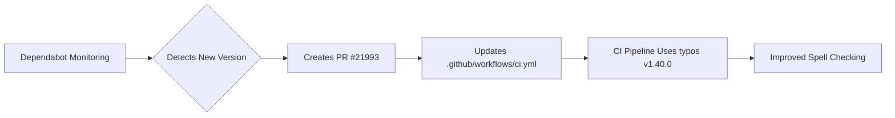

+++
title = "#21993 Bump crate-ci/typos from 1.39.2 to 1.40.0"
date = "2025-12-01T00:00:00"
draft = false
template = "pull_request_page.html"
in_search_index = true

[taxonomies]
list_display = ["show"]

[extra]
current_language = "en"
available_languages = {"en" = { name = "English", url = "/pull_request/bevy/2025-12/pr-21993-en-20251201" }, "zh-cn" = { name = "中文", url = "/pull_request/bevy/2025-12/pr-21993-zh-cn-20251201" }}
labels = ["C-Dependencies"]
+++

# Title

## Basic Information
- **Title**: Bump crate-ci/typos from 1.39.2 to 1.40.0
- **PR Link**: https://github.com/bevyengine/bevy/pull/21993
- **Author**: app/dependabot
- **Status**: MERGED
- **Labels**: C-Dependencies
- **Created**: 2025-12-01T06:33:41Z
- **Merged**: 2025-12-01T07:22:18Z
- **Merged By**: mockersf

## Description Translation
Bumps [crate-ci/typos](https://github.com/crate-ci/typos) from 1.39.2 to 1.40.0.
<details>
<summary>Release notes</summary>
<p><em>Sourced from <a href="https://github.com/crate-ci/typos/releases">crate-ci/typos's releases</a>.</em></p>
<blockquote>
<h2>v1.40.0</h2>
<h2>[1.40.0] - 2025-11-26</h2>
<h3>Features</h3>
<ul>
<li>Updated the dictionary with the <a href="https://redirect.github.com/crate-ci/typos/issues/1405">November 2025</a> changes</li>
</ul>
</blockquote>
</details>
<details>
<summary>Changelog</summary>
<p><em>Sourced from <a href="https://github.com/crate-ci/typos/blob/master/CHANGELOG.md">crate-ci/typos's changelog</a>.</em></p>
<blockquote>
<h2>[1.40.0] - 2025-11-26</h2>
<h3>Features</h3>
<ul>
<li>Updated the dictionary with the <a href="https://redirect.github.com/crate-ci/typos/issues/1405">November 2025</a> changes</li>
</ul>
</blockquote>
</details>
<details>
<summary>Commits</summary>
<ul>
<li><a href="https://github.com/crate-ci/typos/commit/2d0ce569feab1f8752f1dde43cc2f2aa53236e06"><code>2d0ce56</code></a> chore: Release</li>
<li><a href="https://github.com/crate-ci/typos/commit/efbd900f8db9952781b6bd1ad83baa38ebd153e3"><code>efbd900</code></a> chore: Release</li>
<li><a href="https://github.com/crate-ci/typos/commit/863fd15db8bf16bfe9117ec1a83ea7b6e802e9f3"><code>863fd15</code></a> docs: Update changelog</li>
<li><a href="https://github.com/crate-ci/typos/commit/9a27b16791dd73549457a07f247bc4920f787919"><code>9a27b16</code></a> Merge pull request <a href="https://redirect.github.com/crate-ci/typos/issues/1432">#1432</a> from epage/nov</li>
<li><a href="https://github.com/crate-ci/typos/commit/3dbd9d4eacab7f22586ea581e4d403c3ca9dbbb7"><code>3dbd9d4</code></a> feat(dict): November additions</li>
<li><a href="https://github.com/crate-ci/typos/commit/a1a16c7b7c25d1c27cc750525aada8b9ae68b716"><code>1a16c7</code></a> Merge pull request <a href="https://redirect.github.com/crate-ci/typos/issues/1427">#1427</a> from deining/bump-github-action</li>
<li><a href="https://github.com/crate-ci/typos/commit/cb8d2e78ff23c82fca05340ed256b04513d022b9"><code>cb8d2e7</code></a> docs: Bump GitHub checkout action in 'github-action.md'</li>
<li><a href="https://github.com/crate-ci/typos/commit/9f99fb8dfe87b8a3441863fb2e5d5da88a2aa9a2"><code>9f99fb8</code></a> docs(ref): Clarify extend-words / extend-identifiers</li>
<li>See full diff in <a href="https://github.com/crate-ci/typos/compare/v1.39.2...v1.40.0">compare view</a></li>
</ul>
</details>
<br />


[](https://docs.github.com/en/github/managing-security-vulnerabilities/about-dependabot-security-updates#about-compatibility-scores)

Dependabot will resolve any conflicts with this PR as long as you don't alter it yourself. You can also trigger a rebase manually by commenting `@dependabot rebase`.

[//]: # (dependabot-automerge-start)
[//]: # (dependabot-automerge-end)

---

<details>
<summary>Dependabot commands and options</summary>
<br />

You can trigger Dependabot actions by commenting on this PR:
- `@dependabot rebase` will rebase this PR
- `@dependabot recreate` will recreate this PR, overwriting any edits that have been made to it
- `@dependabot merge` will merge this PR after your CI passes on it
- `@dependabot squash and merge` will squash and merge this PR after your CI passes on it
- `@dependabot cancel merge` will cancel a previously requested merge and block automerging
- `@dependabot reopen` will reopen this PR if it is closed
- `@dependabot close` will close this PR and stop Dependabot recreating it. You can achieve the same result by closing it manually
- `@dependabot show <dependency name> ignore conditions` will show all of the ignore conditions of the specified dependency
- `@dependabot ignore this major version` will close this PR and stop Dependabot creating any more for this major version (unless you reopen the PR or upgrade to it yourself)
- `@dependabot ignore this minor version` will close this PR and stop Dependabot creating any more for this minor version (unless you reopen the PR or upgrade to it yourself)
- `@dependabot ignore this dependency` will close this PR and stop Dependabot creating any more for this dependency (unless you reopen the PR or upgrade to it yourself)


</details>

## The Story of This Pull Request

This pull request represents a routine dependency update in the Bevy engine's continuous integration (CI) pipeline. The PR was automatically generated by Dependabot, a GitHub feature that monitors project dependencies and creates pull requests to keep them current. In this case, the dependency is the `crate-ci/typos` GitHub Action, a tool used to check for spelling errors in the codebase.

The core issue addressed here is maintaining code quality through automated spell-checking. Spelling errors in code comments, documentation, and even variable names can create confusion for developers and negatively impact the project's professionalism. The `typos` tool helps catch these errors early in the development process by running as part of the CI pipeline.

The solution approach is straightforward: update the version reference in the CI configuration file. Version 1.40.0 of `crate-ci/typos` was released on November 26, 2025, and includes dictionary updates from the November 2025 changes. These dictionary updates are the primary feature of this release, meaning the tool will have an expanded vocabulary for checking spelling and potentially reduced false positives.

The implementation is minimal, consisting of a single line change in the CI workflow file. The change updates the version tag from `v1.39.2` to `v1.40.0`. This ensures that when the CI job runs, it uses the latest version of the typos checker with the updated dictionary.

From a technical perspective, this update demonstrates the importance of keeping development tooling current. The dictionary updates in typos 1.40.0 improve the tool's accuracy by adding new valid words and potentially fixing previous false positives. This helps maintain the quality of the codebase without requiring manual intervention from developers.

The impact of this change is limited to the CI pipeline's spell-checking step. After merging, all subsequent CI runs will use version 1.40.0 of the typos tool. This provides incremental improvements in spell-checking accuracy but doesn't affect the actual Bevy engine code or runtime behavior. The PR was merged quickly (within 49 minutes) because it's a low-risk dependency update with a perfect compatibility score, as indicated by the Dependabot badge.

## Visual Representation



## Key Files Changed

### File: `.github/workflows/ci.yml`

This file contains the GitHub Actions workflow configuration for Bevy's continuous integration pipeline. The change updates the version of the `crate-ci/typos` action used in the spell-checking job.

**Key modification:**
```yaml
# Before:
      - name: Check for typos
        uses: crate-ci/typos@v1.39.2

# After:
      - name: Check for typos
        uses: crate-ci/typos@v1.40.0
```

**Explanation:**
The change updates the GitHub Action reference from version 1.39.2 to 1.40.0. This is located in the "typos" job within the CI workflow. When this job runs, it now executes the newer version of the typos tool with the updated dictionary. The rest of the workflow remains unchanged.

This single-line change is the entirety of the PR's modifications. It demonstrates how minor dependency updates can be handled efficiently through automated tooling like Dependabot.

## Full Code Diff
```
diff --git a/.github/workflows/ci.yml b/.github/workflows/ci.yml
index 4c6e26bc8ef45..c0bb16ad5b710 100644
--- a/.github/workflows/ci.yml
+++ b/.github/workflows/ci.yml
@@ -336,7 +336,7 @@ jobs:
     steps:
       - uses: actions/checkout@v6
       - name: Check for typos
-        uses: crate-ci/typos@v1.39.2
+        uses: crate-ci/typos@v1.40.0
       - name: Typos info
         if: failure()
         run: |
```

## Further Reading

- [typos GitHub repository](https://github.com/crate-ci/typos) - Source code and documentation for the spell-checking tool
- [GitHub Actions documentation](https://docs.github.com/en/actions) - Official documentation for GitHub's CI/CD platform
- [Dependabot documentation](https://docs.github.com/en/github/managing-security-vulnerabilities/about-dependabot-security-updates) - How Dependabot helps manage dependencies
- [Semantic Versioning](https://semver.org/) - Understanding version numbers and their implications for updates